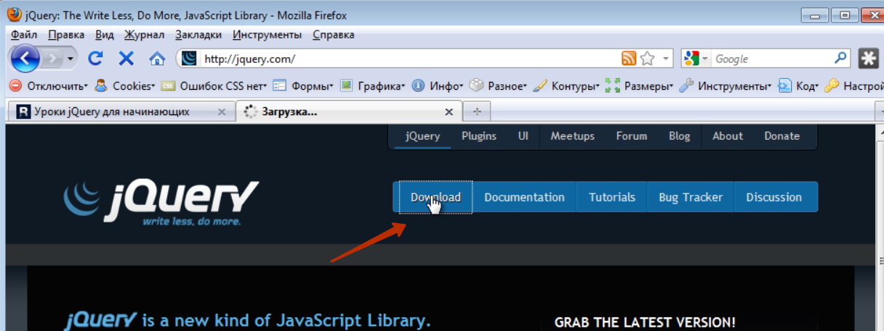
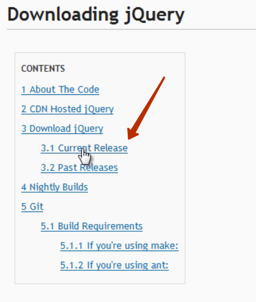

#JQUERY
#Создание выборки из элементов
# Введение в jQuery 
Первым делом нужно поговорить для чего были созданы подобные библиотеки. Потому что как вы знаете есть не только jQuery есть и другие подобные как multools и др. так вот для чего вообще создавались эти библиотеки? Дело в том что мы с вами увидели на некоторых примерах на сколько не идеально работает простой JavaScript в разных браузерах т.е. где то одно свойство поддерживается, где то другое и таких примеров на самом деле очень много. Мы просто с вами не лезли в дебри, но если в них залезть там очень много таких нюансов которые в одном браузере что то будет работать, в другом что то не будет. И проблема эта вся в том что браузеры по разному работают с этой dom моделью, объектной моделью документа о которой мы говорили. Да и плюс к тому вы и сами заметили что простой JavaScript он не совершенен потому что например в нем всего лишь два метода которые позволяют нам отбирать элементы по названию тега и по id. 
А если вам например нужно отобрать все теги по названию которые содержат какой то класс, потому что сейчас таблицы стилей очень распространены и не одного сайта не представишь без таблицы стилей, без использования классов, и если вам нужно стандартными средствами отобрать все элементы с одинаковым названием какого – то класса то вам придется очень много постараться. Там нужно будет перебрать все теги страницы в цикле, дальше внутри этого цикла создать еще один цикл который будет перебирать уже конкретный тег и все его свойства. Если он там обнаружит свойства, класс, то он должен проверить соответствует ли этот класс тому что мы указали и если соответствует то поместить этот элемент в итоговый массив и таким образом пройтись по всем элементам сайта он отберет в массив нужные нам совпадения т.е. все элементы с названием одного и того же класса. Это очень много кода, это очень много времени писать, а с помощью той же jQuery вы можете реализовать эту задачу всего лишь там двумя фразами, даже не одной строкой, а просто там буквально два слова надо написать и у вас в нужную переменную занесутся все объекты с одинаковым классом т.е. все эти манипуляции с циклами, с переборами тегов, с устранением проблем в браузере, все это происходит на фоне, на себя это берет эта библиотека. Плюс ко всему очень много задач есть при программировании на JavaScript которые очень типичны так скажем потому что мы с вами даже сами убедились сколько раз нам  приходилось в цикле проходится по какому то массиву. Это был или массив элементов, или массив студентов не важно. Постоянно мы что то перебираем в цикле. И каждый раз нам нужно писать этот цикл указывать там счетчики, условия всякие. Так вот в jQuery сделано все таким образом что во многих местах вы можете пользоваться циклом автоматически т.е. у вас есть какой то набор элементов, хотите вы с ними сделать что то одинаковое, вы просто берете этот набор, пишите что вы хотите сделать и jQuery сам возьмет на себя все остальное, он сам пройдется в цикле по всем элементам и сделает все что мы хотим т.е. опять вместо кучи кода нам нужно написать всего лишь там два слова. И вот в этом то и сила этих библиотек.

**ПОДКЛЮЧАЕМ JQUERY**

Переходим по якорю текущий релиз потому что когда вы будете смотреть данный курс выйдут уже новые версии данной библиотеки.

Выбираем minifined 
