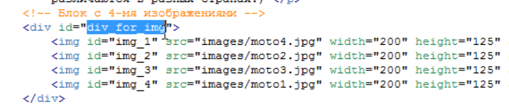
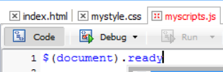
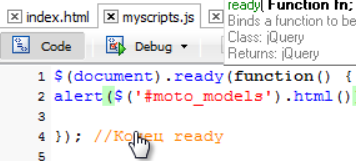
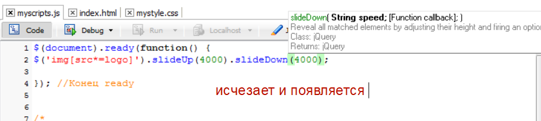
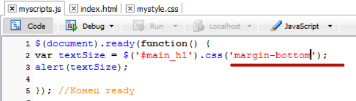
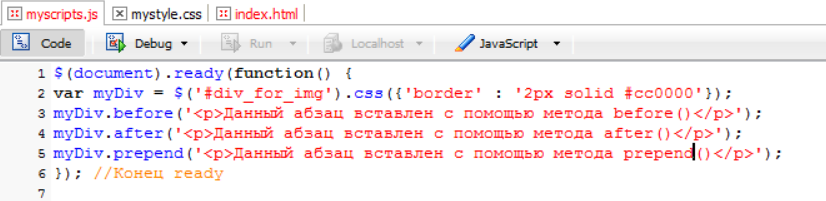
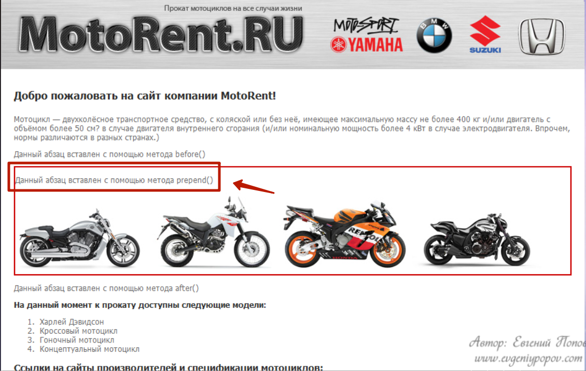
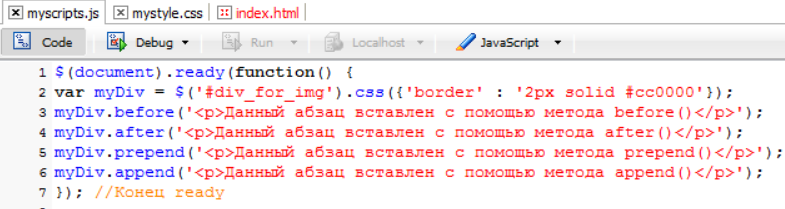

#JQUERY
#Создание выборки из элементов
# Введение в jQuery 
Первым делом нужно поговорить для чего были созданы подобные библиотеки. Потому что как вы знаете есть не только jQuery есть и другие подобные как multools и др. так вот для чего вообще создавались эти библиотеки? Дело в том что мы с вами увидели на некоторых примерах на сколько не идеально работает простой JavaScript в разных браузерах т.е. где то одно свойство поддерживается, где то другое и таких примеров на самом деле очень много. Мы просто с вами не лезли в дебри, но если в них залезть там очень много таких нюансов которые в одном браузере что то будет работать, в другом что то не будет. И проблема эта вся в том что браузеры по разному работают с этой dom моделью, объектной моделью документа о которой мы говорили. Да и плюс к тому вы и сами заметили что простой JavaScript он не совершенен потому что например в нем всего лишь два метода которые позволяют нам отбирать элементы по названию тега и по id. 
А если вам например нужно отобрать все теги по названию которые содержат какой то класс, потому что сейчас таблицы стилей очень распространены и не одного сайта не представишь без таблицы стилей, без использования классов, и если вам нужно стандартными средствами отобрать все элементы с одинаковым названием какого – то класса то вам придется очень много постараться. Там нужно будет перебрать все теги страницы в цикле, дальше внутри этого цикла создать еще один цикл который будет перебирать уже конкретный тег и все его свойства. Если он там обнаружит свойства, класс, то он должен проверить соответствует ли этот класс тому что мы указали и если соответствует то поместить этот элемент в итоговый массив и таким образом пройтись по всем элементам сайта он отберет в массив нужные нам совпадения т.е. все элементы с названием одного и того же класса. Это очень много кода, это очень много времени писать, а с помощью той же jQuery вы можете реализовать эту задачу всего лишь там двумя фразами, даже не одной строкой, а просто там буквально два слова надо написать и у вас в нужную переменную занесутся все объекты с одинаковым классом т.е. все эти манипуляции с циклами, с переборами тегов, с устранением проблем в браузере, все это происходит на фоне, на себя это берет эта библиотека. Плюс ко всему очень много задач есть при программировании на JavaScript которые очень типичны так скажем потому что мы с вами даже сами убедились сколько раз нам  приходилось в цикле проходится по какому то массиву. Это был или массив элементов, или массив студентов не важно. Постоянно мы что то перебираем в цикле. И каждый раз нам нужно писать этот цикл указывать там счетчики, условия всякие. Так вот в jQuery сделано все таким образом что во многих местах вы можете пользоваться циклом автоматически т.е. у вас есть какой то набор элементов, хотите вы с ними сделать что то одинаковое, вы просто берете этот набор, пишите что вы хотите сделать и jQuery сам возьмет на себя все остальное, он сам пройдется в цикле по всем элементам и сделает все что мы хотим т.е. опять вместо кучи кода нам нужно написать всего лишь там два слова. И вот в этом то и сила этих библиотек.

**ПОДКЛЮЧАЕМ JQUERY**

Переходим по якорю текущий релиз потому что когда вы будете смотреть данный курс выйдут уже новые версии данной библиотеки.

Выбираем minifined 

Все загрузка завершена и можно подключать данную библиотеку к нашему документу. Переходим на индексную страницу и здесь где мы изначально подключали файл со скриптами подключаем после таблицы стилей библиотеку jquery 

вот мы с вами и подключили библиотеку jquery 

 # Основные выборки элементов с помощью jquery  
   Первым делом стоит сказать что после подключения данной библиотеки в нашем распоряжении появляется вот такая функция 
    
    Так и называется. Эта функция с которой мы с вами будем постоянно работать. Которая несет в себе сразу 3-ри функции она позволяет отбирать нужные нам элементы, она позволяет прописывать им события и совершать с ними различные действия. Т.е. помните то уравнение объект – действие – событие . точно так же jquery одной этой функцией позволяет нам делать все три этих элемента. Во – первых отбирать элементы, во – вторых вешать на них события, и в третьих указывать действия  которые должны выполняться при наступлении событий. Вот такая универсальная функция и что еще интересно ее можно записывать в сокращенном варианте 
    
    ставится просто доллар. Используется и тот и тот вариант, но чаще в литературе и всяких уроках вы увидите вот этот вариант. Но функция в написании jquery() как я вам давал ранее, она используется очень часто в тех случаях когда на одном и том же сайте используется несколько библиотек. Потому что многие библиотеки в качестве сокращений имеют этот самый доллар и по этому возникают всякие конфликты. А если вы будете писать функция jquery именно таким образом то у вас не будет конфликтов с другими библиотеками. Но с другой стороны мало кто пытается совместить две библиотеки на одной странице по этому мы с вами будем всегда писать через $ потому что это намного быстрее.
Это что касалось появления новой функции. 
Теперь что касается как отбирать элементы с помощью jquery?? Потому что я вам напомню мы пока работаем над первой частью нашего уравнения, над отбором элементов. Прежде чем начать с ними что то делать мы должны просто на пятерку научится отбирать элементы со страницы, потому что это очень важно.
И так как у нас происходит отбор элементов с помощью jquery ? нам нужно вернуться немножко к css. Дело в том что я вам уже говорил что разработчики jquery не стали изобретать велосипед и приняли всю мощь css т.е. как там происходит отбор элементов, точно так же они решили сделать отбор элементов в jquery. 
И немножко давайте освежим наши знания css. Давайте откроем файл my.style.css который у нас подключен и 

название элемента либо название класса либо индификатора. Т.е. все что идет до фигурных скобок называется селектор. В данном случае это селектор по названию тега т.е. мы указываем название тега body и указываем правила для него. Т.е. 

мы по сути с  помощью этой строки 
отбираем на всей странице  элемент у которого есть класс maindiv и предаем ему эти правила.
Короче очень много говорит про css, возьми курс по css и освежи знания……………………………………………………………………………………………….
Так вот в jQuery все происходит примерно тоже самое. Когда нам нужно найти элемент например с каким то тегом т.е. просто вытащить все элементы по названию тега мы просто так и пишем что нам например нужно найти все абзацы.

 Вот мы с вами таким образом вытащили все абзацы. Это все равно что если бы мы с вами в обычном JavaScript то то выглядело бы document.getElementsByTegName (p). То здесь видите на сколько это все короче пишется, буквально 5-ть и нам вытащит все абзацы со страницы.
Если бы мы хотели бы вытащить какой – нибудь объект с каким - нибудь  индификатором то абсолютно точно так же как и в css могли бы написать. Ну допустим нас заинтересовал вот этот заголовок первого уровня 

И здесь нам просто в скобках указать как в css  

И вот эта запись у на отберет в jQuery набор вот этот элемент #main_h1. Я кстати буду часто пользоваться этим понятием jQuery набор или jQuery выборка  т.е. когда мы с вами пишем функцию jQuery и указываем в качестве параметров() какие – то элементы, например тег или id элемета, или class какой – то, то у нас по сути происходит перебор всей страницы и выбор указанного элемента т.е. происходит такая выборка. По этому я ее  буду называть выборкой или набор.
И 3-й момент который мы здесь должны изучить это выбор элемента по названию класса т.е. точно так же как и в стилях мы указываем название класса например 

Точно так же мы и здесь можем указать. Т.е. мы смотрим на странице например у какого элемента есть класс 

Т.е. мы спокойно можем отобрать данный элемент по названию его класса. При этом если есть еще элементы с таким классом они так же будут включены в наш набор .
Мы пишем точно также 

Как в таблице стилей. И у нас таким образом будет отобраны все элементы у которых есть вот такой class. 
Вот эти три селектора которые мы будем с вами использовать на постоянной основе это по названию class, по id и по названию тега 

Но естественно как и в css мы можем прописывать там через запятую, указывать всяких потомков
 К примеру
 
 Сначала находится элемент который имеет class mototable, затем ищется потомок tbody, в нем уже ищется tr и только в нем находиться td для которого прописано правило. Т.е. таким способом можно выбирать элемент и в jQuery. Но об этих более сложных способах мы поговорим позже. Главное уяснить что эти три основных метода мы с вами будем использовать постоянно и вам очень важно их понимать. Это три основных селектора которые позволяют нам выбирать объекты со страницы и формировать их них этот самый jQuery набор.

 # Вложенные и дочерние селекторы, следующий тег 
 И так мы с вами уже научились отбирать элемент по названию тега, класса  по id. И что бы еще закрепить эти знания хотел показать вам небольшую иллюстрацию 
 
 На которой видно например что если вы пишите $(#main_h1), то в этот момент у нас из dom дерева выбирается этот элемент т.е. он как бы подсвечивается. Это просто держите в голове что jQuery работает с этим dom деревом и когда вы отбираете какой – то элемент страницы то у вас в этом dom дереве он подсвечивается или они если их много, и вы уже с ними можете работать дольше. 
А мы продолжаем изучение селекторов которые позволяют нам отбирать элементы. Я уже говорил что jQuery имеет очень много инструментов которые позволяют очень гибко выбирать элементы страницы. 
Следующие элементы которые нам нужно изучить это вложенные селекторы, вложенные теги. Как пример можно привести  

Т.е. нас интересуют теги strong которые вложены в тег р. И точно также как и в css мы пишем их через пробел, мы можем так же писать их и в jQuery. Т.е. если нам нужно отобрать все теги strong которые находятся внутри тега р  мы так же пишем 

мы получим набор все теги strong находящиеся в теге р. Точно так же можно написать, например если вам нужны все картинки которые находятся внутри блока div с id = for img. 

То мы можем спокойно написать вот так

Вот таким образов в ваш набор попадут все картинки которые находятся внутри элемента с этим id.

Следующее что нам нужно знать это вид селектора выбор следующего тега. Иногда бывает такая ситуация что вам нужно выбрать именно следующий тег за каким – то. Вот у вас например есть тег h1 

А нам нужно получить доступ к следующему за ним абзацу. Если посмотреть внимательно то просто так получить доступ к этому абзацу как бы сложновато, у него нет ни id у него нет на class. Получается что если мы просто напишем тег р, то у нас будут отобраны все теги р. И в данном случае 

Сложно получить доступ к этому абзацу. Я уже не говорю про простые способы JavaScript. 
Так вот здесь нам на помощь придет селектор который позволяет выбрать следующий тег т.е. мы можем взять  за основной тег h1  у которого есть id = “main_h1”  и затем с помощью специальной конструкции указать что нам нужен следующий за ним тег. И делается это таким образом: мы пишем название тега который стоит выше (#main_h1 и указываем название тега который нам нужен +р)т.е. это выбор следующего тега. 

запомните что + означает выбор следующего тега. Это используется реже чем все остальные, но все равно вы должны знать что такой метод есть и иногда только он позволяет получить доступ именно к какому – то конкретному элементу вашей страницы.
И последний способ выбрать элемент с помощью jQuery который мы пройдем в этом уроке это способ выбора дочерних тегов. Помните мы в просто JavaScript изучали такое свойство как childNodes т.е. эти самые дочерние узлы. Т.е. точно так же  jQuery вы можете выбирать эти самые дочерние узлы и если вам нужно например выбрать там все дочерние узлы в том же теге div 

То вы можете написать так, копируем id и указываем таким образом 

вот такая запись выдаст вам все дочерние картинки для данного тега. 
Вы можете спросить а зачем это нужно? Могли просто написать 

Но в этом случае у нас выбируться вообще все картинки которые находяться внутри этого блока. Потому что у нас может быть и такая ситуация что допустим картинки могут быть в абзацах 

и в этом случае у нас 

будут выбраны все картинки, даже те которые находятся внутри абзаца.
А если мы напишем таким образом 

то в данном случае нас будут интересовать именно дочерние картинки и вот эта картинка 

сюда уже не попадет. Она уже не является дочерней по отношению к тегу div for_img потому что картинка по сути является сыном для абзаца, по этому данный вариант выберет только 3-ри картинки, именно дочерние, которые являются как бы прямыми потомками. По этому это имейте ввиду, я не зря вам объяснял эти родственные связи. Если вам нужно выбрать именно дочерние то это пишется через знак больше >. А если вам нужно выбрать все картинки внутри блока то это просто через пробел 

# Выборка по наличию и значению атрибутов 
И так мы с вами уже изучили 6-ть способов отбора элементов с вэб – страницы, в jQuery выборку, это выборка по названию тега, по id по названию class, по вложенным селекторам, по выбору следующего тега, и выбор дочерних тегов. И сейчас мы изучим еще 40ре варианта выбора элементов с вэб страницы т.е. у нас того уже будет 10-ть. Как видите jQuery нам дает очень огромную гибкость в выборе элементов вэб страницы. 
И сейчас мы поговорим как выбирать элементы по их атрибутам. Если вы внимательно посмотрите на нашу страницу, то увидите что у многих тегов есть много атрибутов

И в jQuery есть 4-ре способа которые заточены под выборку элементов именно по атрибутам. Это одни из моих любимых способов выбирать элементы на вэб странице, они очень простые и очень точечно позволяют выбрать какой – то элемент или группу элементов. На практике мы с вами будем их постоянно использовать. Сейчас мы их в краце рассмотрим. 
И первое с чего мы начнем это выборка элемента по точному значению его атрибута. Допустим  смотрите, нам нужны все картинки у которых ширина 200px. 

и здесь мы как раз можем применить способ выбора элементов по их атрибутам т.е. мы можем написать что нас интересует все картинки у которых  width 200px.  и делается это очень просто. Мы вызываем функцию jQuery как обычно и в качестве параметра отдаем ей такое значение, т.е. мы говорим что нас интересуют все теги img но не абсолютно все а у которых атрибут width = 200, пишем в квадратных скобках [], 

здесь ни каких кавычек не нужно, просто в квадратных скобках просто пишем название атрибута и его значение. Вот такая запись выберет нам все картинки на странице с width 200px. если мы посмотрим это на более наглядном примере это будет выглядеть вот таким образом

таким образом вы поймете как это дело работает и когда вам нужно выбрать какой – то элемент именно по названию его атрибута то достаточно написать это название и указать его значение
 
 Второй способ это способ по начальному значению атрибута. Если выше мы писали точное значение, то иногда бывает ситуация когда нужно выбрать элементы по начальному значению. Например все ссылки href у которых начальное значение начинается с http 

например следующая ссылка на просто ведет на какой – то файл на нашем сервере. Ссылка  с протоколом http ведет на отдельный сайт. И допустим нас интересуют все ссылки на страницы которые ведут на другие сайты которые начинаются с http. Как мы с вами можем это реализовать?? Мы же на можем с вами написать полное название атрибута.
На этот случай в jQuery есть специальный вариант отбора элементов по начальному значению атрибута. Т.е. мы можем указать таким образом что нас интересует href у которых атрибут начинается с http. И делается это еще проще. Вызываем функцию и в скобках пишем. Мы говорим что нас интересуют ссылки (‘a’), и раз речь идет об атрибутах ставим обязательно квадратные скобки 

это мы написали что href = равен http, а что бы указать что начинается перед знаком равенства нужно поставить птичку 

помните эту птичку из регулярных выражений, там она тоже означала начало строки, а здесь она означает что http должно быть началом и с этого должно начинаться значение атрибута. Все, такая запись отберет все ссылки на странице у которых атрибут href начинается с протокола http.
И логично было бы при котором атрибут должен заканчиваться на что –то. Потому что часто бывает ситуация когда нам нужно например выбрать все ссылки на какие –то файлы. Допустим у нас есть файл pdf 

ссылки на файл pdf. И допустим мы хотим сделать так что бы в jQuery набор попали все ссылки которые ведут на pdf файлы или все картинки с расширением jpg. Давайте рассмотрим пример когда нам нужны картинки только с расширением jpg.  
В параметрах функции jQuery говорим что нас интересуют картинки jpg, если мы работаем с атрибутами то ставим квадратные скобки [], у которых атрибут src = заканчивается на .jpg 

и здесь что бы показать что это именно заканчивается мы должны перед знаком равенства поставить уже не птичку а доллар $.

опять таки знакомый нам доллар из регулярных выражений, там он у нас обозначал конец строки т.е. и здесь примерно тоже самое он обозначает что именно должно заканчиваться на .jpg 
У нас остался последний вариант выборки это когда в атрибуте есть значение в любом его месте. Тоже очень полезна бывает такая возможность и здесь самый простой пример это опять таки с нашими 4-мя картинками. Мы можем написать что нас интересуют все изображения у которых в атрибуте src встречается слово moto. 
Пишем функцию и в круглых скобках говорим что нас интересуют картинки jpg атрибут [] src который содержит = moto.  И что бы сказать что именно содержит мы перед знаком равенства должны поставить звездочку которая означает как бы в любом месте. 

вот таким образом у нас отберется в набор эти 4-ре картинки у которых в атрибуте src как мы видим встречается moto.

# Фильтрация выборок  
К этому моменту мы знаем 10-ть методов 

с помощью которых мы можем создать выборку т.е. выбрать объект на вэб странице с которым мы хотим работать или объекты.
На разработчики jQuery на этом не остановились они добавили еще много всяких интересных возможностей для создания выборок и таким образом вы сможете сделать выборку еще более уникальной. И сейчас мы пройдем еще 9-ть возможностей. Все эти возможности предоставляются так называемыми фильтрами и работают они таким образом.
Для показа первого фильтра давайте вернемся на нашу html страницу у нас там есть табличка

в ней две строчки Харлей Дэвидсон и Кроссовый мотоцикл

вот они эти две строчки и нам для примера нужно добавить еще две. Я заранее их приготовил 

сохраняю страничку и смотрим на первый фильтр.
Допустим смотрите, у нас такая ситуация что нам нужно выбрать только четные строки данной таблицы. Простыми способами которые у нас сейчас доступны мы этого сделать не можем, мы не можем выбрать именно все четные строки. Допустим мы хотим что бы четные строки подсвечивались у нас серым цветом

Просто очень часто так делают для облегчения чтения таблицы, четные строки делают немножко сероватыми, а не четные белыми оставляют.
Так вот что бы нам выбрать все не четные строки у нас пока таких возможностей нет. И для этого как раз используются фильтры. И как они работают?? Первым делом мы выбираем табличку которая нас интересует 

у нее несть id moto_table т.е. мы это копируем, как обычно пишем функцию jQuery и указываем первым делом эту табличку а затем говорим что нас интересуют строки это теги tr, 

но в данном случае как вы знаете он нам выберет все строки. Что бы выбрать например только четные строки мы можем добавить этот самый фильтр и он пишется вот так, просто ставите двоеточие за тем элементом которому нужно добавить фильтр и пишете название фильтра. Это применимо именно к этому фильтру четности не четности, потому что разные фильтры пишутся по разному как мы с вами увидим. А вот именно фильтр четности не четности пишется таким образом. Если вам нужны четные пишите even,

но только имейте ввиду что если вы здесь пишите четное то это будет четное с точки зрения JavaScript потому что смотрите. Если мы пишем moto_table tr, то там этих строк 4-ре, получается у нас вернется массив из четырех строк, мы знаем что в массивах отсчет идет с ноля, и ели вы пишите фильтр even четное то он нам возьмет четные элементы это 0-й и 2-й. а для нас для людей это будет первый и третий. По этому это имейте ввиду и держите в голове. когда вам нужны четные элементы то вам нужно наоборот писать другой фильтр odd перевод как не четные 

но для точки зрения отсчета в массивах он будет конечно не четным, а для нас это будет четное наоборот для человеческой системы.
Следующий фильтр это фильтр отрицания not. Для чего он используется?? Иногда бывает такая ситуация что нужно выбрать все элементы какого – то типа на странице, но не брать какие то конкретные элементы. Допустим у вас есть куча ссылок на странице но при этом навигация так же состоит из ссылок. И допустим вам нужно выбрать все эти ссылки и перекрасить там в какой – то  цвет, но навигацию при этом трогать не нужно. По этому вы можете написать таким образом что допустим взять все ссылки, но кроме тех которые находятся в блоке навигации. И сейчас мы попробуем сделать подобный пример. Допустим у нас есть много картинок на странице 6-ть штук. И допустим мы хотим взять все картинки в наборе, но кроме тех которые находятся в этом блоке div. 

здесь опять таки нам на помощь придет фильтр not, фильтр отрицания. И это будет выглядеть таким образом. Мы пишем функцию jQuery, в скобках (‘’)говорим что нас во первых интересуют все картинки  на странице но кроме тех, по этому ставим :not, и ставим круглые скобки и говорим кроме каких, кроме тех которые входят в этот блок div  с id 

т.е. это простой такой же селектор который выбрал бы нам те картинки внутри этого блока 

Но мы пишем этот селектор уже внутри фильтра not, по этому он их наоборот не возьмет. И эта запись будет означать взять все картинки на странице но кроме тех которые указаны в круглых скобках. Тоже достаточно часто используется данный фильтр, по этому имейте его ввиду ничего сложного в нем нет. Когда вам нужно взять что – то конкретное но кроме каких то, то фильтр not нам здесь помощник.

Следующий фильтр это фильтр элементов который содержит другие элементы. О чем здесь идет речь?? Бывает такая ситуация что нужно выбрать например все блоки div в которых есть картинки например. Или там все списки в которых есть например ссылки. Иногда бывает ситуация что нужно выбрать объект только если он содержит другой объект. 
Допустим все теги div которые содержат в себе тег fieldset  

пишем таким образом. Мы говорим что нас интересуют блоки div, но не все, а нужно их отфильтровать по этому мы ставим : has перевод с английского как иметь, по этому мы говорим что нас интересуют блоки div которые имеют внутри себя и указываем что они имеют().просто указываем название этого тега fieldset

и это будет означать что нужно взять только те блоки div которые внутри себя содержат  теги fieldset. Ничего сложного да? Здесь видите что все основано на английском языке. Все приближено к нашему реальному языку и по этому все это достаточно понятно. 

Следующий фильтр это фильтр по содержанию определенного текста. Иногда бывает ситуация что нужно отобрать какой то абзац только если в нем есть какое – то слово например. 

Как нам отобрать абзацы со словом мотоцикл? Из текущих свойств которые мы изучили у нас такой возможности нет.
Есть такой специальный фильтр который позволяет это сделать. Это фильтр contains перевод содержит. Мы пишем что нас интересуют все абзацы но на самом деле только те которые содетжут  и в скобках указываем что они содержат. 

вот эта запись уже позволит выбрать из всей страницы только те абзацы которые содержат это слово. Это был фильтр по содержанию.

Следующий фильтр это фильтр первого элемента. Иногда бывает ситуация что нужно выбрать какую – то первую часть. Допустим у нас есть блок div с 4-мя картинками но нам потребовалась тольо первая. Допустим у нее нет там ни каких id, ничего нет. 
Единственный способ по которому ее можно ее определить это вот именно то что она идет первая в блоке div. 
У нас есть этот блок с этим id 

Т.е. мы можем сказать что нас интересуют все картинки с этого блока сначала, а потом добавить фильтр что не все а только первая.
По этому мы берем этот id и говорим что нужно взять выборку все картинки и из этого блока с таким id 

Но потом дописываем специальный фильтр что оказывается не все, а только первую 

и естественно есть противоположное этому значение last последняя. 

И еще два фильтра которые мы здесь просто опишем но пока не будем с ними экспериментировать потому что нам сначала нужно дойти до действий с элементами а там мы уже их будем использовать. Это фильтры которые забирают только скрытые элементы либо только видимые. Потому что как вы увидите на практике, мы очень часто будем скрывать разные блоки на странице. И допустим если мы скрыли какой –то блок div и хотим в набор получить именно все скрытые блоки на данный момент, то есть такой специальный фильтр 

И есть обратный этому фильтру 

# Ожидание формирования DOM дерева
И так мы с вами закончили большую и очень важную тему это отбор элементов вэб страницы для дальнейшей работы с этими элементами. При этом мы изучили как делается отбор с помощью традиционного JavaScript и как с помощью библиотеки jQuery/
А теперь пришло время научится производить различные действия над этими элементами которые мы долго учились отбирать, но перед этим есть не большое важное замечание которое вы должны так же понять и использовать. Помните я вам говорил такую вещь, даже мы рассматривали пример что пока dom дерево не сформировано мы не должны пытаться что –то делать с его элементами потому что у нас все равно этого не получится. Мы писали вот здесь 

который потом убрали в самый конец и сделали мы это для того что бы дождаться полного построения dom дерева и только потом выполнять все эти скрипты. На самом деле в jQuery есть специальный механизм который позволяет дожидаться автоматически полной загрузки dom дерева и только потом выполнять всякие скрипты. По этому вы можете спокойно снизу взять наш скрипт и перенести его обратно наверх, потому что больше нет надобности держать в самом конце  и оставим его вот  здесь

а вместо этого в наш файл js мы в самом начале напишем  специальную конструкцию на jQuery которая позволяет дожидаться загрузки документа и только потом выполнять все действия которые мы напишем. Выглядит она таким образом.
Вызываем нашу функцию jQuery и  в скобках пишем объект document 

Затем мы говорим что воспользуемся специальным методом ready и внутри этого метода мы должны написать следующее(), function ставим две круглые скобки(), и две фигурные {}, 

эта конструкция у нас и будет отвечать за то что бы документ загрузился до того как он начнет выполнять какие – то действия, и все наши коды мы будем писать внутри этой конструкции

По сути мы с вами сейчас написали что документ будет готов, нужно выполнять все действия которые расположены здесь между фигурными скобками. 
Есть еще более сокращенная версия данной записи. Вы ее так же можете встретить во всяких уроках. Пишется вот так

Возвращаем старую запись. И в самом низу желательно оставить комментарий и написать что это конец ready

Потому что мы с вами будем часто пользоваться вот такими всякими конструкциями и у нас таких фигурных скобок в конце может быть несколько штук, и что бы сразу видеть где что обычно удобно написать в самом конце что это закончилось, какая именно функция и уже дальше удобнее будет работать. 

# Действия над отобранными элементами

  # Функции text(), hide(), show()
  В этом уроке изучим первые три метода которые позволят нам что –то делать с элементами нашей вэб страницы. 
И так начнем мы с того что изучим метод text который позволяет нам получать текст элемента и изменять его. Если вы помните в стандартном JavaScript мы на этот счет изучали свойство innerText которое, к сожалению, не точно работало во всех браузерах. А здесь же это все работает идеально по этому здесь волноваться не нужно. 
И так первым делом давайте определимся текст какого элемента мы хотим получить пусть это будет заголовок h1. 

И так если мы хотим получить текст элемента или изменить его, то нам сначала нужно выбрать этот элемент со страницы в данном случае выбираем его по id.  Т.е. мы пишем нашу функцию jQuery говорим что отбираем элемент с таким id 

И по сути мы таким образом создали jQuery объект. Запомните что когда вы отбираете в выборку какие –то элементы или элемент то вы по сути создаете jQuery объект и вам становится доступны все свойства этого объекта, а у jQuery объектов очень много свойств и постепенно мы с вами будем их изучать. Так вот мы с вами по сути создали jQuery объект и теперь можем к нему применять всякие методы. И первый их этих методов text/

И вот эта конструкция вернет нам текст который находится в элементе #main_h1 
И естественно что бы его например вывести на экран мы можем либо сразу написать alert либо сохранить в переменную а затем уже выводить

как мы видим мы получаем тот самый alert и получаем текст этого самого заголовка.

Если мы хотим изменить этот текст. Просто нужно передать в эту функцию параметр 

и тогда текст будет изменен. 

Следующая функция которую мы изучим это функция hide()
Эта функция которая позволяет прятать элемент со страницы. Допустим пусть это будет шапка сайта. Если мы посмотрим на код то нам первым делом нужно определится как мы ее вытащим для дальнейшей работы. 

предположим найдем картинку в которой в атрибуте src есть значение logo.jpg 

Вот таким образом мы создали объект jQuery который включает ссылку на нашу картинку и теперь мы можем делать с ней все что угодно.

это скорость исчезновения и функция которая будет выполнена после завершения работы этого метода. Т.е. как только картинка исчезает можно сделать так что бы выполнилась какая - нибудь функция. Пока мы воспользуемся только первым параметром и укажем за сколько должна исчезнуть картинка, здесь нужно указывать время в милисекундах. По этому если мы хотим что бы исчезла за три секунды нужно указать 3000

Проверяем на сайте. Исчезает. 
Тоже самое только в обратную сторону show т.е. он наоборот показывает картинку 

таким образом у нас сначала картинка исчезает, а затем эта же картинка появится. Проверяем. Вот так работает метод hide и метод show.
Но при этом если смотрите, здесь такое важное замечание. Если вы с одной и тоже выборкой работаете несколькими методами то желательно такую выборку поместить в какую – нибудь переменную, потому что если вы этого не делаете смотрите как действует интерпритатор JavaScript. Когда он доходит до этой строчки 

он ищет все картинки у которых в атрибуте src встречается logo.jpg. если страница очень большая, например на ней очень много картинок, то это достаточно затратная операция получается. И вот он ее нашел hide. Дальше он идет сюда 

Ему нужно опять пройтись по всему dom дереву и найти тоже самое изображение по этому если вы планируете с одним и тем же объектом работать несколькими методами то лучше его заранее сохранить в какую - нибудь переменную. 

при этом работа компилятора уменьшается ровно в два раза. Т.е. он один раз находит эту картинку, создает объект, помещает его в переменную, а дальше ему заново не надо искать, он просто сначала прячет а затем показывает.

# Понятие цепных функций 
функций 
В этом коротком уроке мы с вами пройдем очень важное понятие которое вы должны знать и понимать и использовать на практике это понятие цепных функций. Что это такое? Смотрите, мы с вами в предыдущем уроке остановились на том что у нас к одной и тоже переменной, по сути к одному и тому же объекту jQuery которую мы в эту переменную поместили 

применяются две функции причем на разных строках. Так вот разработчики jQuery подумали что это как – то не очень логично, и было бы здорово сразу прописать все необходимые функции в одну строку т.е. примерно вот таки образом

и они это на самом деле реализовали. Назвали это дело цепные функции. И вы спокойно можете это использовать т.е. данный код будет работать точно также как и предыдущий. 
 Таким образом в одну строку вы можете написать сколько угодно функций, реально можно составить очень длинный список функций.

# Понятие автоматических циклов 
В этом уроке мы с вами затронем еще одно очень важное понятие которое вы должны так же очень хорошо понимать и представлять себе как это работает. Потому что если вы понимаете как что – то работает то вам на много проще это использовать.
Это понятие автоматических циклов. Что это значит?? До текущего момента мы с вами применяли функции jQuery для одиночных элементов. Мы не отбирали элементы которые содержат сразу несколько. Например мы попробуем сейчас отобрать те самые 4-ре мотоцикла эти 4-ре картинки

В скрипте напишем что нас интересуют все картинки внутри div вот с таким id 

таким образом мы с вами создадим объект который будет содержать 4-ре картинки. Если вы вспомните обычный JavaScript где мы использовали для примерно подобных целей метод getElementsByTegName т.е. там если нам нужны были все картинки со страницы то мы писали document. getElementsByTegNameи в качестве параметров() передавали ему img  и он нам возвращал все эти картинки. При этом если нам надо было например посмотреть атрибут src других картинок то нам нужно было писать цикл для прохождения по всему этому массиву, и в цикле мы выводили на экран значение атрибута src. Там нам даже эти текстовые узлы попались. Факт в том что мы проходились циклом по этому массиву и выводили нужное значение. 
Так вот представьте себе что в jQuery за вас уже позаботились и вам уже не нужно писать эти циклы когда вы хотите применить какой – то метод сразу ко всем объектам которые попали в вашу выборку. 
В данном случае нам в выборку попало 4-ре картинки и что бы сразу скрыть эти все четыре картинки нам достаточно написать просто .hide 

Т.е. вы должны оценить всю эту мощь jQuery когда вас уже не заставляют проходиться по массиву, писать этот цикл, который все равно по сути дела одно и тоже даст с каждым элементом массива. Здесь уже все сделано за вас, все эти циклы проходят за кулисами, вам достаточно сделать выборку в которой там может быть хоть 200-ти элементов и просто написать что мы хотим с ними сделать. И если мы посмотрим на результат, то мы увидим как это все происходит.
Видно что все эти картинки исчезают т.е. цикл проходится автоматичеки, за вашими глазами, но факт в том что это работает. Это еще одна прелесть jQuery которую я вам хотель объяснить в этом уроке. Когда вам в элемент jQuery попадает много элементов то вам не нужно выдумывать какие – то циклы, проходится по массивам, просто пишите что вы хотите с ними сделать и все.

# Изменение высоты и ширины элементов 
эти методы позволяют получать значения ширины и высоты. Эти методы позволяют получать значения ширины выбранного элемента и высоты соответственно а так же позволяют менять эту ширину и высоту там где это возможно. Допустим у нас есть наш любимы блок div который обрамляет эти 4-ре картинки 

и для наглядности давайте выделим этот блок с помощью css правил и дадим ему рамку ширину и высоту.

А теперь перейдем в наш JavaScript файл и попробуем получить значение ширины для этого блока. Опять таки говорим что нас интересует объект с id (‘#div_for_img’ )ставим точку . и говорим что нас интересует ширина width. 

если нас интересует просто ширина мы естественно ни каких параметров не передаем а лучше занесем это значение в переменную 

это что касается того как узнать. 

Теперь попробуем изменить значение высоты и ширины 

выводит мы alert не будем . смотрим. 

на наших глазах размер данного блока уменьшился. Но уменьшился он мгновенно да? Возможно вы уже видели что бывает такое плавное уменьшение ширины и высоты но до этого мы еще доберемся.

# изменение кода внутри элемента 
# Функция html 
Несколько уроков назад мы с вами изучили метод text который позволяет получать и изменять текст элемента который находится в jQuery выборке 

и сейчас мы с вами дополним эти знания тем что узнаем как получать и изменять html код объекта, потому что если вы вспомните простой JavaScript то там тоже для получения текста у нас было свойство inText, а для получения html кода inHtml помните да? Эти свойства исключения.
Так вот в jQuery есть специальный метод для получения и изменения html кода элемента и он так и называется html. 
Сейчас на примере попробуем посмотреть как он работает и для примера возьмем нумерованный список 

попробуем его вытащить его в jQuery выборку а затем вытащить его в html код.
В js говорим что нас интересует элемент 

А теперь что бы вывести его на экран можно либо сохранить в переменную, либо просто написать altrt и взять это все в круглые скобки 

Теперь попробуем изменить html код данного элемента. И в js в качестве параметра просто достаточно передать скопированный html код 

там же в параметрах прописываем к примеру тег strong 

# Функция fadeInt() и fadeOut()
В этом уроке мы с вами разберем две функции которые позволяют плавно исчезать элементу и плавно ему появляться. Мы уже рассматривали похожие функции это show и hide которые прячут и показывают элемент, но там это было без эффекта. Просто нужно спрятать, он прячется, нужно показать он показывается. А это именно вариация данной функции но более красивая с более интересным эффектом. FadeOut это плавное исчезновение а fadeInt плавное появление. 
И давайте на примере все это дела рассмотрим. Допустим мы хотим что бы у нас так же исчезла шапка сайта, и давайте отберем ее в наш jQuery набор и применим ей функцию fadeOut  

и так же эта функция может принимать два параметра, это функция исчезновения, и вторая что будет после исчезновения. Пока воспользуемся просто временем исчезновения, и напишем что объект должен исчезать за четыре секунды.

В этом случае у нас изображение просто плавно исчезает и не уходит по умолчанию в левый верхний угол. Оно остается на месте. 

и после того как оно исчезло весь остальной контент пододвигается на его место.
Далее просто добавляем пловное появление

вот они эти два метода. Очень простые, но достаточно эффектные.

# Функция fadeTo()
С помощью этого метода мы можем уже сами регулировать  до какой степени прозрачности у нас элемент должен измениться т.е. он может совсем немножко поменять прозрачность, может почти исчезнуть но оставить немножко свой облик, может занять среднее положение прозрачности. И для этих целей используется метод fadeTo. 
И давайте на том же примере нашей картинки попробуем поэксперементировать с этим методом. И так указываем нашу картинку и прописываем метод 

И здесь в качестве параметров указываем время исчезновения, затем степень исчезновения, и опять таки функция которая может быть выполнена после проведения тех исчезновений 

и вторым параметром мы должны передать степень исчезновения от 0-ля до 1-цы. Допустим он у нас исчезнет на половину. 

и вот при проверке шапка сайта за четыре секунды меняет свою прозрачность но полностью не исчезает и остается вот в таком положении

сейчас давайте допишем ему, что бы он менял прозрачность до 1-цы 

# функция slideDown() и slideUp()
И так мы с вами уже знаем два способа исчезнуть и появится элемента с помощью метода show hide и fadeInt и fadeOut ну и плюс через fadeTo. 
Сейчас мы узнаем еще один, даже комплект методов которые позволяют исчезнуть и появится элементу, только уже с другим эффектом. Т.е. если там у нас происходило плавное исчезновение за счет смены прозрачности, то здесь у нас будет плавное исчезновение за счет того что элемент как бы уезжает вверх или вниз. Это методы slideUp(исчезнуть вверх) и slideDown (что бы он обратно появился). 
Смотрим как они работают

Это еще одна вариация того как можно заставить объект исчезнуть.

# Функция attr() и remuveAttr()  
В этом уроке мы с вами познакомимся еще с двумя методами которые позволяют работать с атрибутами выбранных объектов. Это очень интересные и полезные методы. Они очень часто используются на практике. По этому обратите внимание на этот урок. В нем ничего сложного нет. Просто нужно запомнить как он работает.
Первый метод называется attr от слова attribute. 
Давайте возьмем какой - нибудь тег и узнаем значение его атрибута. Вот например в самом конце у нас есть картинка 

и допустим мы хотим узнать ее высоту. 
Напишем что нас интересует картинка img у которой значение атрибута(‘ [src *в любом месте встречается =footer ] ‘). И дальше пишем наш метод attr(и говорим что мы хотим узнать значение атрибута ‘height’) просто в кавычках передаем в качестве параметра значение того атрибута, точнее название того атрибута которого хотим узнать и он нам вернет его значение и давайте поместим это значение в какю – нибудь переменную. И выведем это в какой нибудь блок. В html у нас есть блок 

Мы говорим что нас интересует блок вот с таким id forresults и туда нужно методом text выведем высоту 

вот таким образом мы с вами вытащили значение высоты у выбранного нами объекта.
Еще можно с помощью этого метода менять значение атрибута т.е. не только узнавать но и менять. Для этого нужно передавать второй параметр т.е. первым параметром вы передаете название атрибута, а вторым уже его значение.
Для примера давайте возьмем какой – нибудь другой элемент нашей вэб страницы  пусть это будет select который позволяет нам выбирать мотоциклы для проката 

В данном случае у нас выглядет таким образом что у нас виден один вариант выбора 

а что бы открыть остальные нам нужно открыть select и уже там будут остальные при этом за то сколько у нас показывается вариантов выбота в один момент времени, мы знаем что за это у нас отвечает атрибут

И я предлагаю сейчас попробовать поменять значение данного атрибута с помощью этого метода которого мы с вами изучили.
 Id у него motoSelect.

в этом случае нам вернется значение данного атрибута, а если мы хотим изменить его то мы должны прописать второй параметр. 

и вот мы видим что наш блок select выводит все четыре мотоцикла и можем выбрать любой из них.

И второй метод который мы здесь пройдем это метод remuveAttr он позволяет наоборот удалять атрибуты. И для этого примера возьмем еще один элемент нашей страницы это эту таблицу 

смотрите когда я навожу на нее у меня появляется подсказка. За это как мы знаем у нас отвечает специальный атрибут

давайте попробуем избавится от этого атрибута. Например он нам перестал быть нужен. Возьмем наш id данной таблицы

Вот и все очень простой метод .

И при этом здесь еще одно замечание которое нужно сделать, это когда мы пользуемся методом attr и например даем значение атрибуту, в нашем случае мы давали значение атрибуту size, то в случае если вдруг у атрибута такого элемента не было…. Что будет в этом случае? В этом случае атрибут будет просто добавлен и ничего страшного не произойдет.  

# Функции addClass() и remuveClass()
В этом уроке мы с вами изучим еще два полезных метода это методы для работы с классами. Дело в том что работая с css при разработке сайтов с использование jQuery и javaScript это очень важная задача, очень часто встречающаяся. Поэтому для работы с классами и для работы с css свойствами были выделены в jQuery специальные свойства. И например для добавления класса к элементу есть специальный метод который называется addClass.
И сейчас мы посмотрим как он работает. Он позволяет добавлять какой – то класс к элементу. По этому давайте создадим этот самый класс в таблице в таблице стилей и попробуем его добавить к какому – нибудь элементу. Предположим что мы хотим выделить вот этот абзац

т.е. можно попробовать выделить его какой – нибудь рамкой, дать фон, и добавить небольшие внутренние отступы. В css таблице 

сохраняем и запоминаем что наш класс называется new 

а теперь отберем в наш jQuery набор этот самый абзац. Как мы его можем отобрать?? 

один из способов это по id блока div_for_img и мы можем взять следующий за ним тег абзаца, потому что у нас есть такие селекторы, по этому копруем данный id и в js говорим что нас интересует 

Дальше попробуем добавить нашему выбранному абзацу тот самый class new который мы только что создали

Вот таким образом мы с вами добавим class для этого абзаца. 

видно да? У нас отобрался в набор этот абзац и к нему был приплюсован этот самый новый class new. Вот таким образом работае метод addClass.

И второй метод который идет с ним в комплекте это метод remuveClass это метод который позволяет наоборот удалить class. 

Так же ищем его по id  

Вот таким методом удаляем

вот видите у нас в таблице удалилась рамка, верхний отступ, и таким образом у нас сработал метод remuveClass.

# Функция css ()
Изучим еще один метод предназначенный для работы именно с css это метод который так и называется css. Он нам уже позволяет получить точное значение каких – то определенных свойств. Потому что смотрите например: у нас есть заголовок 

в коде он у нас выглядит таким образом

а в таблице стилей для него прописаны правила 

Так вот пока что до текущего момента у нас с вами не было инструментов которые позволяли бы получить значение например цвета для элемента т.е. какой у него выставлен цвет или какой у него размер шрифта. 
Так вот с помощью метода css вы получаете такую возможность и для выбранного элемента можете узнать текущее значение например размера шрифта т.е. любое css свойство которое есть у этого элемента вы можете узнать с помощью этого метода.

Если вы хотите просто получить значение свойства то здесь как обычно просто указываем параметр и все. И так занесем сразу значение величины шрифта для данного элемента например в переменную var textSize =делаем jQuery выборку $(‘ говорим что нас интересует элемент с id main_h1   ’) и говорим что мы хотим воспользоваться методом .css (‘ передаем в этот метод параметр в данном случае это название свойства которое нас интересует font-size ’); и попробуем вывести на экран данную переменную 

но это только первый момент. При этом имейте ввиду что когда вы запрашиваете какое то свойство нужно обязательно запрашивать его полный вариант, потому что сокращений данный метод не понимает и если вы у него запросите просто свойство padding или margin то он этого не поймет. 

он нам ничего не выведет. По этому нужно обязательно указывать какой именно отступ вас интересует нижний, верхний, 

И еще одно небольшое замечание. Если вы запрашиваете значение цвета т.е. 

То он вам вернет не привычную вам форму когда указывается через решетку.

А вернет он вам вот в таком виде

rgb и укажет составляющие красного зеленого и синего. Но это только для получения результата.
Для установки же, когда мы хотим поменять значение, мы спокойно можем передавать вот в таком формате 

и даже свойства можно передавать в сокращенном формате. А для получения вот эти особенности есть. По этому вы их должны иметь ввиду.
Теперь давайте попробуем изменить какое – нибудь свойство для данного элемента. Пусть это будет тот же цвет. Например мы хотим сделать его уже не черным а например синим. Для этого нам достаточно передать второй параметр 

Вот такая запись отберет элемент main_h1 и скажет что нужно значение css поменять на синий цвет. 

Теперь что касается момента когда вы хотите изменить сразу несколько свойств, потому что это очень часто бывает что вы хотите например поменять цвет и размер сразу. Как здесь можно поступить??
Здесь есть два варианта. Первый это просто еще дальше дописать 

А второй вариант этой записи. В этом случае мы должны передать так называемый литерал объекта и пишется он таким образом т.е. вы пишите сначала круглые скобки, а затем указываете еще и фигурные скобки, а уже внутри вы должны передавать не через запятую,а черех двоеточие, свойство:значение запятая, и указываем дальше что нас интересует. 

и видите, здесь немножко громоздко, но что бы легче читалось обычно делают вот так 

мы с вами будем в основном пользоватся этим тетодом, потому что он позволяет за раз внести все необходимые изменения. Просто запомните что этот момент называется литерал объекта. По сути мы здесь передаем свойство объекта. А свойство объекта передается вот в таком формате, вам нужно сразу к нему привыкать. Потому что если вы будете изучать тот же ajacks то там данные передаются в основном вот в таком формате.  

# Функция animate()
В jQuery есть еще один интересный метод. Он очень похож на css, но он изменяет значение свойств не мгновенно, как это происходит в css, а за заданное время. 
Если вы например хотите уменьшить размер какого – то блока, то вы указываете не только размер этого блока, а  за сколько вы хотите его уменьшить. И таким образом можно создать некую анимацию, когда блок у вас уменьшается за определенное время. Тоже самое там например с отступами. Все свойства которые имеют числовые значения вы можете с ними играться, за определенное время их уменьшая или увеличивая.  
Посмотрим как он работает. Давайте уменьшим блок который у нас содержит картинки с мотоциклами

и допустим мы хотим его уменьшить до 450px. если мы посмотрим на код, каждая картинка у нас имеет по 200px ширины 

и так что бы у нас эффект был более отслеживаемым я предлагая добавить этому блоку красную рамку. Первым делом отберем в jQuery выборку этот набор, с помощью метода css добавляем ему рамку, добавляем ему литерал объекта ({‘’}) и говорим что первым делом нужно изменить рамку :  у которой должно быть два пикселя, сплошная, темнокрасная. 

И продолжаем писать… далее мы изучим animate. При этом данный метод так же принимает третий параметр это функцию которая должна быть выполнена после завершения анимации, но начнем мы как обычно с двух параметров. 1-е укажем какие свойства мы хотим менять, а 2-е за сколько мы хотим их поменять. И мы договорились что будем менять свойства ширины, здесь так же мы должны передать литерал объекта т.е. какие свойства мы будем менять до каких значений ({}) и первое свойство которое мы будем менять это ширина width. Говорим что ширина должна быть умньшена до 450px и вторым параметром, после литерала, ставим за какое время должно произойти изменение 

и вот этот блок постепенно уменьшается

вот таким образом работает данный метод. 
И я еще обещал вам показать как добавить функцию которая будет происходить после завершения анимации. Делается это очень просто. Ставим так же запятую и прям здесь пишем function, здесь ей название давать не нужно, по этому сразу ставим скобки для параметров и указываем что должно происходить 

и после фигурных скобок пишем, пусть он у нас выведет например alert () сообщение о том что он завершил работу. 

таким образом, после того как у нас анимация будет выполнена, запустится наша анонимная функция. Почему анонимная? Потому что мы ей не даем название. Впринцыпе вы сюда пожжете добавить свою какую – нибудь функцию которувы уже где – то ранее создали, вы можете ее сюда просто прописать но при этом ее нужно указывать без круглых скобок т.е просто название функции. А в данном случае мы прописали функцию прям здесь внутри и по этому она у нас называется анонимная. 

т.е. в эту функцию мы можем поместить любые действия которые должны быть выполнены после завершения анимации.
Так и для закрепления давайте еще попробуем изменить какое – нибудь свойство и кстати как раз пройдем одну особенность данного метода. 
 Давайте возьмем наш заголовак h1 и попробуем у него изменить верхний внутренний отступ. При этом смотрите здесь какая особенность. Если вы хотите поменять какое –то свойство которое в обычном состоянии пишется через дефис, тотже padding-top, вы должны убрать дефис а следующую букву которая идет за ней сделать большой 
 
 

 # Функция append() prepend() after() before() 
В этом уроке мы с вами затронем еще четыре метода jQuery которые позволяют нам работать с объектами и это методы которые позволяют добавлять различный контент до, после, и внутрь выбранного элемента.
Для эксперимента опять возьмем наш блок с мотоциклами.
Метод before() он позволяет добавлять html код до выбранного элемента. С английского это переводится как перед, до т.е. передает полностью смысл который на этом слове и лежит. 

давайте попробуем вставить абзац и напишем что данный абзац вставлен с помощью метода before 

Следующий метод это auto этот метод сохраняет изменения в конце блока. Можно даже для удобства все это сохранить в какую – нибудь 

вот таким образом мы с вами внесли в переменную наш объект и во второй строчке будем посить изучаемые методы. 

вставляет код после элемента

И еще два метода это метод prepend который позволяет вставить код внутрь элемента, но до кода который там уже есть 

и последний метод это метод append он вставляет код в конец элемента. 

# Функция each() и понятие $(this)
И так мы с вами дошли до еще одного важного метода  это метод each который можно перевести как каждый. И для чего он нужен мы сейчас посмотрим вот на таком примере.
Допустим у нас есть ситуация когда нам нужно избавится от всех картинок у которых ширина больше 400px, нам нужно их скрыть. Если мы посмотрим на наш сайт. У нас здесь шесть картинок, две из них шириной больше 400pz это шапка и footer. Так вот если мы посмотрим на текущие наши знания и текущие методы и селекторы которые мы уже прошли

то у нас здесь особых вариантов нет что бы проверить больше ли ширина картинки 400px или нет и уже скрыть этот элемент в зависимости от того больше или нет. 
А с другой стороны в обычном JavaScript мы могли бы поступить так. С помощью метода getElenentsByTagName вытащить все картинки нашей страницы в какой – нибудь массив, далее пройтись в цикле по этому массиву и для каждого элемента массива узнать ширину и если она больше 400px то спрятать его. 
 А в jQuery как мы знаем циклы выполняются автоматически и если мы допустим отбираем все картинки со страницы то мы не можем допустим отдельно для какой то картинки сказать что нужно ее срятать или не нужно. 
Так вот для решения таких задач в jQuery все таки есть метод который позволяет пройтись по каждому элементу массива т.е. не выполнять автоматический цикл, а полуавтоматический так скажем. Т.е. мы все таки можем получить доступ к каждому элементу массива и что то проверить для этого элемента.
И для этого как раз таки и служит этот метод each и переводится как каждый. Т.е. мы можем пройтись по каждому элементу нашей выборки и уже там прописать какие то условия в зависимости от которых будут делаться действия с этим элементом выборки или не будут. И давайте возьмем этот же пример, когда нам нужно выбрать все картинки на странице. Пишем что нас интересуют все картинки и метод each 

так и здесь у нас смотрите какая ситуация. Вот он у нас будет выбирать каждый элемент выборки. В img мы выбираем 6-ть картинок и он должен с each каждой что то сделать. Т.е. он берет первую картинку и должен что то сделать, то что мы напишем в круглых скобках , это параметр сука все ни как не запомню. И ключевое слово здесь сделать, потому что мы не можем, например, сразу в параметр написать if там и т.д потому что это естественно не будет выполнено, в параметре никогда код не пишется, а пишется он только либо в функциях, либо напрямую, но не в параметрах.
По этому здесь мы пропишем ту саму анонимную функцию с которой мы уже познакомились. Либо прописать название нашей готовой уже функции которую мы создали где то ранее.  Мы здесь будем писать анонимную функцию, имя этой функции давать не нужно.

вот теперь мы можем писать код который будет выполнен для каждого элемента нашей выборки. Для каждой картинки т.е. представьте что на данный момент у нас взята первая картинка и мы с ней сейчас что то будем делать. Но здесь встает другой вопрос. Как же обозначить текущую картинку которой мы хотим получить значение ширины? 
И здесь это делается так. Если при просто JavaScript мы писали бы текущий элемент массива, т.е. если бы мы как нибудь обозвали массив например myArray [] то текущий элемент у нас там было вот таким образом мы там ставили  

Это у нас был текущий элемент массива. То здесь в jQuery для метода each текущий элемент пишется вот таким образом ставите значок доллара в круглых скобках пишите это или текущий перевод. $(this)

И далее какая у нас задача? Задача проверить ширину этого текущего элемента, и если она больше 400px, то скрыть этот элемент. По этому давайте напишем что нас интересует условие if и в круглых скобках дописываем условие что если текущий элемент его ширина > 400 то пишем действие{}. То этот же текущий элемент должен быть скрыт и пусть он исчезнет через метод fadeout за три секунды например. И это полностью решает нашу задачу. 

Все сохраняем и проверяем. Все исчезает. Если бы в условии поставили бы меньше < 400  то у нас исчезали бы мотоциклы.

Вот таким образом это все происходит. Это все по сути полуавтоматический цикл. Если нам все нужно сделать на автомате мы просто сразу например сюда пишем fadeOut

И у нас все картинки исчезнут.
А если же нам нужно какое – то условие тонкое прописать, то мы можем сказать что мы хотим поработать с каждым элементом выборки, для этого пишем each и затем указываем анонимную функцию которая и будет работать с этими текущими элементами. При этом текущий элемент обозначается как $(this), т.е. this это по сути тоже самое что если бы мы могли написать выборку для 
первой картинки #img_1

Т.е. тоже самое что объект который мы выбираем простым способом, тоже самое и this, т.е. это обычный объект jQuery в данном случае это первая картинка, она проверяется на условие, если условие выполняется то делается с ней вот это действие  

Далее цикл идет дальше. Берется вторая картинка и уже условие проверяется для второй картинки. Т.е. обычный цикл но уже немного в другом формате. Но согласитесь он достаточно короткий этот цикл. Здесь не нужно ни какие счетчики писать.

# Функция size() и доступ к элементу выборки
В этом уроке мы с вами затронем два не больших метода которые смогут вам пригодится в работе.
Первый метод это метод size() он позволяет узнать сколько элементов попало в вашу jQuery выборку. Это помните когда мы изучали массивы, у нас там было свойство length которое позволяло нам узнать сколько элементов попало в массив или находится в массиве. Мы даже часто это использовали в цикле for? Писали что счетчик i должен работать до тех пор пока у нас он менmit чем количество элементов в массиве. 
Так вот если вам когда – нибудь понадобится узнать количество элементов в вашей jQuery выборке то на этот случай есть здесь этот самый метод size. Например вы хотите узнать сколько у вас блоков div на странице 

И вот вам вернется количество блоков div которое попало вам в набор. Можно даже это занести в переменную и вывести это дело на экран. 

И ВОТ ОН НАМ ГОВОРИТ ЧТО У НАС 12-NM БЛОВ DIV НА СТРАНИЦЕ.
И таким образом любой другой набор который вы вот здесь создаете

он влюбом случае получает какое – то количество элементов. И вы с помощью метода size всегда сможете узнать какое количество элементов у вас попало в набор.

И второй  метод это метод доступа к конкретному элементу. здесь смысл в том что иногда вам может понадобится получить доступ к конкретному элементу и делается это через метод get и в параметрах указывается индекс нужного элемента, потому что мы знаем что у нас 12-ть блоков div, т.е. массив из 12-ти блоков нам вернет. И что бы получить доступ к самому первому элементу блока div вы можете написать get (0)

Вот такая конструкция вернет вам самый первый блок div в виде обычного JavaScript объекта т.е. все если бы вы написали getElementById и указали бы в качестве параметра именно индификатор id этого первого блока. Вернули бы объект, обычный JavaScript объект с которым можно дальше работать. 
Т.е. запомните что этот момент

Возвращает не jQuery объект, а именно просто обычный JavaScript объект. Но это как бы очень редко может вам встретится,  а если встретится, повторите просто данный урок и сразу все поймете. А так мы с вами обычно указываем конкретный элемент с которым мы работаем. Благо у нас для этого есть очень много возможностей для выбора элемента 

с вэб страницы. И уже получив его уже в качестве jQuery объекта мы можем использовать с ним все эти методы которые нам дает jQuery. И это еще ведь не большая часть методов.

# Функция clone() и remove()
В этом уроке мы с вами пройдем еще два метода, которые иногда могут так же встретится вам, это методы клонирования и удаления выборки. 
Иногда бывает ситуация что нужно клонировать какой – то элемент. Смотрите, самый простой пример, который мы сейчас рассмотрим. Вот у нас есть блок который у нас содержит 4-ре картинки это блок div for_img

и допустим у нас есть задача клонировать данный блок и разместить точно такой же блок где - нибудь вот здесь после формы 

после формы расчета стоимости проката.
Как нам это сделать с помощью jQuery? Делается это именно с помощью метода clone т.е. мы делаем выборку элемента который хотим склонировать, в данном случае 

 делаем его выборку и говорим что мы его клонируем 
 
 И вот этот метод нам вернет копию данного блока. По этому мы можем его куда нибудь сохранить, например в переменную var myDiv 
 
 А затем мы ищем элемент куда мы хотим добавить данный с клонированный элемент.  
И так находим где у нас заканчивается форма, и после нее добавим наш блок. Мы уже знаем как добавлять элементы после какого то элемента т.е. это метод after по этому мы делаем выборку нашей формы, у нее id 
 
 говорим что после формы хотим вставить наш клонированный элемент пишем after и в качестве параметров передаем нашу переменную myDiv где у нас хранится клонированный элемент
 
 
 видим да? У нас после формы появился точно такой же блок.

Следующий метод который я хотел вам объяснить это удаление элементов. 
Предположим мы с помощью методов jQuery решили удалить какой – то объект со страницы. Именно не скрыть, а удалить. Удаление осуществляется с помощью методов remove  

И проверяем, в этом случае у нас удалится форма. При обновлении страницы наблюдаем что форма исчезла.  
 При этом у данного метода есть такая хорошая особенность что он когда удаляет элемент, он его же и возвращает по сути, т.е. мы 
можем его сохранить в какую – нибудь переменную. Таким 

Таким образом у нас элемент удалится со страницы, но сам элемент будет помещен в переменную myForm и когда он нам где – то понадобится мы его можем спокойно вернуть из этой переменной.  Т.е. например где мы хотим видеть форму. Давай те попробуем где нибудь перед табличкой попробуем

И мы можем спокойно написать что нас интересует элемент с id moto_table, а вот перед ним мы хотим вставить нечто, пишем befor и указываем в качестве параметров нашу переменную myForm где у нас хранится удаленная форма. 

# Два  полезных совета
В этом уроке мы с вами рассмотрим два вопроса которые могли возникнуть по ходу изучения предыдущих уроков и первый из них звучит примерно так. Как добавить в один набор разнотипные элементы? 
Допустим нам нужно добавить в один набор картинки у которых ширина 200px, и например, туда же нужно добавить ссылку которая в атрибуте href атрибут document

Вот у нас такая задача, добавить в один набор такие разнотипные элементы.
Если мы посмотрим на те селекторы которые мы изучили, то у нас в основном было так что мы отбирали однотипный элемент, но факт в том что мы никогда не пытались добавить в один набор разнотипные элементы.
На самом деле это очень просто делается. Так же как и в css, когда вам нужно дать допустим всем параграфам и всем заголовкам один и тот же шрифт, например тахома, то мы там обычно писали как?

Точно так жи и здесь, когда вам нужно в один набор добавить разнотипные элементы достаточно поставить запятые.
Т.е. вы допустим говорите что вам первым делом нужны картинки у которых атрибут ширины равен 200, ставим запятую, и так же говорим что нам нужны все ссылки у которых в атрибуте href в любом месте * есть слово documents

И таким образом у нас в один набор попадут все эти элементы

у нас должны за пять секунд исчезнуть как картинки так и эта ссылка. Проверяем все так.

И второй вопрос который у вас мог возникнуть. Это как отобрать элемент просто по наличию атрибута? Потому что если мы посмотрим, мы везде старались писать либо что бы атрибут был чему то равен 

либо что бы он с чего – то начинался, либо заканчивался, но мы не разу не писали что бы атрибут просто был.
Допустим нам нужно найти все ссылки у которых есть атрибут alt  

Вот мы прописали что нам нужны все картинки с атрибутом alt и что бы они исчезли. Проверяем все так.