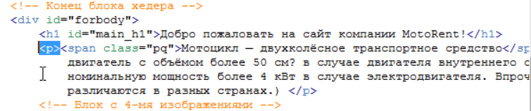
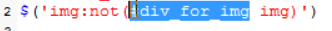

#JQUERY
#Создание выборки из элементов
# Введение в jQuery 
Первым делом нужно поговорить для чего были созданы подобные библиотеки. Потому что как вы знаете есть не только jQuery есть и другие подобные как multools и др. так вот для чего вообще создавались эти библиотеки? Дело в том что мы с вами увидели на некоторых примерах на сколько не идеально работает простой JavaScript в разных браузерах т.е. где то одно свойство поддерживается, где то другое и таких примеров на самом деле очень много. Мы просто с вами не лезли в дебри, но если в них залезть там очень много таких нюансов которые в одном браузере что то будет работать, в другом что то не будет. И проблема эта вся в том что браузеры по разному работают с этой dom моделью, объектной моделью документа о которой мы говорили. Да и плюс к тому вы и сами заметили что простой JavaScript он не совершенен потому что например в нем всего лишь два метода которые позволяют нам отбирать элементы по названию тега и по id. 
А если вам например нужно отобрать все теги по названию которые содержат какой то класс, потому что сейчас таблицы стилей очень распространены и не одного сайта не представишь без таблицы стилей, без использования классов, и если вам нужно стандартными средствами отобрать все элементы с одинаковым названием какого – то класса то вам придется очень много постараться. Там нужно будет перебрать все теги страницы в цикле, дальше внутри этого цикла создать еще один цикл который будет перебирать уже конкретный тег и все его свойства. Если он там обнаружит свойства, класс, то он должен проверить соответствует ли этот класс тому что мы указали и если соответствует то поместить этот элемент в итоговый массив и таким образом пройтись по всем элементам сайта он отберет в массив нужные нам совпадения т.е. все элементы с названием одного и того же класса. Это очень много кода, это очень много времени писать, а с помощью той же jQuery вы можете реализовать эту задачу всего лишь там двумя фразами, даже не одной строкой, а просто там буквально два слова надо написать и у вас в нужную переменную занесутся все объекты с одинаковым классом т.е. все эти манипуляции с циклами, с переборами тегов, с устранением проблем в браузере, все это происходит на фоне, на себя это берет эта библиотека. Плюс ко всему очень много задач есть при программировании на JavaScript которые очень типичны так скажем потому что мы с вами даже сами убедились сколько раз нам  приходилось в цикле проходится по какому то массиву. Это был или массив элементов, или массив студентов не важно. Постоянно мы что то перебираем в цикле. И каждый раз нам нужно писать этот цикл указывать там счетчики, условия всякие. Так вот в jQuery сделано все таким образом что во многих местах вы можете пользоваться циклом автоматически т.е. у вас есть какой то набор элементов, хотите вы с ними сделать что то одинаковое, вы просто берете этот набор, пишите что вы хотите сделать и jQuery сам возьмет на себя все остальное, он сам пройдется в цикле по всем элементам и сделает все что мы хотим т.е. опять вместо кучи кода нам нужно написать всего лишь там два слова. И вот в этом то и сила этих библиотек.

**ПОДКЛЮЧАЕМ JQUERY**

Переходим по якорю текущий релиз потому что когда вы будете смотреть данный курс выйдут уже новые версии данной библиотеки.

Выбираем minifined 

Все загрузка завершена и можно подключать данную библиотеку к нашему документу. Переходим на индексную страницу и здесь где мы изначально подключали файл со скриптами подключаем после таблицы стилей библиотеку jquery 

вот мы с вами и подключили библиотеку jquery 

 # Основные выборки элементов с помощью jquery  
   Первым делом стоит сказать что после подключения данной библиотеки в нашем распоряжении появляется вот такая функция 
    
    Так и называется. Эта функция с которой мы с вами будем постоянно работать. Которая несет в себе сразу 3-ри функции она позволяет отбирать нужные нам элементы, она позволяет прописывать им события и совершать с ними различные действия. Т.е. помните то уравнение объект – действие – событие . точно так же jquery одной этой функцией позволяет нам делать все три этих элемента. Во – первых отбирать элементы, во – вторых вешать на них события, и в третьих указывать действия  которые должны выполняться при наступлении событий. Вот такая универсальная функция и что еще интересно ее можно записывать в сокращенном варианте 
    
    ставится просто доллар. Используется и тот и тот вариант, но чаще в литературе и всяких уроках вы увидите вот этот вариант. Но функция в написании jquery() как я вам давал ранее, она используется очень часто в тех случаях когда на одном и том же сайте используется несколько библиотек. Потому что многие библиотеки в качестве сокращений имеют этот самый доллар и по этому возникают всякие конфликты. А если вы будете писать функция jquery именно таким образом то у вас не будет конфликтов с другими библиотеками. Но с другой стороны мало кто пытается совместить две библиотеки на одной странице по этому мы с вами будем всегда писать через $ потому что это намного быстрее.
Это что касалось появления новой функции. 
Теперь что касается как отбирать элементы с помощью jquery?? Потому что я вам напомню мы пока работаем над первой частью нашего уравнения, над отбором элементов. Прежде чем начать с ними что то делать мы должны просто на пятерку научится отбирать элементы со страницы, потому что это очень важно.
И так как у нас происходит отбор элементов с помощью jquery ? нам нужно вернуться немножко к css. Дело в том что я вам уже говорил что разработчики jquery не стали изобретать велосипед и приняли всю мощь css т.е. как там происходит отбор элементов, точно так же они решили сделать отбор элементов в jquery. 
И немножко давайте освежим наши знания css. Давайте откроем файл my.style.css который у нас подключен и 

название элемента либо название класса либо индификатора. Т.е. все что идет до фигурных скобок называется селектор. В данном случае это селектор по названию тега т.е. мы указываем название тега body и указываем правила для него. Т.е. 

мы по сути с  помощью этой строки 
отбираем на всей странице  элемент у которого есть класс maindiv и предаем ему эти правила.
Короче очень много говорит про css, возьми курс по css и освежи знания……………………………………………………………………………………………….
Так вот в jQuery все происходит примерно тоже самое. Когда нам нужно найти элемент например с каким то тегом т.е. просто вытащить все элементы по названию тега мы просто так и пишем что нам например нужно найти все абзацы.

 Вот мы с вами таким образом вытащили все абзацы. Это все равно что если бы мы с вами в обычном JavaScript то то выглядело бы document.getElementsByTegName (p). То здесь видите на сколько это все короче пишется, буквально 5-ть и нам вытащит все абзацы со страницы.
Если бы мы хотели бы вытащить какой – нибудь объект с каким - нибудь  индификатором то абсолютно точно так же как и в css могли бы написать. Ну допустим нас заинтересовал вот этот заголовок первого уровня 

И здесь нам просто в скобках указать как в css  

И вот эта запись у на отберет в jQuery набор вот этот элемент #main_h1. Я кстати буду часто пользоваться этим понятием jQuery набор или jQuery выборка  т.е. когда мы с вами пишем функцию jQuery и указываем в качестве параметров() какие – то элементы, например тег или id элемета, или class какой – то, то у нас по сути происходит перебор всей страницы и выбор указанного элемента т.е. происходит такая выборка. По этому я ее  буду называть выборкой или набор.
И 3-й момент который мы здесь должны изучить это выбор элемента по названию класса т.е. точно так же как и в стилях мы указываем название класса например 

Точно так же мы и здесь можем указать. Т.е. мы смотрим на странице например у какого элемента есть класс 

Т.е. мы спокойно можем отобрать данный элемент по названию его класса. При этом если есть еще элементы с таким классом они так же будут включены в наш набор .
Мы пишем точно также 

Как в таблице стилей. И у нас таким образом будет отобраны все элементы у которых есть вот такой class. 
Вот эти три селектора которые мы будем с вами использовать на постоянной основе это по названию class, по id и по названию тега 

Но естественно как и в css мы можем прописывать там через запятую, указывать всяких потомков
 К примеру
 
 Сначала находится элемент который имеет class mototable, затем ищется потомок tbody, в нем уже ищется tr и только в нем находиться td для которого прописано правило. Т.е. таким способом можно выбирать элемент и в jQuery. Но об этих более сложных способах мы поговорим позже. Главное уяснить что эти три основных метода мы с вами будем использовать постоянно и вам очень важно их понимать. Это три основных селектора которые позволяют нам выбирать объекты со страницы и формировать их них этот самый jQuery набор.

 # Вложенные и дочерние селекторы, следующий тег 
 И так мы с вами уже научились отбирать элемент по названию тега, класса  по id. И что бы еще закрепить эти знания хотел показать вам небольшую иллюстрацию 
 
 На которой видно например что если вы пишите $(#main_h1), то в этот момент у нас из dom дерева выбирается этот элемент т.е. он как бы подсвечивается. Это просто держите в голове что jQuery работает с этим dom деревом и когда вы отбираете какой – то элемент страницы то у вас в этом dom дереве он подсвечивается или они если их много, и вы уже с ними можете работать дольше. 
А мы продолжаем изучение селекторов которые позволяют нам отбирать элементы. Я уже говорил что jQuery имеет очень много инструментов которые позволяют очень гибко выбирать элементы страницы. 
Следующие элементы которые нам нужно изучить это вложенные селекторы, вложенные теги. Как пример можно привести  

Т.е. нас интересуют теги strong которые вложены в тег р. И точно также как и в css мы пишем их через пробел, мы можем так же писать их и в jQuery. Т.е. если нам нужно отобрать все теги strong которые находятся внутри тега р  мы так же пишем 

мы получим набор все теги strong находящиеся в теге р. Точно так же можно написать, например если вам нужны все картинки которые находятся внутри блока div с id = for img. 

То мы можем спокойно написать вот так

Вот таким образов в ваш набор попадут все картинки которые находятся внутри элемента с этим id.

Следующее что нам нужно знать это вид селектора выбор следующего тега. Иногда бывает такая ситуация что вам нужно выбрать именно следующий тег за каким – то. Вот у вас например есть тег h1 

А нам нужно получить доступ к следующему за ним абзацу. Если посмотреть внимательно то просто так получить доступ к этому абзацу как бы сложновато, у него нет ни id у него нет на class. Получается что если мы просто напишем тег р, то у нас будут отобраны все теги р. И в данном случае 

Сложно получить доступ к этому абзацу. Я уже не говорю про простые способы JavaScript. 
Так вот здесь нам на помощь придет селектор который позволяет выбрать следующий тег т.е. мы можем взять  за основной тег h1  у которого есть id = “main_h1”  и затем с помощью специальной конструкции указать что нам нужен следующий за ним тег. И делается это таким образом: мы пишем название тега который стоит выше (#main_h1 и указываем название тега который нам нужен +р)т.е. это выбор следующего тега. 

запомните что + означает выбор следующего тега. Это используется реже чем все остальные, но все равно вы должны знать что такой метод есть и иногда только он позволяет получить доступ именно к какому – то конкретному элементу вашей страницы.
И последний способ выбрать элемент с помощью jQuery который мы пройдем в этом уроке это способ выбора дочерних тегов. Помните мы в просто JavaScript изучали такое свойство как childNodes т.е. эти самые дочерние узлы. Т.е. точно так же  jQuery вы можете выбирать эти самые дочерние узлы и если вам нужно например выбрать там все дочерние узлы в том же теге div 

То вы можете написать так, копируем id и указываем таким образом 

вот такая запись выдаст вам все дочерние картинки для данного тега. 
Вы можете спросить а зачем это нужно? Могли просто написать 

Но в этом случае у нас выбируться вообще все картинки которые находяться внутри этого блока. Потому что у нас может быть и такая ситуация что допустим картинки могут быть в абзацах 

и в этом случае у нас 

будут выбраны все картинки, даже те которые находятся внутри абзаца.
А если мы напишем таким образом 

то в данном случае нас будут интересовать именно дочерние картинки и вот эта картинка 

сюда уже не попадет. Она уже не является дочерней по отношению к тегу div for_img потому что картинка по сути является сыном для абзаца, по этому данный вариант выберет только 3-ри картинки, именно дочерние, которые являются как бы прямыми потомками. По этому это имейте ввиду, я не зря вам объяснял эти родственные связи. Если вам нужно выбрать именно дочерние то это пишется через знак больше >. А если вам нужно выбрать все картинки внутри блока то это просто через пробел 

# Выборка по наличию и значению атрибутов 
И так мы с вами уже изучили 6-ть способов отбора элементов с вэб – страницы, в jQuery выборку, это выборка по названию тега, по id по названию class, по вложенным селекторам, по выбору следующего тега, и выбор дочерних тегов. И сейчас мы изучим еще 40ре варианта выбора элементов с вэб страницы т.е. у нас того уже будет 10-ть. Как видите jQuery нам дает очень огромную гибкость в выборе элементов вэб страницы. 
И сейчас мы поговорим как выбирать элементы по их атрибутам. Если вы внимательно посмотрите на нашу страницу, то увидите что у многих тегов есть много атрибутов

И в jQuery есть 4-ре способа которые заточены под выборку элементов именно по атрибутам. Это одни из моих любимых способов выбирать элементы на вэб странице, они очень простые и очень точечно позволяют выбрать какой – то элемент или группу элементов. На практике мы с вами будем их постоянно использовать. Сейчас мы их в краце рассмотрим. 
И первое с чего мы начнем это выборка элемента по точному значению его атрибута. Допустим  смотрите, нам нужны все картинки у которых ширина 200px. 

и здесь мы как раз можем применить способ выбора элементов по их атрибутам т.е. мы можем написать что нас интересует все картинки у которых  width 200px.  и делается это очень просто. Мы вызываем функцию jQuery как обычно и в качестве параметра отдаем ей такое значение, т.е. мы говорим что нас интересуют все теги img но не абсолютно все а у которых атрибут width = 200, пишем в квадратных скобках [], 

здесь ни каких кавычек не нужно, просто в квадратных скобках просто пишем название атрибута и его значение. Вот такая запись выберет нам все картинки на странице с width 200px. если мы посмотрим это на более наглядном примере это будет выглядеть вот таким образом

таким образом вы поймете как это дело работает и когда вам нужно выбрать какой – то элемент именно по названию его атрибута то достаточно написать это название и указать его значение
 
 Второй способ это способ по начальному значению атрибута. Если выше мы писали точное значение, то иногда бывает ситуация когда нужно выбрать элементы по начальному значению. Например все ссылки href у которых начальное значение начинается с http 

например следующая ссылка на просто ведет на какой – то файл на нашем сервере. Ссылка  с протоколом http ведет на отдельный сайт. И допустим нас интересуют все ссылки на страницы которые ведут на другие сайты которые начинаются с http. Как мы с вами можем это реализовать?? Мы же на можем с вами написать полное название атрибута.
На этот случай в jQuery есть специальный вариант отбора элементов по начальному значению атрибута. Т.е. мы можем указать таким образом что нас интересует href у которых атрибут начинается с http. И делается это еще проще. Вызываем функцию и в скобках пишем. Мы говорим что нас интересуют ссылки (‘a’), и раз речь идет об атрибутах ставим обязательно квадратные скобки 

это мы написали что href = равен http, а что бы указать что начинается перед знаком равенства нужно поставить птичку 

помните эту птичку из регулярных выражений, там она тоже означала начало строки, а здесь она означает что http должно быть началом и с этого должно начинаться значение атрибута. Все, такая запись отберет все ссылки на странице у которых атрибут href начинается с протокола http.
И логично было бы при котором атрибут должен заканчиваться на что –то. Потому что часто бывает ситуация когда нам нужно например выбрать все ссылки на какие –то файлы. Допустим у нас есть файл pdf 

ссылки на файл pdf. И допустим мы хотим сделать так что бы в jQuery набор попали все ссылки которые ведут на pdf файлы или все картинки с расширением jpg. Давайте рассмотрим пример когда нам нужны картинки только с расширением jpg.  
В параметрах функции jQuery говорим что нас интересуют картинки jpg, если мы работаем с атрибутами то ставим квадратные скобки [], у которых атрибут src = заканчивается на .jpg 

и здесь что бы показать что это именно заканчивается мы должны перед знаком равенства поставить уже не птичку а доллар $.

опять таки знакомый нам доллар из регулярных выражений, там он у нас обозначал конец строки т.е. и здесь примерно тоже самое он обозначает что именно должно заканчиваться на .jpg 
У нас остался последний вариант выборки это когда в атрибуте есть значение в любом его месте. Тоже очень полезна бывает такая возможность и здесь самый простой пример это опять таки с нашими 4-мя картинками. Мы можем написать что нас интересуют все изображения у которых в атрибуте src встречается слово moto. 
Пишем функцию и в круглых скобках говорим что нас интересуют картинки jpg атрибут [] src который содержит = moto.  И что бы сказать что именно содержит мы перед знаком равенства должны поставить звездочку которая означает как бы в любом месте. 

вот таким образом у нас отберется в набор эти 4-ре картинки у которых в атрибуте src как мы видим встречается moto.

# Фильтрация выборок  
К этому моменту мы знаем 10-ть методов 

с помощью которых мы можем создать выборку т.е. выбрать объект на вэб странице с которым мы хотим работать или объекты.
На разработчики jQuery на этом не остановились они добавили еще много всяких интересных возможностей для создания выборок и таким образом вы сможете сделать выборку еще более уникальной. И сейчас мы пройдем еще 9-ть возможностей. Все эти возможности предоставляются так называемыми фильтрами и работают они таким образом.
Для показа первого фильтра давайте вернемся на нашу html страницу у нас там есть табличка

в ней две строчки Харлей Дэвидсон и Кроссовый мотоцикл

вот они эти две строчки и нам для примера нужно добавить еще две. Я заранее их приготовил 

сохраняю страничку и смотрим на первый фильтр.
Допустим смотрите, у нас такая ситуация что нам нужно выбрать только четные строки данной таблицы. Простыми способами которые у нас сейчас доступны мы этого сделать не можем, мы не можем выбрать именно все четные строки. Допустим мы хотим что бы четные строки подсвечивались у нас серым цветом

Просто очень часто так делают для облегчения чтения таблицы, четные строки делают немножко сероватыми, а не четные белыми оставляют.
Так вот что бы нам выбрать все не четные строки у нас пока таких возможностей нет. И для этого как раз используются фильтры. И как они работают?? Первым делом мы выбираем табличку которая нас интересует 

у нее несть id moto_table т.е. мы это копируем, как обычно пишем функцию jQuery и указываем первым делом эту табличку а затем говорим что нас интересуют строки это теги tr, 

но в данном случае как вы знаете он нам выберет все строки. Что бы выбрать например только четные строки мы можем добавить этот самый фильтр и он пишется вот так, просто ставите двоеточие за тем элементом которому нужно добавить фильтр и пишете название фильтра. Это применимо именно к этому фильтру четности не четности, потому что разные фильтры пишутся по разному как мы с вами увидим. А вот именно фильтр четности не четности пишется таким образом. Если вам нужны четные пишите even,

но только имейте ввиду что если вы здесь пишите четное то это будет четное с точки зрения JavaScript потому что смотрите. Если мы пишем moto_table tr, то там этих строк 4-ре, получается у нас вернется массив из четырех строк, мы знаем что в массивах отсчет идет с ноля, и ели вы пишите фильтр even четное то он нам возьмет четные элементы это 0-й и 2-й. а для нас для людей это будет первый и третий. По этому это имейте ввиду и держите в голове. когда вам нужны четные элементы то вам нужно наоборот писать другой фильтр odd перевод как не четные 

но для точки зрения отсчета в массивах он будет конечно не четным, а для нас это будет четное наоборот для человеческой системы.
Следующий фильтр это фильтр отрицания not. Для чего он используется?? Иногда бывает такая ситуация что нужно выбрать все элементы какого – то типа на странице, но не брать какие то конкретные элементы. Допустим у вас есть куча ссылок на странице но при этом навигация так же состоит из ссылок. И допустим вам нужно выбрать все эти ссылки и перекрасить там в какой – то  цвет, но навигацию при этом трогать не нужно. По этому вы можете написать таким образом что допустим взять все ссылки, но кроме тех которые находятся в блоке навигации. И сейчас мы попробуем сделать подобный пример. Допустим у нас есть много картинок на странице 6-ть штук. И допустим мы хотим взять все картинки в наборе, но кроме тех которые находятся в этом блоке div. 

здесь опять таки нам на помощь придет фильтр not, фильтр отрицания. И это будет выглядеть таким образом. Мы пишем функцию jQuery, в скобках (‘’)говорим что нас во первых интересуют все картинки  на странице но кроме тех, по этому ставим :not, и ставим круглые скобки и говорим кроме каких, кроме тех которые входят в этот блок div  с id 

т.е. это простой такой же селектор который выбрал бы нам те картинки внутри этого блока 

Но мы пишем этот селектор уже внутри фильтра not, по этому он их наоборот не возьмет. И эта запись будет означать взять все картинки на странице но кроме тех которые указаны в круглых скобках. Тоже достаточно часто используется данный фильтр, по этому имейте его ввиду ничего сложного в нем нет. Когда вам нужно взять что – то конкретное но кроме каких то, то фильтр not нам здесь помощник.

Следующий фильтр это фильтр элементов который содержит другие элементы. О чем здесь идет речь?? Бывает такая ситуация что нужно выбрать например все блоки div в которых есть картинки например. Или там все списки в которых есть например ссылки. Иногда бывает ситуация что нужно выбрать объект только если он содержит другой объект. 
Допустим все теги div которые содержат в себе тег fieldset  

пишем таким образом. Мы говорим что нас интересуют блоки div, но не все, а нужно их отфильтровать по этому мы ставим : has перевод с английского как иметь, по этому мы говорим что нас интересуют блоки div которые имеют внутри себя и указываем что они имеют().просто указываем название этого тега fieldset

и это будет означать что нужно взять только те блоки div которые внутри себя содержат  теги fieldset. Ничего сложного да? Здесь видите что все основано на английском языке. Все приближено к нашему реальному языку и по этому все это достаточно понятно. 

Следующий фильтр это фильтр по содержанию определенного текста. Иногда бывает ситуация что нужно отобрать какой то абзац только если в нем есть какое – то слово например. 

Как нам отобрать абзацы со словом мотоцикл? Из текущих свойств которые мы изучили у нас такой возможности нет.
Есть такой специальный фильтр который позволяет это сделать. Это фильтр contains перевод содержит. Мы пишем что нас интересуют все абзацы но на самом деле только те которые содетжут  и в скобках указываем что они содержат. 

вот эта запись уже позволит выбрать из всей страницы только те абзацы которые содержат это слово. Это был фильтр по содержанию.

Следующий фильтр это фильтр первого элемента. Иногда бывает ситуация что нужно выбрать какую – то первую часть. Допустим у нас есть блок div с 4-мя картинками но нам потребовалась тольо первая. Допустим у нее нет там ни каких id, ничего нет. 
Единственный способ по которому ее можно ее определить это вот именно то что она идет первая в блоке div. 
У нас есть этот блок с этим id 

Т.е. мы можем сказать что нас интересуют все картинки с этого блока сначала, а потом добавить фильтр что не все а только первая.
По этому мы берем этот id и говорим что нужно взять выборку все картинки и из этого блока с таким id 

Но потом дописываем специальный фильтр что оказывается не все, а только первую 

и естественно есть противоположное этому значение last последняя. 

И еще два фильтра которые мы здесь просто опишем но пока не будем с ними экспериментировать потому что нам сначала нужно дойти до действий с элементами а там мы уже их будем использовать. Это фильтры которые забирают только скрытые элементы либо только видимые. Потому что как вы увидите на практике, мы очень часто будем скрывать разные блоки на странице. И допустим если мы скрыли какой –то блок div и хотим в набор получить именно все скрытые блоки на данный момент, то есть такой специальный фильтр 

И есть обратный этому фильтру 

# Ожидание формирования DOM дерева
И так мы с вами закончили большую и очень важную тему это отбор элементов вэб страницы для дальнейшей работы с этими элементами. При этом мы изучили как делается отбор с помощью традиционного JavaScript и как с помощью библиотеки jQuery/
А теперь пришло время научится производить различные действия над этими элементами которые мы долго учились отбирать, но перед этим есть не большое важное замечание которое вы должны так же понять и использовать. Помните я вам говорил такую вещь, даже мы рассматривали пример что пока dom дерево не сформировано мы не должны пытаться что –то делать с его элементами потому что у нас все равно этого не получится. Мы писали вот здесь 

который потом убрали в самый конец и сделали мы это для того что бы дождаться полного построения dom дерева и только потом выполнять все эти скрипты. На самом деле в jQuery есть специальный механизм который позволяет дожидаться автоматически полной загрузки dom дерева и только потом выполнять всякие скрипты. По этому вы можете спокойно снизу взять наш скрипт и перенести его обратно наверх, потому что больше нет надобности держать в самом конце  и оставим его вот  здесь

а вместо этого в наш файл js мы в самом начале напишем  специальную конструкцию на jQuery которая позволяет дожидаться загрузки документа и только потом выполнять все действия которые мы напишем. Выглядит она таким образом.
Вызываем нашу функцию jQuery и  в скобках пишем объект document 

Затем мы говорим что воспользуемся специальным методом ready и внутри этого метода мы должны написать следующее(), function ставим две круглые скобки(), и две фигурные {}, 

эта конструкция у нас и будет отвечать за то что бы документ загрузился до того как он начнет выполнять какие – то действия, и все наши коды мы будем писать внутри этой конструкции

По сути мы с вами сейчас написали что документ будет готов, нужно выполнять все действия которые расположены здесь между фигурными скобками. 
Есть еще более сокращенная версия данной записи. Вы ее так же можете встретить во всяких уроках. Пишется вот так

Возвращаем старую запись. И в самом низу желательно оставить комментарий и написать что это конец ready

Потому что мы с вами будем часто пользоваться вот такими всякими конструкциями и у нас таких фигурных скобок в конце может быть несколько штук, и что бы сразу видеть где что обычно удобно написать в самом конце что это закончилось, какая именно функция и уже дальше удобнее будет работать. 

# Действия над отобранными элементами

  # Функции text(), hide(), show()
  В этом уроке изучим первые три метода которые позволят нам что –то делать с элементами нашей вэб страницы. 
И так начнем мы с того что изучим метод text который позволяет нам получать текст элемента и изменять его. Если вы помните в стандартном JavaScript мы на этот счет изучали свойство innerText которое, к сожалению, не точно работало во всех браузерах. А здесь же это все работает идеально по этому здесь волноваться не нужно. 
И так первым делом давайте определимся текст какого элемента мы хотим получить пусть это будет заголовок h1. 

И так если мы хотим получить текст элемента или изменить его, то нам сначала нужно выбрать этот элемент со страницы в данном случае выбираем его по id.  Т.е. мы пишем нашу функцию jQuery говорим что отбираем элемент с таким id 

И по сути мы таким образом создали jQuery объект. Запомните что когда вы отбираете в выборку какие –то элементы или элемент то вы по сути создаете jQuery объект и вам становится доступны все свойства этого объекта, а у jQuery объектов очень много свойств и постепенно мы с вами будем их изучать. Так вот мы с вами по сути создали jQuery объект и теперь можем к нему применять всякие методы. И первый их этих методов text/

И вот эта конструкция вернет нам текст который находится в элементе #main_h1 
И естественно что бы его например вывести на экран мы можем либо сразу написать alert либо сохранить в переменную а затем уже выводить

как мы видим мы получаем тот самый alert и получаем текст этого самого заголовка.

Если мы хотим изменить этот текст. Просто нужно передать в эту функцию параметр 

и тогда текст будет изменен. 

Следующая функция которую мы изучим это функция hide()
Эта функция которая позволяет прятать элемент со страницы. Допустим пусть это будет шапка сайта. Если мы посмотрим на код то нам первым делом нужно определится как мы ее вытащим для дальнейшей работы. 

предположим найдем картинку в которой в атрибуте src есть значение logo.jpg 

Вот таким образом мы создали объект jQuery который включает ссылку на нашу картинку и теперь мы можем делать с ней все что угодно.

это скорость исчезновения и функция которая будет выполнена после завершения работы этого метода. Т.е. как только картинка исчезает можно сделать так что бы выполнилась какая - нибудь функция. Пока мы воспользуемся только первым параметром и укажем за сколько должна исчезнуть картинка, здесь нужно указывать время в милисекундах. По этому если мы хотим что бы исчезла за три секунды нужно указать 3000

Проверяем на сайте. Исчезает. 
Тоже самое только в обратную сторону show т.е. он наоборот показывает картинку 

таким образом у нас сначала картинка исчезает, а затем эта же картинка появится. Проверяем. Вот так работает метод hide и метод show.
Но при этом если смотрите, здесь такое важное замечание. Если вы с одной и тоже выборкой работаете несколькими методами то желательно такую выборку поместить в какую – нибудь переменную, потому что если вы этого не делаете смотрите как действует интерпритатор JavaScript. Когда он доходит до этой строчки 

он ищет все картинки у которых в атрибуте src встречается logo.jpg. если страница очень большая, например на ней очень много картинок, то это достаточно затратная операция получается. И вот он ее нашел hide. Дальше он идет сюда 

Ему нужно опять пройтись по всему dom дереву и найти тоже самое изображение по этому если вы планируете с одним и тем же объектом работать несколькими методами то лучше его заранее сохранить в какую - нибудь переменную. 

при этом работа компилятора уменьшается ровно в два раза. Т.е. он один раз находит эту картинку, создает объект, помещает его в переменную, а дальше ему заново не надо искать, он просто сначала прячет а затем показывает.

# Понятие цепных функций 
функций 
В этом коротком уроке мы с вами пройдем очень важное понятие которое вы должны знать и понимать и использовать на практике это понятие цепных функций. Что это такое? Смотрите, мы с вами в предыдущем уроке остановились на том что у нас к одной и тоже переменной, по сути к одному и тому же объекту jQuery которую мы в эту переменную поместили 

применяются две функции причем на разных строках. Так вот разработчики jQuery подумали что это как – то не очень логично, и было бы здорово сразу прописать все необходимые функции в одну строку т.е. примерно вот таки образом

и они это на самом деле реализовали. Назвали это дело цепные функции. И вы спокойно можете это использовать т.е. данный код будет работать точно также как и предыдущий. 
 Таким образом в одну строку вы можете написать сколько угодно функций, реально можно составить очень длинный список функций.

# Понятие автоматических циклов 
В этом уроке мы с вами затронем еще одно очень важное понятие которое вы должны так же очень хорошо понимать и представлять себе как это работает. Потому что если вы понимаете как что – то работает то вам на много проще это использовать.
Это понятие автоматических циклов. Что это значит?? До текущего момента мы с вами применяли функции jQuery для одиночных элементов. Мы не отбирали элементы которые содержат сразу несколько. Например мы попробуем сейчас отобрать те самые 4-ре мотоцикла эти 4-ре картинки

В скрипте напишем что нас интересуют все картинки внутри div вот с таким id 

таким образом мы с вами создадим объект который будет содержать 4-ре картинки. Если вы вспомните обычный JavaScript где мы использовали для примерно подобных целей метод getElementsByTegName т.е. там если нам нужны были все картинки со страницы то мы писали document. getElementsByTegNameи в качестве параметров() передавали ему img  и он нам возвращал все эти картинки. При этом если нам надо было например посмотреть атрибут src других картинок то нам нужно было писать цикл для прохождения по всему этому массиву, и в цикле мы выводили на экран значение атрибута src. Там нам даже эти текстовые узлы попались. Факт в том что мы проходились циклом по этому массиву и выводили нужное значение. 
Так вот представьте себе что в jQuery за вас уже позаботились и вам уже не нужно писать эти циклы когда вы хотите применить какой – то метод сразу ко всем объектам которые попали в вашу выборку. 
В данном случае нам в выборку попало 4-ре картинки и что бы сразу скрыть эти все четыре картинки нам достаточно написать просто .hide 

Т.е. вы должны оценить всю эту мощь jQuery когда вас уже не заставляют проходиться по массиву, писать этот цикл, который все равно по сути дела одно и тоже даст с каждым элементом массива. Здесь уже все сделано за вас, все эти циклы проходят за кулисами, вам достаточно сделать выборку в которой там может быть хоть 200-ти элементов и просто написать что мы хотим с ними сделать. И если мы посмотрим на результат, то мы увидим как это все происходит.
Видно что все эти картинки исчезают т.е. цикл проходится автоматичеки, за вашими глазами, но факт в том что это работает. Это еще одна прелесть jQuery которую я вам хотель объяснить в этом уроке. Когда вам в элемент jQuery попадает много элементов то вам не нужно выдумывать какие – то циклы, проходится по массивам, просто пишите что вы хотите с ними сделать и все.

# Изменение высоты и ширины элементов 
эти методы позволяют получать значения ширины и высоты. Эти методы позволяют получать значения ширины выбранного элемента и высоты соответственно а так же позволяют менять эту ширину и высоту там где это возможно. Допустим у нас есть наш любимы блок div который обрамляет эти 4-ре картинки 

и для наглядности давайте выделим этот блок с помощью css правил и дадим ему рамку ширину и высоту.

А теперь перейдем в наш JavaScript файл и попробуем получить значение ширины для этого блока. Опять таки говорим что нас интересует объект с id (‘#div_for_img’ )ставим точку . и говорим что нас интересует ширина width. 

если нас интересует просто ширина мы естественно ни каких параметров не передаем а лучше занесем это значение в переменную 

это что касается того как узнать. 

Теперь попробуем изменить значение высоты и ширины 

выводит мы alert не будем . смотрим. 

на наших глазах размер данного блока уменьшился. Но уменьшился он мгновенно да? Возможно вы уже видели что бывает такое плавное уменьшение ширины и высоты но до этого мы еще доберемся.
