[Создание выборки из элементов](#создание-выборки-из-элементов)

[Основные выборки элементов с помощью jquery](#основные-выборки-элементов-с-помощью-jquery)

[Вложенные и дочерние селекторы, следующий тег](#вложенные-и-дочерние-селекторы,-следующий-тег)

[Выборка по наличию и значению атрибутов](#выборка-по-наличию-и-значению-атрибутов)

[Фильтрация выборок ](#фильтрация-выборок)

[Ожидание формирования DOM дерева](#ожидание-формирования-dom-дерева)

[Действия над отобранными элементами](#действия-над-отобранными-элементами)

[Функции text(), hide(), show()](#функции-text()-hide()-show())

[Изменение высоты и ширины элементов](#изменение-высоты-и-ширины-элементов)

[Функция html](#функция-html)

[Функция fadeInt() и fadeOut()](#функция-fadeint-и-fadeout)

[Функция fadeTo()](#функция-fadeto)

[функция slideDown() и slideUp()](#функция-slidedown-и-slideup)

[функция attr() и remuveAttr()](#функция-attr-и-remuveattr)

[Функции addClass() и remuveClass()](#функции-addclass-и-remuveclass)

[Функция css ()](#функция-css)

[Функция animate()](#функция-animate)

[Функция append() prepend() after() before()](#функция-append()-prepend()-after()-before())

[Функция each() и понятие $(this)](#функция-each-и-понятие)

[Функция size() и доступ к элементу выборки](#функция-size-и-доступ-к-элементу-выборки)

[Функция clone() и remove()](#функция-clone-и-remove)

[Два  полезных совета](#два-полезных-совета)

[Реакция элементов web страниц на события](#реакция-элементов-web-страниц-на-события)

[Список событий которые отслеживает браузер](#список-событий-которые-отслеживает-браузер)

[Традиционная модель событий и ее недостатки](#традиционная-модель-событий-и-ее-недостатки)

[jQuery модель событий](#jquery-модель-событий)

[jQuery событие hover() и toggle ()](#jquery-событие-hover-и-toggle)

[понятие объекта события](#понятие-объекта-события)

[отмена обычного поведения элемента](#отмена-обычного-поведения-элемента)

[Создаем слайдшоу для закрепления метериала](#cоздаем-слайдшоу-для-закрепления-метериала)

[выбор и фильтрация элементов формы](#выбор-и-фильтрация-элементов-формы)

[фильтры состояния элементов](#фильтры-состояния-элементов)

[узнаем значение элементов формы в выборке](#узнаем-значение-элементов-формы-в-выборке)

[события submit() и focus()](#события-submit-и-focus)

[событие blur() и change()](#событие-blur-и-change)
[Включение и отключение скрытие и показ полей ](#включение-и-отключение-скрытие-и-показ-полей)
[Два  полезных совета](#два-полезных-совета)
[Два  полезных совета](#два-полезных-совета)
[Два  полезных совета](#два-полезных-совета)
[Два  полезных совета](#два-полезных-совета)

#JQUERY
# Создание выборки из элементов
# Введение в jQuery 
Первым делом нужно поговорить для чего были созданы подобные библиотеки. Потому что как вы знаете есть не только jQuery есть и другие подобные как multools и др. так вот для чего вообще создавались эти библиотеки? Дело в том что мы с вами увидели на некоторых примерах на сколько не идеально работает простой JavaScript в разных браузерах т.е. где то одно свойство поддерживается, где то другое и таких примеров на самом деле очень много. Мы просто с вами не лезли в дебри, но если в них залезть там очень много таких нюансов которые в одном браузере что то будет работать, в другом что то не будет. И проблема эта вся в том что браузеры по разному работают с этой dom моделью, объектной моделью документа о которой мы говорили. Да и плюс к тому вы и сами заметили что простой JavaScript он не совершенен потому что например в нем всего лишь два метода которые позволяют нам отбирать элементы по названию тега и по id. 
А если вам например нужно отобрать все теги по названию которые содержат какой то класс, потому что сейчас таблицы стилей очень распространены и не одного сайта не представишь без таблицы стилей, без использования классов, и если вам нужно стандартными средствами отобрать все элементы с одинаковым названием какого – то класса то вам придется очень много постараться. Там нужно будет перебрать все теги страницы в цикле, дальше внутри этого цикла создать еще один цикл который будет перебирать уже конкретный тег и все его свойства. Если он там обнаружит свойства, класс, то он должен проверить соответствует ли этот класс тому что мы указали и если соответствует то поместить этот элемент в итоговый массив и таким образом пройтись по всем элементам сайта он отберет в массив нужные нам совпадения т.е. все элементы с названием одного и того же класса. Это очень много кода, это очень много времени писать, а с помощью той же jQuery вы можете реализовать эту задачу всего лишь там двумя фразами, даже не одной строкой, а просто там буквально два слова надо написать и у вас в нужную переменную занесутся все объекты с одинаковым классом т.е. все эти манипуляции с циклами, с переборами тегов, с устранением проблем в браузере, все это происходит на фоне, на себя это берет эта библиотека. Плюс ко всему очень много задач есть при программировании на JavaScript которые очень типичны так скажем потому что мы с вами даже сами убедились сколько раз нам  приходилось в цикле проходится по какому то массиву. Это был или массив элементов, или массив студентов не важно. Постоянно мы что то перебираем в цикле. И каждый раз нам нужно писать этот цикл указывать там счетчики, условия всякие. Так вот в jQuery сделано все таким образом что во многих местах вы можете пользоваться циклом автоматически т.е. у вас есть какой то набор элементов, хотите вы с ними сделать что то одинаковое, вы просто берете этот набор, пишите что вы хотите сделать и jQuery сам возьмет на себя все остальное, он сам пройдется в цикле по всем элементам и сделает все что мы хотим т.е. опять вместо кучи кода нам нужно написать всего лишь там два слова. И вот в этом то и сила этих библиотек.

**ПОДКЛЮЧАЕМ JQUERY**

Переходим по якорю текущий релиз потому что когда вы будете смотреть данный курс выйдут уже новые версии данной библиотеки.

Выбираем minifined 

Все загрузка завершена и можно подключать данную библиотеку к нашему документу. Переходим на индексную страницу и здесь где мы изначально подключали файл со скриптами подключаем после таблицы стилей библиотеку jquery 

вот мы с вами и подключили библиотеку jquery 

 # Основные выборки элементов с помощью jquery  
   Первым делом стоит сказать что после подключения данной библиотеки в нашем распоряжении появляется вот такая функция 
    
    Так и называется. Эта функция с которой мы с вами будем постоянно работать. Которая несет в себе сразу 3-ри функции она позволяет отбирать нужные нам элементы, она позволяет прописывать им события и совершать с ними различные действия. Т.е. помните то уравнение объект – действие – событие . точно так же jquery одной этой функцией позволяет нам делать все три этих элемента. Во – первых отбирать элементы, во – вторых вешать на них события, и в третьих указывать действия  которые должны выполняться при наступлении событий. Вот такая универсальная функция и что еще интересно ее можно записывать в сокращенном варианте 
    
    ставится просто доллар. Используется и тот и тот вариант, но чаще в литературе и всяких уроках вы увидите вот этот вариант. Но функция в написании jquery() как я вам давал ранее, она используется очень часто в тех случаях когда на одном и том же сайте используется несколько библиотек. Потому что многие библиотеки в качестве сокращений имеют этот самый доллар и по этому возникают всякие конфликты. А если вы будете писать функция jquery именно таким образом то у вас не будет конфликтов с другими библиотеками. Но с другой стороны мало кто пытается совместить две библиотеки на одной странице по этому мы с вами будем всегда писать через $ потому что это намного быстрее.
Это что касалось появления новой функции. 
Теперь что касается как отбирать элементы с помощью jquery?? Потому что я вам напомню мы пока работаем над первой частью нашего уравнения, над отбором элементов. Прежде чем начать с ними что то делать мы должны просто на пятерку научится отбирать элементы со страницы, потому что это очень важно.
И так как у нас происходит отбор элементов с помощью jquery ? нам нужно вернуться немножко к css. Дело в том что я вам уже говорил что разработчики jquery не стали изобретать велосипед и приняли всю мощь css т.е. как там происходит отбор элементов, точно так же они решили сделать отбор элементов в jquery. 
И немножко давайте освежим наши знания css. Давайте откроем файл my.style.css который у нас подключен и 

название элемента либо название класса либо индификатора. Т.е. все что идет до фигурных скобок называется селектор. В данном случае это селектор по названию тега т.е. мы указываем название тега body и указываем правила для него. Т.е. 

мы по сути с  помощью этой строки 
отбираем на всей странице  элемент у которого есть класс maindiv и предаем ему эти правила.
Короче очень много говорит про css, возьми курс по css и освежи знания……………………………………………………………………………………………….
Так вот в jQuery все происходит примерно тоже самое. Когда нам нужно найти элемент например с каким то тегом т.е. просто вытащить все элементы по названию тега мы просто так и пишем что нам например нужно найти все абзацы.

 Вот мы с вами таким образом вытащили все абзацы. Это все равно что если бы мы с вами в обычном JavaScript то то выглядело бы document.getElementsByTegName (p). То здесь видите на сколько это все короче пишется, буквально 5-ть и нам вытащит все абзацы со страницы.
Если бы мы хотели бы вытащить какой – нибудь объект с каким - нибудь  индификатором то абсолютно точно так же как и в css могли бы написать. Ну допустим нас заинтересовал вот этот заголовок первого уровня 

И здесь нам просто в скобках указать как в css  

И вот эта запись у на отберет в jQuery набор вот этот элемент #main_h1. Я кстати буду часто пользоваться этим понятием jQuery набор или jQuery выборка  т.е. когда мы с вами пишем функцию jQuery и указываем в качестве параметров() какие – то элементы, например тег или id элемета, или class какой – то, то у нас по сути происходит перебор всей страницы и выбор указанного элемента т.е. происходит такая выборка. По этому я ее  буду называть выборкой или набор.
И 3-й момент который мы здесь должны изучить это выбор элемента по названию класса т.е. точно так же как и в стилях мы указываем название класса например 

Точно так же мы и здесь можем указать. Т.е. мы смотрим на странице например у какого элемента есть класс 

Т.е. мы спокойно можем отобрать данный элемент по названию его класса. При этом если есть еще элементы с таким классом они так же будут включены в наш набор .
Мы пишем точно также 

Как в таблице стилей. И у нас таким образом будет отобраны все элементы у которых есть вот такой class. 
Вот эти три селектора которые мы будем с вами использовать на постоянной основе это по названию class, по id и по названию тега 

Но естественно как и в css мы можем прописывать там через запятую, указывать всяких потомков
 К примеру
 
 Сначала находится элемент который имеет class mototable, затем ищется потомок tbody, в нем уже ищется tr и только в нем находиться td для которого прописано правило. Т.е. таким способом можно выбирать элемент и в jQuery. Но об этих более сложных способах мы поговорим позже. Главное уяснить что эти три основных метода мы с вами будем использовать постоянно и вам очень важно их понимать. Это три основных селектора которые позволяют нам выбирать объекты со страницы и формировать их них этот самый jQuery набор.

 # Вложенные и дочерние селекторы, следующий тег 
 И так мы с вами уже научились отбирать элемент по названию тега, класса  по id. И что бы еще закрепить эти знания хотел показать вам небольшую иллюстрацию 
 
 На которой видно например что если вы пишите $(#main_h1), то в этот момент у нас из dom дерева выбирается этот элемент т.е. он как бы подсвечивается. Это просто держите в голове что jQuery работает с этим dom деревом и когда вы отбираете какой – то элемент страницы то у вас в этом dom дереве он подсвечивается или они если их много, и вы уже с ними можете работать дольше. 
А мы продолжаем изучение селекторов которые позволяют нам отбирать элементы. Я уже говорил что jQuery имеет очень много инструментов которые позволяют очень гибко выбирать элементы страницы. 
Следующие элементы которые нам нужно изучить это вложенные селекторы, вложенные теги. Как пример можно привести  

Т.е. нас интересуют теги strong которые вложены в тег р. И точно также как и в css мы пишем их через пробел, мы можем так же писать их и в jQuery. Т.е. если нам нужно отобрать все теги strong которые находятся внутри тега р  мы так же пишем 

мы получим набор все теги strong находящиеся в теге р. Точно так же можно написать, например если вам нужны все картинки которые находятся внутри блока div с id = for img. 

То мы можем спокойно написать вот так

Вот таким образов в ваш набор попадут все картинки которые находятся внутри элемента с этим id.

Следующее что нам нужно знать это вид селектора выбор следующего тега. Иногда бывает такая ситуация что вам нужно выбрать именно следующий тег за каким – то. Вот у вас например есть тег h1 

А нам нужно получить доступ к следующему за ним абзацу. Если посмотреть внимательно то просто так получить доступ к этому абзацу как бы сложновато, у него нет ни id у него нет на class. Получается что если мы просто напишем тег р, то у нас будут отобраны все теги р. И в данном случае 

Сложно получить доступ к этому абзацу. Я уже не говорю про простые способы JavaScript. 
Так вот здесь нам на помощь придет селектор который позволяет выбрать следующий тег т.е. мы можем взять  за основной тег h1  у которого есть id = “main_h1”  и затем с помощью специальной конструкции указать что нам нужен следующий за ним тег. И делается это таким образом: мы пишем название тега который стоит выше (#main_h1 и указываем название тега который нам нужен +р)т.е. это выбор следующего тега. 

запомните что + означает выбор следующего тега. Это используется реже чем все остальные, но все равно вы должны знать что такой метод есть и иногда только он позволяет получить доступ именно к какому – то конкретному элементу вашей страницы.
И последний способ выбрать элемент с помощью jQuery который мы пройдем в этом уроке это способ выбора дочерних тегов. Помните мы в просто JavaScript изучали такое свойство как childNodes т.е. эти самые дочерние узлы. Т.е. точно так же  jQuery вы можете выбирать эти самые дочерние узлы и если вам нужно например выбрать там все дочерние узлы в том же теге div 

То вы можете написать так, копируем id и указываем таким образом 

вот такая запись выдаст вам все дочерние картинки для данного тега. 
Вы можете спросить а зачем это нужно? Могли просто написать 

Но в этом случае у нас выбируться вообще все картинки которые находяться внутри этого блока. Потому что у нас может быть и такая ситуация что допустим картинки могут быть в абзацах 

и в этом случае у нас 

будут выбраны все картинки, даже те которые находятся внутри абзаца.
А если мы напишем таким образом 

то в данном случае нас будут интересовать именно дочерние картинки и вот эта картинка 

сюда уже не попадет. Она уже не является дочерней по отношению к тегу div for_img потому что картинка по сути является сыном для абзаца, по этому данный вариант выберет только 3-ри картинки, именно дочерние, которые являются как бы прямыми потомками. По этому это имейте ввиду, я не зря вам объяснял эти родственные связи. Если вам нужно выбрать именно дочерние то это пишется через знак больше >. А если вам нужно выбрать все картинки внутри блока то это просто через пробел 

# Выборка по наличию и значению атрибутов 
И так мы с вами уже изучили 6-ть способов отбора элементов с вэб – страницы, в jQuery выборку, это выборка по названию тега, по id по названию class, по вложенным селекторам, по выбору следующего тега, и выбор дочерних тегов. И сейчас мы изучим еще 40ре варианта выбора элементов с вэб страницы т.е. у нас того уже будет 10-ть. Как видите jQuery нам дает очень огромную гибкость в выборе элементов вэб страницы. 
И сейчас мы поговорим как выбирать элементы по их атрибутам. Если вы внимательно посмотрите на нашу страницу, то увидите что у многих тегов есть много атрибутов

И в jQuery есть 4-ре способа которые заточены под выборку элементов именно по атрибутам. Это одни из моих любимых способов выбирать элементы на вэб странице, они очень простые и очень точечно позволяют выбрать какой – то элемент или группу элементов. На практике мы с вами будем их постоянно использовать. Сейчас мы их в краце рассмотрим. 
И первое с чего мы начнем это выборка элемента по точному значению его атрибута. Допустим  смотрите, нам нужны все картинки у которых ширина 200px. 

и здесь мы как раз можем применить способ выбора элементов по их атрибутам т.е. мы можем написать что нас интересует все картинки у которых  width 200px.  и делается это очень просто. Мы вызываем функцию jQuery как обычно и в качестве параметра отдаем ей такое значение, т.е. мы говорим что нас интересуют все теги img но не абсолютно все а у которых атрибут width = 200, пишем в квадратных скобках [], 

здесь ни каких кавычек не нужно, просто в квадратных скобках просто пишем название атрибута и его значение. Вот такая запись выберет нам все картинки на странице с width 200px. если мы посмотрим это на более наглядном примере это будет выглядеть вот таким образом

таким образом вы поймете как это дело работает и когда вам нужно выбрать какой – то элемент именно по названию его атрибута то достаточно написать это название и указать его значение
 
 Второй способ это способ по начальному значению атрибута. Если выше мы писали точное значение, то иногда бывает ситуация когда нужно выбрать элементы по начальному значению. Например все ссылки href у которых начальное значение начинается с http 

например следующая ссылка на просто ведет на какой – то файл на нашем сервере. Ссылка  с протоколом http ведет на отдельный сайт. И допустим нас интересуют все ссылки на страницы которые ведут на другие сайты которые начинаются с http. Как мы с вами можем это реализовать?? Мы же на можем с вами написать полное название атрибута.
На этот случай в jQuery есть специальный вариант отбора элементов по начальному значению атрибута. Т.е. мы можем указать таким образом что нас интересует href у которых атрибут начинается с http. И делается это еще проще. Вызываем функцию и в скобках пишем. Мы говорим что нас интересуют ссылки (‘a’), и раз речь идет об атрибутах ставим обязательно квадратные скобки 

это мы написали что href = равен http, а что бы указать что начинается перед знаком равенства нужно поставить птичку 

помните эту птичку из регулярных выражений, там она тоже означала начало строки, а здесь она означает что http должно быть началом и с этого должно начинаться значение атрибута. Все, такая запись отберет все ссылки на странице у которых атрибут href начинается с протокола http.
И логично было бы при котором атрибут должен заканчиваться на что –то. Потому что часто бывает ситуация когда нам нужно например выбрать все ссылки на какие –то файлы. Допустим у нас есть файл pdf 

ссылки на файл pdf. И допустим мы хотим сделать так что бы в jQuery набор попали все ссылки которые ведут на pdf файлы или все картинки с расширением jpg. Давайте рассмотрим пример когда нам нужны картинки только с расширением jpg.  
В параметрах функции jQuery говорим что нас интересуют картинки jpg, если мы работаем с атрибутами то ставим квадратные скобки [], у которых атрибут src = заканчивается на .jpg 

и здесь что бы показать что это именно заканчивается мы должны перед знаком равенства поставить уже не птичку а доллар $.

опять таки знакомый нам доллар из регулярных выражений, там он у нас обозначал конец строки т.е. и здесь примерно тоже самое он обозначает что именно должно заканчиваться на .jpg 
У нас остался последний вариант выборки это когда в атрибуте есть значение в любом его месте. Тоже очень полезна бывает такая возможность и здесь самый простой пример это опять таки с нашими 4-мя картинками. Мы можем написать что нас интересуют все изображения у которых в атрибуте src встречается слово moto. 
Пишем функцию и в круглых скобках говорим что нас интересуют картинки jpg атрибут [] src который содержит = moto.  И что бы сказать что именно содержит мы перед знаком равенства должны поставить звездочку которая означает как бы в любом месте. 

вот таким образом у нас отберется в набор эти 4-ре картинки у которых в атрибуте src как мы видим встречается moto.

# Фильтрация выборок  
К этому моменту мы знаем 10-ть методов 

с помощью которых мы можем создать выборку т.е. выбрать объект на вэб странице с которым мы хотим работать или объекты.
На разработчики jQuery на этом не остановились они добавили еще много всяких интересных возможностей для создания выборок и таким образом вы сможете сделать выборку еще более уникальной. И сейчас мы пройдем еще 9-ть возможностей. Все эти возможности предоставляются так называемыми фильтрами и работают они таким образом.
Для показа первого фильтра давайте вернемся на нашу html страницу у нас там есть табличка

в ней две строчки Харлей Дэвидсон и Кроссовый мотоцикл

вот они эти две строчки и нам для примера нужно добавить еще две. Я заранее их приготовил 

сохраняю страничку и смотрим на первый фильтр.
Допустим смотрите, у нас такая ситуация что нам нужно выбрать только четные строки данной таблицы. Простыми способами которые у нас сейчас доступны мы этого сделать не можем, мы не можем выбрать именно все четные строки. Допустим мы хотим что бы четные строки подсвечивались у нас серым цветом

Просто очень часто так делают для облегчения чтения таблицы, четные строки делают немножко сероватыми, а не четные белыми оставляют.
Так вот что бы нам выбрать все не четные строки у нас пока таких возможностей нет. И для этого как раз используются фильтры. И как они работают?? Первым делом мы выбираем табличку которая нас интересует 

у нее несть id moto_table т.е. мы это копируем, как обычно пишем функцию jQuery и указываем первым делом эту табличку а затем говорим что нас интересуют строки это теги tr, 

но в данном случае как вы знаете он нам выберет все строки. Что бы выбрать например только четные строки мы можем добавить этот самый фильтр и он пишется вот так, просто ставите двоеточие за тем элементом которому нужно добавить фильтр и пишете название фильтра. Это применимо именно к этому фильтру четности не четности, потому что разные фильтры пишутся по разному как мы с вами увидим. А вот именно фильтр четности не четности пишется таким образом. Если вам нужны четные пишите even,

но только имейте ввиду что если вы здесь пишите четное то это будет четное с точки зрения JavaScript потому что смотрите. Если мы пишем moto_table tr, то там этих строк 4-ре, получается у нас вернется массив из четырех строк, мы знаем что в массивах отсчет идет с ноля, и ели вы пишите фильтр even четное то он нам возьмет четные элементы это 0-й и 2-й. а для нас для людей это будет первый и третий. По этому это имейте ввиду и держите в голове. когда вам нужны четные элементы то вам нужно наоборот писать другой фильтр odd перевод как не четные 

но для точки зрения отсчета в массивах он будет конечно не четным, а для нас это будет четное наоборот для человеческой системы.
Следующий фильтр это фильтр отрицания not. Для чего он используется?? Иногда бывает такая ситуация что нужно выбрать все элементы какого – то типа на странице, но не брать какие то конкретные элементы. Допустим у вас есть куча ссылок на странице но при этом навигация так же состоит из ссылок. И допустим вам нужно выбрать все эти ссылки и перекрасить там в какой – то  цвет, но навигацию при этом трогать не нужно. По этому вы можете написать таким образом что допустим взять все ссылки, но кроме тех которые находятся в блоке навигации. И сейчас мы попробуем сделать подобный пример. Допустим у нас есть много картинок на странице 6-ть штук. И допустим мы хотим взять все картинки в наборе, но кроме тех которые находятся в этом блоке div. 

здесь опять таки нам на помощь придет фильтр not, фильтр отрицания. И это будет выглядеть таким образом. Мы пишем функцию jQuery, в скобках (‘’)говорим что нас во первых интересуют все картинки  на странице но кроме тех, по этому ставим :not, и ставим круглые скобки и говорим кроме каких, кроме тех которые входят в этот блок div  с id 

т.е. это простой такой же селектор который выбрал бы нам те картинки внутри этого блока 

Но мы пишем этот селектор уже внутри фильтра not, по этому он их наоборот не возьмет. И эта запись будет означать взять все картинки на странице но кроме тех которые указаны в круглых скобках. Тоже достаточно часто используется данный фильтр, по этому имейте его ввиду ничего сложного в нем нет. Когда вам нужно взять что – то конкретное но кроме каких то, то фильтр not нам здесь помощник.

Следующий фильтр это фильтр элементов который содержит другие элементы. О чем здесь идет речь?? Бывает такая ситуация что нужно выбрать например все блоки div в которых есть картинки например. Или там все списки в которых есть например ссылки. Иногда бывает ситуация что нужно выбрать объект только если он содержит другой объект. 
Допустим все теги div которые содержат в себе тег fieldset  

пишем таким образом. Мы говорим что нас интересуют блоки div, но не все, а нужно их отфильтровать по этому мы ставим : has перевод с английского как иметь, по этому мы говорим что нас интересуют блоки div которые имеют внутри себя и указываем что они имеют().просто указываем название этого тега fieldset

и это будет означать что нужно взять только те блоки div которые внутри себя содержат  теги fieldset. Ничего сложного да? Здесь видите что все основано на английском языке. Все приближено к нашему реальному языку и по этому все это достаточно понятно. 

Следующий фильтр это фильтр по содержанию определенного текста. Иногда бывает ситуация что нужно отобрать какой то абзац только если в нем есть какое – то слово например. 

Как нам отобрать абзацы со словом мотоцикл? Из текущих свойств которые мы изучили у нас такой возможности нет.
Есть такой специальный фильтр который позволяет это сделать. Это фильтр contains перевод содержит. Мы пишем что нас интересуют все абзацы но на самом деле только те которые содетжут  и в скобках указываем что они содержат. 

вот эта запись уже позволит выбрать из всей страницы только те абзацы которые содержат это слово. Это был фильтр по содержанию.

Следующий фильтр это фильтр первого элемента. Иногда бывает ситуация что нужно выбрать какую – то первую часть. Допустим у нас есть блок div с 4-мя картинками но нам потребовалась тольо первая. Допустим у нее нет там ни каких id, ничего нет. 
Единственный способ по которому ее можно ее определить это вот именно то что она идет первая в блоке div. 
У нас есть этот блок с этим id 

Т.е. мы можем сказать что нас интересуют все картинки с этого блока сначала, а потом добавить фильтр что не все а только первая.
По этому мы берем этот id и говорим что нужно взять выборку все картинки и из этого блока с таким id 

Но потом дописываем специальный фильтр что оказывается не все, а только первую 

и естественно есть противоположное этому значение last последняя. 

И еще два фильтра которые мы здесь просто опишем но пока не будем с ними экспериментировать потому что нам сначала нужно дойти до действий с элементами а там мы уже их будем использовать. Это фильтры которые забирают только скрытые элементы либо только видимые. Потому что как вы увидите на практике, мы очень часто будем скрывать разные блоки на странице. И допустим если мы скрыли какой –то блок div и хотим в набор получить именно все скрытые блоки на данный момент, то есть такой специальный фильтр 

И есть обратный этому фильтру 

# Ожидание формирования DOM дерева
И так мы с вами закончили большую и очень важную тему это отбор элементов вэб страницы для дальнейшей работы с этими элементами. При этом мы изучили как делается отбор с помощью традиционного JavaScript и как с помощью библиотеки jQuery/
А теперь пришло время научится производить различные действия над этими элементами которые мы долго учились отбирать, но перед этим есть не большое важное замечание которое вы должны так же понять и использовать. Помните я вам говорил такую вещь, даже мы рассматривали пример что пока dom дерево не сформировано мы не должны пытаться что –то делать с его элементами потому что у нас все равно этого не получится. Мы писали вот здесь 

который потом убрали в самый конец и сделали мы это для того что бы дождаться полного построения dom дерева и только потом выполнять все эти скрипты. На самом деле в jQuery есть специальный механизм который позволяет дожидаться автоматически полной загрузки dom дерева и только потом выполнять всякие скрипты. По этому вы можете спокойно снизу взять наш скрипт и перенести его обратно наверх, потому что больше нет надобности держать в самом конце  и оставим его вот  здесь

а вместо этого в наш файл js мы в самом начале напишем  специальную конструкцию на jQuery которая позволяет дожидаться загрузки документа и только потом выполнять все действия которые мы напишем. Выглядит она таким образом.
Вызываем нашу функцию jQuery и  в скобках пишем объект document 

Затем мы говорим что воспользуемся специальным методом ready и внутри этого метода мы должны написать следующее(), function ставим две круглые скобки(), и две фигурные {}, 

эта конструкция у нас и будет отвечать за то что бы документ загрузился до того как он начнет выполнять какие – то действия, и все наши коды мы будем писать внутри этой конструкции

По сути мы с вами сейчас написали что документ будет готов, нужно выполнять все действия которые расположены здесь между фигурными скобками. 
Есть еще более сокращенная версия данной записи. Вы ее так же можете встретить во всяких уроках. Пишется вот так

Возвращаем старую запись. И в самом низу желательно оставить комментарий и написать что это конец ready

Потому что мы с вами будем часто пользоваться вот такими всякими конструкциями и у нас таких фигурных скобок в конце может быть несколько штук, и что бы сразу видеть где что обычно удобно написать в самом конце что это закончилось, какая именно функция и уже дальше удобнее будет работать. 

# Действия над отобранными элементами

  # Функции text() hide() show()
  В этом уроке изучим первые три метода которые позволят нам что –то делать с элементами нашей вэб страницы. 
И так начнем мы с того что изучим метод text который позволяет нам получать текст элемента и изменять его. Если вы помните в стандартном JavaScript мы на этот счет изучали свойство innerText которое, к сожалению, не точно работало во всех браузерах. А здесь же это все работает идеально по этому здесь волноваться не нужно. 
И так первым делом давайте определимся текст какого элемента мы хотим получить пусть это будет заголовок h1. 

И так если мы хотим получить текст элемента или изменить его, то нам сначала нужно выбрать этот элемент со страницы в данном случае выбираем его по id.  Т.е. мы пишем нашу функцию jQuery говорим что отбираем элемент с таким id 

И по сути мы таким образом создали jQuery объект. Запомните что когда вы отбираете в выборку какие –то элементы или элемент то вы по сути создаете jQuery объект и вам становится доступны все свойства этого объекта, а у jQuery объектов очень много свойств и постепенно мы с вами будем их изучать. Так вот мы с вами по сути создали jQuery объект и теперь можем к нему применять всякие методы. И первый их этих методов text/

И вот эта конструкция вернет нам текст который находится в элементе #main_h1 
И естественно что бы его например вывести на экран мы можем либо сразу написать alert либо сохранить в переменную а затем уже выводить

как мы видим мы получаем тот самый alert и получаем текст этого самого заголовка.

Если мы хотим изменить этот текст. Просто нужно передать в эту функцию параметр 

и тогда текст будет изменен. 

Следующая функция которую мы изучим это функция hide()
Эта функция которая позволяет прятать элемент со страницы. Допустим пусть это будет шапка сайта. Если мы посмотрим на код то нам первым делом нужно определится как мы ее вытащим для дальнейшей работы. 

предположим найдем картинку в которой в атрибуте src есть значение logo.jpg 

Вот таким образом мы создали объект jQuery который включает ссылку на нашу картинку и теперь мы можем делать с ней все что угодно.

это скорость исчезновения и функция которая будет выполнена после завершения работы этого метода. Т.е. как только картинка исчезает можно сделать так что бы выполнилась какая - нибудь функция. Пока мы воспользуемся только первым параметром и укажем за сколько должна исчезнуть картинка, здесь нужно указывать время в милисекундах. По этому если мы хотим что бы исчезла за три секунды нужно указать 3000

Проверяем на сайте. Исчезает. 
Тоже самое только в обратную сторону show т.е. он наоборот показывает картинку 

таким образом у нас сначала картинка исчезает, а затем эта же картинка появится. Проверяем. Вот так работает метод hide и метод show.
Но при этом если смотрите, здесь такое важное замечание. Если вы с одной и тоже выборкой работаете несколькими методами то желательно такую выборку поместить в какую – нибудь переменную, потому что если вы этого не делаете смотрите как действует интерпритатор JavaScript. Когда он доходит до этой строчки 

он ищет все картинки у которых в атрибуте src встречается logo.jpg. если страница очень большая, например на ней очень много картинок, то это достаточно затратная операция получается. И вот он ее нашел hide. Дальше он идет сюда 

Ему нужно опять пройтись по всему dom дереву и найти тоже самое изображение по этому если вы планируете с одним и тем же объектом работать несколькими методами то лучше его заранее сохранить в какую - нибудь переменную. 

при этом работа компилятора уменьшается ровно в два раза. Т.е. он один раз находит эту картинку, создает объект, помещает его в переменную, а дальше ему заново не надо искать, он просто сначала прячет а затем показывает.

# Понятие цепных функций 
функций 
В этом коротком уроке мы с вами пройдем очень важное понятие которое вы должны знать и понимать и использовать на практике это понятие цепных функций. Что это такое? Смотрите, мы с вами в предыдущем уроке остановились на том что у нас к одной и тоже переменной, по сути к одному и тому же объекту jQuery которую мы в эту переменную поместили 

применяются две функции причем на разных строках. Так вот разработчики jQuery подумали что это как – то не очень логично, и было бы здорово сразу прописать все необходимые функции в одну строку т.е. примерно вот таки образом

и они это на самом деле реализовали. Назвали это дело цепные функции. И вы спокойно можете это использовать т.е. данный код будет работать точно также как и предыдущий. 
 Таким образом в одну строку вы можете написать сколько угодно функций, реально можно составить очень длинный список функций.

# Понятие автоматических циклов 
В этом уроке мы с вами затронем еще одно очень важное понятие которое вы должны так же очень хорошо понимать и представлять себе как это работает. Потому что если вы понимаете как что – то работает то вам на много проще это использовать.
Это понятие автоматических циклов. Что это значит?? До текущего момента мы с вами применяли функции jQuery для одиночных элементов. Мы не отбирали элементы которые содержат сразу несколько. Например мы попробуем сейчас отобрать те самые 4-ре мотоцикла эти 4-ре картинки

В скрипте напишем что нас интересуют все картинки внутри div вот с таким id 

таким образом мы с вами создадим объект который будет содержать 4-ре картинки. Если вы вспомните обычный JavaScript где мы использовали для примерно подобных целей метод getElementsByTegName т.е. там если нам нужны были все картинки со страницы то мы писали document. getElementsByTegNameи в качестве параметров() передавали ему img  и он нам возвращал все эти картинки. При этом если нам надо было например посмотреть атрибут src других картинок то нам нужно было писать цикл для прохождения по всему этому массиву, и в цикле мы выводили на экран значение атрибута src. Там нам даже эти текстовые узлы попались. Факт в том что мы проходились циклом по этому массиву и выводили нужное значение. 
Так вот представьте себе что в jQuery за вас уже позаботились и вам уже не нужно писать эти циклы когда вы хотите применить какой – то метод сразу ко всем объектам которые попали в вашу выборку. 
В данном случае нам в выборку попало 4-ре картинки и что бы сразу скрыть эти все четыре картинки нам достаточно написать просто .hide 

Т.е. вы должны оценить всю эту мощь jQuery когда вас уже не заставляют проходиться по массиву, писать этот цикл, который все равно по сути дела одно и тоже даст с каждым элементом массива. Здесь уже все сделано за вас, все эти циклы проходят за кулисами, вам достаточно сделать выборку в которой там может быть хоть 200-ти элементов и просто написать что мы хотим с ними сделать. И если мы посмотрим на результат, то мы увидим как это все происходит.
Видно что все эти картинки исчезают т.е. цикл проходится автоматичеки, за вашими глазами, но факт в том что это работает. Это еще одна прелесть jQuery которую я вам хотель объяснить в этом уроке. Когда вам в элемент jQuery попадает много элементов то вам не нужно выдумывать какие – то циклы, проходится по массивам, просто пишите что вы хотите с ними сделать и все.

# Изменение высоты и ширины элементов 
эти методы позволяют получать значения ширины и высоты. Эти методы позволяют получать значения ширины выбранного элемента и высоты соответственно а так же позволяют менять эту ширину и высоту там где это возможно. Допустим у нас есть наш любимы блок div который обрамляет эти 4-ре картинки 

и для наглядности давайте выделим этот блок с помощью css правил и дадим ему рамку ширину и высоту.

А теперь перейдем в наш JavaScript файл и попробуем получить значение ширины для этого блока. Опять таки говорим что нас интересует объект с id (‘#div_for_img’ )ставим точку . и говорим что нас интересует ширина width. 

если нас интересует просто ширина мы естественно ни каких параметров не передаем а лучше занесем это значение в переменную 

это что касается того как узнать. 

Теперь попробуем изменить значение высоты и ширины 

выводит мы alert не будем . смотрим. 

на наших глазах размер данного блока уменьшился. Но уменьшился он мгновенно да? Возможно вы уже видели что бывает такое плавное уменьшение ширины и высоты но до этого мы еще доберемся.

# изменение кода внутри элемента 
# Функция html 
Несколько уроков назад мы с вами изучили метод text который позволяет получать и изменять текст элемента который находится в jQuery выборке 

и сейчас мы с вами дополним эти знания тем что узнаем как получать и изменять html код объекта, потому что если вы вспомните простой JavaScript то там тоже для получения текста у нас было свойство inText, а для получения html кода inHtml помните да? Эти свойства исключения.
Так вот в jQuery есть специальный метод для получения и изменения html кода элемента и он так и называется html. 
Сейчас на примере попробуем посмотреть как он работает и для примера возьмем нумерованный список 
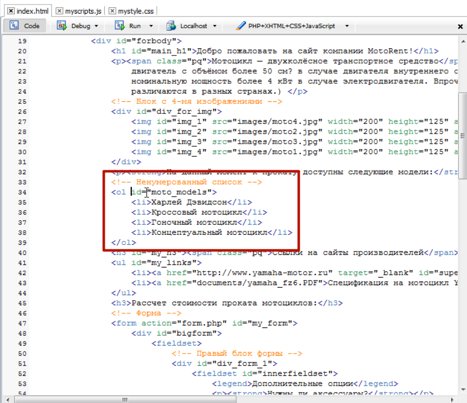
попробуем его вытащить его в jQuery выборку а затем вытащить его в html код.
В js говорим что нас интересует элемент 

А теперь что бы вывести его на экран можно либо сохранить в переменную, либо просто написать altrt и взять это все в круглые скобки 

Теперь попробуем изменить html код данного элемента. И в js в качестве параметра просто достаточно передать скопированный html код 

там же в параметрах прописываем к примеру тег strong 

# Функция fadeInt() и fadeOut()
В этом уроке мы с вами разберем две функции которые позволяют плавно исчезать элементу и плавно ему появляться. Мы уже рассматривали похожие функции это show и hide которые прячут и показывают элемент, но там это было без эффекта. Просто нужно спрятать, он прячется, нужно показать он показывается. А это именно вариация данной функции но более красивая с более интересным эффектом. FadeOut это плавное исчезновение а fadeInt плавное появление. 
И давайте на примере все это дела рассмотрим. Допустим мы хотим что бы у нас так же исчезла шапка сайта, и давайте отберем ее в наш jQuery набор и применим ей функцию fadeOut  

и так же эта функция может принимать два параметра, это функция исчезновения, и вторая что будет после исчезновения. Пока воспользуемся просто временем исчезновения, и напишем что объект должен исчезать за четыре секунды.

В этом случае у нас изображение просто плавно исчезает и не уходит по умолчанию в левый верхний угол. Оно остается на месте. 

и после того как оно исчезло весь остальной контент пододвигается на его место.
Далее просто добавляем пловное появление

вот они эти два метода. Очень простые, но достаточно эффектные.

# Функция fadeTo()
С помощью этого метода мы можем уже сами регулировать  до какой степени прозрачности у нас элемент должен измениться т.е. он может совсем немножко поменять прозрачность, может почти исчезнуть но оставить немножко свой облик, может занять среднее положение прозрачности. И для этих целей используется метод fadeTo. 
И давайте на том же примере нашей картинки попробуем поэксперементировать с этим методом. И так указываем нашу картинку и прописываем метод 

И здесь в качестве параметров указываем время исчезновения, затем степень исчезновения, и опять таки функция которая может быть выполнена после проведения тех исчезновений 

и вторым параметром мы должны передать степень исчезновения от 0-ля до 1-цы. Допустим он у нас исчезнет на половину. 

и вот при проверке шапка сайта за четыре секунды меняет свою прозрачность но полностью не исчезает и остается вот в таком положении

сейчас давайте допишем ему, что бы он менял прозрачность до 1-цы 

# функция slideDown() и slideUp()
И так мы с вами уже знаем два способа исчезнуть и появится элемента с помощью метода show hide и fadeInt и fadeOut ну и плюс через fadeTo. 
Сейчас мы узнаем еще один, даже комплект методов которые позволяют исчезнуть и появится элементу, только уже с другим эффектом. Т.е. если там у нас происходило плавное исчезновение за счет смены прозрачности, то здесь у нас будет плавное исчезновение за счет того что элемент как бы уезжает вверх или вниз. Это методы slideUp(исчезнуть вверх) и slideDown (что бы он обратно появился). 
Смотрим как они работают

Это еще одна вариация того как можно заставить объект исчезнуть.

# Функция attr() и remuveAttr()  
В этом уроке мы с вами познакомимся еще с двумя методами которые позволяют работать с атрибутами выбранных объектов. Это очень интересные и полезные методы. Они очень часто используются на практике. По этому обратите внимание на этот урок. В нем ничего сложного нет. Просто нужно запомнить как он работает.
Первый метод называется attr от слова attribute. 
Давайте возьмем какой - нибудь тег и узнаем значение его атрибута. Вот например в самом конце у нас есть картинка 

и допустим мы хотим узнать ее высоту. 
Напишем что нас интересует картинка img у которой значение атрибута(‘ [src *в любом месте встречается =footer ] ‘). И дальше пишем наш метод attr(и говорим что мы хотим узнать значение атрибута ‘height’) просто в кавычках передаем в качестве параметра значение того атрибута, точнее название того атрибута которого хотим узнать и он нам вернет его значение и давайте поместим это значение в какю – нибудь переменную. И выведем это в какой нибудь блок. В html у нас есть блок 
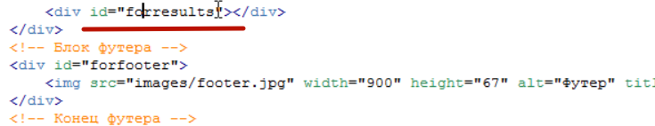
Мы говорим что нас интересует блок вот с таким id forresults и туда нужно методом text выведем высоту 

вот таким образом мы с вами вытащили значение высоты у выбранного нами объекта.
Еще можно с помощью этого метода менять значение атрибута т.е. не только узнавать но и менять. Для этого нужно передавать второй параметр т.е. первым параметром вы передаете название атрибута, а вторым уже его значение.
Для примера давайте возьмем какой – нибудь другой элемент нашей вэб страницы  пусть это будет select который позволяет нам выбирать мотоциклы для проката 

В данном случае у нас выглядет таким образом что у нас виден один вариант выбора 

а что бы открыть остальные нам нужно открыть select и уже там будут остальные при этом за то сколько у нас показывается вариантов выбота в один момент времени, мы знаем что за это у нас отвечает атрибут

И я предлагаю сейчас попробовать поменять значение данного атрибута с помощью этого метода которого мы с вами изучили.
 Id у него motoSelect.

в этом случае нам вернется значение данного атрибута, а если мы хотим изменить его то мы должны прописать второй параметр. 

и вот мы видим что наш блок select выводит все четыре мотоцикла и можем выбрать любой из них.

И второй метод который мы здесь пройдем это метод remuveAttr он позволяет наоборот удалять атрибуты. И для этого примера возьмем еще один элемент нашей страницы это эту таблицу 

смотрите когда я навожу на нее у меня появляется подсказка. За это как мы знаем у нас отвечает специальный атрибут

давайте попробуем избавится от этого атрибута. Например он нам перестал быть нужен. Возьмем наш id данной таблицы

Вот и все очень простой метод .

И при этом здесь еще одно замечание которое нужно сделать, это когда мы пользуемся методом attr и например даем значение атрибуту, в нашем случае мы давали значение атрибуту size, то в случае если вдруг у атрибута такого элемента не было…. Что будет в этом случае? В этом случае атрибут будет просто добавлен и ничего страшного не произойдет.  

# Функции addClass() и remuveClass()
В этом уроке мы с вами изучим еще два полезных метода это методы для работы с классами. Дело в том что работая с css при разработке сайтов с использование jQuery и javaScript это очень важная задача, очень часто встречающаяся. Поэтому для работы с классами и для работы с css свойствами были выделены в jQuery специальные свойства. И например для добавления класса к элементу есть специальный метод который называется addClass.
И сейчас мы посмотрим как он работает. Он позволяет добавлять какой – то класс к элементу. По этому давайте создадим этот самый класс в таблице в таблице стилей и попробуем его добавить к какому – нибудь элементу. Предположим что мы хотим выделить вот этот абзац

т.е. можно попробовать выделить его какой – нибудь рамкой, дать фон, и добавить небольшие внутренние отступы. В css таблице 

сохраняем и запоминаем что наш класс называется new 

а теперь отберем в наш jQuery набор этот самый абзац. Как мы его можем отобрать?? 

один из способов это по id блока div_for_img и мы можем взять следующий за ним тег абзаца, потому что у нас есть такие селекторы, по этому копруем данный id и в js говорим что нас интересует 

Дальше попробуем добавить нашему выбранному абзацу тот самый class new который мы только что создали

Вот таким образом мы с вами добавим class для этого абзаца. 

видно да? У нас отобрался в набор этот абзац и к нему был приплюсован этот самый новый class new. Вот таким образом работае метод addClass.

И второй метод который идет с ним в комплекте это метод remuveClass это метод который позволяет наоборот удалить class. 

Так же ищем его по id  

Вот таким методом удаляем

вот видите у нас в таблице удалилась рамка, верхний отступ, и таким образом у нас сработал метод remuveClass.

# Функция css ()
Изучим еще один метод предназначенный для работы именно с css это метод который так и называется css. Он нам уже позволяет получить точное значение каких – то определенных свойств. Потому что смотрите например: у нас есть заголовок 

в коде он у нас выглядит таким образом

а в таблице стилей для него прописаны правила 

Так вот пока что до текущего момента у нас с вами не было инструментов которые позволяли бы получить значение например цвета для элемента т.е. какой у него выставлен цвет или какой у него размер шрифта. 
Так вот с помощью метода css вы получаете такую возможность и для выбранного элемента можете узнать текущее значение например размера шрифта т.е. любое css свойство которое есть у этого элемента вы можете узнать с помощью этого метода.

Если вы хотите просто получить значение свойства то здесь как обычно просто указываем параметр и все. И так занесем сразу значение величины шрифта для данного элемента например в переменную var textSize =делаем jQuery выборку $(‘ говорим что нас интересует элемент с id main_h1   ’) и говорим что мы хотим воспользоваться методом .css (‘ передаем в этот метод параметр в данном случае это название свойства которое нас интересует font-size ’); и попробуем вывести на экран данную переменную 

но это только первый момент. При этом имейте ввиду что когда вы запрашиваете какое то свойство нужно обязательно запрашивать его полный вариант, потому что сокращений данный метод не понимает и если вы у него запросите просто свойство padding или margin то он этого не поймет. 

он нам ничего не выведет. По этому нужно обязательно указывать какой именно отступ вас интересует нижний, верхний, 

И еще одно небольшое замечание. Если вы запрашиваете значение цвета т.е. 

То он вам вернет не привычную вам форму когда указывается через решетку.

А вернет он вам вот в таком виде

rgb и укажет составляющие красного зеленого и синего. Но это только для получения результата.
Для установки же, когда мы хотим поменять значение, мы спокойно можем передавать вот в таком формате 

и даже свойства можно передавать в сокращенном формате. А для получения вот эти особенности есть. По этому вы их должны иметь ввиду.
Теперь давайте попробуем изменить какое – нибудь свойство для данного элемента. Пусть это будет тот же цвет. Например мы хотим сделать его уже не черным а например синим. Для этого нам достаточно передать второй параметр 

Вот такая запись отберет элемент main_h1 и скажет что нужно значение css поменять на синий цвет. 

Теперь что касается момента когда вы хотите изменить сразу несколько свойств, потому что это очень часто бывает что вы хотите например поменять цвет и размер сразу. Как здесь можно поступить??
Здесь есть два варианта. Первый это просто еще дальше дописать 

А второй вариант этой записи. В этом случае мы должны передать так называемый литерал объекта и пишется он таким образом т.е. вы пишите сначала круглые скобки, а затем указываете еще и фигурные скобки, а уже внутри вы должны передавать не через запятую,а черех двоеточие, свойство:значение запятая, и указываем дальше что нас интересует. 

и видите, здесь немножко громоздко, но что бы легче читалось обычно делают вот так 

мы с вами будем в основном пользоватся этим тетодом, потому что он позволяет за раз внести все необходимые изменения. Просто запомните что этот момент называется литерал объекта. По сути мы здесь передаем свойство объекта. А свойство объекта передается вот в таком формате, вам нужно сразу к нему привыкать. Потому что если вы будете изучать тот же ajacks то там данные передаются в основном вот в таком формате.  

# Функция animate()
В jQuery есть еще один интересный метод. Он очень похож на css, но он изменяет значение свойств не мгновенно, как это происходит в css, а за заданное время. 
Если вы например хотите уменьшить размер какого – то блока, то вы указываете не только размер этого блока, а  за сколько вы хотите его уменьшить. И таким образом можно создать некую анимацию, когда блок у вас уменьшается за определенное время. Тоже самое там например с отступами. Все свойства которые имеют числовые значения вы можете с ними играться, за определенное время их уменьшая или увеличивая.  
Посмотрим как он работает. Давайте уменьшим блок который у нас содержит картинки с мотоциклами
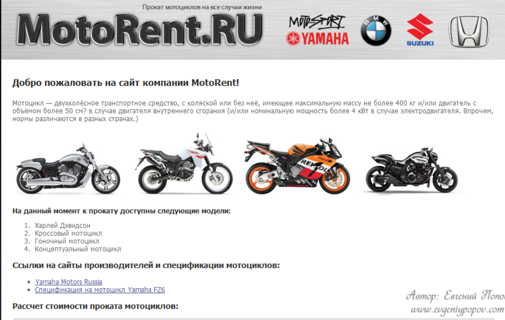
и допустим мы хотим его уменьшить до 450px. если мы посмотрим на код, каждая картинка у нас имеет по 200px ширины 

и так что бы у нас эффект был более отслеживаемым я предлагая добавить этому блоку красную рамку. Первым делом отберем в jQuery выборку этот набор, с помощью метода css добавляем ему рамку, добавляем ему литерал объекта ({‘’}) и говорим что первым делом нужно изменить рамку :  у которой должно быть два пикселя, сплошная, темнокрасная. 

И продолжаем писать… далее мы изучим animate. При этом данный метод так же принимает третий параметр это функцию которая должна быть выполнена после завершения анимации, но начнем мы как обычно с двух параметров. 1-е укажем какие свойства мы хотим менять, а 2-е за сколько мы хотим их поменять. И мы договорились что будем менять свойства ширины, здесь так же мы должны передать литерал объекта т.е. какие свойства мы будем менять до каких значений ({}) и первое свойство которое мы будем менять это ширина width. Говорим что ширина должна быть умньшена до 450px и вторым параметром, после литерала, ставим за какое время должно произойти изменение 

и вот этот блок постепенно уменьшается

вот таким образом работает данный метод. 
И я еще обещал вам показать как добавить функцию которая будет происходить после завершения анимации. Делается это очень просто. Ставим так же запятую и прям здесь пишем function, здесь ей название давать не нужно, по этому сразу ставим скобки для параметров и указываем что должно происходить 

и после фигурных скобок пишем, пусть он у нас выведет например alert () сообщение о том что он завершил работу. 

таким образом, после того как у нас анимация будет выполнена, запустится наша анонимная функция. Почему анонимная? Потому что мы ей не даем название. Впринцыпе вы сюда пожжете добавить свою какую – нибудь функцию которувы уже где – то ранее создали, вы можете ее сюда просто прописать но при этом ее нужно указывать без круглых скобок т.е просто название функции. А в данном случае мы прописали функцию прям здесь внутри и по этому она у нас называется анонимная. 

т.е. в эту функцию мы можем поместить любые действия которые должны быть выполнены после завершения анимации.
Так и для закрепления давайте еще попробуем изменить какое – нибудь свойство и кстати как раз пройдем одну особенность данного метода. 
 Давайте возьмем наш заголовак h1 и попробуем у него изменить верхний внутренний отступ. При этом смотрите здесь какая особенность. Если вы хотите поменять какое –то свойство которое в обычном состоянии пишется через дефис, тотже padding-top, вы должны убрать дефис а следующую букву которая идет за ней сделать большой 
 
 

 # Функция append() prepend() after() before() 
В этом уроке мы с вами затронем еще четыре метода jQuery которые позволяют нам работать с объектами и это методы которые позволяют добавлять различный контент до, после, и внутрь выбранного элемента.
Для эксперимента опять возьмем наш блок с мотоциклами.
Метод before() он позволяет добавлять html код до выбранного элемента. С английского это переводится как перед, до т.е. передает полностью смысл который на этом слове и лежит. 

давайте попробуем вставить абзац и напишем что данный абзац вставлен с помощью метода before 

Следующий метод это auto этот метод сохраняет изменения в конце блока. Можно даже для удобства все это сохранить в какую – нибудь 

вот таким образом мы с вами внесли в переменную наш объект и во второй строчке будем посить изучаемые методы. 

вставляет код после элемента

И еще два метода это метод prepend который позволяет вставить код внутрь элемента, но до кода который там уже есть 

и последний метод это метод append он вставляет код в конец элемента. 

# Функция each() и понятие $(this)
И так мы с вами дошли до еще одного важного метода  это метод each который можно перевести как каждый. И для чего он нужен мы сейчас посмотрим вот на таком примере.
Допустим у нас есть ситуация когда нам нужно избавится от всех картинок у которых ширина больше 400px, нам нужно их скрыть. Если мы посмотрим на наш сайт. У нас здесь шесть картинок, две из них шириной больше 400pz это шапка и footer. Так вот если мы посмотрим на текущие наши знания и текущие методы и селекторы которые мы уже прошли

то у нас здесь особых вариантов нет что бы проверить больше ли ширина картинки 400px или нет и уже скрыть этот элемент в зависимости от того больше или нет. 
А с другой стороны в обычном JavaScript мы могли бы поступить так. С помощью метода getElenentsByTagName вытащить все картинки нашей страницы в какой – нибудь массив, далее пройтись в цикле по этому массиву и для каждого элемента массива узнать ширину и если она больше 400px то спрятать его. 
 А в jQuery как мы знаем циклы выполняются автоматически и если мы допустим отбираем все картинки со страницы то мы не можем допустим отдельно для какой то картинки сказать что нужно ее срятать или не нужно. 
Так вот для решения таких задач в jQuery все таки есть метод который позволяет пройтись по каждому элементу массива т.е. не выполнять автоматический цикл, а полуавтоматический так скажем. Т.е. мы все таки можем получить доступ к каждому элементу массива и что то проверить для этого элемента.
И для этого как раз таки и служит этот метод each и переводится как каждый. Т.е. мы можем пройтись по каждому элементу нашей выборки и уже там прописать какие то условия в зависимости от которых будут делаться действия с этим элементом выборки или не будут. И давайте возьмем этот же пример, когда нам нужно выбрать все картинки на странице. Пишем что нас интересуют все картинки и метод each 

так и здесь у нас смотрите какая ситуация. Вот он у нас будет выбирать каждый элемент выборки. В img мы выбираем 6-ть картинок и он должен с each каждой что то сделать. Т.е. он берет первую картинку и должен что то сделать, то что мы напишем в круглых скобках , это параметр сука все ни как не запомню. И ключевое слово здесь сделать, потому что мы не можем, например, сразу в параметр написать if там и т.д потому что это естественно не будет выполнено, в параметре никогда код не пишется, а пишется он только либо в функциях, либо напрямую, но не в параметрах.
По этому здесь мы пропишем ту саму анонимную функцию с которой мы уже познакомились. Либо прописать название нашей готовой уже функции которую мы создали где то ранее.  Мы здесь будем писать анонимную функцию, имя этой функции давать не нужно.

вот теперь мы можем писать код который будет выполнен для каждого элемента нашей выборки. Для каждой картинки т.е. представьте что на данный момент у нас взята первая картинка и мы с ней сейчас что то будем делать. Но здесь встает другой вопрос. Как же обозначить текущую картинку которой мы хотим получить значение ширины? 
И здесь это делается так. Если при просто JavaScript мы писали бы текущий элемент массива, т.е. если бы мы как нибудь обозвали массив например myArray [] то текущий элемент у нас там было вот таким образом мы там ставили  

Это у нас был текущий элемент массива. То здесь в jQuery для метода each текущий элемент пишется вот таким образом ставите значок доллара в круглых скобках пишите это или текущий перевод. $(this)

И далее какая у нас задача? Задача проверить ширину этого текущего элемента, и если она больше 400px, то скрыть этот элемент. По этому давайте напишем что нас интересует условие if и в круглых скобках дописываем условие что если текущий элемент его ширина > 400 то пишем действие{}. То этот же текущий элемент должен быть скрыт и пусть он исчезнет через метод fadeout за три секунды например. И это полностью решает нашу задачу. 

Все сохраняем и проверяем. Все исчезает. Если бы в условии поставили бы меньше < 400  то у нас исчезали бы мотоциклы.

Вот таким образом это все происходит. Это все по сути полуавтоматический цикл. Если нам все нужно сделать на автомате мы просто сразу например сюда пишем fadeOut

И у нас все картинки исчезнут.
А если же нам нужно какое – то условие тонкое прописать, то мы можем сказать что мы хотим поработать с каждым элементом выборки, для этого пишем each и затем указываем анонимную функцию которая и будет работать с этими текущими элементами. При этом текущий элемент обозначается как $(this), т.е. this это по сути тоже самое что если бы мы могли написать выборку для 
первой картинки #img_1

Т.е. тоже самое что объект который мы выбираем простым способом, тоже самое и this, т.е. это обычный объект jQuery в данном случае это первая картинка, она проверяется на условие, если условие выполняется то делается с ней вот это действие  

Далее цикл идет дальше. Берется вторая картинка и уже условие проверяется для второй картинки. Т.е. обычный цикл но уже немного в другом формате. Но согласитесь он достаточно короткий этот цикл. Здесь не нужно ни какие счетчики писать.

# Функция size() и доступ к элементу выборки
В этом уроке мы с вами затронем два не больших метода которые смогут вам пригодится в работе.
Первый метод это метод size() он позволяет узнать сколько элементов попало в вашу jQuery выборку. Это помните когда мы изучали массивы, у нас там было свойство length которое позволяло нам узнать сколько элементов попало в массив или находится в массиве. Мы даже часто это использовали в цикле for? Писали что счетчик i должен работать до тех пор пока у нас он менmit чем количество элементов в массиве. 
Так вот если вам когда – нибудь понадобится узнать количество элементов в вашей jQuery выборке то на этот случай есть здесь этот самый метод size. Например вы хотите узнать сколько у вас блоков div на странице 

И вот вам вернется количество блоков div которое попало вам в набор. Можно даже это занести в переменную и вывести это дело на экран. 

И ВОТ ОН НАМ ГОВОРИТ ЧТО У НАС 12-NM БЛОВ DIV НА СТРАНИЦЕ.
И таким образом любой другой набор который вы вот здесь создаете

он влюбом случае получает какое – то количество элементов. И вы с помощью метода size всегда сможете узнать какое количество элементов у вас попало в набор.

И второй  метод это метод доступа к конкретному элементу. здесь смысл в том что иногда вам может понадобится получить доступ к конкретному элементу и делается это через метод get и в параметрах указывается индекс нужного элемента, потому что мы знаем что у нас 12-ть блоков div, т.е. массив из 12-ти блоков нам вернет. И что бы получить доступ к самому первому элементу блока div вы можете написать get (0)

Вот такая конструкция вернет вам самый первый блок div в виде обычного JavaScript объекта т.е. все если бы вы написали getElementById и указали бы в качестве параметра именно индификатор id этого первого блока. Вернули бы объект, обычный JavaScript объект с которым можно дальше работать. 
Т.е. запомните что этот момент

Возвращает не jQuery объект, а именно просто обычный JavaScript объект. Но это как бы очень редко может вам встретится,  а если встретится, повторите просто данный урок и сразу все поймете. А так мы с вами обычно указываем конкретный элемент с которым мы работаем. Благо у нас для этого есть очень много возможностей для выбора элемента 

с вэб страницы. И уже получив его уже в качестве jQuery объекта мы можем использовать с ним все эти методы которые нам дает jQuery. И это еще ведь не большая часть методов.

# Функция clone() и remove()
В этом уроке мы с вами пройдем еще два метода, которые иногда могут так же встретится вам, это методы клонирования и удаления выборки. 
Иногда бывает ситуация что нужно клонировать какой – то элемент. Смотрите, самый простой пример, который мы сейчас рассмотрим. Вот у нас есть блок который у нас содержит 4-ре картинки это блок div for_img

и допустим у нас есть задача клонировать данный блок и разместить точно такой же блок где - нибудь вот здесь после формы 

после формы расчета стоимости проката.
Как нам это сделать с помощью jQuery? Делается это именно с помощью метода clone т.е. мы делаем выборку элемента который хотим склонировать, в данном случае 

 делаем его выборку и говорим что мы его клонируем 
 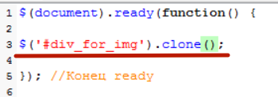
 И вот этот метод нам вернет копию данного блока. По этому мы можем его куда нибудь сохранить, например в переменную var myDiv 
 
 А затем мы ищем элемент куда мы хотим добавить данный с клонированный элемент.  
И так находим где у нас заканчивается форма, и после нее добавим наш блок. Мы уже знаем как добавлять элементы после какого то элемента т.е. это метод after по этому мы делаем выборку нашей формы, у нее id 
 
 говорим что после формы хотим вставить наш клонированный элемент пишем after и в качестве параметров передаем нашу переменную myDiv где у нас хранится клонированный элемент
 
 
 видим да? У нас после формы появился точно такой же блок.

Следующий метод который я хотел вам объяснить это удаление элементов. 
Предположим мы с помощью методов jQuery решили удалить какой – то объект со страницы. Именно не скрыть, а удалить. Удаление осуществляется с помощью методов remove  

И проверяем, в этом случае у нас удалится форма. При обновлении страницы наблюдаем что форма исчезла.  
 При этом у данного метода есть такая хорошая особенность что он когда удаляет элемент, он его же и возвращает по сути, т.е. мы 
можем его сохранить в какую – нибудь переменную. Таким 

Таким образом у нас элемент удалится со страницы, но сам элемент будет помещен в переменную myForm и когда он нам где – то понадобится мы его можем спокойно вернуть из этой переменной.  Т.е. например где мы хотим видеть форму. Давай те попробуем где нибудь перед табличкой попробуем

И мы можем спокойно написать что нас интересует элемент с id moto_table, а вот перед ним мы хотим вставить нечто, пишем befor и указываем в качестве параметров нашу переменную myForm где у нас хранится удаленная форма. 

# Два  полезных совета
В этом уроке мы с вами рассмотрим два вопроса которые могли возникнуть по ходу изучения предыдущих уроков и первый из них звучит примерно так. Как добавить в один набор разнотипные элементы? 
Допустим нам нужно добавить в один набор картинки у которых ширина 200px, и например, туда же нужно добавить ссылку которая в атрибуте href атрибут document

Вот у нас такая задача, добавить в один набор такие разнотипные элементы.
Если мы посмотрим на те селекторы которые мы изучили, то у нас в основном было так что мы отбирали однотипный элемент, но факт в том что мы никогда не пытались добавить в один набор разнотипные элементы.
На самом деле это очень просто делается. Так же как и в css, когда вам нужно дать допустим всем параграфам и всем заголовкам один и тот же шрифт, например тахома, то мы там обычно писали как?

Точно так жи и здесь, когда вам нужно в один набор добавить разнотипные элементы достаточно поставить запятые.
Т.е. вы допустим говорите что вам первым делом нужны картинки у которых атрибут ширины равен 200, ставим запятую, и так же говорим что нам нужны все ссылки у которых в атрибуте href в любом месте * есть слово documents

И таким образом у нас в один набор попадут все эти элементы

у нас должны за пять секунд исчезнуть как картинки так и эта ссылка. Проверяем все так.

И второй вопрос который у вас мог возникнуть. Это как отобрать элемент просто по наличию атрибута? Потому что если мы посмотрим, мы везде старались писать либо что бы атрибут был чему то равен 
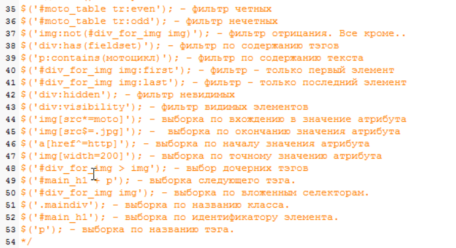
либо что бы он с чего – то начинался, либо заканчивался, но мы не разу не писали что бы атрибут просто был.
Допустим нам нужно найти все ссылки у которых есть атрибут alt  

Вот мы прописали что нам нужны все картинки с атрибутом alt и что бы они исчезли. Проверяем все так.

 # Реакция элементов web страниц на события

 # Список событий, которые отслеживает браузер
 Этот урок мы начнем с того что узнаем, а какие же события отслеживает наш браузер? Первое что он отслеживает это события moseover , mose это мышь, а over это над. Это событие у нас наступает когда пользователь у на с наводит мыim на какой – то элемент. 
 Например мы навели мышь на мотоцикл и у нас сработало это событие moseover. При этом оно сработало сразу для многих элементов, по сути оно сработало для тега div который у нас общий для картинок с мотоциклами. 

и естественно оно сработало для нашего мотоцикла. Т.е. на первый взгляд нам кажется что оно срабатывает только для мотоцикла, но если вдуматься то это событие срабатывает сразу для нескольких элементов. По этому это так же держите в голове.это еще по научному называется всплывание событий. Т.е. оно срабатывает сразу для нескольких элементов которые находятся в зоне.
Следующее у нас на повестке это событие moseout оно противопольжно событию moseover. Оно противоположно и как бы говорит мышь уходит т.е. это увод мыши с элемента. 
Получается когда я навожу мышь на картинку срабатывает moseover, когда отводим мышь от картинки то срабатывает moseout.

Следующее событие которое отслеживает браузер это естественно клик мышью пишется так click это одиночный клик мышью. При этом оно так же поисходит для всех элементов которые здесь даже не видны т.е. это блок div и тд.

Следующее событие это dbleclick, db это double, это двойной щелчек мышью, это когда вы очень быстро нажали левую кнопку мыши.
Следующее событие это mosemove, move движение. Когда вы передвигаете мышкой по вэб странице постоянно происходит это событие mosemove, при этом мы двигаем мышь еще наводим на элемент, еще кликаем  т.е. постоянная череда таких событий происходит.

Следующее событие долее редко используется, оно называется mousedown это событие когда вы нажали мышь но еще не отпустили.
И если отсчелкиваете зажатую кнопку мыши, то это событие называется moseup. Т.е. по сути в клике у нас происходит аж три события. Сначала mosedown затем moseup и потом получается click. Может быть последовательность конечно немного другая это надо уточнять. 

Это что касалось событий мыши. Следующее событие это событие которые происходят с формами. Они очень часто используются. Вторые по частоте событий мыши по этому мы пройдем сначала их. И так у нас здесь не зря дана форма

первое событие которое мы изучим это событие submit оно происходит когда происходит отправка формы. Т.е. человек заполнил все поля, нажимает кнопку отправить и если эта кнопка имеет тип submit 

Следующее событие это когда событие фокуса. Очень часто используется. Это когда какой то элемент получает фокус focus. Вот я например щелкаю в текстовую область и получаю focus 

т.е. происходит событие focus именно для этого элемента. Щелкаю например на checkbox и так же получаю событие фокуса итд.
Противоположное focus событие blur оно так же часто очень используется и происходит когда мы уходи с поля. Например я нахожусь в фокусе в одном поле и перешел на другое поле. И вот с этого события с которого я ушел произошло событие blur. Т.е. когда поле теряет событие focus происходит событие blur.
Следующее очень важное событие это chenge оно происходит в момент когда что – то меняется. Вот я например зашел в поле и что то написал, произошло изменение

и вот это событие браузер так же фиксирует постоянно. Ввел букву произошло событие chenge, поменял select опять это событие, поменят радио кнопку опять это событие. Т.е. любое состояние изменение элемента это событие chenge.
Следующее событие это событие reset но это уже достаточно редко используемая вещь, это когда происходит сброс формы, есть специальная кнопка inputtypereset которая сбрасывает форму и вот в момент сброса, если такую кнопку нажали происходит событие reset.
Следующее событие которое мы изучим оно уже относится к событиям клавиатуры. И у клавиатуры в основном три таких универсальных события которые потдерживаются большинством браузеров это события  keyperes а так же keypeup и keypedown  т.е. очень похоже по сути на click котрый у нас был выше. Допустим я ввожу в поле какое то значение то у меня просходит событие не только  chenge но и keyperese. При этом дальнейшее событие, как мы дальше увидим, можно даже вытащить код нажатой кнопки. Но это просто так. Пока что знай те что мы когда нажимаем какие то кливиши в браузере то это происходит событие keyperese которое в свою очередь состоит из двух частей это keydown и keyup. Т.е. когда мы нажали кнопку но еще не отпустили происходит keydown а когда отпускаем кнопку то keyup.
И переходим к событиям окна браузера. Там тоже есть несколько интересных событий которые нужно знать. Первое событие это событие load, переводится как загрузка, и смысл его в том что когда браузер загрузил все файлы страницы т.е. html код, все скрипты, все картинки, все таблицы стилей, все флэш объекты, происходит это событие. Т.е. как только оно произошло то все уже загружено с сервера.
Следующее событие это событие resize, событие когда меняется ширина окна браузера, т.е. когда мы тянем за ползунок 
Следующее событие это событие scroll оно наступает когда мы прокручиваем страницу с помощью ползунка, либо с помощью колесика мыши. 
 И последнее событие это событие unload т.е. наоборот выгрузка, кагда мы закрываем страницу, либо переходим надругую страницу, оно естественно работает не во всех браузерах. 

# Традиционная модель событий и ее недостатки
Помните когда мы с вами изучали как отбирать события вэб страницы для дальнейшей работы с ними мы изучали традиционные методы. Это методы объекта document getElementsByTagName и getElementById т.е. получение по названию тега и по индификатору.
Так вот здесь мы начнем работу с событием именно так же с изучения традиционной модели использования событий в javascript это нужно для того что бы вы поняли на сколько она не совершенна да и знали вообще как она работает, потому что мало ли где вам придется встретить javaskript код.
И начнем мы стого что определимся с тем уравнением это объект событие и действие. В данном случае нам нужно выбрать объект с которым мы будем работать, событие которое будет наступать, и действие которое будет совершаться в момент наступления события. Допустим мы будем реботать с первым мотоциклом. 

и в мометр щелчка по мотоциклу у нас должно появляться сообщение о том что мы щелкнули по первому мотоциклу. Т.е. у нас есть объект, картинка мотоцикла. У нас есть событие клик мышью. И действие, появление сообщения.
 И так начнем с того что выберем объект в какую – нибудь переменную.  Если мы посмотрим исходний код страницы то увидим что объект у нас имеет id 
 
 и так вытаскиваем и помещаем в переменную
 
 И так с объектом мы разобрались. Ссылка на него у нас лежит в этой переменной myMoto. Следующее нам нужно разобраться с действиями и что будет происходить когда по нему кликнут мышью. 
Для действи обычно пишется функция по этому мы так же ее напишем. Пишем функцию и как нибудь ее обзываем например motoClick () говорим что у нее не будет параметров, а в качестве действия {} она нам должна вывести информацию, пусть она выведет информацию о ширине. 

И так с объектом мы разобрались. Ссылка на него у нас лежит в этой переменной myMoto. Следующее нам нужно разобраться с действиями и что будет происходить когда по нему кликнут мышью. 
Для действи обычно пишется функция по этому мы так же ее напишем. Пишем функцию и как нибудь ее обзываем например motoClick () говорим что у нее не будет параметров, а в качестве действия {} она нам должна вывести информацию, пусть она выведет информацию о ширине. 

вот таким образом мы с вами написали функцию которая будет выводить сообщение с шириной данной картинки.
Так это все понятьно. У нас есть объект, у нас есть действие,  но у нас нет события. 
Теперь как пишуться события. А пишуться они очень просто. Мы указываем нашу переменную myMoto ставим точку и говорим какое событие мы хотим использовать. В данном случае это событие click, но в традиционном javascript нужно еще добавлять приставку on, т.е. пишем on  а потом только click. И далее соотвотственно через знак присваивания мы присваиваем значение этой функции. И здесь круглые скобки ставить не нужно, толко название функции. 

эта модель которая применяется в традиционном javascript. Есть еще более старый вариант это прописывание в html код и делается это таким образом. 

т.е. здесь не нужно вытаскивать объект в какую – то переменную. Просто пишете напрямую в теге этого объекта, в качетсве атрибута называете событие onclick и уже прям здесь пишите код. Но естественно это совсем старый подход потому что  как я вам уже сказал сейчас идет тенденция когда все должно быть отдельно. 
Какие же недостатки есть у данной модели по сравнению с тем что мы изучим с вами в модели jQuery. Здесь на самом деле достаточно много недостатков, но самый главный из них это разная работа с событиями в разных браузерах. И здесь загвоздка в том что например браузер internetexplourer он пошел своим путем и он многие события обрабатывает по своему. Т.е. по этот браузер вам придется писать отдельный код. Плюс ко всему здесь очень плохо вот с чем. Если у вас например эти четыре картинки

должны одинаково реагировать на щелчек мышью по ним, то если в jQuery нам достаточно взять четыре картинки в набор и прописпать им однустрочку для реакции, то здесь нам придется писать для каждого объекта свой обработчик событий. Это тоже очень плохо.
И еще на одно событие мы можем повесить только одну функцию

хотя часто бывает так что нужно использовать несколько функций для обработки одного события. В общем достаточно много недостатков. И мы данную модель затронули с той целью что бы вы знали как это было б ы в обычном javascript.

# jQuery модель событий
И так мы с вами рассмотрели модель событий в традиционном 
JavaScript. 
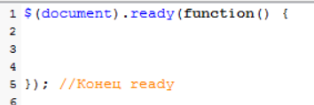
А сейчас давайте рассмотрим как это выглядит в jQuery. Помните я вам говорил когда мы только начинали изучать jQuery что эта функция позволяет нам как отбирать элементы, так и воздействовать на них, та и работать с событиями. 3-ри в одном. И сейчас пришло время научится работать с событиями с помощью jQuery.
И делается это здесь очень просто. Все состоит из 3-х шагов. Найти объект, присвоить ему событие, и прописать нужное действие. 
Давайте начнем с простейшего примера. Возьмем шапку нашего сайта и попробуем добавить событие клик мыши, что бы у нас наш скрипт реагировал на этот скрипт и что то делал при нем. Давайте сделаем что бы выскакивало сообщение что вы кликнули по шапке сайта.
 И так все разбиваем на три шага. Первым делом отбираем объект шапка. Шапка это у нас картинка вот с таким атрибутом src

т.е. можно спокойно взять ее по атрибуту либо взять по id forheader, не важно. Т.е. любым способом отбираем шапку нашего сайта. Пишем что нас интересуер forheader и все изображения внутри него

Второй шаг это присвоить событие. Т.е. мы выбираем событие которое нам нужно в данном случае, внашем случае это click, и просто пишем через точку это событие 
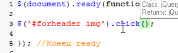
Вот таким образом для данного объекта мы присвоили значение click. Теперь нам нужно написать что будет происходить в этот момент. Т.е. что будет по этому клику происходить. Но как обычно мы с вами в параметре не можем написать код того что будет происходить по этому мы должны добавить анонимную функцию и уже внутри нее писать необходимые коды которые уже будут выполняться в jQuery при наступлении этого события

И уже здесь пишем то действие которое мы хотим видеть  это появление сообщения 

Вот еще один пример. Допустим мы хотим что бы у нас выскакивало сообщение при прокрутке страницы. Это уже объект window. Это наш самый корневой объект. Это событие scroll 

и действие это опять таки выскакивание сообщения. Когда мы работаем с такими объектами window, document и т.д мы их пишем естественно без кавычек.
 
 
 вот таким образом мы с вами добавили еще один обработчиксобытий.

И давайте еще более интересный пример сделаем. Уже задействуем те методы которые мы с вами изучили.
И я предлагаю сделать такой пример. Смотрите у нас есть четыре мотоцикла. И допустим по щелчке на мотоцикле он у нас должен появляться где нибудь вот здесь

он будет у нас как бы клонироваться.
И так какой у нас объект?? Объект у нас в данном случае является эти четыре мотоцикла которые находяться в этом блоке div for_img. Т.е. мы можем спокойно написать таким образом что нас интересуют эти 4-ре мотоцикла 

Вот таким образом мы с вами обтобрали эти четыре мотоцикла.

Теперь говорим что если по ним происходит клик, то нужно делать следующее, пишем анонимную функцию и говорим что при щелчке объект должен быть клонирован и должен появится уже в элементе forresults 

Теперь давайте подумаем как это реализовать. Т.е. наше предложение начинается так. Мотоцикл по которому кликнули

Здесь нам поможет тоже свойство this которое мы с вами изучили. 

когда мы перебирали элементы воборки мы так же использовали для работы с текущим элементом выборки эту конструкцию this. Точно так же и здесь на данный момент отобрано 4-ре мотоцикла. И если мы пишем click то получается click может произойти только по одному мотоциклу. Так вот тот мотоцикл по которому произошел клик он в данном случае и будет скрыватся в этой конструкции this. Т.е. this это как бы тот мотоцикл который откликнулся на событие. Далее мы говорим что нам нужно этот мотоцикл клонировать в переменную, и говорим что тот мотоцикл который откликнулся его нужно клонировать с помощью метода clone 

Следующий момент. Нам нужно отобрать в jQuery набор тот самый блок куда мы хотим вставить этот мотоцикл. Это блок с id forresults.

После выбора мы говорим что хотим туда добавить наш клонированный мотоцикл. Как мы можем добавить html код в нутрь элемента. 

 
Append добавляет добавляет контент внутрь элемента после всено остального т.е. у нас даже если мы потом еще раз кликнем второй мотоцикл будет добавлен после первого.

В append указываем нашу переменную moto в которой хранятся наши мотоциклы.

Вот и все. Такая сложная на первый взгляд задача решена всего лишь тремя строчками. И посмотрим как это работает. 

после каждого клика они у нас клонируются. 

вот вы видите на сколько мощная вещь эта jQuery. с помощью трех строчек мы смогли реализовать такое.

# jQuery событие hover() и toggle () 
В этом уроке мы с вами затронем еще два события которые применимы только в jQuery.
Первое из них это событие hover. Я специально не стал удалять код из предыдущего домашнего задания что бы показать вам на наглядном примере как это работает. 

помните там у нас была ситуация. Когда мы наводили курсор мыши на строку таблицы и она у нас подсвечивалась

т.е. здесь у нас было использовано два события одного и тогоже объекта. В качестве объекта это были строки таблицы 

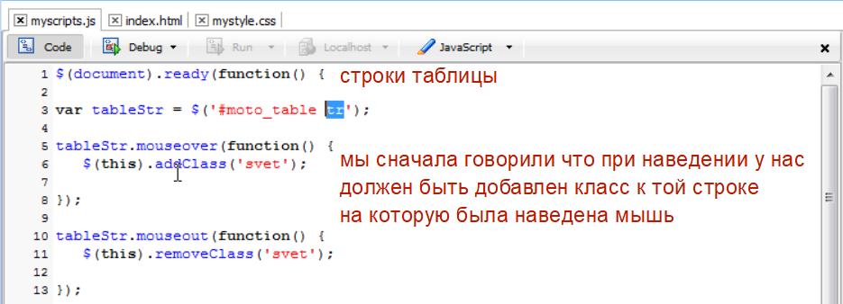

так вот эти два события очень часто работают вместе. В том же меню. В любом меню мы когда наводим курсор мыши оно либо подсвечивается, либо выскакивает что нибудь. Когда уводим курсор мыши с пункта меню он принимает обычное положение.
Так вот разработчики jQuery увидив эту ситуацию что эти два события очень часто используются вместе, наводка мыши и увод мыши, они создали отдельное событие которое позволяет прописать в него сразу две эти функции анонимные, первое для состояния когда мышь наведена, второе для состояния когда мышь убрана. И таким образом у нас отпадает необходимость сохранять объект в переменную и затем применять к нему два события. Нам достаточно взять просто сам объект и прописать ему это событие hover которое принимает на себя две анонимные функции одна для события moseover а вторая для события mouseout. И давайте это пропишем.

так и сначала в условии пишем первую анонимную функцию для события mouseover

А вторую функцию мы пишем просто через запятую. Ставим после окончания первой функции запятую и пишем вторую. 

А вторую функцию мы пишем просто через запятую. Ставим после окончания первой функции запятую и пишем вторую. 

Вот таким образом мы с вами записали тоже самое что было до этого. Если там это заняло 10-ть строк, то здесь примерно в два раза меньше.
Все точно так же работает 

И второй момент который мы здесь изучим это событие toggle которое очень похоже на hover. Только если здесь у нас используется наведение и увод мыши то там используется клик мышью. При этом при первом клике происходит одно событие, при втором клике другое.
Давайте посмотрим на примере что бы вам было понятно.
Допустим у нас есть ситуация когда нам нужно эту форму сделать сворачиваемой. Потому что сейчас идет такая тенденция что эоементы сайта должны быть сворачиваемыми и какой – то элемент который вам не нужен вы можете свернуть и развернуть. 
И вот у нас есть задача допустим добавить такую ссылочку сюда, небольшую, которая позволяет свернуть данную форму при первом нажатии и развернуть при втором. Как у нас это будет выглядеть.
Для начала давайте создадим эту ссылочку, что бы можно было с ней работать. Например поле расчета стоимости мотоциклов 

добавим какую нибудь ссылочку свернуть форму. 

и дадим немного стилей 

и теперь у нас смотрите какая ситуация. При первом щелчке у нас форма должна сворачиваться, при этом свернуть форму должна изменяться на развернуть форму, и при втором щелчке форма должна разворачиваться, а текст снова меняться на свернуть форму.
Когда у нас такая ситуация, когда нам нужно что то переключать, а фактически у нас здесь получается типичный переключитель. Так вот для такой ситуации в jQuery и создано событие toggle. И посмотрите как оно работает. Мы говорим что нас интересует элемент с этим id

 В js в выборке пишем вот так. По сути говорим что этот элемент будет переключателем. И он так же принимает две анонимные функции, первая это для первого положения, второая для второго.
 
 Сразу прописываем две анонимные функции. И прописываем что происходит при первом и при втором положении. И так при первом мы должны найти элемент формы и свернуть его, или спрятать его, у нас есть несколько методов fadeOut slideUp и тд. И плюс к этому нам нужно изменить текст этого элемента по которому мы счелкнули. Находим нашу форму у нее id my_form
 
 
 

 # понятие объекта события  
 И так мы с вами добрались до важного понятия. Понятие объекта события. Что это за объект такой мы сейчас с вами посмотрим. Помните когда мы только приступили к изучению событий я говорил что браузер отслеживает все наши действия. Т.е. перемещение мыши, прокрутка страницы, щелчок мышью и тд. У нас даже был список событий которы1 отслеживает браузер
 
 так вот кроме этого я еще говорил что браузер не только отслеживает события но он еще и записывает всю информацию о произошедшем событии. Да все равно что можно сравнить метеорит упал какой нибудь крупный у нас на планете. Всякие ученые сразу делают по этому событию некий каталог информации. Да т.е. сразу записываю когда упал, в каком месте, сколько он весил, из чего он состоял и тд. Тоже сомое делает примерно и браузер. Когда мы кликаем мышью по какому то объекту. Он заносит информацию в каком месте был щелчок, какой объект в это время был под курсором, да т.е. на коком объекте произвели щелчок, была ли например нажата клавиша shift и тд. Браузер по каждому происходящему событию так же записывает информацию и записывает он ее как раз таки в этот самый объект событие.
И сейчас мы посмотрим как получить к нему доступ. Для этого давайте создадим простейший обработчик событий. Возьмем тот же самый блок который хранит у нас те же самые четыре картинки с мотоциклами, и повесим на него событие click.
Делаем выборку. 

Прописываем click.  И создаем анонимную функцию. А действие в этой функции у нас будет просто вывод сообщения klick 

так вот для чего мы это сделали?? Мы сейчас будем отслеживать этот самый объект событие и попробуем вытащить из него всякую информацию. Т.е. в каком месте был щелчок и др моменты.

И так давайте посмотрим как мы можем получить доступ к объекту события? На самом деле к нему получить доступ очень легко. Достаточно в  анонимной функции в круглых скобках, в условии, прописать название переменной. Т.е. мы по сути передаем в эту анонимную функцию специальный параметр, мы его можем назвать как угодно я обычно называю eventObject т.е. объект события. И вот в этот момент когда мы кликаем мышью по этому блоку у нас в эту переменную eventObject занесется объект этого события со всей информацией по этому событию.

Где был щелчок, была ли нажата клавиша, какой объект среагировал на щелчок и т.д.

Так и давайте попробуем воспользоваться информацией из этого объекта события. Раз это объект то у него есть свойства, а эти свойства как раз таки и хранят всю эту необходимую информацию. Т.е. допустим мы хотим узнать координату щелчка по оси х, то мы можем написать таким образом координаты хранятся в свойстве screen x 

и если мы сейчас сохраним и проверим. 

при этом 603px от края монитора. Если по оси y то это соответсвенно screenY.
Но бывает полезнее иногда узнать в каком месте браузера. Потому что окно браузера может быть открыто не на полный экран, и часто бывает так что нужно узнать по отношению к краю браузера. Это свойства pageX и pageY.

Следующее важное свойство это былали нажата клавиши alt. Т.е. вы можете написать таким образом свойство altKey которое вернет вам либо true или false в зависимости от того былали нажата клавиша alt в момент щелчка. 

Тоже самое есть для клавиши ctrl 
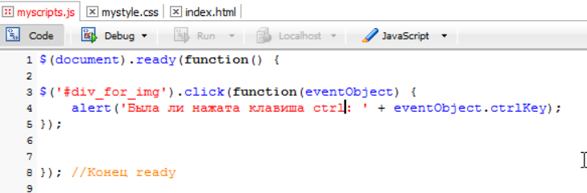
И тоже самое для клавиши shift 
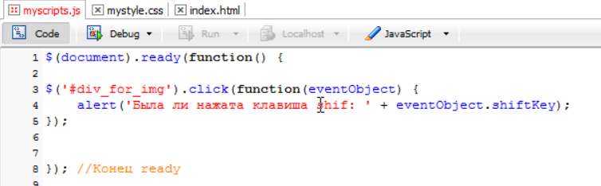
вот таким образом вы можете отслеживать были ли нажаты выше перечисленные клавиши в момент наступления события.
Следующее свойство это свойсто target т.е. какой объект отреагировал на событие.
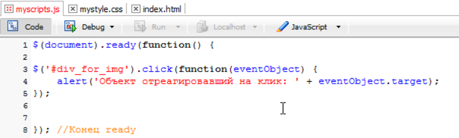

и он нам говорит что был  клик по объекту img т.е. в данном случае нам возвращается обычный javascript объект и мы допустим можем получить доступ к его свойствам. Т.е. можно сзделать так. Мы можем сохранить объект который отреагирует на событие в какую нибудь переменную, и в сообщении дописываем  что мы хотим увидит его id 

вот таким образом вы можете получить объект который реагирует на то или иное событие.
Так есть еще одно свойство которое мы пока затрагивать не будем это свойство data. Мы его возможно затронем в будущем. Возможно вообще не будем затрагивать потому что оно достаточно сложное и используется достаточно редко.

# отмена обычного поведения элемента
В этом уроке мы с вами затронем метод объекта события который я обещал вам рассмотреть. Что это за метод такой?
Смотрите у нас некоторые элементы страницы имеют встроенные уже действия на события. Например ссылка она имеет встроенное действие открыть страницу при щелчке. Или там кнопка формы 
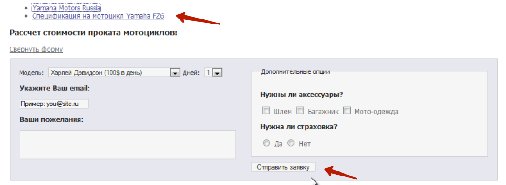
она так же имеет встроенные действия, при щелчке отправить форму на сервер. 
Так вот бывают ситуации когда нужно запретить это стандартное поведение. Стандартную реакцию на наши действия. Допустим мы бы хотели что бы у нас по клику на ссылки  выводилась какая нибудь информация в блок div_forresults а у нас в место этого открывается новый сайт 

т.е. как то не хорошо. Так вот этот метод он называется preventDefault предотвратить действие по умолчанию, он как раз таки и позволяет решить эту задачу. Когда вам например нужно сделать так что бы ссылка например не реагировала на нажатие, не открывала новую страницу, вы можете воспользоватся этим самым методом. 

вот мы берем эту ссылку и у нее id ( короче при прокрутке там дальше) 

Теперь наша задача предотвратить обычное поведение при клике, потому что при обычном состоянии по данной ссылке у нас откроется сайт. А что бы этого не произошло мы воспользуемся нашим объектом eventObject и его специальным методом preventDefault 

если мы сохраняем и смотрим что это нам дает то мы видим что мы уже не можем перейти по ссылке. 
Можно сделать так что бы при клике у нас в блок с id forresults добавлялся какой нибудь текст. При выборке элемента мы ему говорим что он нам должен добовлять html код. Пишем append и в качестве параметров передаем уму абзац. 

вот такая запись у нас не даст открыться новому сайту но при этом добавить html код 

т.е. вот таким образом вы можете предотвратить обычное поведение тех элементов у которых уже действие вшито. 
 При этом есть еще такой вариант. Во многих источниках вы можете увидеть то что вместо preventDefault можно написать return false т.е. вернуть ложь 
 
 что бы получился вывод абзаца нужно поменять метами потому что после return false любой код игнорируется 
 

# Создаем слайдшоу для закрепления метериала  
Для закрепления тех знаний которых мы уже получили к текущему моменту в этом уроке мы проделаем практическую работу и попробуем реализовать вот такую галерею 
 
 когда она загружается у нас появляется вот такая картинка при этом внизу идут миниатюры. при щелчке на миниатюру у нас появляется 
 
 этот мотоцикл уже в увеличенном виде. Вот такая простенькая галерея которая позволит нам закрепить наши знания. 
Что нам понадобится для работы этой галереи?? Во первых это 10-ть картинок. Четыре миниатюрки, четыре больших мотоцикла, картинка старта, и маленькая картинка gif анимация которая появляется в момент смены. Потому что сейчас я работаю на локальном компьютере. Здесь это все происходит очень быстро, а на реальном сервере у нас картинка будет какое – то время сначала загружаться. По этому в это время должна показываться прокручивающаяся стрелка. 
И так с чего мы начнем? А начнем мы с того что найдем в дополнительных материалах шаблон. Потому что мы не будем здесь с ноля писать весь html код, у нас все таки курс не по html, мы будем заниматься именно jQuery частью. А сначала нам нужно взять html  и css шаблоны что бы организовать каркас данной галереи 

это каркас нашей галереи. Здесь он состоит сплошником из блоков div. здесь ничего сложного нет 

обратите внимание как у нас устроени данная галерея.
Идет общий блок div с id gallery. Далее идет блок  div с id bid и в нем находится эта стартовая картинка она называется start.jpg на которой написано Галерея мотоциклов.
Далее у нас идет отдельный блок div для маленьких картинок div id small. И уже в нем идут не просто картинки, а картинки заключенные в ссылки 

каждая такая маленькая катринка заключена в ссылку, а ссылка ведет уже на юольшую картинку. Это сделано для того что бы если даже у человека отключен javascript, то при щелчке на карртинки у него все равно откроется большая картинка уже в новом окне т.е. сработает как обычная ссылка.
 Теперь подключим css правила 
 
 
 здесь тоже буквально 4-ре блока, один общий для общего блока div #gallery, один для большой картинки #big,  один для маленькой картинки #small, и для ссылок  #small a img что бы у нас рамок не показывалось. Копируем и добавляем к нашему файле таблицы стилей.

И теперь наша задача повесить на это все логику, уже написать script который будет заставлять это все работать. 
Начнем мы естественно с определения объекта. Что у нас в данном случае будет являться обектом который будет реагировать на щелчек мышью? Т.е. у нас объектом являются 4-ре ссылки

которые содержат в себе эти 4-ре мотоцикла. При щелчке по лубой ссылки мы уже будем писать что должно происходить. 

Первый делом отбираем эти ссылки. Если посмотрим код то увидим что их легко отобрать с помощью родительского id small 

т.е. мы говорим что нас интересует блок с id small и все ссылки внутри него.

Теперь определяемся с событием. Событие у нас это клик. Пишем click и пишем анонимную функцию 

При этом нам нужно что бы у нас в новом окне ссылка не открывалась, т.е. нам нужно будет предотвращать обычное поведение по этому мы сюда добавим еще  объект событие 

Это мы с вами отобрали объект и определились с событием.

Теперь третья часть нашего уравнения. Какие же действия у нас?? Т.е. что должно у нас происходить при щелчке первым делом. При щелчке у нас большая картинка которая здесь стоит должна прятаться 

а должна появляться та по которой мы щелкнули. При этом мы знаем что когда мы щелкаем по ссылке, у нас у этой ссылке есть такой атрибут href 

который ведет на большую картинку. Т.е. мы что можем сделать? При щелчке по ссылке мы можем вытащить этот путь, где лежит у нас большая картинка,  и поменять этот путь 

у большой картинки которая находится на данный момент активной. 
Первым делом нам нужно спрять ту картинку которая стоит в этом блоке с id big. 
Переходим в скрипт и первым делом говрим что нас интересует блок и id big и та картинка которая находится внутри него, и эту картинку мы хотим спрятать 

И так это была первая часть уравнения. При этом мы должны поменять атрибуты т.е. в момент щелчка мы получается должны получить атрибуты ссылки по которой кликнули, и заменить 

И так это была первая часть уравнения. При этом мы должны поменять атрибуты т.е. в момент щелчка мы получается должны получить атрибуты ссылки по которой кликнули, и заменить 

т.е. мы говорим что нам нужно не только спрятать большую картинку, но нам еще нужно поменять у нее атрибут src. Пишем метод работы с атрибутами attr() говорим что нас интересует атрибут src и вторым параметром мы передаем значение на которое мы хотим его поменять. А поменять мы его хотим на значение которое хранится в атрибуте href нашей ссылки. 

Как мы можем получить доступ ко второму атрибуту? Мы видим что у нас объектом является ссылка, и что когда по ней происходит щелчок т.е. та по которой произошел щелчок будет находится в объекте this т.е. мы можем написать $this(). И получить ее значение атрибута href , так жи пишем метод атрибута attr и говорим что нас интересует атрибут href 

т.е. вот эта запись 

у нас вернет значение атрибуда href текущей ссылки. А вот это уже изменит атрибут src 

немножко запутанно конечно. Но если вы спокойно внимательно это все продумаете то все станет на свои места и вы все поймете.
И теперь следующая задача наша это показать картинку. Но вот у нас в чем беда. Мы не можем ее просто так показать потому что она еще может быть не загружена. По этому здесь нужно действовать так. Здесь нужно вспомнить специальный метод  который мы с вами уже здесь изучали событие load полная  загрузка страницы. Так вот на сомом деле это событие можно использовать не только для отслеживания загрузки страницы, но и для отслеживания полной загрузки любого объекта. В нашем случае картинки. Т.е это означает что мы можем написать так 
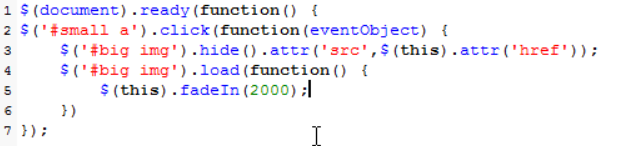
и плюс к этому когда у нас происходит клик мышью мы должны предотвратить обычное поведение ссылки т.е. что бы у нас картинка не открывалась в новом окне. Мы для этого воспользуемся методом preventDefault 

проверяем все впорядке. 

единственное что не появляется это загрузчик на фоне 

# выбор и фильтрация элементов формы
И так мы с вами добрались до элементов фильтрации формы. Но прежде чем переходить к ним я предлагаю сделать следующее.
У нас для работы галереи здесь образовался достаточно внушительный код и для дальнейшей работы он нам будет как бы мешать. Его нужно по сути оставить что бы галерея у нас работала, но он уже занимает достаточно большую часть страницы. По этому я предлагаю его вынести в отдельный файл и назвать его gallery.js
Копируем и создаем новый js файл 

помещаем туда этот код и сохраним данный файл в наш проект

а для того что бы эта галерея у нас работала мы этот скрипт подключим к нашей html странице 

вот они все подключенные jquery.js, javascript.js и gallery.js
Удаляем весь код с файла myscript.js и проверим работает ли у нас галерея

работает.
Так и теперь возвращаемся к фильтрам которые у на существуют для элементов форм. 
Обратите внимание на такую деталь что у нас многие элементы форм создаются с помощью одного и того же тега

видите что здесь очень много элементов разного типа checkbox например, radio группы, создают с помощью тега input и даже кнопка у нас создается с помощью тега input, текстовые поля так же с помощью input. Т.е. очень много достаточно полей с помощью одного и того же тега.
По этому разработчики jQuery добавили для работы с элементами форм специальные которые позволяют выбрать вам например очень быстро все checkbox вашей формы. Потому что если нам пришлось бы выбирать обычными способами, нужно было бы писать название тега input? Потом указывать что атрибут type этого тега обязательно должен быть значение checkbox. Но разработчики jQuery упростили нам жизнь и теперь что бы выбрать например все checkbox нам достаточно написать таким образом. В выборке ставим двоеточие и название выбранного элемента формы
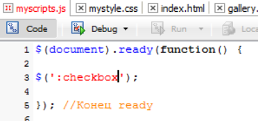
И если мы их попробуем скрыть  
  Что бы выбрать например все радио кнопки 
 
   Что бы выбрать все кнопки типа submit 

Так какие у нас элементы еще создаются  с помощью тега input? Это кнопки, кнопка сброса, кнопка загрузки файла. Т.е. здесь так же можете применять эти фильтры. Т.е. если вам нужно скрыть все кнопки сброса это reser, если нужно скрыть все кнопки загрузки файлов это file, если нужно скрыть все просто кнопки это button, если нужно скрыть все поля для ввода обычного текста это text. Если вам нужно скрыть поле для ввода пароля это password/. И еще есть input которые  создают кнопки в виде картинок image 

И если нужно скрыть все элементы типа input т.е. те которые позволяют вводить информацию. 

При этом смотрите мы в данном варианте писали это для всех тегов input. Но на странице у нас божет быть несколько форм.и вот такая запись скроет 

все input type text во всех формах. 
Если же вам нужно скрыть в какой – то конкретной форме в нашем случае это 

то вы можете написать таким образом. 

и таким же образом вы можете работать с теми же методами которые мы изучили для работы с формами. Т.е. это такие же объекты как и любые другие теги просто здесь сделан более удобный способ их отбора через эти фильтры для элементов форм.

# фильтры состояния элементов  
И так в предыдущем уроке мы с вами научились отбирать различные поля формы с помощью специальных фильтров которые есть в jQuery именно для полей форм 

но мы не научились отбирать на данный момент отмеченные на данный момент элементы. Потому что часто бывает так что нам нужно например только активные. Допустим только где стоит значок нет 

или только select где стоит багажник. 
Как нам выбрать эти активные элементы? Для этого в jQuery есть еще один специальный фильтр checked т.е. отмеченные. 

смотрите если мы пишем $(‘#my_form :checked’).fadeOut(5000); по идее сейчас должны исчезнуть все элементы которые на данный момент активны. 

и как видите у checkbox и radio кнопок может быть состояние checked т.е. отмеченные. Например у select такого состояния нет, у них есть состояние selected 

А у checkbox и radio есть состояние checked. Мы можем с помощью этого фильтра активные на данный момент отбирать активные radio и checkbox. При этом мы можем выбирать. На данный момент мы выбрали все для формы 

А если мы хотим выбрать только активные checkbox то делается это таким образом. Сначала мы говорим что нас интересует checkbox внутри этой формы #my_form, но не все подряд, а именно отмеченные.

При этом особенность этого фильтра checked в том что когда вы его используете для конкретных элементов, то его нужно писать слитно 

И второй фильтр который мы изучим это фильтр selected переводится как выбранные. Что бы выбрать текущее значение в этом списке
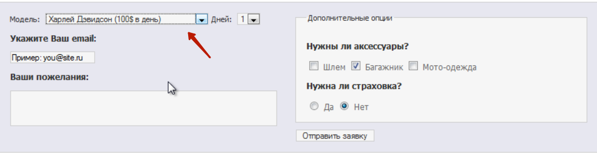
мы можем взять id этого списка 

и в данном случае если мы хотим  отобрать в jQuery набор именно текущее выбор пользователя в этом select, там достаточно написать таким образом

здесь естественно слитно писать уже не нужно, пишем через пробел. 

как видите он исчез, правда мы этого не заметили. Вот таким образом у нас происходит выборка текущего селекта который на данный момент отмечен. На этом мы здесь и остановимся, потому что интереснее его не прятать, а узнать его текущее значение.

# узнаем значение элементов формы в выборке
И так в предыдущих уроках мы с вами научились отбирать элементы форм. Теперь нам осталось научиться узнавать значение которые были введены в эти элементы. Потому что очень часто бывает так что нам нужно узнать, а что пользователь ввел например в это поле 

а что в другое поле и тд. По этому в этом уроке мы изучим специальный метод который позволяет нам узнать значение которое было введено в поле. 
И для реализации этого примера давайте где – нибудь под формой добавим еще одну кнопочку по нажатию которой мы будем проверять что пользователь вводил в разные поля. Переходим в индексный файл 

и теперь давайте посмотрим какой тег у нас отвечает за получение информации из поля. Первым делом попробуем сделать так что бы при щелчке на эту кнопку у нас выводилось сообщение что же введено на данный момент в это поле текстовой области 

вот эта текстовая область. У нее id mytextarea. Первым делом нас интересует кнопка checkbutton. На нее мы повесим событие клика. Т.е. мы говорим что в момент клика по этой кнопке должна выполняться анонимная функция которая должна получить значение этой текстовой области. Берем id этой текстовой области и через специальный метод val это сокращение от value которое переводится как значение 

Мы по сути говорим что у нас есть объект mytextarea и мы хотим узнать его значение. И эта запись вернет нам это значение. При этом выводим все это дело на экран 

т.е. он получает значение текстовой области с помощью метода val. При этом смотрите. Мы можем в качестве параметра 

Передать сюда текст и таким образом установить значение поля.

alert нам не нужен. По этому при щелчке у нас просто будет устанавливаться значение. 

т.е. если мы передаем параметр в этом методе то значение будет установлено. Если мы используем без параметра то значение будет получено. Это что касалось текстовой области.
Тоже самое будет для этого блока text 

Если мы хотим узнать какой select на данный момент выбран, то мы уже делаем следующим образом. 

И при этом нас интересует выбранный на данный момент пункт 

И вот такая запись нам вернет на данный момент значение которое выбрано на данный момент
 
 видите да ? он возвращает не текст, а значение атрибута value. Потому что смотрите атрибут value 
  
  именно это значение отправляется на сервер. Когда форма отправляется. У нас на сервер будет отправлен не текст, а именно это значение. Соответственно когда мы пишем что хотим получить значение он нам возвращает значение value 
  
  Заодно можно пройтись по радио группе
  
  Т.е. узнать какой элемент на данный момент выбран 
  
  
  
  При этом тоже самое мы могли записать по другому 
  
  А вот с checkbox можно поступить таким образом 
  
  потому что checkbox у нас может быть выбрано несколько и мы можем например пройтись их в цикле. Заодно повторим цикл each который есть в jQuery 
  
  внутри этой анонимной функции будет происходит следующее. Нам нужны не все подряд checkbox, а именно выделенные 
  
  
  
  

  # события submit() и focus()

  И так мы с вами изучили специфические селекторы для выбора элемента форм
  
  но мы не затрагивали вплотную события которые происходят с элементами форм. Мы лишь частично их коснулись когда проходили события отслеживаемые браузером. 

я вам говорил что он отслеживает например событие submit момент отправки формы, focus, blur, chenge и тд.  И вот эти события мы с вами более плотно пройдем, на примерах, что бы вы могли ими уже уверенно пользоваться.
И так первое событие которое мы пройдем это событие submit. Событие submit обычно используется для проверки формы т.е. когда происходит событие submit, на момент отправки формы, мы можем проверить все ли поля например заполнены. И давайте для примера напишем для нашей формы обработчик событий submit и проверим былоли например заполнено поле email перед отправкой. 

Т.е. если оно было заполнено мы отправим, если нет то не будем отправлять. 
Идем в наш js файл и говорим что нас интересует объект с id my_form и его событие submit.

Т.е. когда происходит событие submit должна быть выполнена анонимная функция.

И наша задача проверить. А было ли что – то введено у нас значение в поле email. Т.е. нас интересует блок который отвечает за формирование текстового поля ввода email

мы говорим что нас интересует значение элемента с id email, а что бы получить его значение воспользуемся методом val.

Так вот это вернет нам значение. И нам нужно проверить если оно равно пустоте, тогда нам нужно прекратить отправку формы и вывести сообщение об ошибке. Т.е. мы дописываем условие если значение равняется пустоте, то мы должны прекратить отправку формы.

этими строками предотвращаем отправку формы и выводим сообщение на экран.
И теперь когда у нас будет происходить отправка формы т.е. в любом месте когда пользователь будет находится в форме и нажмет enter, либо если он нажмет курсором мыши по кнопке отправки формы  у нас произойдет это событие и будет проверено поле email. Давайте посмотрим. Допустим мы ничего не введем и нажмем enter. 

у нас произошло событие submit и нам говорят что мы не заполнили email. Тоже самое будет если я нажму кнопку отправить заявку. А если что – нибудь введу то отправка произойдет успешно.

Следующее событие которое мы здесь подробно затронем это событие focus. Т.е. когда какой- - то элемент получает focus то у нас происходит это событие

и мы можем на него что то повесить. Например очистить элемент или дать ему какую – нибудь подсветку. Давайте на примере этого текстового поля для ввода email попробуем воспользоваться событием focus. 
Все удаляю и пишу что меня интересует событие focus и во время этого события должна быть выполнена анонимная функция. 
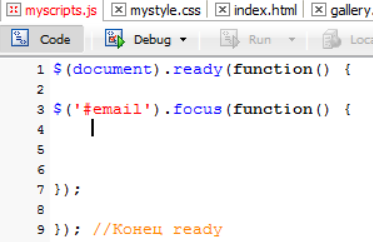
И что у нас будет происходить? Давайте сделаем так что когда пользователь у нас счелкает в этом поле 

допустим это поле у нас будет подсвечиваться зеленой рамкой. Для этого мы напишем что this, потому что это поле которое у нас отреагирует на событие фокуса, это поле для ввода email и методом css добавим ему разные свойства 

Во – первых передадим литерал объекта, потому что мы будем два свойства добавлять. 1-е это рамка 

И 2-е добавим подсветку 
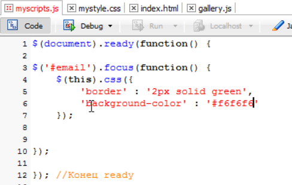

видите. В момент focus у нас срабатывает эта анонимная функция и данному полу присваиваются эти css стили. Вот таким образом у нас работает событие focus. 

# событие blur() и change()
Теперь пришло время изучить событие blur  это когда поле у нас теряет фокус. И давайте сделаем так, немножко усовершенствуем то что мы здесь написали 

и просто будем подключать class в момент фокуса и убирать class dj время потери фокуса. 
Вырезаем данный момент и где - нибудь в таблице стилей пишем что мы создаем специальный class который называется onFocus например и в него пропишем эти два правила 

И теперь мы можем написать так что во время фокуса мы должны, нашему элементу уже не css а просто addClass и указываем название класса onFocus 

далее напишем что при событии blur должна выполняться другая анонимная функция при которой у нас текущему элементу, с которым произошло это событие blur, расфокусировка, у него должен удаляться класс onFocus 

сохраним и проверяем. 

Вот таким образом мы с вами научились пользоваться событием focus и событием blur 
Если вас смутила такая запись, то ничего мутного в ней нет. Просто мы воспользовались цепными функциями. Если бы я писал blur отдельной строкой мнебы пришлось заносить этот обьект в переменную 

что бы у нас небыло двойной выборки так скажем. А так мы просто написали что по событию focus мы должны мы должны выполнять focus, а при событии blur удалять его. Ничего сложного.

И следующее событие которое мы изучим это событие chenge. Тоже очень интересное событие которое срабатывает в момент изменения элемента. Самый хороший пример это когда мы меняем select 

вот произошло  событие chenge при смене select. 
Или что – то начала вводить, букву 

это событие chenge потому что у нас поле изменилось. И вы возможно даже в интернете видели такие скрипты, которые при вводе например нового email, который вы придумали себе , он прям по ходу того как вы вводите, сбоку горит такой кружок доступно ли данное имя 

так вот он как раз использует событие chenge. Как только вы нажимаете какую то букву, он берет получившуюся комбинацию отправляет ее на сервер, получает ответ и выводит вам доступно ли данное имя или нет. Причем было бы хорошо совместить с этой зеленой рамкой т.е. если имя доступно то рамка зеленая. Если вы вводите имя которое очень распостраненное и которое уже занято то рамка будет красная.
 А мы давайте рассмотрим вот какой пример в связи с этим событием chenge. Допустим у нас есть такая ситуация что гоночный мотоцикл мы можем дать только на один день хотя у насздесь два 
 
 допустим харлей можем дать вообще на 3-ри дня. У нас такая ситуация что разные мотоциклы мы можем дать на разное количество дней.
Так вот мы свами сейчас можем написать такой скрипт который будет обрабатывать событие chenge в этом select и в зависимости от полученного результата будет менять количество дней во втором select 

первым делом давайте определимся на сколько дней мы будем давать каждый из мотоциклов. Харлей максимум на 2-ва дня, кроссовый на 4-ре, гоночный на 1-н,  а концептуальный на 3-ри.
Пишем код. Нас интересует в первую очередь вот этот select 

он имеет id motoSelect.
Идем в скрипт и говорим что нас интересует элемент с id motoSelect и его событие chenge т.е. как только там происходят какие – то изменения мы будем что – то делать т.е. мы будем выполнять нашу анонимную функцию

так и что в ней будет происходить? Во – первых мы должны проверить а что же пользователь выбрал? По этому мы можем спокойно написать, создать выборку что нам нужно узнать текущий выбранный элемент. Мы пишем motoSelect и фильтр который мы изучили это selected и если мы сюда допишем метод val вернет нам значение 

кторое на данный момент выбрал пользователь т.е. он нам вернет либо 1-цу, либо 2-ку, 3-ку или 4-ку в зависимости от выбранного мотоцикла.
Мы уже здесь можем спокойно писать условие поместим этот выбор в какую – нибудь переменную 

получается у нас вот в этой переменной находится выбор пользователя и мы можем спокойно сравнивать.
Пишем если или, конструкцию if else, 

и мы говорим что если у нас myChoice равен еденице то мы интересуемся вторым select 

если у нас к примеру выбрали первый мотоцикл то нам нужно взять второй select и изменть его html код, потому что на данный момент если мы посмотрим его html код состоит из таких элементов

Т.е. максимум два дня.
Мы договорились что харлей мы будем сдавать на два дня. То здесь по сути нам нужно написать так что нас интересует элемент вот с таким id 

daysSelect и с помощью метода html мы занесем в него такой же код котрый у нас на данный момент и стоит

теперь если у нас не срабатывает это условие, если не 1-ца то мы проверяем иначе если 

т.е. в случае если будет выбран кроссовый мотоцикл у нас html код второго select изменится и в нем уже появятся 4-ре пункта.
Если и это не сработает, если это не второй, то еще раз проверяем myChoice будет равен 3-м то мы должны взять опять таки этот daysSelect который у нас отвечает за выборку дней и гоночный мотоцикл мы можем дать вообще только на один день. 
И последний мотоцикл концептуальный мы пишем что можем дать его на 3-ри дня. 

т.е. мы что делаем? Мы в момент изменения основного select, где выбирают мотоциклы, мы заносим в переменную текущий выбор пользователя  т.е. что он выбрал. И затем проверяем, если он выбрал первый то меняем код у второго select и добавляем два дня, если он выбрал другой мотоцикл 3-ри и тд. И давайте проверим сработает ли у нас такая конструкция. 

вот таким образом мы с вами воспользовались событием chenge т.е. когда я что то меняю в первом select, у нас происходит событие chenge и мы по этому событию уже можем писать код и изменять другие элементы.

# Включение и отключение скрытие и показ полей 
И так в этом уроке давайте закончим с формами. Нам осталось выяснить а как же нам блокировать какой –то элемент формы? И самым хорошим примером здесь будет вот такой вариант.
Допустим у нас есть ситуация когда мы например для концептуального мотоцикла не можем предложить в качестве аксессуаров багажник

т.е либо он не разработан, либо для этой модели он не доступен. Так что нам нужно что бы когда человек выбирает концептуальный мотоцикл либо спрятать поле с багажником, либо как то его заблокировать.
И вот именно на этом примере давайте посмотрим как можно блокировать поле с помощью jQuery. На самом деле делается это очень просто. Если вы знаете html то должны знать что поле блокируется с помощью атрибута disabled. Т.е. если мы возьмем тот же checkbox с багажником 

То мы ему можем дописать атрибут disabled и в качестве значения так же нужно написать disabled 

если вы внимательно смотрели предыдущие уроки, то вы можете спокойно догадаться как нам это сделать с помощью jQuery. Т.е. у нас есть событие change и мы можем спокойно написать если в ходе события change значение выбранного элемента равняется 4-ке то нужно взять этот элемент 

и с помощью метода attr работы с атрибутами, взять атрибут disabled и просто присвоить ему значение disabled. Давайте этим займемся. 

и нам осталось дописать простое условие что если у нас данное значение равно 4-м, то нужно деать следующее

нужно найти объект который отвечает за багажник 

у него id bug, т.е. мне нужно найти элемент с id bug и с помощью метода attr взять его атрибут disabled и внести в него значение disabled. 

и при этом если мы выбираем другой элемент то багажник у нас не разблокируется. Нам нужно дописать вариант else т.е. когда у нас myChoice не равен 4-м, т.е. в любом другом случае багажник должен быть разблокирован. 

все правильно. Все кроме 4-го варианта разблокируется.
И еще для большей наглядности можно выделять само слово богажник в красный цвет. 

вот таким образом мы познакомились с вами  с возможностью блокировать элементы причем делать по наступлению каких то событий. Можно для примера спратать элемент. 

Далее изучай php после технологию ajax это связь между php и javascript.  
