# настройка рабочей среды
И так будем рассматривать на примере фотошоп cs5. При первом запуске мы можем заметить некоторые отличия.
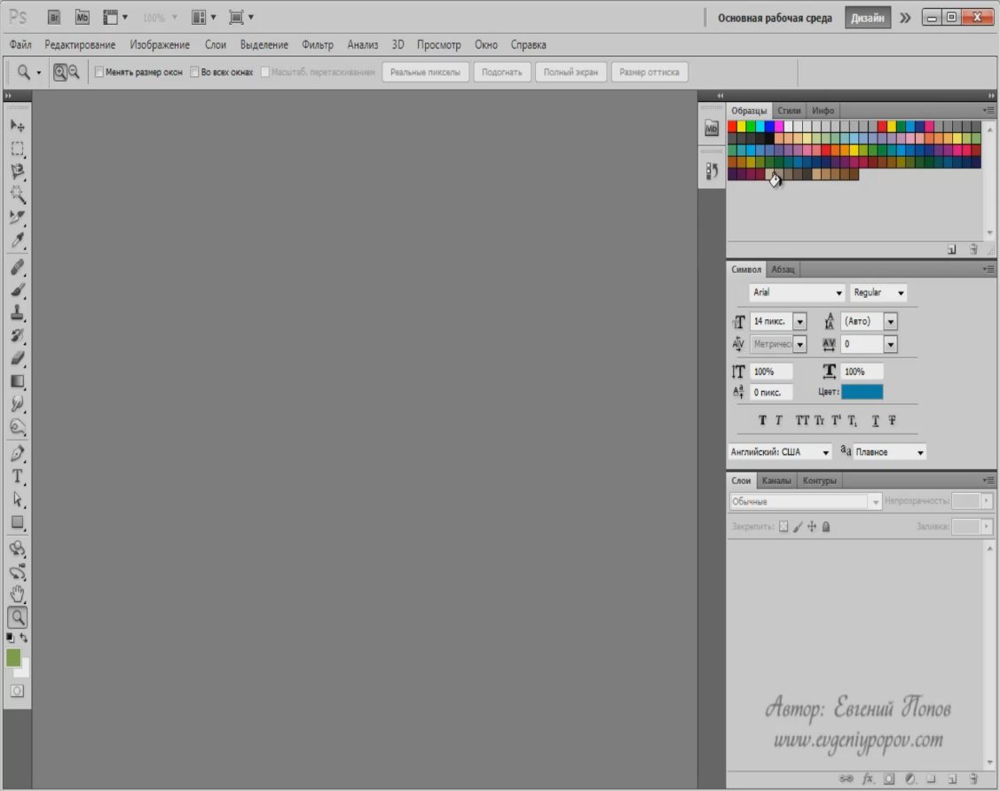
У вас правая часть программы, которая состоит из так называемых палитр, может отличаться от моей. Но в этом нет ничего страшного сейчас мы приведем все к единому виду. 
И так давайте создадим свою рабочую  среду. Для этого перейдите в правый верхний угол экрана нажмите на стрелочку и выберите пункт создать новую рабочую среду.

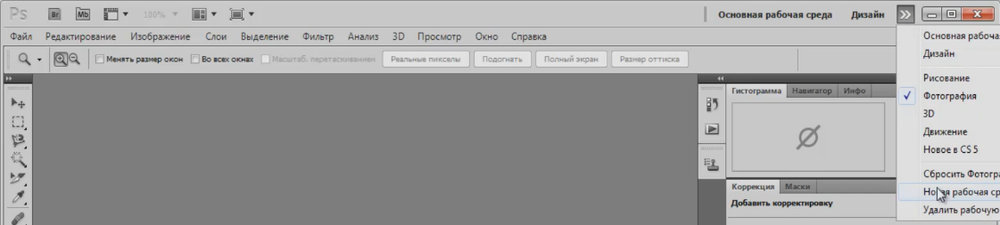

дайте ей какое-нибудь название и сохраните ее.
Все теперь это наша среда. Теперь мы ее один раз настроим и она у нас будет всегда в таком виде в котором мы ее сейчас сделаем.
Для этого переходим на вкладку окно и отключаем не нужные вкладки.

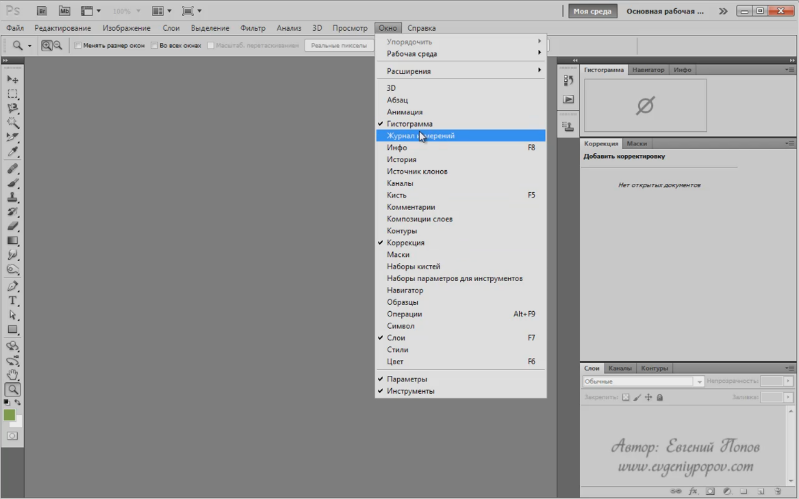
    Нам не нужны будут Гистограммы, Коррекция. Мы должны будем только оставить пункт слои и на первом этапе нам понадобится История (по другому еще называют палитра истории).
    5
Далее мы приводим вот к такому виду и далее отключаем лишнее. И далее отключаем палитру источника клонов
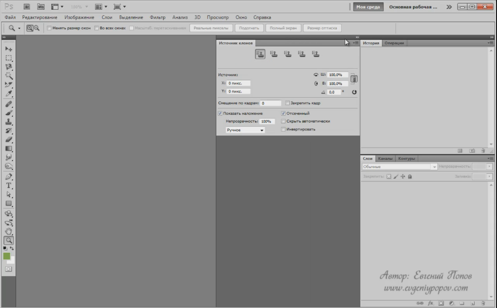
Она нам так же не понадобится. По этому щелкаем в правой части окна и выбираем закрыть группу вкладок.
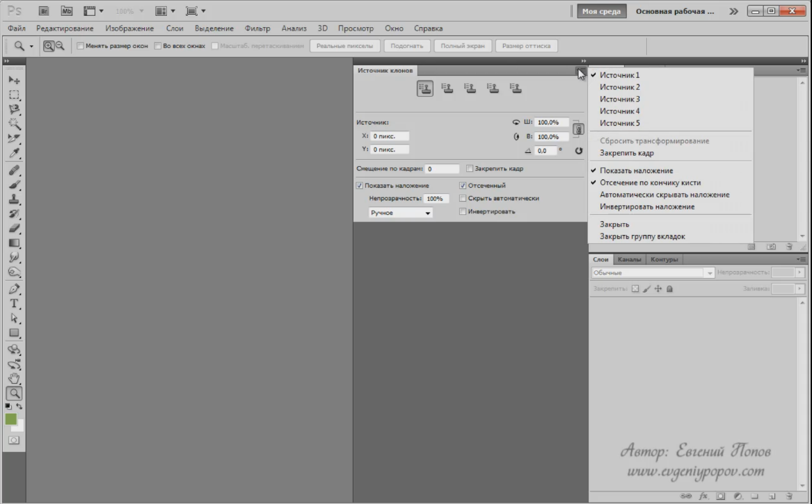
Далее палитра операции нам тоже пока не понадобится и палитра контуров и каналов тоже. По этому оставляем только слои и историю.  Эти две палитры первое время мы будем использовать достаточно много по этому оставляем только их.
Вот таким образом мы с вами настроили рабочую среду и привели внешний вид программы к одинаковому виду.
Выбираем инструмент перемещение и как на картинке настраиваем ее. Ставим галочку возле автовыбор и выбираем группу слоев.
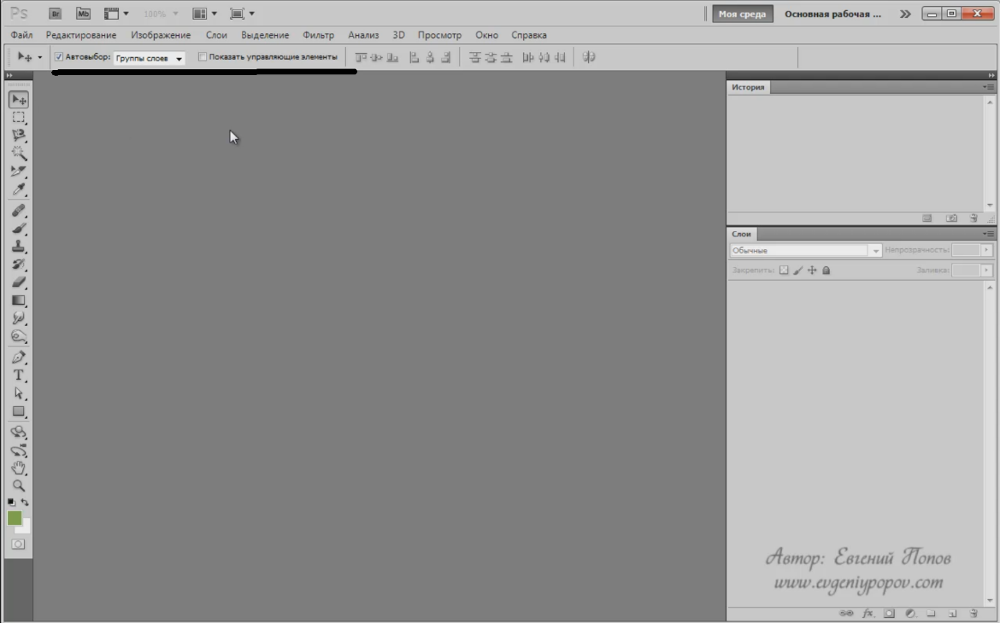

# новый и существующий документ
Следующий наш шаг это научиться создавать новый документ в фотошопе и открывать уже существующие. В принципе здесь ничего сложного нет единственно там есть пара особенностей по расположению. 
И так новый документ создается как обычно файл создать или через комбинацию клавиш ctrl+n. 

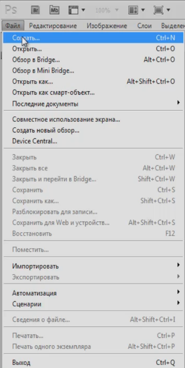
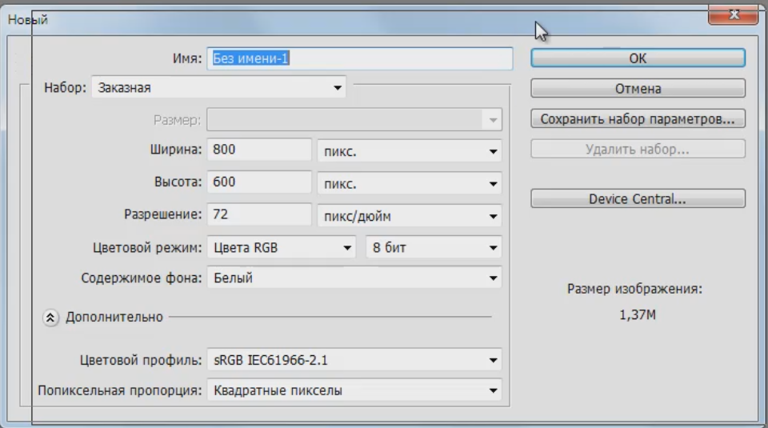
Здесь на что следует сразу обратить внимание. Это на пункт имя, здесь мы сразу можем задать имя нового документа. 
Набор-это всего лиш заготовки которые есть в фотошопе  и мы можем например выбрать пункт международный формат бумаги.
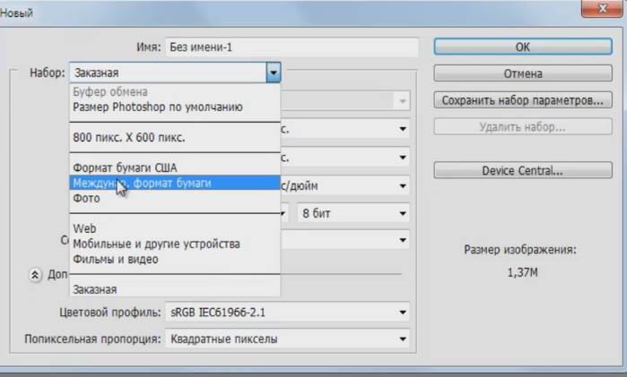
И далее уже в пункте размер выбрать из международных форматов например А4. Он сразу проставляет ширину, высоту, размеры в пикселях, цветовой режим, содержимое фона и т.д.
Но обычно используется пункт Заказная где мы можем сами уже регулировать размер. Проставляем свой размер в пикселях например ширина 800, высота 600, и разрешение если вы делаете изображение для размещения на сайте  или просто для хранения в цифровом виде то то достаточно 72 пикселя на дюйм, 300 это используется для печати. Цветовой режим мы будем использовать RGB 8-ми битный так и оставляем и содержимое фона белый. И дополнительные настройки не трогаем. Нажимаем ок и у нас создается новый документ.
Если вы часто работаете с каким то одним размером то вы можете сохранить набор. Выставляем свои значения
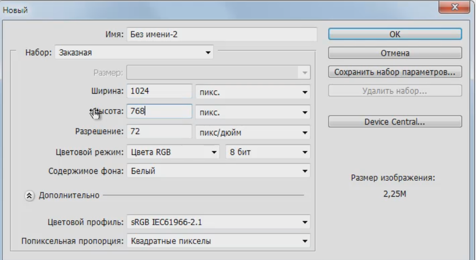
И что бы каждый раз это не прописывать мы можем в правой части экрана выбрать параметр сохранить набор параметров.
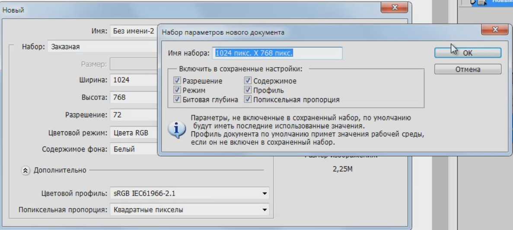
И нажимаем ок. у нас сохраняется это набор и в следующий раз когда мы будем создавать новый документ из пункта набор мы уже сможем выбрать готовый формат и нажать ок у нас создастся документ по нашим параметрам.
Теперь давайте поговорим уже про открытие существующих изображений файлов. Делается это как обычно через пункт Файл, Открыть и здесь мы указываем то место на своем компьютере где у нас хранятся различные изображения и открываем к примеру штук 6-ть изображений, это нам сейчас понадобится.
Все документы у нас располагаются вот в таких вкладках
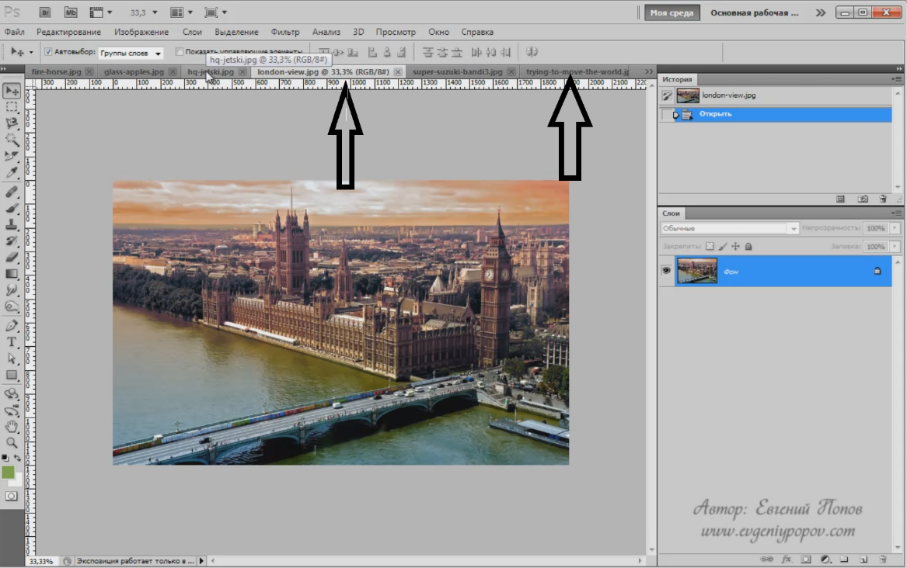
А теперь обратите внимание на вот этот пункт называется упорядочить документы
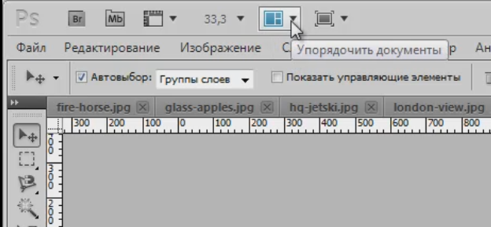
И он позволяет изменить внешний вид вот этого рабочего пространства где открыты фотографии. Если мы в один момент захотели увидеть все фотографии, а не так как во вкладках, выбираем пункт Расположить все в  сетке. Фотошоп под каждую картинку отведет свое место естественно полностью картинку не удастся увидеть.
Есть множество других вариантов по экспериментируй. 
Лучший вариант называется сравнение.

