[1. настройка рабочей среды](#настройка-рабочей-среды) 

[2. новый и существующий документ](#новый-и-существующий-документ) 

[3. масштаб и перемещение](#масштаб-и-перемещение) 

[4. создание и удаление слоев](#создание-и-удаление-слоев) 

[5. палитра истории](#палитра-истории) 

[6. блокировка слоя](#блокировка-слоя) 

[7. операция со слоями](#операция-со-слоями) 

[8. маска слоя](#маска-слоя) 

[9. режимы наложения слоев](#режимы-наложения-слоев) 

[10. введение в корректирующие слои](#введение-в-корректирующие-слои) 

[11. цветовой тон насыщенность](#цветовой-тон-насыщенность) 

[12. уровни кривые](#уровни-кривые) 

[13. команды коррекции](#команды-коррекции) 

[14. стили слоя](#стили-слоя) 

[15. обтравочная маска](#обтравочная-маска) 

[16. выделение](#выделение) 

[17. расскройка](#расскройка) 

[18. пипетка и линейка комментарии](#пипетка-и-линейка-комментарии) 

[19. восстанавливающая кисть точечная восстанавливающая кисть  заплатка красные глаза](#восстанавливающая-кисть-точечная-восстанавливающая-кисть-заплатка-красные-глаза) 

[20. штамп](#штамп) 

[21. осветлитель затемнитель губка](#осветлитель-затемнитель-губка) 

[22. размытие и резкость и палец](#размытие-и-резкость-и-палец) 

[23. кисть](#кисть) 

[24. ластик](#ластик) 

[25. градиент и заливка](#градиент-и-заливка) 

[26. архивная кисть](#архивная-кисть) 

[27. свободная трансформация](#свободная-трансформация) 

[28. перо](#перо) 

[29. работа с текстом часть 1](#работа-с-текстом-часть-1) 

[31. работа с текстом часть 2](#работа-с-текстом-часть-2) 

[32. векторные фигуры](#векторные-фигуры) 

[33. перевод вектора в  растр](#перевод-вектора-в-растр) 

[34. размер холста](#размер-холста) 

[35. фильтры](#фильтры) 

[36. экшены часть 1](#экшены-часть-1) 

[37. экшены часть 2](#экшены-часть-2) 

[38. смарт-объекты](#смарт-объекты) 

[39. покадровая анимация](#покадровая-анимация) 

[40. анимация по временной шкале](#анимация-по-временной-шкале) 

[41. полезные мелочи часть 1](#полезные-мелочи-часть-1) 

[42. полезные мелочи часть 2](#полезные-мелочи-часть-2) 

[43. настройки программы](#настройки-программы) 

[44. горячие клавиши ](#горячие-клавиши) 

****
     

# настройка рабочей среды
И так будем рассматривать на примере фотошоп cs5. При первом запуске мы можем заметить некоторые отличия.

У вас правая часть программы, которая состоит из так называемых палитр, может отличаться от моей. Но в этом нет ничего страшного сейчас мы приведем все к единому виду. 
И так давайте создадим свою рабочую  среду. Для этого перейдите в правый верхний угол экрана нажмите на стрелочку и выберите пункт создать новую рабочую среду.

дайте ей какое-нибудь название и сохраните ее.
Все теперь это наша среда. Теперь мы ее один раз настроим и она у нас будет всегда в таком виде в котором мы ее сейчас сделаем.
Для этого переходим на вкладку окно и отключаем не нужные вкладки.

    Нам не нужны будут Гистограммы, Коррекция. Мы должны будем только оставить пункт слои и на первом этапе нам понадобится История (по другому еще называют палитра истории).

    
    5
Далее мы приводим вот к такому виду и далее отключаем лишнее. И далее отключаем палитру источника клонов

Она нам так же не понадобится. По этому щелкаем в правой части окна и выбираем закрыть группу вкладок.

Далее палитра операции нам тоже пока не понадобится и палитра контуров и каналов тоже. По этому оставляем только слои и историю.  Эти две палитры первое время мы будем использовать достаточно много по этому оставляем только их.
Вот таким образом мы с вами настроили рабочую среду и привели внешний вид программы к одинаковому виду.
Выбираем инструмент перемещение и как на картинке настраиваем ее. Ставим галочку возле автовыбор и выбираем группу слоев.

****
     

# новый и существующий документ
Следующий наш шаг это научиться создавать новый документ в фотошопе и открывать уже существующие. В принципе здесь ничего сложного нет единственно там есть пара особенностей по расположению. 
И так новый документ создается как обычно файл создать или через комбинацию клавиш ctrl+n. 

Здесь на что следует сразу обратить внимание. Это на пункт имя, здесь мы сразу можем задать имя нового документа. 
Набор-это всего лиш заготовки которые есть в фотошопе  и мы можем например выбрать пункт международный формат бумаги.

И далее уже в пункте размер выбрать из международных форматов например А4. Он сразу проставляет ширину, высоту, размеры в пикселях, цветовой режим, содержимое фона и т.д.
Но обычно используется пункт Заказная где мы можем сами уже регулировать размер. Проставляем свой размер в пикселях например ширина 800, высота 600, и разрешение если вы делаете изображение для размещения на сайте  или просто для хранения в цифровом виде то то достаточно 72 пикселя на дюйм, 300 это используется для печати. Цветовой режим мы будем использовать RGB 8-ми битный так и оставляем и содержимое фона белый. И дополнительные настройки не трогаем. Нажимаем ок и у нас создается новый документ.
Если вы часто работаете с каким то одним размером то вы можете сохранить набор. Выставляем свои значения

И что бы каждый раз это не прописывать мы можем в правой части экрана выбрать параметр сохранить набор параметров.

И нажимаем ок. у нас сохраняется это набор и в следующий раз когда мы будем создавать новый документ из пункта набор мы уже сможем выбрать готовый формат и нажать ок у нас создастся документ по нашим параметрам.
Теперь давайте поговорим уже про открытие существующих изображений файлов. Делается это как обычно через пункт Файл, Открыть и здесь мы указываем то место на своем компьютере где у нас хранятся различные изображения и открываем к примеру штук 6-ть изображений, это нам сейчас понадобится.
Все документы у нас располагаются вот в таких вкладках

А теперь обратите внимание на вот этот пункт называется упорядочить документы

И он позволяет изменить внешний вид вот этого рабочего пространства где открыты фотографии. Если мы в один момент захотели увидеть все фотографии, а не так как во вкладках, выбираем пункт Расположить все в  сетке. Фотошоп под каждую картинку отведет свое место естественно полностью картинку не удастся увидеть.
Есть множество других вариантов по экспериментируй. 
Лучший вариант называется сравнение.

****
     

# масштаб и перемещение
И так мы с вами переходим к следующему уроку, он будет достаточно простой, но важный, потому что он будет посвящен работе с изображением с точки зрения масштаба и перемещения по этому изображению. Эти функции используются почти в каждой работе и вам ими пользоваться нужно очень хорошо.
 И так, смотрите, когда вы открываете достаточно большую картинку мы ее видим целиком. Но на самом деле мы ее видим не в реальном размере, а в уменьшенном это можно легко определить по вот этой цифре, которая находится во вкладке 43,5%

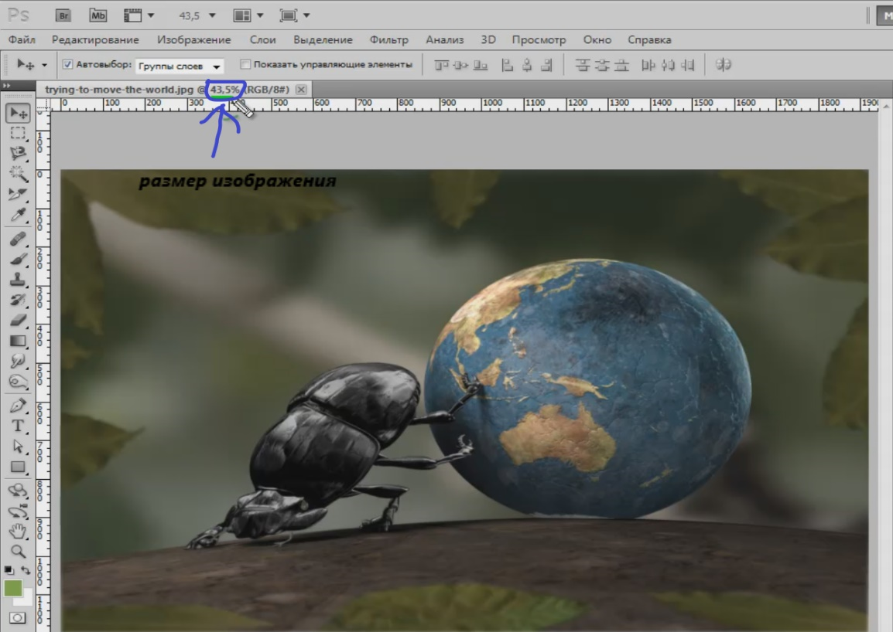

Т.е этим фотошоп нам говорит что картинку мы видим не в полном размере а  он ее уменьшил что бы мы ее видели целиком. И нам нужно учится работать вот с этим масштабом.
В левой панели инструментов  есть иконка лупы. Этот инструмент называется масштаб, его основная клавиша это Z . изначально он включается в положении плюса т.е. если мы нажимаем на изображение у нас масштаб увеличивается обратите внимание что во вкладке размер сразу поменялся на 50%. И при масштабировании на 100% мы видим изображение с разрешением 72 пикселя на дюйм, то самое стандартное разрешение для монитора. 
Теперь если мы хотим переключится на уменьшение то мы можем на панели настроек данного инструмента переключится на лупу со значком минус. Для перехода между плюсом и минусом не обязательно переходить в верхнее меню, достаточно ЗАЖАТЬ  клавишу ALT и данное значение поменяется, как только отпустите вернется в первоначальное положение.
И еще один важный момент это две кнопки реальные пикселы и подогнать

Реальные пикселы это по cent тот же самый реальный масштаб. а режим подогнать это тот самый режим в котором картинка открывается изначально т.е. мы видим ее полностью.
Теперь что касается дополнительных моментов которые вам нужно здесь знать.
Масштаб перетаскиванием

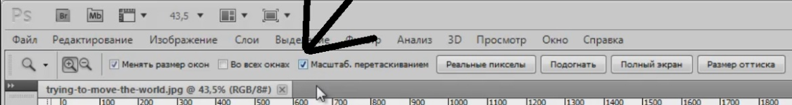

Смотрите если она включена я нажимаю левую кнопку мыши и двигаю мышку вниз у меня автоматически масштаб увеличивается.
Если мы убираем галочку то при зажатии левой кнопки мыши у нас квадратом выделяется область которую нужно увеличить . еще один момент когда мы тащим эту рамку иногда может такая ситуация быть что нужно эту рамку передвинуть. Для перетаскивания рамки достаточно  зажать пробел  и тащите эту рамку в нужное нам место. 
И теперь давайте сразу затронем еще один инструмент  который часто используется вместе с масштабом  это инструмент рука 

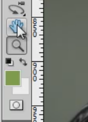

щелкните на него. У него горячая клавиша это H. И теперь допустим нужно переместиться в какую то часть изображения. Переместились поработали допустим кисточкой и теперь нам нужно переместится обратно. Можно поступить так же включить руку переместиться и дальше опять включить кисточку но это не очень удобно.
 По этому придумали такой способ перетаскивания не теряя инструмента достаточно нажать пробел, у нас временно инструмент меняется на руку и как только пробел отпускаем у нас опять возвращается кисточка. 
        

****
     

# создание и удаление слоев
Очень часто при работе со слоями приходиться создавать новые слои. И первый способ это щелкнуть по иконке которая находится в нижнем правим краю

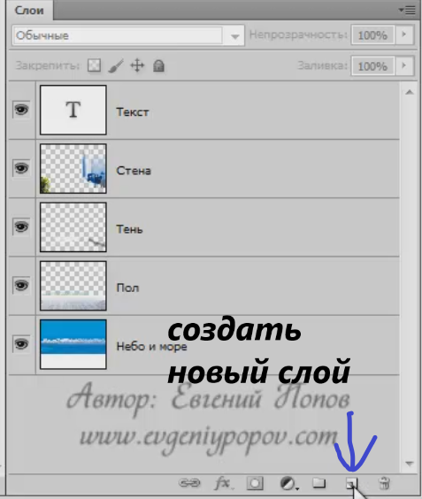

Второй момент который годится под создание нового слоя это пункт слои

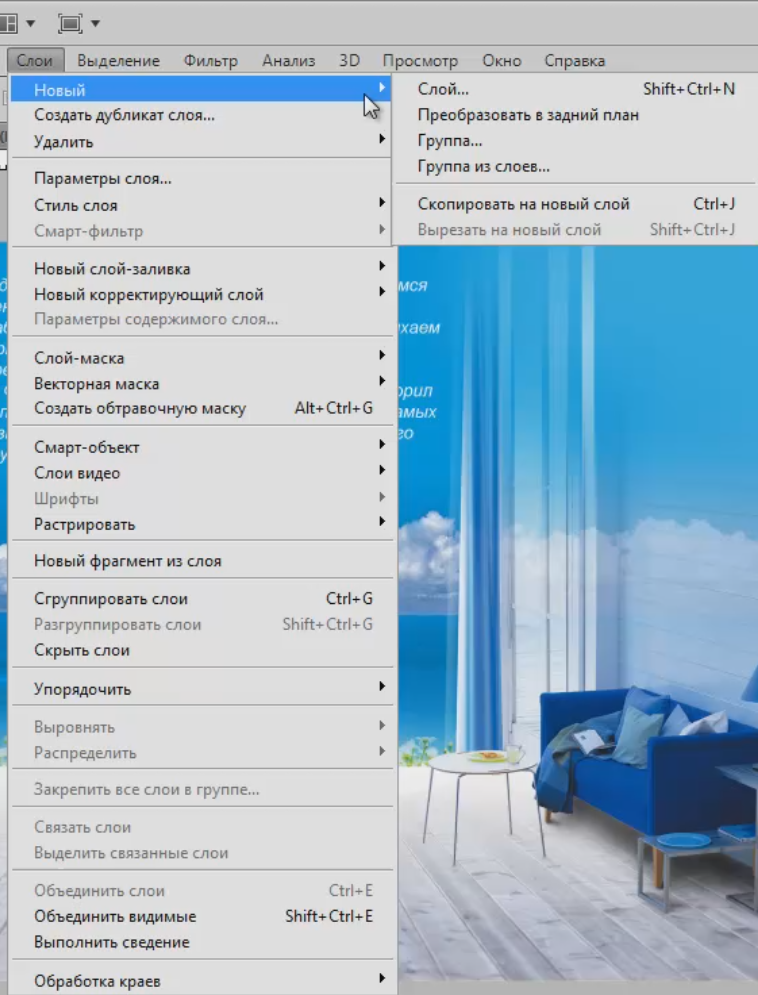

Третий вариант-это нажать комбинацию клавишей shift +ctrl+N.
Интересная особенность если мы создаем новый слой через пункт меню СЛОИ +НОВЫЙ+СЛОЙ то у нас появляется вот такое окошко в котором 

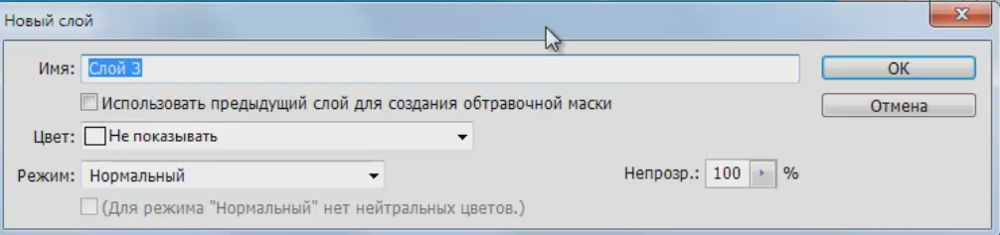

Сразу можно задать имя слоя. Можно использовать предыдущий слой для обтравочной маски, об этом мы еще поговорим. Можно задать цвет этому слою, но это будет просто раскраска слоя для вас что бы он выделялся в палитре слоев. На самом же деле слой будет такой же пустой. Ну и можно поменять режим наложения и непрозрачность о которых мы еще поговорим.
Удаление слоев. Первый способ мы можем перетащить на иконку с корзиной в палитре история в левом нижнем углу. Так же можно удалить несколько слоев достаточно зажать клавишу  ctrl и выделить нужные слои и удалить.
Обратите  внимание на новый слой. Мы видим так называемую шахматную доску. Э ТО ПРОЗРАЧНЫЕ ПИКСЕЛИ В ФОТОШОП. Это по сути обозначает что мы создали новый слой новую такую пленку по верх всех остальных которая абсолютно прозрачна т.е. мы через нее смотрим на все остальные слои. Эта пленка ближе всего сейчас к нашим глазам.
И давай те на нем что-нибудь нарисуем, солнце. Забежим немножко вперед и воспользуемся инструментом кисть.

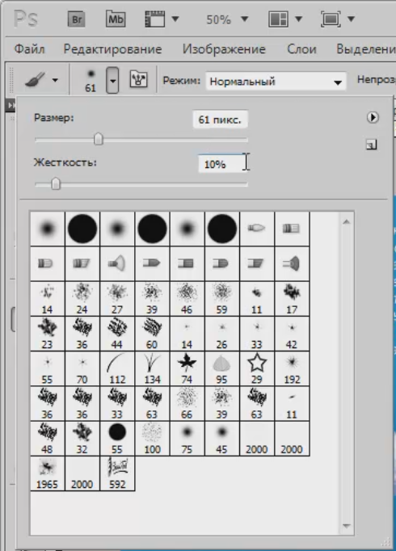

С помощью параметров настройки данной кисти выставте  примерно такие размеры.
Выберите цвет какой-нибудь желто-оранжевый.
И теперь убедитесь что вы стоите на новом слое приучайте себя проверять на каком слое вы работаете. И рисуем солнце. Переименовываем данные слой в солнце. Таким образом у нас все элементы нашего коложа расположены на отдельных слоях. Отключить слой можно на иконку глаза на против того слоя который хотим отключить.

Так же на что хотел обратить ваше внимание это на остальные слои где вы видите вот эту шахматную доску. Сразу такой совет если вы хотите отключить видимость всех слоев кроме какого-то конкретного то делается это очень просто. Зажмите клавишу alt и щелкните по глазу слоя который хотите оставить. Все остальные сразу выключаются. Что бы вернуть видимость всех слоев опять нажимаем alt и щелкаем по глазу левой кнопкой мыши.
И следующее понятие которое мы здесь разберем это не прозрачность слоя.  И обратите внимание на тот параметр который называется не прозрачность слоя

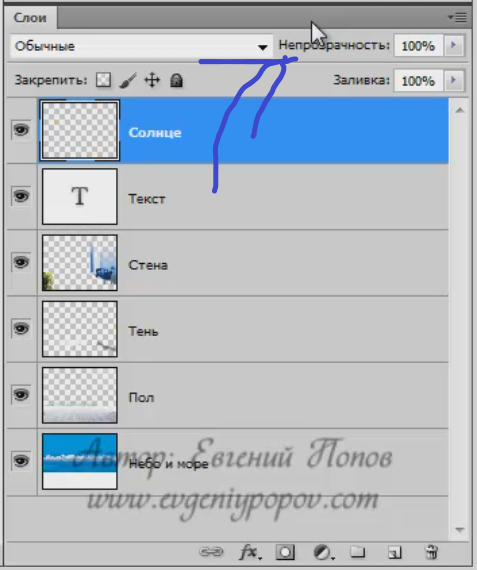

он говорит сам за себя и он отвечает за то как мы видим слой. Часто бывает так что нужно добавить слою прозрачность что бы через него были видны пиксели других слоев. И делается это как раз таки за счет этой настройки. Мы можем щелкнуть на стрелку и с помощью ползунка задать прозрачность либо кликнуть и вбить самим нужное значение. Так же мы можем щелкнуть левой кнопкой мыши на слово непрозрачность и водить ее влево или вправо. 

 ****
     

# палитра истории
В палитре фиксируются все шаги которые мы проделываем с нашим изображением. Но фиксация это еще пол дела самое классное что мы можем возвращаться по этим шагам назад и соответственно восстанавливать то состояние которое было до внесения нами каких то изменений.

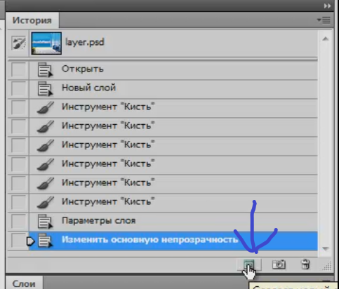

Здесь есть еще такой пункт как  создание нового файла из текущего состояния. Тоже иногда может пригодиться.
Следующая иконка позволяет создавать снимки, но на первое время не советую с ними работать потому что можете просто запутаться.
изначально  у нас есть один снимок. Он называется так как и сам файл. И все вот эти шаги относятся именно к нему. Но можно создать и новые снимки.

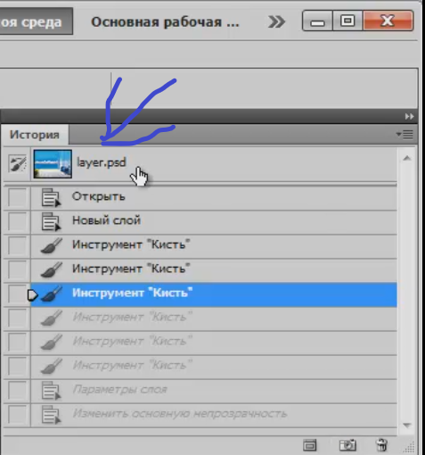

Допустим мы нарисовали оранжевое солнце и сделали снимок оранжевого солнца.

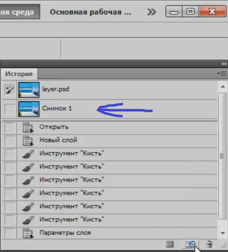

Перешли назад на laer.psd и решили нарисовать желтое солнце. Ну или возвращаемся на несколько шагов назад когда солнце еще не было нарисовано и далее рисуем желтое солнце. И после того как нарисовали делаем еще один снимок.

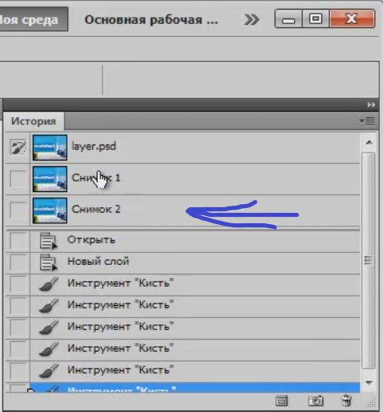

и теперь переходя по снимкам мы можем сравнивать. И допустим если из каких-то солнц нам одно понравилось больше, то остаемся на этом снимке и дальше продолжаем работать. Теперь уже все шаги пойдут с этого момента.
И третья иконка говорит сама за себя корзина.

 ****
     

# блокировка слоя
Обратите внимание на инструмент перемещения и на его галочку автовыбор рядом выберите слой или группу слоев. В принципе на первом этапе это не так важно.и смотрите теперь если я щелкаю по изображению у меня автоматически выделяется тот слой к которому относится пиксель по которому я щелкнул. Эта настройка позволяет удобно работать со слоями.
Теперь что касается блокировок. Давайте возьмем какой-нибудь слой  который у нас есть слой со стеной. И первая блокировка которая здесь есть наведите на нее курсор

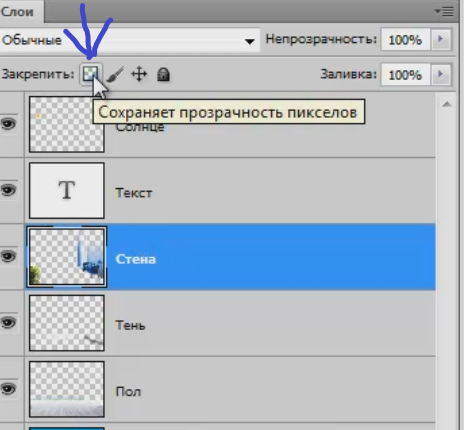

она называется сохраняет прозрачность пикселей. Т.е. это блокировка прозрачных пикселей и в чем она состоит? Если мы ставим эту блокировку то мы не сможем рисовать на прозрачных пикселах а на цветных видимых закрашивание будет происходить в отличие от прозрачных. Сразу на слое появляется такой белый значок который говорит что слой частично заблокирован т.е. какие то возможности по работе с этим слоем блокированы.
Вторая иконка(кисточка) называется сохранение цвета пикселов. Она предотвращает рисование вовсе не только по прозрачным но и по цветным пикселам.
Третий значок блокировки это значок блокировки перемещения. Бывает очень удобным в тот момент когда нужно зафиксировать слой.
И последний вариант блокировки это уже как вы догадались это полная блокировка. Здесь уже черный замок который запрещает какие либо действия.
И кроме вот этой полной блокировки есть еще так называемое блокировка фонового слоя. Если мы открое любую JPG картинку мы увидим так же белый значок

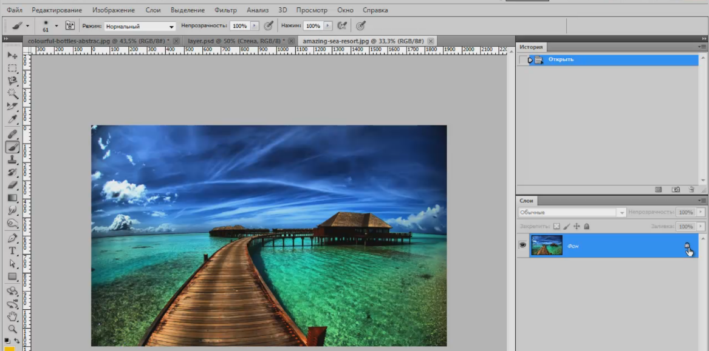

Который говорит о частичной блокировке, но обратите внимание что обычные блокировки здесь не доступны т.е. фоновый слой он идет сам по себе. Это отдельный вид слоя который имеет свои ограничения. Например одно из таких ограничений фоновый слой всегда находится внизу.
Как превратить фоновый слой в обычный? Это можно сделать очень просто щелкните вот здесь в свободном пространстве

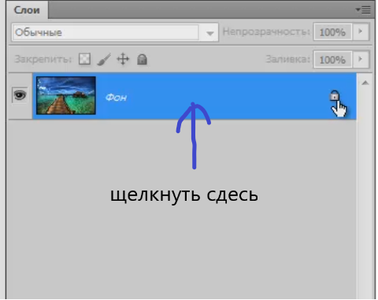
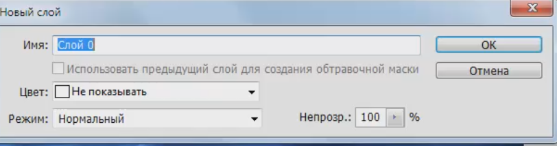

И здесь достаточно нажать ок что бы он превратился в обычный.

 ****
     
 
# операция со слоями
В этом уроке мы затронем еще четыре важных момента которые вы должны знать и первый из них это дублирование слоя. Часто бывает так что нужно продублировать какой-нибудь слой т.е. вот есть у нас например солнце понадобилось нам еще точно такое же. Что бы не создавать новый слой не рисовать такое же солнце мы можем просто взять данный слой и продублировать его.

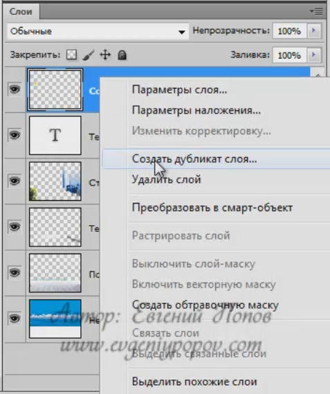

правой кнопкой мыши нажимаем на слой и выбираем Создать дубликат слоя либо тащим в самый низ палитры слоя на иконку создания нового слоя. У нас появляется иконка нового слоя чуть выше. И даже если мы выключим основной слой он все равно будет показываться. 
Но кроме того что можно дублировать слой в одном документе но так же его можно продублировать в другой документ.
Допустим открыли мы другой документ нашли нужный нам слой. Также на нем кликаем правой клавишей мыши и выбираем Создать дубликат слоя появляется вот такое окно в котором мы можем указать в какой документ мы можем продублировать данный слой.

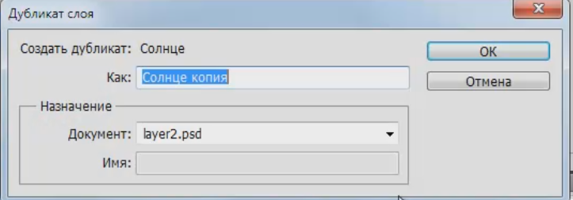

И если мы вернемся на тот документ в который продублировали слой с другого документа мы увидим в палитре слои данный слой в данном случае это солнце который только не виден. Одна загвоздка данный слой появляется на исходном месте на том на котором и стоит и по этому в другом документе оно появляется но мы его можем не увидеть. По этому мы просто в документе в том в который продублировали просто перемещаем. В нашем случае данное солнце вышло за пределы документа.
Второй момент который в этом уроке будем разбирать это группировка слоев.
Бываю такие моменты когда слои разбиты не лучшим образом. Например одни и те же цветы или как в примере многоэтажки разбиты на множество слоев. И для того что бы например отключить или включить цветы приходится отключать несколько слоев. Для таких вот моментов и существует обьединение слоев. Делается это следующим образом. Внизу политры слоев щелкаем на иконку дублирования

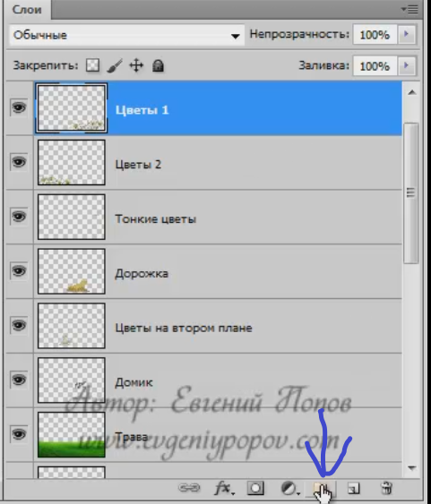

Вверху появляется папка

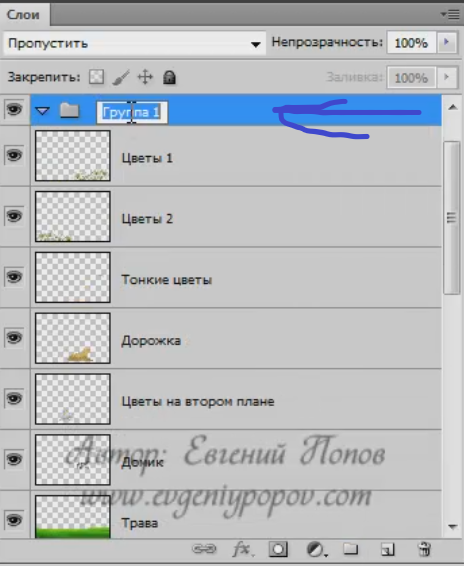

Которую мы можем назвать например цветы и переместить туда все слои связанные с цветами. Выделяем нужные слои и перетаскиваем туда. Такая группировка используется в больших проектах когда делается какой-то очень сложный шаблон. Теперь еще скажу про горячую клавишу которая помогает обьединять слои. Можно просто выделить интересующие слои и нажать комбинацию клавиш ctrl+G.И у вас автоматически появится нужная группа в которую сложены эти слои.
Следующий момент который мы должны изучить называется связывание слоев. Если обратить внимание то на некоторых слоях мы можем увидеть такие цепочки, это значок связывания. 
Допустим нужно нам передвинуть два слоя с цветами но они двигаются по одному. Выделяем нужные нам слои и внизу палитры слоем есть значок связывания

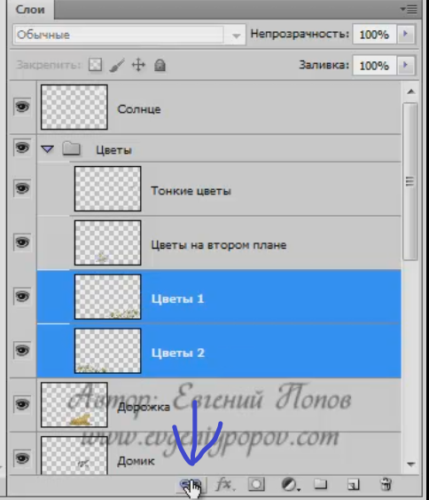

теперь два отдельных слоя позиционируются так как нам нужно.
И следующий момент о котором мы должны поговорить это слияние слоев.
Для этого мы можем выделить нужные нам слои, щелкнуть правой кнопкой мыши по ним и выбрать пункт обьединение слоев.

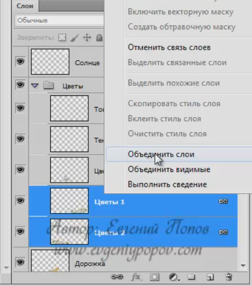

И кроме этого там еще есть дополнительные варианты обьединения это обьединения видимых слоев. И как мы можем наблюдать у нас все слои обьеденились в один видимый слой но те которые были не видимыми остались не тронутыми.
И еще один вариант это выполнить сведение. Он отличается тем что все слои обьединяються в единый фоновый слой. При чем если есть какие то скрыетые слои то нам будет предложено их удалить.

 ****
     

# маска слоя
Этот инструмент очень часто используется в работе по этому я советую отнестись к этому уроку максимально внимательно и обязательно на практике повторить то что сейчас мы будем делать. Тем более что как раз многое новички спотыкаются на этих масках хотя по сути там ничего сложного нет нужно всего лишь один раз понять смысл.
Разберем не примере давайте вот в этот наш калаш добавить в небо летающую тарелку т.е. в картинку. Для этого давайте откроем файл из дополнительных метериалов к этому уроку файл u.jpg. давайте для разнообразия не будем дублировать слой а для разнообразия сделаем расположение в сетке и перенесем его

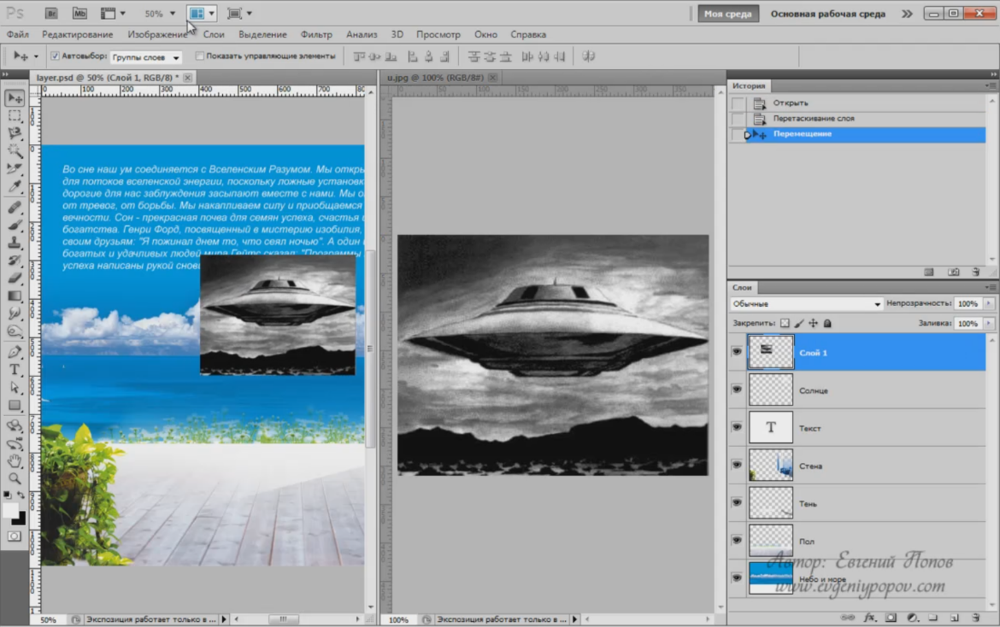

И так у нас появился слой с летающей тарелкой. Как мы видим проблема в том что у нас не только слой с летающей тарелкой а еще небо горы и т.д. и соответственно нам нужно от них как то избавится. И вот здесь есть несколько вариантов. Самый простой который приходит на ум это просто удалить не нужные участки для этого забежим немного в перед и возьмем инструмент ластик

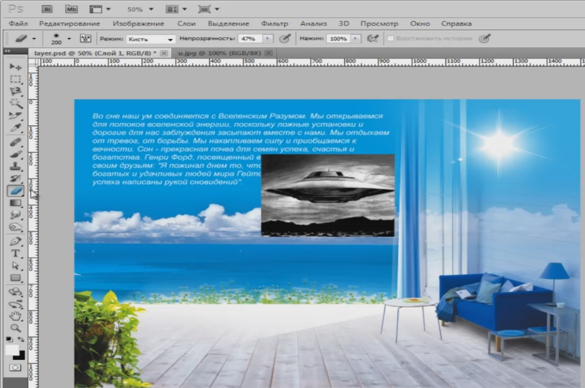

По этому мы берем и просто закрашиваем не нужные участки. Только в панели сверху поставлю непрозрачтость 100%

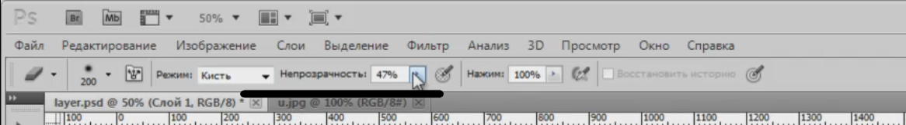
 
И вот таким образом удаляем не нужные нам области. И если я допустим лишку взял мы можем вернуться на пару шагов назад в палитре истории и доделать.
 И теперь смотрите допустим мы сохранили наш файл и открыли его на следующий день. И теперь смотрите если мы берем слой слетающей тарелкой двигаем ее и видим что вокруг нее ничего нет так как мы стерли и соответственно это уже ни как не восстановить это потеряно безвозвратно.

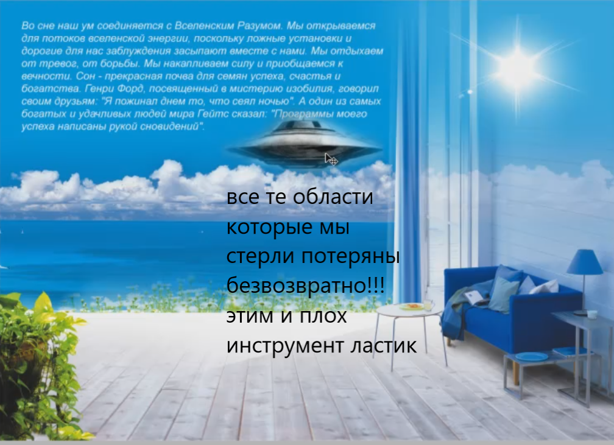

Но иногда бывают такие ситуации что нужно не удалить какие то области а просто скрыть потому что она еще может нам понадобиться. Так вот в такой ситуации когда мы не хотим удалять информацию а просто хотим ее на время скрыть можно использовать маску слоя. И теперь еще раз повторяем для примера. Удаляем этот слой с нашей картинки. Открываем картинку с тарелкой и заново дублируем слой.
Теперь мы воспользуемся маской слоя и вы увидите уже другой способ скрытия областей не удаляя ее.
Для этого переходим в палитру слои, и в ее нижней области находим кнопку маска слоя.

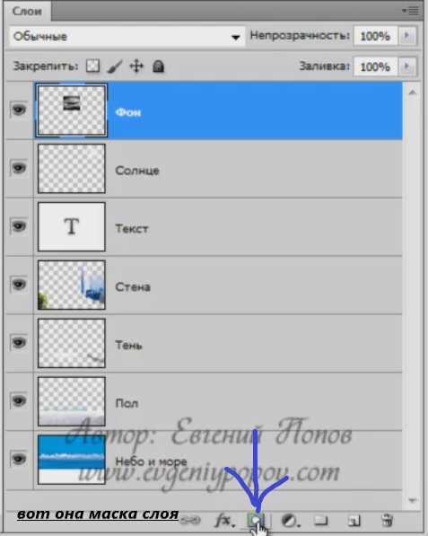

кликая на нее мы добавляем маску слою на котором стоим

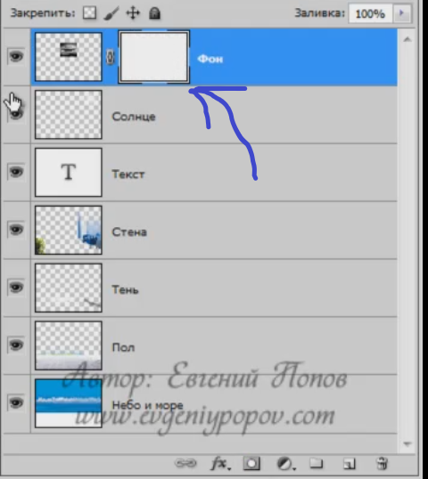

и у нас рядом со слоем появляется такая белая миниатюра. Белая означает то что мы видим весь слой полностью т.е. ели мы видим маску и она белая это означает что слой к которому эта маска относится виден полностью. Вот это запомните раз и на всегда!!!!!!

Теперь попробуем скрыть не нужные участки. Для этого нам нужно взять черную кисточку.

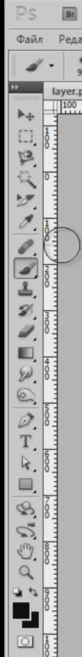

ставим внизу абсолютно  черный цвет и щелкаем на маску.

И начинаем работать на маске. И если мы начинаем рисовать черной кистью нужная нам область прячется т.е. если мы возьмем обратно белую кисточку мы спокойно можем вернуть все обратно. 
Кстати запомните вот такой момент когда вы будите работать с маской вы в основном будете работать с черным и белым цветом. И что бы быстро переключаться между белым и черным цветом можно просто нажимать клавишу X.
Ну и закончим с летающей тарелкой теперь я ее уменьшу немного при помощи сочетаний клавиш CTRL+T.

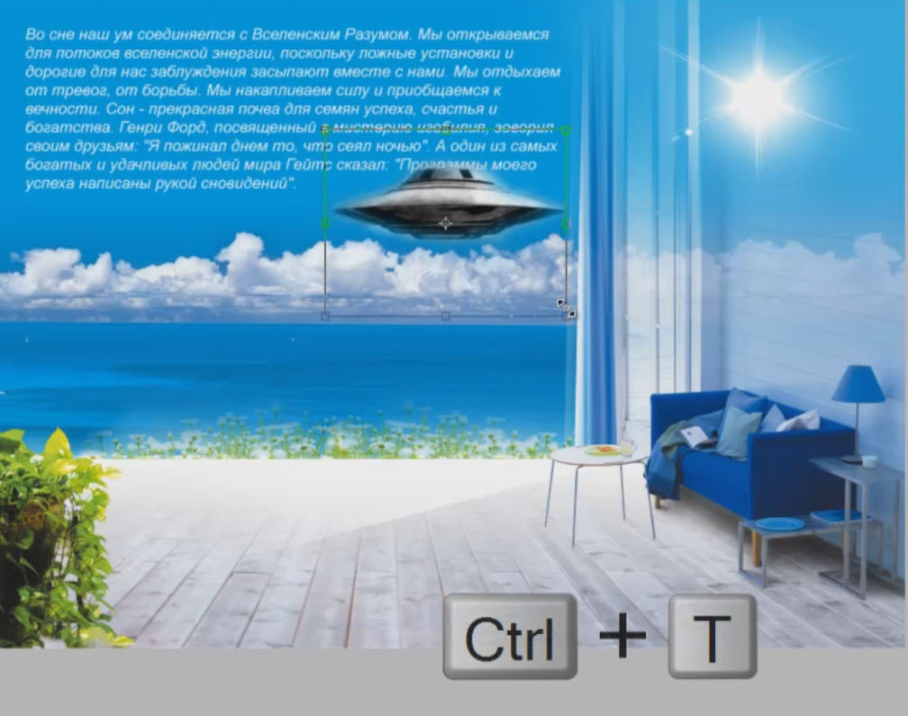

И ЩЕ ОЧЕНЬ ВАЖНЫЙ МОМЕНТ КОТОРЫЙ ВЫ ЗДЕСЬ ДОЛЖНЫ ПОНИМАТЬ ! это то что например между белым и черным цветом  у нас лежит область серого цвета к маскам это так же относится. Если мы будем рисовать по маске не черной кисточкой и не белой  а серой то соответственно мы будем скрывать част слоя только на половину. Слой будет виден но не полностью. Это что то вроде полупрозрачности. И чем соответственно серее цвет тем сильнее он скрывает тем больше прозрачность, а чем светлее серый цвет тем соответственно тем соответственно он больше открывает.вот это тоже усвойте потому что очень часто используется специальный градиент.
ГРАДИЕНТ
Для примера создаем но каком-нибудь слое новую  маску. Выбираем градиент

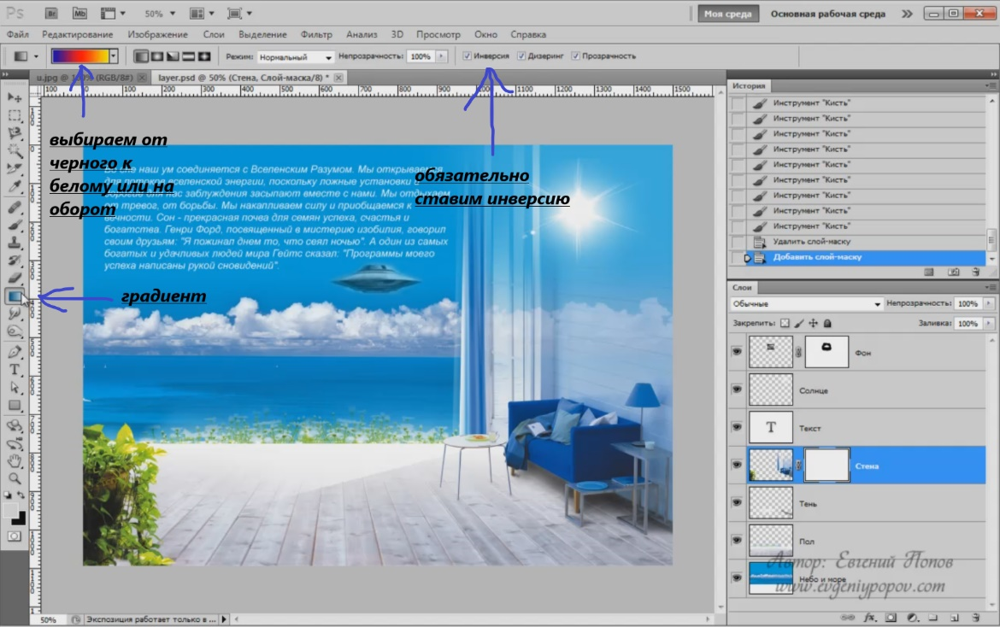

Вверху ставим галочку на инверсию и выбираем градиент от белого к черному. И соответственно при поставленном градиенте при проведении  сверху вниз у нас получится переход от белого к черному т.е. верхняя часть будет лучше видна чем нижняя. Вот этот эффект очень часто используется .

 
****
     

# режимы наложения слоев
Это тот самый выпадающий список который находится у нас в самом начале палитры слоев.

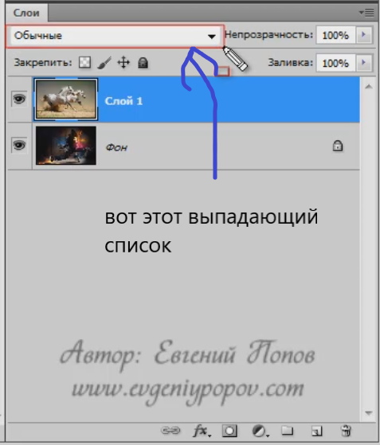

изначально у нас написано обычные. Данный параметр регулирует как слои из которых состоит изображения будут взаимодействовать между собой. Обычные это обозначает что слои ни как между собой не взаимодействуют, и мы к этому уже привыкли. Мы знаем, что если слой лежит выше, то он получается, перекрывает все ниже лежащие. Это так же как если у нас в коробке лежат 10-ть фотографий то мы видим только верхнюю 10-ю фотографию. Ниже лежащие мы уже не видим. Точно так же и здесь. При таком режиме слои не взаимодействуют.
Но в фотошопе есть режимы, позволяющие слоям взаимодействовать друг с другом по определенным формулам.
Конечно это техники используемые больше в обработке фотографий, создании каких то эффектов, и в нашей работе редко применяются, но мы должны это знать хотя бы  базовые режимы наложения. Евгений Попов и его коллеги пользуются всего лишь несколькими режимами о которых он и расскажет.
Режимы наложения это просто формулы позволяющие двум слоям взаимодействовать друг с другом. И все эти формулы зашиты в этом выпадающем списке.

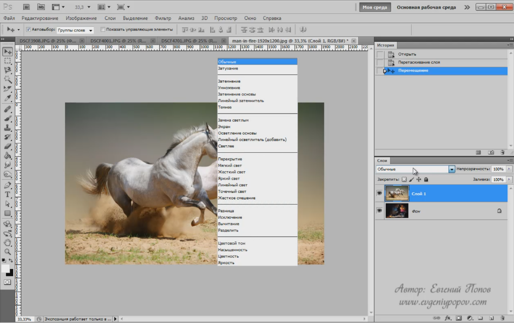

Их всего 20-ть с лишним штук, но используются из них в основном несколько. 
И смотрите допустим я выбираю режим наложения который называется умножение

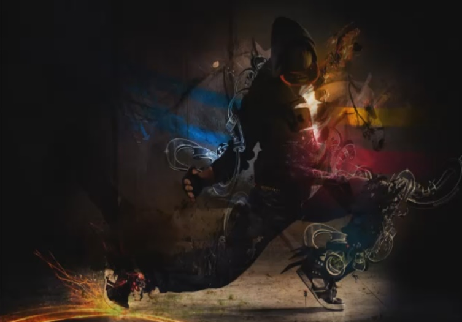

и вот смотрите. Мы видим что слои уже как то начинают взаимодействовать друг с другом и на фоне танцора у нас там проявляются лошади. И таким образом за счет таких вот наложений, смешиваний слоев по определенным формулам мы можем достигать различных эффектов. 

Сейчас мы рассмотрим три фотографии и на примере этих фотографий нам станет на много более понятно принцип работы с наложением слоев.  У всех у этих фотографий первая слишком темная

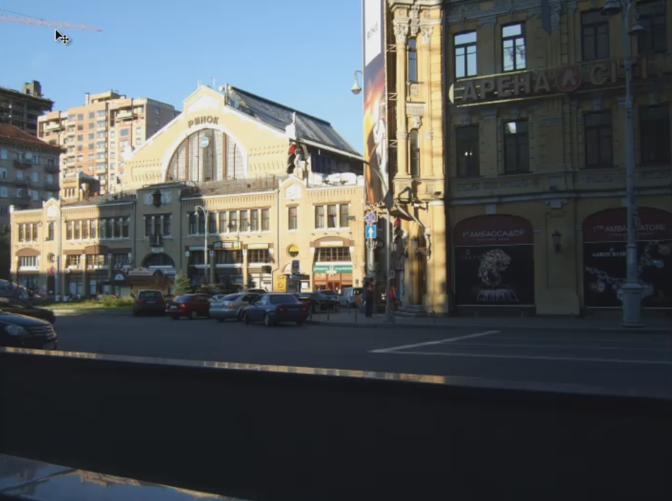

Вторая слишком светлая

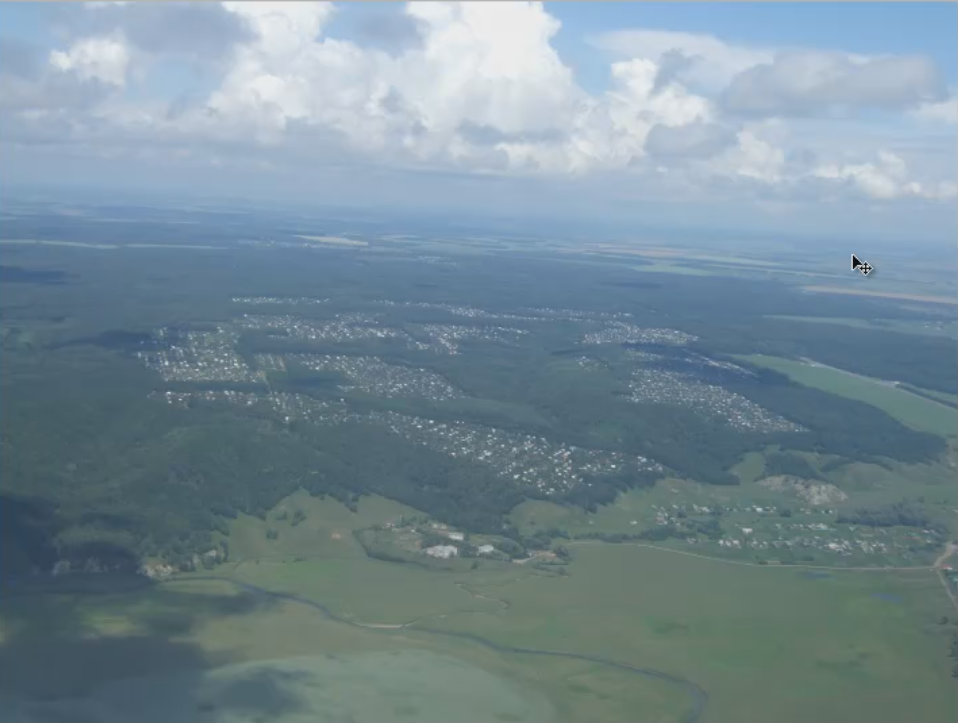

Третья слишком тусклая

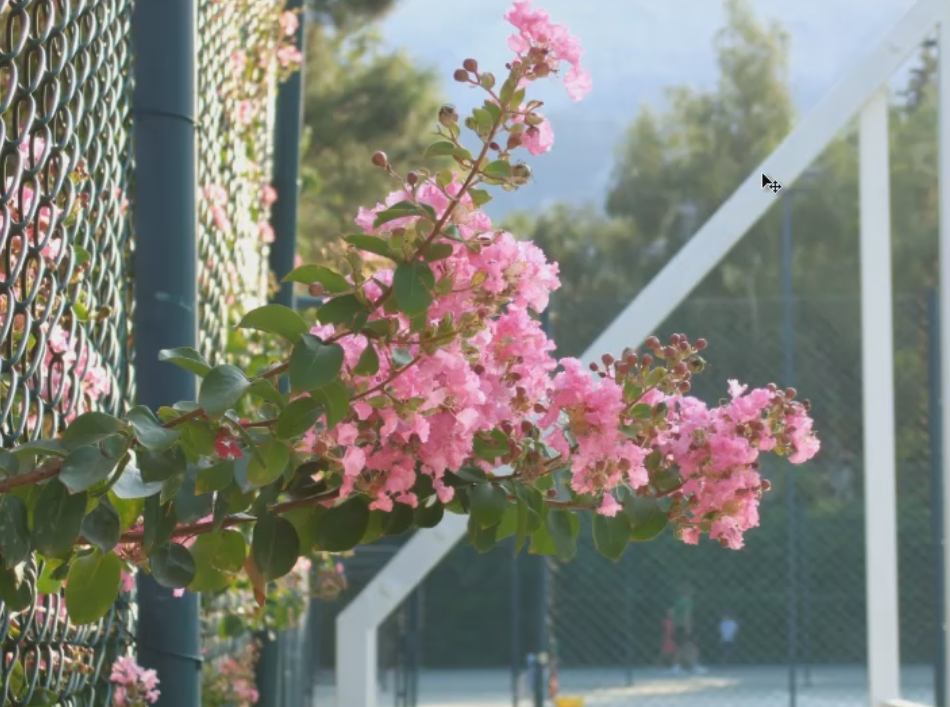

И вот сейчас мы с вами за счет режимов наложения попробуем исправить эти фотографии.
И так первая слишком темная фотография.
Для начала продублируем фоновый слой. теперь наша задача сделать так что бы наши слои взаимодействовали друг с другом по формуле которая поможет нам осветлить эту фотографию.
 Все режимы наложения делятся на группы затемняющую, осветляющую, контрастную, предпоследняя группа вычислительная. Там производятся вычисления разница она вычисляет разность пикселей и т.д.
И сейчас наша задача научится пользоваться режимом, который называется Экран. Он  относится  к осветляющим, и смотрите если мы его выбираем то мы сразу видим что фотография у нас осветлилась, но еще не  достаточно. И по тому еще раз дублируем данный слой. И у нас уже два слоя которые накладываются с режимом экран. И теперь мы видим что затемненная часть стала на много светлее но с другой стороны осветленная часть так же стала на много светлее. Но мы уже знаем что такое маска слоя  и соответственно мы на вот этих осветляющих слоях можем слишком осветленную часть просто скрыть и она у нас останется от фонового слоя. Встаем  на первый дублированный слой  создаем маску. Берем допустим кисточку не максимально черную можно где-нибудь ближе к темно серому.

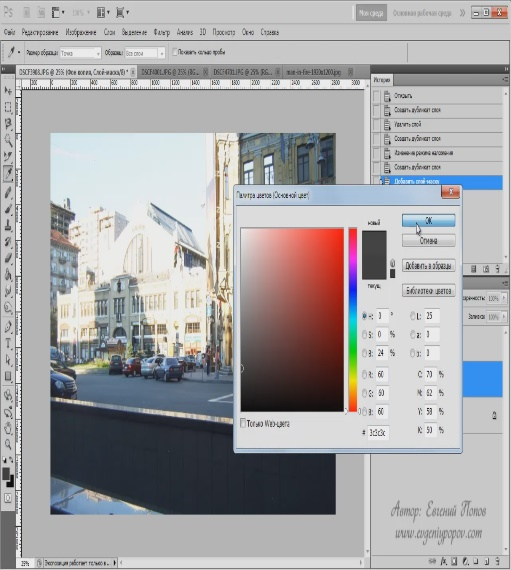

ставим по больше саму кисточку 

И та область которая стала у нас слишком светлой мы начинаем ее скрывать на вот этих осветляющих слоях. Сначала работаем на первом осветляющем слое. И затем точно так же работаем на втором. Так же создаем маску и так же потихоньку скрываем осветленный участок в том месте где нам это не нужно.
Теперь рассмотрим другой режим. Иногда фотографии наоборот получаются слишком светлыми и нужно их затемнить. В этом случае вы можете использовать режим наложения один из затемняющих. Так же дублируем слой 

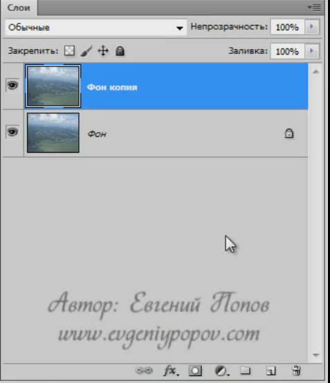

и выбираем один из затемняющих режимов. Их  здесь пять штук. И каждый из них просто в разной степени работает т.е. формулы немножко отличаются, но здесь самым популярным считается режим умножения. Если мы его выбираем то видим что фотография у нас сразу затемняется. Т.е. эти два слоя смешались, пиксель накладывается на пиксель по сути друг на друга и они смешиваются.
Если мы видим допустим что эффект слишком сильный, слишком затемнилась. Мы всегда можем нашему выделенному слою на скриншоте, которому мы дали режим умножения уменьшить не прозрачность и чем меньше не прозрачность соответственно тем меньше его воздействия на ниже лежащий.

И следующий режим это один из контрастных режимов который позволяет добавить сочности фотографии. Режим называется мягкий свет. Так же продублируем слой и скажем что он должен взаимодействовать с ниже лежащим по алгоритму мягкий свет.

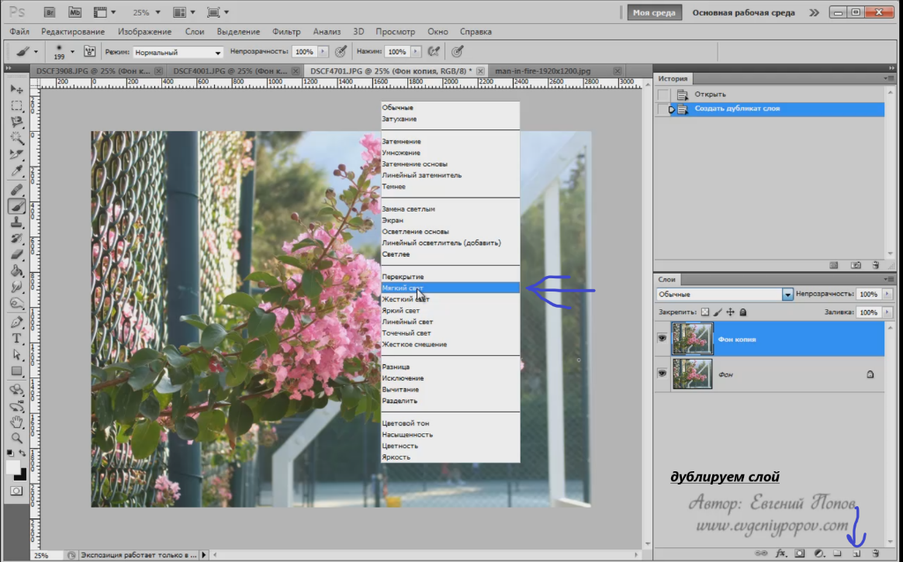

И фотография сразу же становиться такой яркой, контрастной. И опять таки если эффект слишком сильный мы всегда можем его убавить за счет непрозрачности
остальные режимы вы уже можете изучать по своим экспериментам. Для данного уровня нам этого будет вполне достаточно.

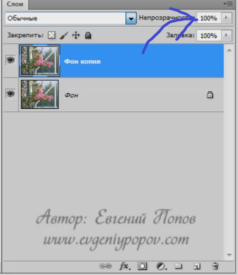
 
****
     

# введение в корректирующие слои
Они так же больше используются в фото обработке, но все равно знать, что это такое нужно и как сними работать. Тем более что там есть варианты, которые мы достаточно часто будем использовать. 
И так что такое корректирующий слой? Давайте рассмотрим на примере.

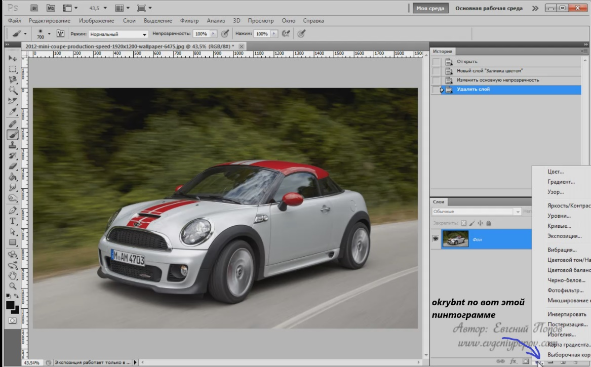

И здесь вы увидите ряд надписей которые отвечают за создание того или иного корректирующего слоя. Но самый простой пример это выберите пункт черно-белая. У нас создастся новый слой, который выглядит не обычным образом. Сразу обратите внимание у него сразу же есть маска.

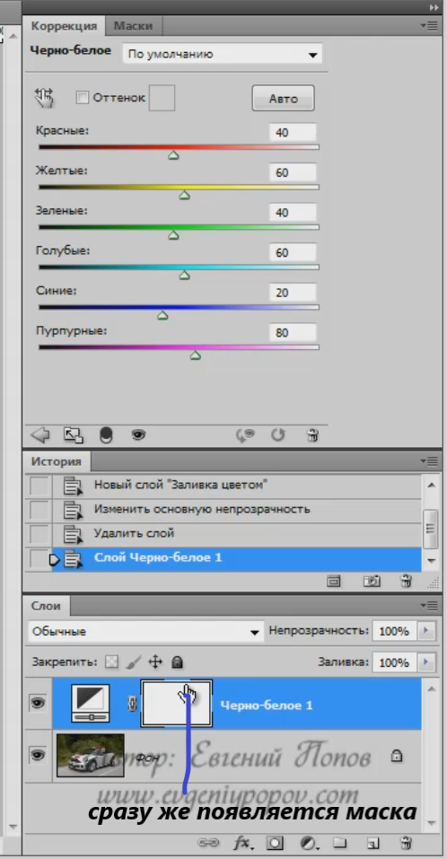

и вместе с этим слоем у нас еще открылась новая палитра которая называется коррекция, и в ней мы видим всякие ползунки. Т.е. корректирующий слой это слой команда которая каким-то образом воздействует на нижележащие слои, но не все корректирующие слои будут воздействовать это мы увидим чуть дальше. Но в данном случае  вот этот слой который называется черно-белое 1, как мы видим воздействует совершенно определенным образом, он обесцвечивает  ниже лежащий слой. 
И здесь мы можем с помощью настроек с ползунками и поиграться с этой степенью перевода в черно-белый режим.
Сейчас мы рассмотрим очень популярный прием когда все изображение черно белое а какая то его часть делается цветной.
Если мы посмотрим на исходное изображение мы сможем допустим сделать видимыми красные части машины.
Т.е. мы включаем этот корректирующий слой, встаем на маску( белое окошко рядом со слоем), и черным цветом кисточки начинаем закрашивать  те места на которые мы хотим что бы этот слой влиял на них т.е. делаем их цветными допустим это тоже  самое зеркало в примере. И начинаем потихоньку работать черным цветом на маске этого черно-белого слоя.  Как мы знаем черный скрывает у нас действие этого слоя. Если где то взяли лишка всегда можно нажать клавишу X и переключить на белую кисточку.
И здесь еще давайте затронем еще три корректирующих слоя которые уже не воздействуют на нижележащие слои, они просто позволят создавать  например

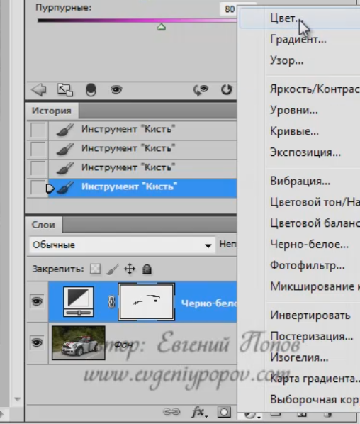

Самый первый корректирующий слой называется цвет. Он  просто создает слой полностью залитый каким то цветом  

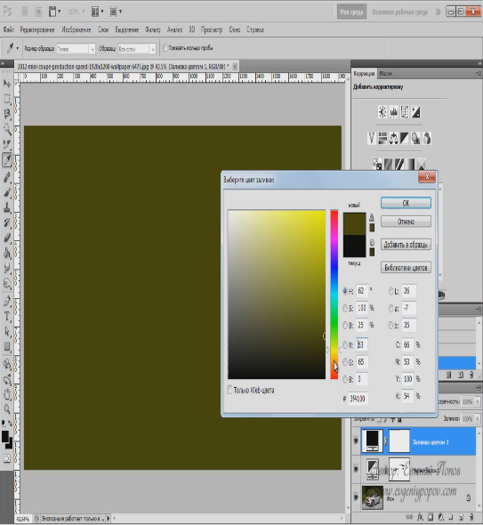

И здесь нам  разу выдается диалоговое окно где нужно выбрать цвет этого заливного цвета так скажем. Иногда такие заливные слои бывают очень полезными. Лучше создавать такие слои  с заливкой не через создать новый слой и инструмент заливка. А создавать именно через корректирующий слой.
Второй слой это градиент. Т.е. тоже самое почти

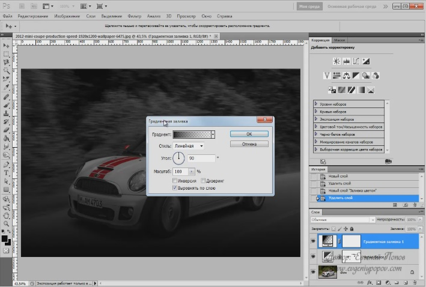

но здесь слой заливается сразу не сплошным цветом  а каким то градиентом. Причем нам так же сразу выдается диалоговое окно в котором мы можем выбрать тот градиент в который нам нужен, сразу можно востановить его угол, масштаб, инверсию сделать. Это примерно тоже самое что и первый корректирующий слой только здесь заливка происходит градиентом.

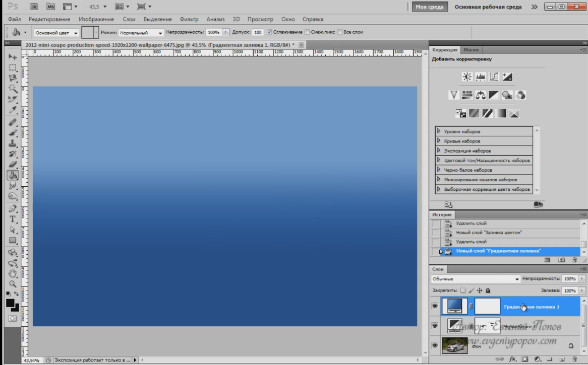

И последний корректирующий слой это корректирующий слой узор который позволяет создавать слой

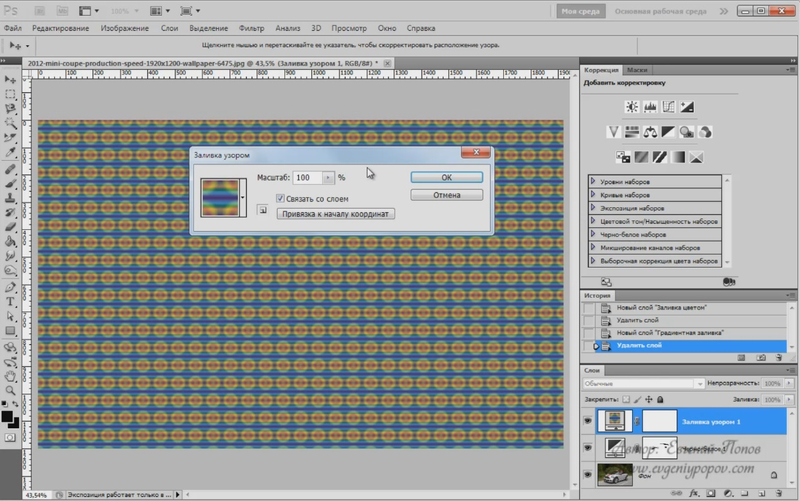

Заполняя его какой-нибудь текстурой. Если у нас в фотошопе установлены какие то текстуры то можно за счет такого корректирующего слоя создать слой заполненный текстурой. 
 
****
     

# цветовой тон насыщенность
Это очень полезный и мощный инструмент который позволяет менять цвета на изображении. И сейчас вот на разных примерах мы посмотрим как это работает. Открываем несколько изображений из дополнительных материалов.

**Начнем с медали**
У нас она бронзовая. Но у нас есть задача сделать из нее допустим красную или синюю. Причем сделать это аккуратно что бы никто даже не догадался что раньше она была другого цвета. 
Вот  как раз таки для этого используется корректирующий слой  который называется Цветовой тон/Насыщенность.

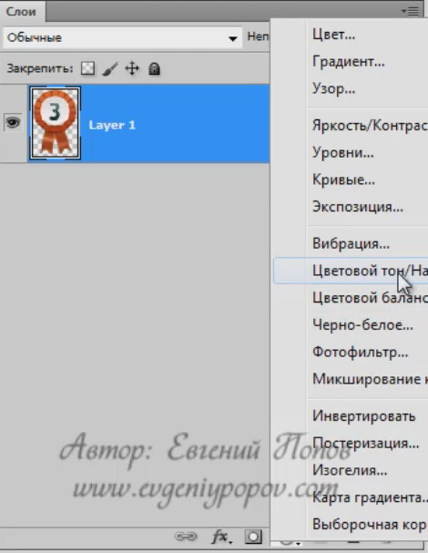
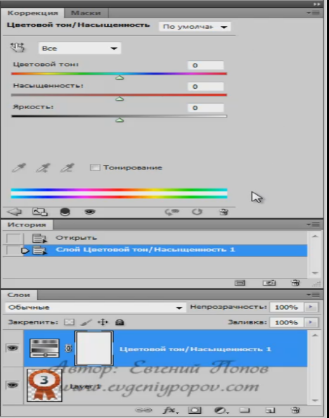

У нее сразу открывается вот такая палитра коррекции в которой сосредоточены все инструменты по работе с данным корректирующим слоем.
И здесь в принципе все достаточно просто. Первое в чем мы должны определиться это какой диапазон цветов мы хотим менять.


Выбираем красный. Здесь мы примерно выбираем.
А дальше желательно уточнить. Сразу обратите внимание на цветовой полоске снизу, когда мы выбрали красный, у нас выделился кое какой диапазон. Этим фотошоп говорит какие цвета он будет менять в случае чего. Т.е. если мы сейчас начнем воздействовать на верхний ползунок то цвета в этом цветовом диапазоне начнут меняться. И обратите внимание что там есть разделение на вертикальные линии


и в случае чего эти цвета будут меняться больше всего. А вот диапазон рядом с ним от красного немного к фиолетовому и к оранжевому и желтому будут меняться менее сильно.
**Причем здесь еще возможность уточнить вот этот диапазон. Это делается через вот эту пипетку +**


щелкаем на нужном нам месте изображения и наблюдаем на полоску. Смотрим что наш диапазон расширился сдвинулся в право в сторону оранжевого. **Пользуемся этой пипеткой всегда.**
И теперь смотрите теперь кода вы уточнили все цвета которые должны быть изменены мы начинаем двигать верхний ползунок по цветовому кругу.
**Следующий пример уже чуть более сложный, здесь очень много синего цвета.**

сложный, здесь очень много синего цвета.
И допустим если мы начинаем менять его таким же образом то у нас начинает меняться все и бутылка с бокалом и небо и т.д.
И опять здесь появляется наша любимая маска. Мы встаем на нее. 
И здесь я вам кстати покажу еще один прием который вам нужно знать когда вам нужно маску полностью превратить из белой в черную достаточно нажать комбинацию CTRL+I. Т.е. я нажимаю эту комбинацию, маска становиться полностью черной .т.е. этот верхний слой уже ни как не влияет на нижний.


**Кароче, сначала создаем цвет который нам нужен. Потом создаем черную маску которая отменяет действие слоя этого созданного цвета на ниже лежащий слой. Хотя по идее тот цвет который мы задали слою остается. Далее берем кисточку белую, становимся на черную маску и начинаем корректировать нашу бутылку  с бокалом. Ну или работаем на тех местах на которых нам нужно воздействие этого корректирующего слоя.**
И вот таким образом уже комбинацией наших знаний по слоям мы используем это корректирующий слой +маска и таким образом мы уже воздействуем на не большой участок изображения. И соответственно теперь если мы будем двигать верхний ползунок, у нас будет меняться цвет самой бутылки с бокалом.
По пипеткам если мы выбираем пипетку минус то соответственно мы исключаем данный цветовой диапазон от изменений. С ползунками насыщенность и яркость я думаю вы уже разберетесь.
И последний момент о котором я хотел вам здесь рассказать это галочка тонирование


она уже полностью тонирует все изображение. Это даже больше актуально для черно-белых изображений. При выборе данной функции у нас картинка тонируется каким-то цветом и соответственно этот тон мы можем менять.
Часто этот эффект используют что бы получить какую-нибудь фотографию в ретро стиле. 

****
     

# уровни кривые

в принципе это уже достаточно мощные инструменты по цветокоррекции фотографии и больше они конечно уже используются проффесиональными фотографами. Но мы далеко туда углубляться не будем, изучим основные моменты которые позволяют быстро восстановить цвета и вообще внешний вид фоторгафии. И для практики откройте две фотографии.

Уровни. 


Так же появляется панель коррекции. В ней имеется гистограмма расположения тонов на изображении. Слева от пипеток мы видим темные тона, а справа светлые. Соответственно если двигать ползунок темных тонов их добавляется. Если двигать правый то добавляются светлые тона. Но не в этом суть. 
Суть здесь в пипетках, слева от гистограммы, с помощью которых мы можем указать фотошопу  точку белого на нашей фотографии и точку черного и за счет этого он сможет вычеслить все остальные пиксели т.е. восстановить всю цветовую тоновою картину  на фотографии.
Берем пипетку отвечающую за белыйи если сами конкретно не видим белый цвет можем воспользоваться таким приемом. Зажимает кнопку ALT и тянем правый ползунок на гистограмме отвечающий за белый и нам сразу начнутся показываться самые светлые пиксели в нашем изображении. И тоже самое проделываем с черной пипеткой и левым ползунком гистограммы. Еще здесь есть такой вариант если мы все не можем определится  с точками черного и белого то, над гистограммой, можно воспользоваться кнопкой авто. В этом случае фотошоп сам постарается подобрать эти точки и вы получите результат иногда хороший, иногда не очень.
Это был первый момент.  
Во втором моменте затронем сразу комплекс корректирующих слоев т.е. закрепим все то что мы изучили до этого и маски, и цветовой тон насыщенность, и за одно пройдем еще один корректирующий слой который называется кривые.
Когда в изображении переизбыток какого то цвета, в уроке это красный фотография там где он с ребенком. И когда вот такая ситуация вы видите что какой-то такой моар на фотографии можно воспользоваться корректирующим слоем кривые. Это еще более продвинутый инструмент


Чем уровни. Т.е здесь можно регулировать эти тона уже в виде кривой т.е. где то добавлять, где то убавлять, делать с помощью точек различные фигуры этой кривой по данному инструменту есть отдельные книги!!!


Допустим нам нужно убрать слишком много красного то выбираем допустим красный канал.т.е. мы можем здесь работать отдельно по каналам.  Если  нужно убрать то тащим кривую вниз, если добавить то вверх.
И последний момент это краснота от куртки которая передалась на лицо. Для этого воспользуемся корректирующим слоем который мы уже изучили Цветовой фон/Насыщенность. 
Но если в тот урок в котором мы изучали данный слой мы больше работали именно с цветовым фоном меняя цвета на изображении то сейчас мы больше поработаем с насыщенностью, вторым ползунком.

и убираю до тех пор пока лицо не станет нормальным. Однако как вы заметили куртка тоже теряет насыщенность как и все изображение в целом а нам этого не нужно. И что бы этого избежать мы как обычно воспользуемся маской. Т.е. сделаем так что бы слой цветовой тон насыщенность влиял именно на лица. По этому мы  полностью закрасим данную маску черным цветом для этого можно нажать CTRL+I. А затем возьмем белую кисточку и  поводим по лицу, начнем открывать видимость данного слоя только в тех местах где нам это нужно. Но это еще только верхушка айзберга. А так если вы еще хотите расширить свои знания то у нас есть еще курс который называется фотошоп для фотографа там уже приводятся гораздо более мощные техники, больше приемов интересных.

****
     

# команды коррекции
Этим уроком мы с вами заканчиваем изучение корректирующих слоев. Хотя у нас тут еще остались не изученные моменты но как я вам сказал уже мы изучаем только то что конкретно используется на практике все остальное более редкое, специфичное,там работа с экспозицией с микшированием каналов и т.д. этим вам голову пока забивать не нужно.
Единственный момент о котором я вам хотел еще рассказать это такой момент. Смотрите допустим если мы выбираем какой-нибудь с корректирующих слоев например еще есть такой простой корректирующий слой фотофильтр. Который имитирует как бы на изображение оттенков которые можно получить с помощью таких фильтров которые надеваются на объектив  фотоаппарата.


Но не в этом суть. Суть в том что все эти корректирующие слои которые мы свами использовали они еще могут вызываться в виде команд через пункт меню изображение коррекция


**Но отличия будут в том что выбирая команду в этом пункте оно будет применяться сразу к изображению не как к отдельному слою и соответственно если мы сохраним это изображение, потом откроете заново мы уже не сможем вернуть обратно исходное состояние. А в случае с корректирующими слоями такого не произойдет. Если вы в видео уроках увидите что кто то пользуется командой коррекции через меню то смело можете это делать не через меню, а в виде корректирующего слоя в палитре слоев, что бы можно было вернуть потом исходное состояние.**

****
     

# стили слоя

и располагаются они вот здесь за вот этой кнопочкой Fx которая осталась единственной не изученной у нас из вот этой нижней строки.
Недоступна она потому что стили слоя нельзя применять к фоновому слою соответственно нам нужно из фонового превратить слой в обычный.  Можете открыть несколько изображений так как мы будем учится копировать стиль слоя из одного изображения в другое.
 И щелчком левой кнопки мыши по синему фону слоя превращаем его в обычный, щелкаем и нажимаем ок.
Щелкаем по этой иконке Fx и у нас вниз выпадает список. Выбираем обводка.


здесь мы не будем изучать все стили слоя не будем сильно вдаваться в эти подробности потому что лучше все это изучать на практике и стили слоя больше используются с различными фигурами которые мы пока не прошли. 
Здесь мы просто познакомимся со стилями слоя, что это такое, как копировать стиль, как их отключать и т.д.
Итак если вы выбрали обводка то на изображении вы пока ни каких изменений не увидите. Потому что обводка у нас стоит в положении снаружи, а с наружи у нас ее просто некуда добавлять потому что изображение занимает все пространство по этому мы переменим положение не внутри. И  мы сразу видим результат. Размер у нас обводки 6 пикселей и цвет стоит черный, режим наложения нормальный, не прозрачность 100%.
Давайте попробуем за счет обводки сделать нечто подобное рамки. Выберете в типе обводки градиент. Внизу мы можем выбрать угол градиента.
Можно добавить следующий стиль это тиснение. Он позволяет добавить обьем нашему слою.
Еще нам здесь очень важно изучить параметр заливка.


Так вот если у нас не прозрачность влияет на весь слой. Если же я уменьшаю заливку то у меня уменьшается только в изображении а все эффекты остаются такими же.

И еще один важный момент который следует знать это то что стили слоя можно копировать из одного слоя в другой.
Выбираем пункт в меню слои здесь есть пункт стиль слоя и там выбираем скопировать стиль слоя.


И далее идем в то изображение в которое хотим вставить и выбираем Слои Стиль слоя и вклеить стиль слоя.


 
****
     

# обтравочная маска
И так мы добрались с вами до последнего урока посвященным слоям. Он будет посвящен такой теме как обтравочная маска. Но не пугайтесь данного названия, если разобрались с обычными масками то здесь проблем не будет.
Откройте три картинки


Продублируйте слой с медалью


И скажите что он нам нужен вот в этом документе.


Но мы хотим перекрасить данную медаль и сделать ее не такой бронзово-оранжевой а допустим фиолетово-розовой. 
Соответственно мы как обычно добавляем корректирующий слой Цветовой тон/Насыщенность. Указываем что базовый цвет у нас будет красный. Через пипетку + добавляем к нему оранжевый и приближенные к нему цвета. И начинаем двигать верхний ползунок. 
Но как вы и заметили данный корректирующий слой повлиял у нас еще и на фоновый слой, т.е. цветовая гамма поменялась не только на медали но и на фоновом слое с танцором. Нам же это совершенно не нужно, нам нужно чтобы корректирующий слой перекрашивал только медаль. Частично мы уже знаем выход из этой ситуации. Мы можем взять встать на маску данного корректирующего слоя


Далее взять черную кисточку  и закрашивать те места где мы  не хотим влияние данного корректирующего слоя.
Либо инвертировать маску и на оборот белой кисточкой пройтись по медали.
 Но это как вы понимаете не так уж быстро и в каких то сложных формах придется долго поработать кисточкой что бы все идеально получилось.
На самом деле в фотошопе есть более специализированный инструмент для такой задачи который называется обтравочная маска. И  он позволяет сделать так что бы корректирующий слой влиял на медаль точно в пиксель в пиксель прям идеально и он будет затрагивать только медаль. 
И смотрите как это делается. Мы просто подносим курсор мыши между этими двумя слоями  и нажимаете клавишу ALT.  У нас появляется вот такой значок.


который говорит что можно создать обтравочную маску и что вот этот верхний слой будет виден только в пределах нижнего.
И что мы видим, у нас верхний слой начинает влиять только на медаль, а фон остался таким как и был. Вот этот смысл этой обтравочной маски. Она экономит время. Нам не нужно самим возится с обычной маской и что то там кисточкой прям идеально выделять. Мы просто ставим корректирующий слой чуть выше того, сразу точнее за тем на который он должен влиять и делаем обтравочную маску. 
 Второй способ ее создания это просто щелкнуть правой кнопкой мыши по данному слою и выбрать пункт создать обтравочную маску.


и у этого слоя сразу появляется стрелочка которая показывает что она влияет только на нижний слой который находится под ним. По этому не в коем случае, если мы хотим что бы он не влиял на фоновый слой, фоновый слой должен стоять последним.

И что бы закрепить работу с обтравочной маской давайте сделаем еще один момент. Создаем новый документ размерами на пример 800 на 600 и возьмите инструмент текст и каким-нибудь штифтом, любым цветом.


И теперь сюда же в этот документ скопируем изображение с банками. Через правую кнопку мыши по слою с банками создаем дубликат и помещаем его в этот новый документ.


Он у нас появляется сразу над слоем с обтравочной маской и показывается в реальных пикселях. Мы его пока отключаем по глазу. И теперь смотрите что мы сделаем. Мы сделаем так что бы у нас вот этот слой с этими банками у нас проявлялся только в рамках вот этого текста.


Мы просто включаем слой с банками, наводим в пространство между слоями нажимаем клавишу ALT и левую кнопку мыши. И теперь смотрите. 


У нас данный слой проявляется только в рамках нижележащего слоя который у нас является текстовым. По тому что текст является для него по сути маской.

****
     

# выделение
И так мы с вами переходим к другой обьемной теме которую одним общим словом можно назвать выделение. И первый такой инструмент называется у нас прямоугольная область он скрывается у нас сразу за стрелкой.


И допустим у нас есть задача сделать в этой комнате не четыре картины а шесть. Мы встаем на фоновый слой и с помощью инструмента прямоугольная область, проследите что бы стиль у вас стоял обычный, мы выделяем два окошка и идем в обычное меню Редактирование Скопировать и потом Редактирование Вставить (CTRL +С CTRL +V.)
У нас сразу образуется новый слой с этими двумя скопированными окошками.
Далее берем инструмент перемещения и нажимаем на клавиатуре левую стрелку то мы видим что у нас на отдельном слое теперь есть два окошка.
**Теперь поговорим о тех параметрах которых данный инструмент имеет.**


И первые параметры это вот эти четыре кнопки. Первый значок это обычный режим в котором мы работаем.
Второй режим это Добавление к выделенной области. Это значит если вы что то выдели ли за тем начинаете еще раз выделять то у вас получается единое выделение на одном слое.
Следующий режим наоборот вычетание. И  последний вариант это пересечение оставляет только ту область в которой произошло пересечение.
**Следующий параметр это растушевка (смягчает края выделенной области).** 
При обычном выделении и перемещении он у нас это делает жестко, по краям видны стыки. Для того что бы оно было четкое и ровное применяется этот инструмент. Радиус растушевки ставим примерно 10 пикселей.
**Следующий параметр это Стиль.** Стиль позволяет нам менять соотношение сторон определенным образом. Т.е. изначально мы можем выделять ка угодно. В стиле мы можем задать пропорции выделения. Если мы допустим хотим сделать выделение допустим 10 на 15 что бы потом распечатать в виде фотографии. То  мы можем поставить что бы ширина допустим должна быть 10 а высота 15. И вот теперь как бы мы не водили у нас всегда пропорции будут соблюдаться.
И иногда нужно выделить какой то конкретный блок, это на практике очень часто используется, для этого используем стиль Задать размер. Он у нас сразу выдает значение в пикселях. Задаем размеры и потом просто кликаем левой кнопкой мыши и нам сразу выдается выделение заданных размеров.
 А теперь поговорим про остальные инструменты этой группы.
**Это инструмент овальная область.** Для перетаскивания выделения мы можем зажать пробел и перетащить в нужную нам область.
 **И последние инструменты этой группы это горизонтальная строка и вертикальная строка (чаще используется в однопиксельном выделении).**
 
****
     

 # лассо
 Следующая наша цель научиться делать не стандартные выделения. Для этого первым инструментом из этой группы мы будем изучать лассо. Здесь на самом деле три вида лассо просто лассо, прямолинейное лассо и магнитное лассо. 
Начнем с первого. Это инструмент позволяющий делать выделение любой формы.так же этот инструмент может работать в тех же режимах как и прямоугольная выделенная область.


Добавление, вычетание и пересечение и так же есть растушевка + параметр сглаживание.
Если  выбираем инструмент прямолинейное лассо, оно уже позволяет более точно выделить обьект и спомощью него можно более точно выделить например вот этот стул. Этот инструмент уэе работает по точкам.


и еще один момент допустим вы не там поставили точку мы можем вернуться назад нажав клавишу Backspase. 
Но не достаток данного инструмента в том что если мы нажимаем Esc то все выделение теряется. Но данный инструмент используется для сложных выделений не так часто и через пару уроков вы поймете почему. Просто потому что есть более удобные инструменты.
И инструмент магнитное лассо он позволяет нам выделять в более менее автоматизированном режиме и он пытается сам определить область которую нужно выделить и основывается он на контрасте. Где нет четкой границы и он не знает куда поставить точку то в этом случае мы можем поставить точку  самостоятельно. А вот эти параметры как вы уже догадались


Первый за ширину зоны контрастности, степень этой контрастности, и третий частота точек которые он будет ставить.

 
****
     

# расскройка
Этот инструмент находится сразу за рамкой кадрирования и предназначен для нарезки изображения на несколько кусков. В основном это используется в вэб-дизайне потому что фотошоп сразу позволяет сохранить такое нарезанное изображение сразу в html виде т.е. на выходе вы получите html страницу где большое изображение будет уже собрано во едино из многих кусочков т.е. это оптимизирует время загрузки больших изображений. Причем на определенные места мы можем сразу поставить ссылки. Сейчас мы все это дело изучим на примере. Вот у нас есть шаблон


Естественно весь шаблон нарезать мы не будем. Потому что это будет долго. Понятно это будет на не большой части шаблона. Мы возьмем только верхнюю часть с логотипом, с большим изображением и навигацией. 
В итоге мы получим  html страницу где пункты навигации будут ссылками и навигация и логотип сохранены в разных форматах, потом это все воедино соединено в html страницу с помощью только лишь фотошопа т.е. ни капли html кода мы с вами писать не будем.

Давайте возьмем с вами ту часть шаблона с которой будем работать. Для этого берем рамку кадрирования и оставляем только верхнюю часть.

 

 Приближаем и начинаем нарезку. Сразу смотрим как выгоднее нарезать данное изображение. Я вижу сразу один единственный вариант вот эту большую часть с девушкой оставить в одном блоке, логотип в одном блоке, белую часть от логотипа до навигации в отдельном блоке, и каждый пункт навигации в отдельном блоке.
 По этому берем инструмент Раскройку и начинаем нарезать. Сначала можно сразу отделить вот этот большой блок с девушкой. Можно даже брать с запасом выходя за пределы, ничего страшного он все равно станет точно по контуру.


И теперь нужно аккуратно продолжить нашу нарезку. Следующий фрагмент получается логотип. Выделяем аккуратно, не заходя на тот нижний элемент который уже вырезали. Обращай внимание на контуры нарезки, при соприкосновении контуров в точке нарезки контур меняет свой цвет. 
**Следующая часть это у нас навигация.** Каждый блок отдельно выделяем в отдельное изображение. При чем как вы уже догадались не достающие блоки добавляются у нас автоматически.

Теперь допустим вам не нравиться что один фрагмент слишком широкий получился и вы хотите его уменьшить то можно здесь еще воспользоваться последним инструментом который позволяет выделить фрагмент т.е. с помощью него вы можете любой фрагмент выделить и потом доработать.


Следующая наша цель добавить пунктам навигации сопоставить их с ссылками это можно сделать сразу здесь щелкнув по элементу два раза и прописать URL 

Либо мы можем сделать это уже при сохранении. Там это можно сделать немножко по удобнее. По-этому здесь мы просто определяемся с теми фрагментами которые у нас будут, нарезаем так как нам нужно. И теперь в пункте **Файл** выбираем **Сохранить для Web и устройств (Alt+Shift+S).**

 

 Сразу загружается пред просмотр где мы можем по каждому кусочку с помощью инструмента выделить фрагмент ходить и выбирать для фрагмента тот формат в котором лучше всего его сохранить. Девушку на картинке сохраняем только в JPEG. Элемент с логотипом лучше всего сохранить GIF сразу видна коласальная разница в размере. Белый блок так же лучше сохранять в gif и все куски области навигации так же лучше сохранить в gif. Мы сэкономили 50 килобайт только за счет разно форматного сохранения. Теперь в принципе все, нажимаем сохранить и выбираем формат в котором мы будем сохранять. 
**Если нам нужны эти просто нарезанные картинки по раздельности то здесь формат можно выбрать Только изображения.**


Если же нам нужен такой вариант когда уже есть готовая html страница с html кодом который все это соединяет воедино то выбираем в формате HTML и изображения.


И второй способ создания ссылок. В пред просмотре кликаем два раза по нужной нам области и в url вводим адрес. В пункте цель если нужно сделать что бы открывался в новом окне выбрать blank. И в ALT можем ввести альтернативный текст если человек заходит на сайт с отключенными картинками. И с остальными блоками соответственно мы можем сделать тоже самое.

 
 

****
     

 # пипетка и линейка комментарии
 25 пипетка и линейка, комментарии
В этом уроке мы свами переходим к группе инструментов которые находятся после раскройки это пипетка, линейка и комментарии.


Пипетка очень простой инструмент. В меню размер образца поставьте точка.


Он позволяет определить цвет под курсором и поставить его в качестве вот этого основного цвета.


вот мы щелкаем по зеленой горе и основной цвет становится зеленым.
Единственная настройка которая здесь важна это от куда он берет этот цвет, **Пункт Размер образца**, либо просто под точкой (точнее в том месте куда мы кликнули этот пиксель он и берет), либо он берет среднее из какого то квадрата.
Что касается вот этой настройки Активный слой или Все слои


То это очень легко понять на примере. Сейчас у нас есть один единственный слой по этому мы особой разницы не почувствуем. Но если мы этот слой разделим на два. Сначала из фонового создадим из него обычный слой. Затем с помощью инструмента Прямоугольное выделение выделим половину картинки и вырежем ее через Ctrl +X 


И вставим на новый слой. Подвинем  как и было.


Т.е. теперь у нас изображение состоит из двух слоев. И смотрите встаем на активный слой (первый) щелкаем на пипетку и выбираем цвета на этом активном слое. Цвета выбираются. Если же выбираем цвета не на активном слое этого не происходит.
При выборе Группа слоев у нас все получается на обоих слоях.
**Следующая настройка это кольцо пробы.**


И при щелканье мы наблюдаем выбор нашего цвета. Сверху у нас показывается тот цвет который у нас получится если мы отпустим мышь. Снизу у нас показывается тот цвет который у нас установлен в качестве основного.
***Линейка***. Это очень актуально для вэб-дизайна при верстке сайта когда нужно узнать размер того или иного блока. Если мы выделили не ровно какой то участок, он будет показывать, в меню сверху, что мы отклонились на столько то нрадусов. Если четко идеально то у нас должен быть ноль.
**Но кроме этого данный инструмент позволяет выравнивать горизонт да же быстрее чем через рамку кадрирования.**


Это делается через вот эту кнопку **выпрямить**. Для этого проводим линию по горизонту который нужно выпрямить и нажимаем эту кнопку. Он автоматически все сделает сам и вы получите фотографию с прямым горизонтом.
**Следующий инструмент это комментарии.** Допустим вам дизайнер прислал то что вы ему заказали шаблон сайта или еще что то, но вас какие то моменты не устроили. Мы можем открыть этот дизайн в фотошопе. Взять инструмент комментарии и в тех местах которые нас не устроили просто щелкаете, появляется окошко и пишем наш  коммент.


****
      

 # восстанавливающая кисть точечная восстанавливающая кисть заплатка красные глаза

Интересный инструмент. Очень часто он используется для ретуши кожи, но не только в этой области можно его использовать. Сейчас мы рассмотрим на примере как с ним работать.


Смотрите у него здесь есть ранка от которой мы сейчас будем избавляться как раз таки за счет инструмента восстанавливающая кисть. Он позволяет клонировать какой то участок слоя и переместить его в другое место при чем таким образом что он там будет вписан максимально идеально. Приближаем участок с той раной, берем инструмент восстанавливающая кисть и увеличиваем его до размера этой раны.


И далее несем курсор на проблемный участок. Мы сразу будем видеть что у нас в итоге получится и нажимаем левой кнопкой мыши. В итоге у нас происходит идеальная подгонка образца к конечному блоку. Таким образом мы можем избавиться от таких мелких дефектов.
**И еще один совет. Если вы хотите данный инструмент хорошо закрепить на практике то можете выполнить вот этот вот урок который есть у нас на сайте фотошоп мастер. Ру.**


**Теперь рассмотрим, чем отличается инструмент точечная восстанавливающая кисть?** Здесь уже смысл в том что нам уже не нужно указывать образец а программа будет сама пытаться определить близ лежащие как бы участки во круг проблемного и будет сама пытаться взять нормальный образец.

 

Иногда это работает, иногда нет. Все же старайтесь самому указывать источник. 
Следующий инструмент в этой группе называется Заплатка. Он очень похож на восстанавливающую кисть, только здесь немножко интересней сделан принцип отбора образца. 

 

 И допустим мы хотим сделать 477 т.е. нам нужно 7 продублировать. Инструментом Заплатка мы можем аккуратно указать контуры этой семерки.

 

 При чем у заплатки есть такой момент, мы можем указывать куда мы хотим вставить эту семерку. В настройках инструмента нужно поставить вместо **Назначение**, пункт **Источник.**

  

  И тогда мы сначала указываем то место куда мы хотим вставить


 А за тем уже это место тащим на семерку.

 

 **И последний инструмент из этой группы он называется красные глаза.** Ставим в настройках размер зрачка примерно но 50% и величину затемнения на 20%. И затем просто указываем, выделяем, то место где зрачок. У нас программа сама определяет его красную часть и ее затемняет.

****
     

# штамп 
Сразу к примеру. С помощью восстанавливающей кисти делаем копию плафона. Далее, что бы увидеть отличия берем инструмент штамп, он работает по тому же принципу, мы берем образец и щелкаем по тому же месту куда нужно вставить копию. И смотрите на результат.


И вот как он был на светлом фоне так он и скопировался. А восстанавливающая кисть все же пытается подогнать ваш клон под то место в которое он вставляется. Вот в этом их главное отличие. Но и + в штампе есть настройки Непрозрачности т.е. вы в штампе можете задавать настройки Непрозрачности и Нажим, а у Восстанавливающей кисти таких настроек нет. 
В качестве закрепления данного инструмента вы можете так же открыть сайт фотошоп мастер ру. И там в разделе учебник фотошопа найдите урок про фотошоп штамп и посмотрите что делается с помощью данного инструмента. В кадр здесь попала девушка с боку


 И в итоге за счет инструмента штамп от нее удалось ибавится. Т.е. все эти участки которые есть рядом с девушкой они постоянно дублировались и в итоге от нее удалось избавиться. 

****
     

 # осветлитель затемнитель губка
 
Осветлитель. Данный инструмент позволяет осветлить часть изображения. Посмотрим на примере осветления радужки глаз и зубов.


Здесь он может работать в трех диапазонах. Если мы ставим Подсветка то он будет воздействовать только на светлые участки. Экспонирование это сила воздействия. Экспонирование сильно много ставить не надо потому что работать нужно очень деликатно. Начинаем водить по интересующей на области. При чем лучше всего делать это на отдельном слое что бы мы могли потом отрегулировать непрозрачность. Сильно осветлением увлекаться не стоит. Если эффект получается не естественным с помощью не прозрачности мы всегда можем откорректировать этот момент.
При чем если нам нужно на оборот осветлить темные участки то в Диапазоне нужно ставить Тени. Если какие то средние участки не светлые и не темные то ставьте Средние тона.
Следующий инструмент который у нас здесь идет это затемнитель. Это обратный инструмент осветлителю. Здесь все тоже самое т.е. он работает по обратному принципу.
 И последний инструмент в этой группе это губка. Который позволяет повышать или понижать насыщенность в каких то участках нашего слоя.
И вот на примере. На  свиторе есть зеленая полоска и мы хотим ее осветлить.


И так же водим по интересующей нас области.

****
     

# размытие и резкость и палец
**Размытие.** В открытом изображении мы видим футболистов которых мы видим одинаково четко. Они все у нас в фокусе находятся и все нормально видны. Но иногда бывает ситуация когда нужно размыть или фон, или какой то передний план что бы выделить того или иного участника.


И размываем фон. Если же эффект слишком сильный мы всегда можем исправить его за счет Непрозрачности.


**Резкость.** Это обратный инструмент размытию. Когда на оборот мы хотим вернуть резкость какой то части картинки можно аккуратно пользоваться вот этим инструментом.


Здесь сильно большую интенсивность можно не ставить.
 И третий инструмент в этой группе это инструмент Палец этот инструмент используется если нам нужно какой то обьект замылить.                   

 ****
     

 #  кисть

  В этом уроке мы с вами более подробно рассмотрим инструмент кисть. Нам нужно более подробно изучить данный инструмент потому что на его основе работают другие инструменты. Как вы заметили  когда мы например пользовались инструментом Размытие или Восстанавливающая кисть или Штамп все время была у нас работа кисточкой. И по этому можно сказать это базовый инструмент и работать с ним нужно уметь. И в первую очередь нужно уметь работать с жесткостью кисти.
Как мы видим при максимальной жесткости края максимально четкие, границы не расплывчаты.  Если мы берем жесткость 0% мы наблюдаем обратную картину, края максимально размыты.

 

 По-этому это имейте ввиду. Когда вам нужно работать очень четко, например вы выделяете какую то границу где ни один пиксель не должен уйти, то нужно работать жесткой кистью. Если же вы наоборот делаете какую то ретушь кожи  где все должно быть очень плавно без резких переходов, то в этом случае нужно использовать более мягкую кисть.
Теперь поговорим про форму кисти.


до этого мы работали вот с такой круглой кистью. Но на самом деле форма кисти может быть практически любой.
Он выбрал кисточку и просто провел… образовалось много звездочек. От чего это зависит?
А зависит это от настройки.


Она открывает дополнительные настройки.


И смотрите здесь стоит дополнительное рассеивание.
И сейчас самые интересные настройки мы рассмотрим.
1.	Это динамика формы. Если  вы хотите что бы при рисовании размер звездочек постоянно менялся то можно поставить эту настройку.
2.	Рассеивание. Название говорит само за себя.
3.	Динамика цвета. Если поставить эту настройку то можно получить разброс цветов. В данном примере разноцветные звездочки. При выставке колебания цветового тона чем больше процентов тем больше разброс цвета. И еще масса других настроек.
Но это еще пол дела. Это те формы которые установлены здесь изначально. На самом деле в интернете мы можем найти миллионы кисточек которые можно дополнительно добавить в фотошоп. Например на сайта фотошом мастер .ру. дальше несет бред с которым и сам разберусь. 

****
     

#  ластик
 В принципе инструмент простой но кое какие особенности здесь есть.

   

 кроме того что здесь есть просто ластик мы еще имеем **Фоновый** и **Волшебный ластик.**
**Простой ластик.** Здесь он изначально работает в режиме кисточки.

 
 

 Первую особенность которую вы должны учитывать при работе с ластиком что он по разному работает с фоновым слоем и с обычным слоем. Для примера дублируем фоновый слой. Теперь у нас есть фоновый и обычный слой.

 

 Теперь пример с обычным слоем.

 
 
 это первая особенность которую мы должны усвоить. На фоновом слое ластик работает по другому.
Но в некоторых случаях работать на фоновом слое даже лучше.  Например если мы хотим сделать космическую часть, то мы можем по сути закрасить 
космонавтов в черный цвет. Те. поставить в качестве фонового черный и закрасить.
Теперь нам остается взять например **инструмент Заплатка с включенной настройкой Назначение** в панели меню инструмента который означает что я могу взять любую область и перенести на целевой участок.


Давайте разберем сразу остальные режимы.
Давайте разберем сразу остальные режимы.
режим **Карандаш**. Он отличается только тем что здесь нельзя регулировать жесткость. И даже если мы будем пытаться уменьшить жесткость у нас все равно она будет задана на 100%.

**И режим Блок** полезен тогда когда нам нужно удалить четко какие то прямоугольные обьекты. И нельзя менять ни жесткость, ни размер, ни прозрачность.

**Фоновый ластик**. Им мы будем работать на изображении с лошадьми. **Данный  инструмент больше предназначен для отделения обьектов от фона.** И смотрите как он работает. По центру данного инструмента мы видим крестик и смысл здесь вот в чем.


половина инструмента заходит на лошадь. Половина находится на фоне. Но самое главное крестик находится на фоне. И если щелкнуть левой кнопкой мыши фотошоп в первую очередь анализирует пиксель который рассположен под крестиком. И с Допуском который находится в меню инструмента начинает удалять пиксели такого же типа. Вот таким образом очень легко отделять обьект от фона.
 


Это мы работали в первом режиме для данного инструмента который называется **Проба берется не прерывно.** Это значит что когда я веду курсор, в каждый момент берется новая.
Если мы работаем во втором режиме то здесь проба берется один раз и дальше удаляются все пиксели одного цвета. 
 И третий вариант удаляет пиксели которые установлены в качестве фонового. 	
Волшебный ластик. Это по сути аналог волшебной палочки. Если вы помните инструмент волшебная палочка при кликанье на обьект выделяет все смежные одинаковые пиксели тем самым за один клик у нас мы можем выделить весь обьект. Волшебный ластик не выделяет а сразу удаляет. 
И вот в нашем случае будет интересно сделать следующее.


допустим какого-нибудь ярко оранжевого цвета и поместим этот слой ниже слоя с футболистами и теперь если мы будем ластиком удалять белые цвета с номера у нас буде проявляться ниже лежащий слой и таким образом мы можем легко перекрашивать номера футболистов.


****
     

# градиент и заливка

Тоже очень часто будут использоваться с нами на практике. По сути ничего сложного в них нет.
**Заливка.** заливает ту область по которой вы щелкаете с некоторым Допуском и тем цветом которым у нас стоит в качестве основного.


Смысл здесь в том что во время щелчка мыши фотошоп анализирует цвет под курсором, в данном случае это абсолютно белый цвет, и он получается начинает заливать все вокруг этой точки, причем если галочка стоит на Смежные пикселы, то обязательно что бы все вокруг соприкасалось. И соответственно чем больше допуск тем больше ему разрешается заливать.
**Градиент.** Здесь уже разнообразие чуть по больше. Градиент позволяет заливать изображение не одним цветом а плавно переходом от одного к другому. Все доступные градиенты вы можете увидеть в редакторе градиентов.


градиенты так же как и кисточки можно добавлять и убирать. Ищи все на сайте фотошоп мастер .ру.
при чем структуру градиента мы можем менять так же в этом окне.
Нижние ползунки отвечают за цвет, а точнее в нижнем блоке Цвет его выбираем, а нижними ползунками регулируем. Так же мы можем добавлять точки щелчком мыши на полоске. Тем самым мы можем сделать разноцветный градиет.
 При этом мы еще можем контролировать степень перехода средним нижним ползунком. А точнее щелкаем по нему, появляются черные точки которыми мы можем регулировать.
Верхние точки у нас отвечают за не прозрачность. При щелканье на верхний ползунок у нас внизу появляется блок отвечающий за непрозрачность. 
Далее проводим полоску по слою и у нас появляется градиент. И регулировать от куда он будет начинаться, мы можем с помощью галочки Инверсия.
 
 

 Возвращаемся в редактор градиента. Кроме того Градиент может быть не только таким цветным как мы уже убедились.


он может быть другого типа который называется Шум.
Здесь мы уже ни как не влияем на сам градиент


Здесь мы можем нажимать различные варианты через кнопку Другой вариант и видеть получающийся шумовой цветной градиент. Но он используется очень редко.
 Обычно используется Градиент: непрерывный где мы можем сами регулировать эти позиции.
И последний момент который нам нужно здесь научится делать это сохранять градиент. Допустим вы какой то градиент доработали под себя, который вы будете много использовать и желательно его сразу сохранить.
 


Теперь поговорим вот о каком моменте. Если мы обратим внимание на палитру данного инструмента то здесь есто такие пять пунктов.


это тип градиента. По экспериментируй с ними. Кроме того у нас есть корректирующий слой в Палитре слоев который называется градиент.

****
     

# архивная кисть
И так у нас остался последний не изусеный инструмент из этой группы.

сейчас мы с вами будем решать одну и ту же задачу двумя разными способами. Давайте попробуем обесцветить всех гонщиков кроме первого, замылить сделать их размытыми а первого гонщика оставить цветным и четким. Мы уже такое делали коде изучали маски и давайте еще раз проделаем данный момент что бы посмотреть как его еще можно реализовать за счет архивной или исторической кисти.
 И так первая наша задача это замылить остальных участников. Берем инструмент размытие  и размывем всех кроме первого. После того переведем все это дело в черно белый вариант. Для этого дублируем слой.


И смотрите теперь наша задача в чем? Сделать  так что бы верхний слой был виден не полностью а были видны остальные гонщики а первый гонщик просвечивался с нижнего цветного слоя. Т.е мы можем уже воспользоваться знакомым нам приемом, создать маску и просто черной кисточкой  сделать так что бы гонщик не показывался на черно-белом слое и соответственно брался с нижнего слоя.
Смотрите как можно было бы решить данную задачу через архивную кисть. Переходим на этап когда мы только перевели слой в черно-белый режим. Если еще на шаг назад на цветной слой. Но с помощью архивной кисти я могу восстанавливать изображение из этапов которые были либо раньше либо позже. Если вы заметили в палитре история на против каждого шага есть такой значок, квадрат. Так вот этот значок как раз таки для исторической кисти и мы можем поставить тот этап либо из будущего, либо из прошлого из которого мы хотим восстановить состояние.
 


И начинаем работать архивной кистью восстанавливая состояние из будущего закрашивая всех кроме первого.

****
     

# свободная трансформация

И так мы с вами переходим еще к одной интересной теме. Пока что мы прервемся в изучении инструментов  т.к. дальше у нас идут инструменты по работе с векторной графикой. И перед тем как к ним переходить мы должны с вами научится производить свободное трансформирование слоя. Что это такое?
До сих пор ы с вами не сталкивались с такой ситуацией когда у нас содержимое слоя не вписывается в тот формат в который нам нужен. Сейчас мы посмотрим такой пример. Откройте файлы из дополнительных материалов.


При этом наша задача как вы понимаете поставить этого пингвина в правый гол первой картинки. Но даже не вооруженным глазом видно что он очень огромен для этого баннера.
По этому через правую кнопку мыши Дублируем слой и в открывшемся окне переносим его в документ с баннером.


Наша задача сейчас его уменьшить. И как раз таки это уменьшение и будет темой нашего урока. Сделать это можно следующим образом. Можно зайти в меню Редактирование и выбрать пункт Свободное трансформирование.


Либо нажить комбинацию клавиш Ctrl+T. запомните ее сразу потому то свободное трансформирование используется очень часто. И когда вам нужно просто уменьшить слой нажимаете Ctrl+T. 


С помощью этих маркеров мы можем делать разные вещи. Во-первых менять масштаб. Главный момент при наведении на маркер зажимаете Shift что бы масштаб менялся пропорционально и перемещает в ту сторону в которую нам нужно. Второй момент, это если вы немножко отведете курсор от маркера, то увидите такую угловатую стрелку, которая говорит о том что мы можем поворачивать угол наклона.

Здесь клавиша Shift уже работает немножко по другому, она скачет через каждые 15 градусов.

Это самые простые способы трансформирования, есть и другие но о них мы поговорим чуть позже. После того как мы уменьшили пингвина до той степени которой нам нужно нажимаем Enter. И вот у нас получился тот результат который нам нужен.
Теперь что касается других способов трансформирования. О них мы поговорим на примере этой фотографии.


здесь обратите внимание сьемка велась снизу и здание получилось как бы заваленым. Обратите внимание что здание у нас идет под углом. И обычно такие фотографии можно выправлять за счет свободного трансформирования и изменения перспективы снимка. Для этого можно так же нажать Ctrl +T, правда обратите внимание что трансформирование не работает на фоновом слое, фоновый слой обязательно нужно преобразовать в обычный. С начало  я нажимаю Ctrl +T и далее доступ к другим видим трансформации мы можем получить через правую кнопку мыши.


Тянем изображение до нужного нам момента и после того как все закончено нажимаем Enter.  Естественно при такой трансформации часть изображения теряется.
И последний вид трансформации который вы должны знать который называется Деформация. И разбирать мы его будем вот на таком примере.


мы с вами будем сейчас получать примерно вот такой результат.
Как видите Деформирование позволяет менять слой уже более глобально т.е. мы можем уже загнуть часть слоя, вытянуть. И сейчас мы прям с ноля попробуем сделать нечто подобное. 
Откройте любой из дополнительных материалов. Там у нас четыре фотографии с футболистами и можно взять любую из них за основу и три видоизмененные.
 


После переноса возвращаемся к обычному режиму просмотра. И вот они у нас все на одной. Далее нужные уменьшаем при уже знакомой нам комбинации Ctrl+T.  при этом обратите внимание если вам нужно уменьшить 3-ри изображения до нужного нам размера то вы можете не гадать уменьшая мышкой а просто можете конкретно задать что вам нужно уменьшить на пример до 35% по ширине и естественно по высоте так же.


и фотошоп нам по высоте, с помощью связки, автоматически так же подстроит.
И что бы согласится с этими изменениями нажимаем Ctrl +Enter. С остальными картинками проделываем тоже самое.


Теперь можно каждой из этих картинок добавить стиль в виде небольшой обводки что бы сделать подобие фотоснимка.
и после задания обводки мы можем просто скопировать стили в другие слоя.


Встать на нужный слой и через такую же манипуляцию только вставить. Далее размываем слой для этого сначала создаем полностью черный слой который мы помещаем под фоновый. 
и размываем с помощью инструмента размытие.


Далее кликаем на нужную на фотографию, нажимаем Ctrl+T.


появляется сетка с множеством маркеров с помощью которых мы можем влиять на данную картинку и делать из нее что хотим. И далее работаем с маркерами.

****
     

# перо

И так мы с вами добрались до инструмента Перо. Он относится к инструментам Векторной графики. И  здесь нам нужно что знать? Отличия Векторной графики от Растровой.  При увеличении картинки мы видим пиксели (квадраты) у каждого пикселя есть свой цвет. Такие картинки относятся к Растровым. И если мы посмотрим размер картинки.


И мы видим что данная картинка состоит из 1920 пикселей по ширине и 1200 пикселей по высоте. Главная особенность Растровых изображений это если мы уменьшаем изображение до 200 пикселей, к примеру, то все лишние пиксели будут отброшены. Т.е. их было 1920 а фотошоп сделал 200. И теперь если мы попытаемся вернуть изначальный размер 1920 на 1200. Фотошопу теперь соответственно нужно придумать как из 200 сделать 1920, и он будет пытаться эти пикселы сам придумать, и в итоге ничего хорошего их этого не получается. Если мы один раз уменьшили то исходное состояние вернуть потом невозможно.
Векторная графика в противовес Растровой состоит из геометрических фигур и подчиняется математическим формулам, по этому векторные фигуры мф можем уменьшать и увеличивать без опасений. Но в векторе вы не получите красивых реальных картинок на подобие фотографии в векторе все  такое обычно сразу отличается. Вектор всегда очень легко отличить.
 А теперь поговорим про инструмент Перо. Инструмент Перо- это инструмент для рисования в фотошопе, но как вы правильно поняли мы с вами рисованием заниматься не будем. Мы воспользуемся только данными возможностями этого инструмента, которые на самом деле будут полезны и вы будете их часто использовать.
И первое что вам нужно знать это то что инструмент перо может работать в двух режимах. Это режим рисования фигур. С помощью выставления точек на изображении мы можем рисовать фигуры.


после замыкания контура у нас появляется векторная фигура. Но эту область работы пера мы с вами на практике использовать практически не будем. По этому здесь наша задача знать что мы можем рисовать векторные фигуры. На самом деле инструмент перо на много более интересный. Например мы с вами нарисовали прямолинейную фигуру. Однако он может рисовать и загнутые фигуры. Для этого достаточно зажать кнопку мыши и не отпуская ее пробовать видоизменять получившийся сегмент с помощью линий.
Следующий режим работы нас больше интересует это режим рисования Контуров или как их еще называют пути.


помните когда мы изучали различные виды выделения я вам сказал что на самом деле можно выделять обьекты еще и с помощь пера. Так вот делается это за счет Контуров. Т.е. мы можем создать такой контур во круг любого обьекта который потом можно либо залить цветом, либо превратить в выделение что используется наиболее часто.
 И давайте посмотрим на примере. Вырежем воздушный шар и перенесем его в другой документ.


ставим инструмент в РЕЖИМ РИСОВАНИЯ КОНТУРОВ и начинаем по тихоньку ставить опорные точки вокруг того обьекта который нам нужен.
Выделение обычно происходит в два этапа. Сначала мы ставим грубо эти точки, особо не напрягаясь, просто создавая черновой контур. После создания чернового контура нам нужно его уточнить. Мы можем приблизиться и в тех местах где мы видим что выделение идет не точно по контуру мы можем взять вот этот инструмент.


инструмент называется просто Стрелка. Он предназначен для выделения контура и вы видите все те опорные точки которые вы ставили. С помощью него мы можем двигать те места которые мы считаем что идут не по границе. И если вы видите что точки не хватает то вы просто нажимаете правой кнопкой мыши. И вот таким образом пройдя по всей границе добавляя или удаляя Опорные точки вы можете максимально точно выделить данный обьект. Таким образом выделяются очень сложные обьекты которые на пример через инструмент Лассо или Волшебная палочка  или какими то другими способами очень сложно выделить. Причем когда вы добавляете опорную точку она еще вам позволяет менять наклон участков которые идут до или после нее.
Таким образом дойдя до конца мы нажимаем правой кнопкой мыши по получившемуся контуру и выбираем пункт Образовать выделенную область.


Ставим радиус растушевки. Нажимаем ок и у нас получается выделение. И копируем в другой документ. Этот второй вариант мы на практике будем использовать достаточно много.
Запомните главное что переключение контуров и рисование фигур.


****
     

# работа с текстом часть 1

Данный инструмент позволяет нам добавлять текстовые слои в наши работы. Берем данный инструмент. 


Когда вы закончили написание текста, чтобы вернуться к обычному режиму работы в программе достаточно нажать либо вот эту галочку.


Либо комбинация клавиш Ctrl+Enter. Таким образом мы заканчиваем редактирование текста. Сразу еще один момент!!! Как писать в определенной области изображения? Т.е. ограничить область написания что бы не писать на всем изображении. Иногда просто текст нужно вписать в определенную область.


когда заканчиваем не забываем нажимать Ctrl+Enter. 
Теперь поговорим еще об одном приеме. Если нам нужно увеличить или уменьшить размер шрифта то можно воспользоваться таким приемом.
В палитре слоев встаем на тот слой который нам нужно увеличить или уменьшить .


Другой вариант это использовать свободное трансформирование которое мы с вами уже проходили. Для этого достаточно нажать Ctrl+Т. И уменьшить или увеличить блок с текстом. Естественно что бы увеличение происходило пропорционально не забывайте удерживать клавишу Shift.
Теперь поговорим про вот этот момент сглаживание.


Его очень легко отследить если сильно увеличить какой то участок с текстом. Увеличили текст и в сглаживании поставили Не показывать. В тексте по контуру сразу стали видны рубленые грани. Все остальные положения в этом пункте в той или иной степени сглаживают контур букв и текст смотрится более гладким.
Следующее о чем нам нужно поговорить это Деформация.


Она используется очень редко. Здесь мы можем деформировать текст по определенным формулам которые здесь заложены. Например текст дугой.


Следующее что нам нужно научиться делать это включать палитру для работы с текстом.
и делается это через Меню Окно-Символ. 


и теперь смотрите в палитре слоев я переключаюсь по слоям текста и у нас сразу в меню Символ меняется информация. Здесь можем изменить все!!! Шрифт, начертание, цвет. И д.р. параметры о которых мы сейчас будем говорить.
Но это больше актуально для многострочных блоков.


Следующий пункт увеличение. Он увеличивает только по вертикали ( слева), справа по горизонтали. Далее смещение базовой линии тоже достаточно редко используемый параметр.


Нас больше интересует вот эта панель которая используется уже на много чаще. Это изменение внешнего вида за счет добавления например подчеркивания, зачеркивания, верхнего индекса, капители (все буквы примут вид заглавных хотя так и останутся маленькими), все прописные (все маленькие буквы примут вид заглавных). И слева на право первых два значка, которые вы должны очень хорошо знать, это придание псевдокурсива и псевдожирности. 
Почему псевдо? Дело в том что изначально многие шрифты имеют возможность задатием жирности и курсив именно вот таким способом смотрите. Я встаю на слой.
  


Т.е. это уже заложено в данный шрифт и это как бы натуральное придание жирности или курсива. 
Если же у данного шрифта нет такой возможности (заблокирован), то мы можем попробовать задать ему псевдокурсив. Но все же если есть возможность задать курсив через стандартный блок то лучше пользоваться им. Если же нет такой возможности то псевдо всегда придет на помощь.

****
     

# работа с текстом часть 2

В начале я вам хочу дать два не больших совета. Первый это когда вы хотите быстро перейти к редактированию текста можно просто два раза щелкнуть по миниатюре слоя с текстом.


И вот второй момент, не забывайте что вы можете менять отдельно буквы т.е. на пример нужно какую то букву из слова сделать больше. Вы ее просто выделяете. 


Следующий момент.


У нас еще есть инструмент Вертикальный текст. Как вы догадались он просто позволяет писать уже вертикально.
Так же мы можем выделить горизонтальный текст.


Здесь я уже не показывал но текст меняется из горизонтального в вертикальный и наоборот. 
Следующий момент это Горизонтальный текст маска и Вертикальный текст маска.  Это инструмент который позволяет сделать выделение в виде буквы какого то шрифта, или в виде прям целого слоя или абзаца. Т.е. когда мы берем данный инструмент и щелкаем в каком то месте изображения, то у нас как мы видим фотошоп переходит в режим быстрой маски и если я начиная что то писать


Как мы заканчиваем работу и выходим обратно то у нас образуется выделение в виде того слова, или той буквы которую мы там написали.


И теперь с эти выделением мы уже можем что то делать. Допустим мы можем создать новый слой с этим выделением и залить каким-нибудь градиентом.

И последний момент который нам нужно с вами изучить это как писать текст по любому контуру!! Я вам говорил, что перо еще используется в третьем варианте.
 Это создание контура для текста.
Начинаем рисовать контур. 
  
  

  И допустим я хочу сделать плавный контур, по которому мне потом нужно будет написать текст.

  

  Данный инструмент позволяет активировать узловые точки контура, которыми мы можем дальше изменять контур.

  

  Она уже позволяет перетаскивать контур туда куда нам нужно.
 И так мы создали контур и нам нужно написать по этому контуру текст.
 


Щелкаем на контур и начинаем писать.


И потом мы так же можем вернуться и дальше редактировать контур по точкам. Текст будет автоматически подстраиваться. При чем мы можем двигать сам текст. Подведите курсор к тексту. Вы увидите такой курсор со стрелкой.


Или переместить по самому контуру. Это тоже очень часто используется. Вы потом можете видоизменять контур и двигать туда куда вам нужно. Основное мы изучили,но как вы понимаете бывают еще нюансы.

****
     

# векторные фигуры

Мы с вами переходим к инструменту по рисованию векторных фигур.


И здесь что стоит сказать перед как к ним переходить? Этот инструмент очень тесно связан с Пером.


и в чем здесь смысл?
Когда мы изучали перо мы могли рисовать в режиме фигур например и ставили там опорные точки по итогу, после замыкания, которых у нас получалась векторная фигура. Но как показывает практика обычно используются фигуры какой то стандартной формы это прямоугольники, овалы, прямоугольники с округленными краями. По этому каждый раз их рисовать было бы не очень продуктивно и долго. По этому в фотошопе уже есть ряд заготовленных фигур которые не нужно рисовать такими опорными точками.

тоже самое мы можем создавать в режиме Контуров. Нужен мне на пример контур овала по которому я буду писать текст я ставлю режим контуров, беру фигуру и рисую контур в том виде в котором мне нужен.


теперь посмотрим какие варианты готовых фигур у нас здесь есть. Переключаюсь в режим рисования фигур и смотрим.


что еще важно так это то что у каждого варианта фигуры есть свои настройки.


и здесь у нас изначально стоит Произвольно. Если мне нужен квадрат то я ставлю квадрат. 
Если мне нужно задать какой то размер конкретный, это будет часто нами использоваться на практике, то выставляем размер, щелкаем левой кнопкой мыши и у нас появляется фигура заданных размеров. Далее Задать пропорции если нам нужно чтобы фигура подчинялась строго каким-нибудь пропорциям можно их выставить по ширине и высоте.
И последние две настройки более тонкие. От центра. Изначально когда я начиная рисовать  у нас там остается угол фигуры т.е. та точка в которую я нажал там остается угол.  Если я ставлю От центра то та точка в которую я нажал будет центром.
Далее мы идем на прямоугольник со скругленными углами.


у него здесь первые четыре настройки все те же самые единственная у него еще есть настройка это радиус который задает радиус закругления.
Обычно с этого инструмента рисуются кнопки.


Далее у нас идет Элепс. Изначально мы можем рисовать его в произвольном виде, но если нам нужна строго окружность мы можем либо зажить клавишу Shift.


при чем у него есть интересная настройка которая позволяет превратить данный инструмент в рисование звезд.


можно поставить галочку Звезда, поставить глубину лучей, сгладить углы. То мы будем рисовать уже не многоугольник а уже вот такую звезду.


Далее у нас идет инструмент по рисованию Линий. Мы можем задать ей толщину и допустим нам нужна строго горизонтальная мы можем зажать Shift (на практике мы будем строго ее использовать). Здесь есть интересная особенность мы можем сделать линию со стрелками в начале и в конце.


И здесь у нас еще очень важный момент это Стиль.
Мы можем иго задавать в ручную через кнопку fx. 


В фотошопе же есть ряд заготовленных уже стилей которые мы можем использовать и больше того можем установить стили уже готовые.


Встроенные стили в фотошопе конечно далеки от качественных. Мы изначально выбираем стиль и он сразу дается фигуре.


теперь поговорим о не стандартных формах фигур которые скрываются за этой иконкой произвольные фигуры.


Эти фигуры часто используют при рисовании шаблона. Кстати если вы видите здесь не такое большое количество фигур  а лишь несколько штук.


кроме этого мы можем устанавливать их из вне.


Мы можем зайти на фотошоп мастер здесь есть фигуры из разных категорий. Мы можем скачать данные фигуры и установить их в фотошоп.  Как обычно расспаковываем архив и через Наборы-Заказные фигуры нажимаем Загрузить.
Если вы хотите изменить нарисованную фигуру.


Щелкнуть по фигуре.


И мы вправе эти точки менять. Допустим сделать живот по больше. Это можно проделывать с любой фигурой. Рисуйте как в режиме фигур так же и в режиме контуров.

****
     

# перевод вектора в растр

Проблема векторной графики в том что мы не можем работать с ней большинством инструментами ( кисточка и т.д.). при наведении на векторный слой у нас появляется знак запрета. Мы не можем работать инструментами которые предназначены для растровой графики с векторными обьектами. Т.е. сами посудите например если ластик у нас занимается удалением пикселей, а данный векторный обьект состоит из векторов то ему просто нечего будет удалять. По этому большинство инструментов, которые предназначены для работы именно с пиксельной графикой (растровой), не доступны для работы с векторными обьектами.
И по этому нам нужно знать такое понятие как расстрирование векторных элементов.

Т.е. как вы понимаете его нужно перевести из вектора в обычный расстровый формат при этом потеряется эта возможность безболезненного уменьшения и увеличения таких обьектов, но с другой стороны мы сможем работать с ними как с обычной графикой.


Еще один способ перевести в Растр это щелкнуть правой кнопкой мыши по слою и выбрать пункт Расстрировать слой.


****
     

# размер холста

Это нужно понимать потому что тоже часто затрагивается.
 
Дело в том что когда мы открываем какое то изображение оно на самом деле лежит на так называемом холсте и изначально размеры у них равны. Изображение равно размеру холста на котором оно лежит.
Но иногда бывают ситуации, когда нам просто необходимо расширить границы холста. Самый банальный пример. Переводим фоновый слой в обычный и поворачиваем изображение на 15 градусов в лево. Для этого вызываем свободную трансформацию, Подводим курсор к углу картинки зажимаем shift и  поворачиваем. Со свободной трансформацией мы познакомились раньше ctrl +T или через меню Редактирование-Свободное трансформирование.


И в таких случаях нужно увеличить холст дабы не потерять часть информации. Через меню Изображение-Размер холста. Появляется такое окно.


 
Холст у нас становиться слишком большим. Для того что бы увидеть его полностью т.е. привести масштаб в нужный для нас размер, для полной визуализации перевернутой картинки мы используем комбинацию клавиш ctrl +0 (ноль).
По уроку у нас все изображение не поместилось на холст. Сразу запомните горячие клавиши для вызова диалога изменения размера холста


При относительном увеличении холста ставим галочку  на Относительная и далее пишем свои значение. Таким же образом мы можем и уменьшить холст прописать отрицательные значения например -150 пикселей ширины или высоты.

****
    

 # фильтры

Это некие команды позволяют добиваться различных эффектов, привносить в фотошоп новые функции, если это внешние фильтры, либо добавлять генерировать какие-то новые объекты.
Я вам покажу какие фильтры использую в своей практике я, а уже из этих фильтров вы уже сможете понять как пользоваться всеми остальными. Мы будем работать на примерах что бы вы поняли лучше работу фильтров.


Мы сейчас будем делать такой эффект, когда весь фон размыт, а сама машина в данном случае, или проще говоря главный объект в кадре, будет у нас четким. Мы могли бы это сделать инструментом размытия, но это было бы слишком долго. Для этого когда нужно размывать большие области или все изображение используется фильтр размытия.


Если мы зайдем в пункт, Фильтр-Размытие, то мы здесь увидим много видов размытия. Но нас интересует пункт Размытие по гауссу-это, самый универсальный фильтр, который можно во-первых настроить как нам нужно, а во-вторых здесь нет ничего лишнего. Просто настраиваем нужную степень размытия.


И весь слой у нас размывается.

 
И после этого глядя на объект до этого у нас как бы все было в кадре четкое, а сейчас мы сделали все размытое и лишь главный объект кадра оставили четким. Этот эффект очень часто используется для обработки фотографий по этому имейте ввиду как он достигается.
**Второй фильтр который мы изучим это фильтр по добавлению резкости.**


**В меню Фильтр-Усиление резкости выбираем Умную резкость.**


Здесь есть отличная **галочка Просмотр,** с помощью которого мы можем смотреть как влияет данный 	 фильтр на ваше изображение. Если вы ее выключаете, то видите начальный вариант. **Если включаете, то видите ее уже после работы фильтра.** И обратите внимание на сколько резче становиться изображение. И настройками Эффекта и Радиуса мы можем играться, уменьшая степень резкости или ее увеличивая.
Следующий фильтр-это фильтр размытия в движении. На картинке машина просто стоит не подвижно, но мы можем попробовать добиться эффекта движения за счет того, что мы размоем фон в таким движении.
 


**здесь мы можем отрегулировать степень Смещения и Угол этого размывания этого движения в слое. Но в нашем случае это будет ноль градусов. Далее так же создаем Маску**


И последнее что нам нужно знать в отношении фильтров это то что фильтры бывают внешние, и их можно устанавливать как отдельные программы в вашу систему и они появятся в фотошопе добавляя тем самым либо какие то новые функции, новые возможности. Таких фильтров очень много, но большинство из них конечно же платные.
 
 
 

 Если мы его открываем, то у нас открывается вот такое окно как совершенно новая программа. 

 

 И здесь, смотрите слева идут различные пред установленные варианты изменения нашей картинки которые вы можете пробовать использовать. Далее нажимаем ок и уже в фотошопе работаем как с обычным слоем.
 На этом мы с фильтрами заканчиваем. Фильтры позволяют расширить рамки самого фотошопа особенно вот такие внешние фильтры, их очень много можно в интернете найти, и есть такие фильтры которые стоят сопоставимо с самим фотошопом это и фильтры для ретуши кожи профессиональный, есть фильтры классные для удаления шума с фотографий в общем здесь границы фотошопа можно расширять и расширять.

****
     

# экшены часть 1

Следующая наша цель изучить операции или как их еще называют Экшены. Что это такое? Операция –это набор действий которые вы можете создать и сохранить под каким то именем. Потому что очень часто бывает так что нужно выполнять определенные действия много раз, допустим в течении месяца. К примеру у вас есть блог и вы регулярно туда размещаете фотографии со своего цифрового фотоаппарата. Но естественно вы не можете сразу взять с фотоаппарата фотографию большого размера и разместить ее на блог. Нам ее нужно предварительно уменьшить, может быть добавить рамку, может быть добавить тень и только потом сохранить для веб и потом только разместит в блоге. И если у вас таких фотографий достаточно много по этому каждый раз нам придется тратить время на эту обработку. 
Что бы время не тратилось в пустую в фотошопе есть возможность один раз записать всю последовательность действий которые мы должны выполнить, сохранить ее под определенным именем, а затем мы ее просто будем запускать для всех остальных фотографий и за две секунды будем получать тот же самый результат.
**Пример. Что бы получить доступ к палитре операций через пункт Окно выберите здесь палитру Операции.**


и вот она у нас появляется. Она у нас может отличаться. У нас возможно будут только Операции по умолчанию. Остальные мы устанавливаем сами. 
Если мы зайдем в операции по умолчанию, то здесь есть уже кое-какие операции, которые есть в фотошопе изначально. Здесь особо интересных таких нет, единственная операция которая может быть интересна это операция Карта градиента.
Она добавляет к изображению корректирующий слой, который называется Карта градиента и меняет ему не прозрачность на 70% а режим наложение на перекрытие и часто это дает очень классный эффект. И смотрите как мы можем выполнить данную операцию.


И вот мы с вами получаем итоговый результат ( не добавлял картинку т.к. на черно белом рисунке все равно ничего не разберешь, а эффект довольно не плохой). И если мы перейдем в слои то увидим.


Новый слой который называется Карта градиента 1, что он стоит в режиме перекрытия, и не прозрачность у него 70%.
Его можно не обязательно использовать в полном режиме. Мне нравиться его использовать как маску и открывать какие то части изображения в этом виде. Перекроем маску сделаем ей Инверсию что бы изначально данный слой у нас был не виден, возьмем белую кисточку и начнем открывать информацию с данного слоя только в местах где у нас эти бокалы.
**Можно кстати данный эффект делать самому без всяких экшенов.**


**т.е. взять самому корректирующий слой Карта градиента.**


И убавить не прозрачность до 70% и мы получим тот же самый эффект. А меняя градиент будем видеть различные варианты с данной картинкой. Это что касалось стандартных экшенов встроенных в программу.
**Теперь поговорим о том как создать свой экшен. И поговорим как раз на примере той задачи которой у нас есть.**
Что бы создать новую Операцию нам во первых нужно под нее создать отдельный каталог.


Слева на право жмем четвертый значок на панели чуть ниже.
 


Далее даем название.


после этого встаем на созданную группу и кликаем по значку создания новой группы.


Даем название Уменьшение фото для блога. В Наборе указываем что он будет храниться вот в этой папке Мои операции. И функциональную клавишу назначать пока не будем. В принципе если она у вас будет совсем очень часто используемая можете даже горячую клавишу назначить. Нажимаем Записать у нас появляется кнопка записи в виде красного кружка, она становиться активной и это означает что каждый следующий наш шаг будет записан вот в этот экшен.
 С чего мы начнем? Во первых я предлагаю перевести фоновый слой в обычный, затем уменьшить само изображение до 500 пикселей. Изображение-Размер изображения и выставляем 500. Далее ставим реальные пикселы. И далее добавляем внутреннюю рамку и тень. Для этого мы увеличиваем холст на 10 пикселей с каждой стороны. Изображение-Размер холста ставим галочку на Относительный вариант и выставляем плюс 10 с каждой стороны. И если вы обратили внимание то все мои действия записываются в экшен.

Далее берем инструмент перемещения и перемещаем картинку чуть левее. Теперь захожу в Эффекты данного слоя клавиша fx в палитре слои и далее в сплывшем окне выставляем ему внутреннюю обводку, ставим внутри, 2-х пиксельную, светло-серого цвета, выставляем тень для данной картинки, угол падения и выставляем ее размер. Далее Файл-Сохранить для Web и устройств. Ставлю разрешение JPEG, качество 70, сохраняем.


Все на этом все операции которые я хотел выполнить выполнил и в палитре операции нажимаю стоп. 
**И теперь самое интересное. Когда мне в следующий раз нужно будет проделать тоже самое с другой фотографией.**


Все те же самые действия он выполняет моментально и сохраняет в туже папку в которую мы указали при записи экшена.
Это очень удобно так как таких экшенов мы можем создавать достаточно много что позволит нам сэкономить уйму времени. И на каждый случай мы можем использовать разные варианты.

****
     

# экшены часть 2

И так мы с вами научились с вами создавать свой экшен. Уже с помощью него научились экономить время. Но на самом деле время экономить можно еще сильнее, в тех случаях когда у вас есть например целый ряд файлов, допустим 100 штук, и вам нужно их обработать одним и тем же экшеном. Если действовать по схеме которой мы действовали здесь, то на придется все 100 файлов открыть, в каждый зайти, нажать кнопку плэй, закрыть, потом дальше открыть новый файл и повторить все действия.
На этот случай в фотошопе так же есть решение которое позволяет отработать все такие подобные файлы за один прием и это называется **Пакетная обработка.** Находится данная опция в меню **Файл-Автоматизация-Пакетная обработка.**

И здесь достаточно указать тот экшен который будет использоваться **Операция:** **Уменьшение фото для блога, Источник: Папка …** в которой лежат исходные фотографии.


Если у вас в экшене есть команда Игнорировать команды “Открыть” т.е. вы в самом экшене открываете документ, то нам нужно поставить эту галочку. В нашем экшене такого нет. Мы работаем как бы уже с открытыми документами по этому галочку здесь ставить не нужно.
Следующий пункт Включить все вложенные папки. Здесь понятно что если бы у нас здесь были еще какие то вложенные папки он будет использовать их так же если поставить данную галочку.
И последние две галочки Поставить диалоги параметров открытия файлов и Запретить сообщения системы управления цветом можно ставить не опасаясь. Они будут подавлять всякие дополнительные запросы от фотошопа которые у него иногда бывают. И если вы допустим не хотите прерываться на них то поставив вот эти галочки они будут подавляться и экшен будет работать без перебоев.
 


В нашем случае указывать не нужно, потому что как мы знаем мы в самом экшене указали куда нужно сохранять результат. Если же вы в самом экшене результат никуда не сохраняете, то в данном случае можно еще указать итоговую папку и он сам туда будет сохранять.


Так же можно сделать что бы он ошибки заносил в файл. Я нажимаю ок и у нас начинается процесс.
И последний момент который я хотел затронуть по эшенам это вот это поле с галочками и рядом с этим полем поле прямоугольника.


что оно дает? Иногда бывают такие ситуации что нам допустим надо воспользоваться эшеном которым у нас уже есть, но какая то часть экшена нас не устраивает.


если мы внимательно посмотрим на экшен, то мы помним что мы здесь добавляли эффекты, стили слоя и делали там тень и обводку.
И допустим у нас есть задача сделать все точно так же как в этом экшене, но обводку на пример нужно не два пикселя а один пиксель сделать. Как быть в этом случае?


Задаем необходимые настройки в этом шаге и далее просто жмем ок и он пойдет дальше.
И второй момент это галочка. Как вы догадались она позволяет полностью отменить какой -то конкретный шаг.

****
     

# смарт-объекты

Смарт обьекты позволяют добавить растровым обьектам некоторые возможности векторных. Помните когда мы изучали отличия растровых объектов от векторных то у нас там был такой показательный пример: мы уменьшали обычную растровую картинку до каких-то маленьких размеров и потом пытались увеличить ее обратно. В итоге у нас на лицо было очень сильная потеря качества. И это нам совершенно понятно, потому что при уменьшении фотошоп отбрасывает все лишние пикселы, а при увеличении пытается их сам смоделировать. И соответственно если мы уменьшили картинку и сохранили ее, закрыли, а после снова открыли то все до прежних размеров мы ее уже увеличить не сумеем. 
Если же мы воспользуемся так называемыми смарт объектами, то это можно обойти. И смотрите как это делается.


В углу слоя сразу появляется вот такой значок, который говорит о том что это смарт объект. И смысл его в том что исходное изображение оно как бы не трогается.
Здесь очень показательный тот примет что, помните когда мы изучали камтасия студио мы там работали над редактированием сырого файла, у нас был отснятый сырой материал и мы в камазии сним что то делали, там уменьшали звук, вырезали какие-то участки, но камтазия сырой файл не трогала она все наши действия записывала в специальный файл проекта и таки образом получалось что исходник не трогается. Все изменения записываются в файл проекта и точно также примерно и здесь.


исходный материал заносится в файл смарт объекта а все наши действия идут как бы в виде команд, а само исходное изображение не затрагивает.
И смотрите как это работает.
 


Здесь уже рамка трансформации немного другая она сразу отличает обычный слой от смарт объекта. И если я уменьшаю Смарт объект, нажимаю enter, а за тем снова его увеличиваю то у меня качество не теряется. Потому что фотошоп как бы записывает себе команду уменьшить смарт объект допустим до 200 писелей.
Потом если мы щелкам два раза по слою.
 


Нажимая ок мы видим исходное изображение которое на самом деле храниться не тронутым.
Теперь что касается вот какого момента. Обратите внимание что если мы сейчас начнем работать по смарт объекту какими-нибудь инструментами, например кисточкой, у нас точно так же появится знак запрета.
 


Дело в том что все эти инструменты предназначены для работы с растровыми изображениями а смарт объект к растровым уже отнести сложно. Это отдельный вид и что бы отредактировать что то нам нужно войти в этот самый исходник, как мы уже делали просто два раза щелкнуть по слою (там нас предупредят что если мы будем что то менять в исходнике нужно обязательно это сохранить), и в итоге мы попадаем в исходник в котором мы можем что то делать.  
 


Т.е. на прямую на смарт объект воздействовать нельзя, только через исходник.
Теперь поговорим про фильтры. На смарт объект так же можно накладывать фильтры как и на обычные слои но здесь будут некоторые особенности.

Допустим вызову Фильтр-Размытие-Размытие по гауссу.


теперь приведем пример с обычным слоем. Добавляем обычный слой. Он у нас во-первых появляется над слоем со смарт объектом. **ПОКА ОТКЛЮЧАЕМ СЛОЙ СО СМАРТ ОБЪЕКТОМ И СМОТРИМ В ЧЕМ ОТЛИЧИЕ.** Этот обычный слой заливаем каким-нибудь градиентом, и если мы к нему применим Фильтр-Размытие по гауссу то фильтр к нему применился, все свои действия внес и если мы допустим сохранили изображение и закрыли, то открыв его заново мы не сможем вернуть исходное состояние.
 


Т.е. мы можем всегда его выключить и увидить опять таки исходный вариант смарт объекта. Вот в этом особенность и очень удобный момент работы со смарт объектами. И как вы заметили у фильтра здесь сразу появляется маска с помощью которой мы можем часть работы фильтра сделать не видимой. Допустим открыть стол со смарт объекта, убрать скажем так часть слоя примененная фильтром.
Следующий момент который хотел здесь объяснить это как мы можем открывать объект сразу ввиде смарт объекта.


и последний момент! Если вы передумали работать со смарт объектом и мы решили превратить его в обычный слой.
 
 

****
     

# покадровая анимация

Здесь углубляться сильно не будем так как на практике мы не раз с этим столкнемся, а лишь разберем самые основы. Как вы знаете фотошоп позволяет создавать не только статичные картинки, но и добавлять в них кое-какое действие, и происходит это как раз за счет смены кадров. Т.е. смысл анимации в том что нам нужно заготовить несколько состояний одной и той же  картинки. Возьмем для примера картинку с автомобилем. Второе состояние этой картинки сделаем с оранжевыми поворотниками. И если мы начнем быстро чередовать эти кадры то будет создаваться эффект что картинка динамичная и поворотники на самом деле мигают. По этому помните что анимация-это последовательность кадров. По этому эти кадры нужно изначально создать и давайте этим замемся.
Смотрим на размер картинки. Если большая то уменьшаем. Далее копируем слой для второй картинки за одно мы сейчас кстати познакомимся с интересным фильтром с помощью которого и будем создавать эффект освещения. Для начало нужно выделить область поворотника с которой мы будем работать.

 

 теперь я иду в Фильтры-Рендеринг-и выберите здесь последний пункт Эффект освещения.

 

 с помощью данного фильтра можно эмулировать освещение от различных лампочек прожекторов и т.д. и здесь в стилях выберем Фонарик.

 

 нажимаем Ок и в выделенной области появляется свечение.
Далее делаем тоже самое в интересующих нас областях. Инструменты выделения используем какие хотим.


И теперь что нам остается. У нас есть два кадра. Первый с обычным видом поворотников. Второй уже с оранжевым.


 теперь идем в пунк Окно-Анимация.


В его случае включен режим покадровой анимации но так же есть режим Анимации по временной шкале. Но в этом уроке мы ее изучать не будем.
 И так у нас здесь есть пока что один кадр.
 


И теперь нам остается только отрегулировать. В первом кадре мы должны видеть без поворотников автомобиль, а во втором наоборот со включенными поворотниками.
 
 

  И теперь если нажимаем плэй то у нас начинает проигрываться данная анимация. Вот это основа анимации. Это самый простейший пример.

****
     

  # анимация по временной шкале

  Здесь же мы тоже все разберем на примере. Откройте три картинки, с пейзажем, с самолетом и с кораблем. Как вы уже догадались, мы будем делать так что бы корабль плыл по морю, а самолет летел по небу.

 

 Сразу перенесем корабль и вертолет в этот слой.


И теперь что касается самой анимации. Здесь принцип создания анимации будет совершенно другой. Здесь не нужно создавать множество слоев с разными состояниями. Здесь все работает вот по какому принципу. Откройте окно с анимацией выберете панель по временной шкале.
 


Мы должны указать начальную точку в которой находится слой, затем время за которое он должен переместиться в конечную точку, и саму эту конечную точку.
 


Открываем данный слой, и мы видим здесь три пункта Позиция, Непрозрачность, Стиль. Нас в первую очередь интересует позиция потому что мы будем делать так что бы корабль плыл из точки А где он сейчас находится в точку Б. и что бы указать точку А щелкаем на значок секундомера.
 


Следующая наша задача указать количество времени, за которое он должен переместится в точку Б.
 


Теперь берем сам корабль и перемещаем в точку Б на изображении.


Возвращаем полоску времени в самое начало. Вместе с ней мы наблюдаем как по фоновому слою корабль возвращается в первоначальное положение. При нажатии кнопки плэй мы наблюдаем как корабль плывет из точки А в точку Б ровно за пять секунд. Это основной такой принцип, который вы должны усвоить.
Теперь для закрепления проделаем тоже самое с самолетом. Встаем на самое начало анимации. Встаем на слой с самолетом. Открываем его, встаем на пункт Позиция и щелкаем по секундомеру тем самым создавая начальную точку. Теперь, за счет передвижения шкалы времени указываем за какое время он у нас должен пролететь по всему небу, и далее указываем конечную точку двигая самолет на фоновом слое в конечную точку. И теперь смотрите у нас будет и корабль плыть и самолет лететь.
 Тоже самое можно проделывать с Непрозрачностью и Стилем слоя. Давайте, для примера, сделаем так что бы у нас самолет в облаках плавно исчезал. Т.е. мы находим ту точку, в которой непрозрачность должна начать меняться.
 


Таким же образом можете проделать на слое с кораблем, только поставим ему три точки, 100%, 0% и опять 100% тем самым создадим корабль призрак.
Вот на таком принципе основан процесс создания анимации по временной шкале. Тоже самое можно проделать и со стилями. Т.е. все так же… мы создаем начальную точку, даем ему какой то стиль, далее перемещаем временную шкалу и ставим конечную точку и там даем другой стиль.
Теперь еще хотел уточнить по времени анимации. Если вы заметили то у нас максимальное время сейчас стоит 10 сек и дальше мы уже сдвинуться не можем. Что бы уменьшить время анимации мы можем просто крайний правый ползунок подвинуть в нужное на место (как при обрезке песни). Если же мы хотим наоборот увеличить время анимации то можно зайти в меню по настройке данной анимации и выбрать **пункт параметры документа.**


И там можно указать уже больше 10 сек. На этом мы завершаем. Данный пример мы делали что бы только понять принципы. Такой баннер или такую анимацию на сайте ни в коем случае размещать нельзя, она будет занимать огромные размеры и здесь мы лишь смотрели принципы работы с этими инструментами ( Позиция, Непрозрачность, Стиль). А так на практике мы конечно будем создавать не большие баннеры, и все это дело мы будем там использовать примерно в том же режиме, а то что мы здесь не затронули и возможно понадобится нам на практике мы обязательно там изучим.

****
     

# полезные мелочи часть 1

Здесь мы изучим некоторые моменты которые еще больше помогут еще больше освоится с фотошопом и в некоторых ситуациях либо сэкономить время, либо просто сделать нашу работу более удобной.
1. Инструмент заливка с учетом содержимого. Этот инструмент появился уже именно в cs5. 


Очень часто бывает так что на фотографии есть какой то обьект который нам там совсем не  нужен, или  столб или лишний человек попал в кадр. Мы можем удалить его теми способами которые мы уже знаем, например восстанавливающей кистью.
Но можно поступить другим образом. Возьмите любой инструмент выделения который вам удобен, и выделите тот обьект который вы хотите удалить из кадра.


Можно конечно заливать простым каким то цветом, но самый интересный момент это С учетом содержимого. Т.е фотошоп он что будет пытаться сделать? Он будет анализировать пиксели рядом с этим выделенным блоком и пытаться самостоятельно исключить данный не желательный участок и восстановить ту картину  которая была бы если данного обьекта там не было.
2. **следующий момент то клавиша Tab.** Если мы ее нажимаем, у нас автоматически скрываются палитры и панель инструментов и теперь мы можем рассматривать нашу картинку на более полном окне.  Когда нужно вернуть обычный режим нажимаем еще раз Tab. 
3. **правая кнопка мыши во время работы кисточкой.** Нажимаем правой кнопкой мыши во время работы кисточкой появляется окно где мы можем менять размер, жесткость и т.д. не нужно заходить через пункт меню.
3. **и нажатием клавиши Ctrl** когда мы находимся на каком то другом инструменте мы переходим на инструмент перемещения. Отпускаем Ctrl и переходим к тому же инструменту.

****
     

# полезные мелочи часть 2

В этом уроке мы поговорим еще о четырех моментах о которых вы должны знать.
1. **Установка новых шрифтов в фотошоп.** На самом деле в фотошоп устанавливать шрифты не нужно потому что он берет список шрифтов из тех что у нас установлены в операционной системе. По этому если мы хотим увидеть в фотошопе новый шрифт нам достаточно установить данный шрифт просто в операционную систему.
2. **индексированные цвета.**
   
  

   На первый взгляд это обычная картинка. Но смотрите если мы взглянем на слой то увидим что там написано индексированные цвета. 
Еще одно отличие. Если я беру кисточку, ставлю на пример ярко-желтый цвет, то смотрите что получается при рисовании. Вместо ярко-желтого у нас рисует каким-то бледно-оранжевым. Причем иногда бывает ситуация что нам вообще не дает рисовать по картинке **это все означает что мы работаем не в режиме RGB.**


В моем случае это, галочка на против, это индексированные цвета. И соответственно если вы начинаете рисовать какими-то цветами которые не входят в этот индекс, то фотошоп подбирает самый ближайший. Что бы вернуть изображению обычный режим достаточно поставить галочку на против RGB. Вот этот момент учтите, что если вы открыли изображение а оно ведет себя как то не адекватно всегда проверьте его режим.
3. **направляющие.** Часто бывает так что приходится выравнивать обьекты по одной линии. Для этого можно использовать специальные направляющие, они берутся из линейки т.е. мы просто щелкаем левой кнопкой мыши по линейке, у нас появляется такая мнимая линия, и ведем ее в то место где она должна стоять.
   
   

   Так же можно добавлять горизонтальные направляющие.
 Так же можно добавить направляющую в конкретном значении по пикселам. Допустим нужна нам направляющая ровно 400 пикселов по горизонтали. Что бы не гадать где эти 400 пикселов мы можем просто через пункт Просмотр-выбрать пункт новая направляющая и выставить значения.

 
 

 в итоге мы получим направляющую ровно в том месте в котором нам и нужно было.

 4. **Магнитное перо.** Помните когда мы изучали инструмент перо.


И если нам нужно было выделить какой то обьект мы ставили режим контуров и выделяли например шар, постепенно ставя узловые точки а потом их подгоняли.
**Здесь пришло время познакомится с таким вариантом работы пера как Магнитное перо.** Этот вид пера бывает очень полезен когда у вас есть какой-то контрастный обьект. В примере шар на фоне неба очень контрастен и его будет очень просто выделить с помощью Магнитного пера. 
**Включить его можно вот таким способом.** Сначала нужно переключить перо в ручной режим, и дальше щелкните по стрелке настройки данного инструмента и включите галочку магнитное перо. Ширина 15, Контрастность 15 и частоту точек в районе 50-ти.


Ставим точку и просто ведем по контуру. Где он ошибся, нажимаем просто **Backspase** и ведем обратно по границе. После замыкания контура берем инструмент по работе с контуром и поправляем в нужных участках.


****
     

# настройки программы

Важные настройки программы. Их не так много но кое-какие  знать все равно нужно.
по этому зайдите в меню **Редактирование-Установки-Основные.**


и запомните сразу комбинацию клавишь **Ctrl+ K.**

Здесь все настройки разбиты на группы.


Мы каждую настройку тщательно разбирать не будем. Я вам расскажу лишь о тех самых интересных на которые нужно обратить внимание.
И так в блоке основные рекомендую обратить внимание на пункт Интерполяция изображения- поставьте здесь Бикубическая, четче (наилучшая для уменьшения). Это оптимальный вариант для уменьшения. Потому что мы с вами в основном при работе в фотошопе уменьшаем изображение. Процесс интерполяции, процесс отброса лишних пикселей будет оптимальным.
Следующий момент на который хочу обратить внимание это смена инструмента клавишей Shift.  Когда галочка не стоит мы можем менять инструменты одной группы просто нажатием клавиши этого инструмента. Допустим  у фигур эта клавиша U и ри ее нажатии будет происходить смена инструментов этой группы.
Если же в настройках мы ставим галочку Смена инструмента клавишей Shift  то смена инструмента будет происходить за счет клавиши Shift и + инструмента группы например L. (не вижу в этом смысла).
Далее Масштабировать колесиком мыши.

Далее переходим на вкладку интерфейс. Здесь обратите внимание на блок Граница. Выставляем значение Не показывать. Здесь же есть кнопка на случай того если мы что-то намудрили с рабочими средами то можете просто нажать Восстановить рабочие среды по умолчанию. 
В пункте Обработка файлов обратите внимание на  Максимизировать совместимость файлов PSD и PSB: поставте в значение Всегда. Оно избавит вас от лишних вопросов от фотошопа которые он всегда задает при сохранении различных файлов.
На вкладке Производительность можно поиграться с количеством оперативной памяти которую вы готовы выделить под фотошоп. Если она подтормаживает попробуйте сменить ей рабочий диск на тот на котором не стоит система. Там же у нас идет пункт История действий. Как вы догадались это количество действий которые будет запоминать фотошоп в палитре История. Здесь нужно иметь ввиду чем большее количество мы будем ставить тем большее количество будет уходить под работу фотошопа.
Курсоры. Здесь лучше никогда ничего не трогать оставляем все как есть.
Прозрачность и цветовой охвать. Здесь тоже самое. Тут регулируется внешний вид не прозрачных пикселей.
Единицы измерения и Линейки. Вот здесь интересная настройка это в чем вам отображать Линейки и Размер шрифтов. Выставляем Пикселы. Когда мы работаем в основном для создания графики для сайта всегда лучше работать с пикселами.
Направляющие, сетка и фрагменты.  Здесь вы можете изменить цвет направляющих, Стиль их изменить. Изменить цвет быстрых направляющих. Это такие которые появляются самостоятельно когда вы что то двигаете.
Во Внешних модулях ничего трогать не нужно они будут устанавливаться туда куда заложено все это дело по умолчанию.
Шрифты. Оставляем все как есть.
И 3D мы с вами не трогаем.
И еще один момент который хотел вам рассказать находиться на вкладке Интерфейс пункт Открыть документы во вкладках. Если вы привыкли к предыдущим версиям фотошопа и вы привыкли что документы открываются в отдельном окне то можно эту галочку убрать и тогда все будет открываться как в прошлых версиях.

****
     

 # горячие клавиши 

 
 
 
 
 

 
 