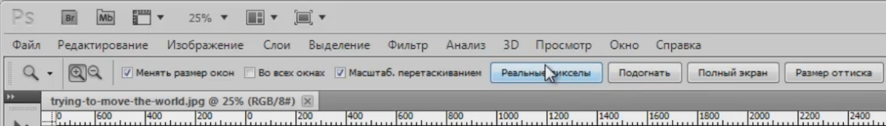
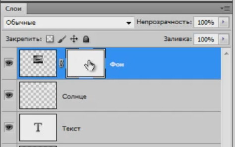
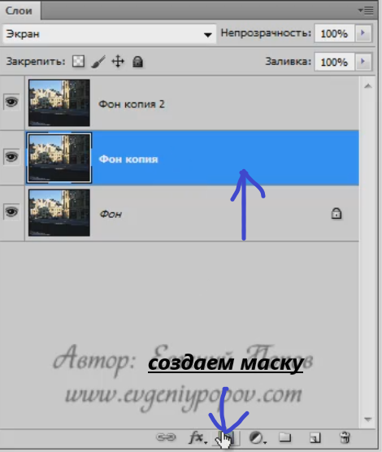
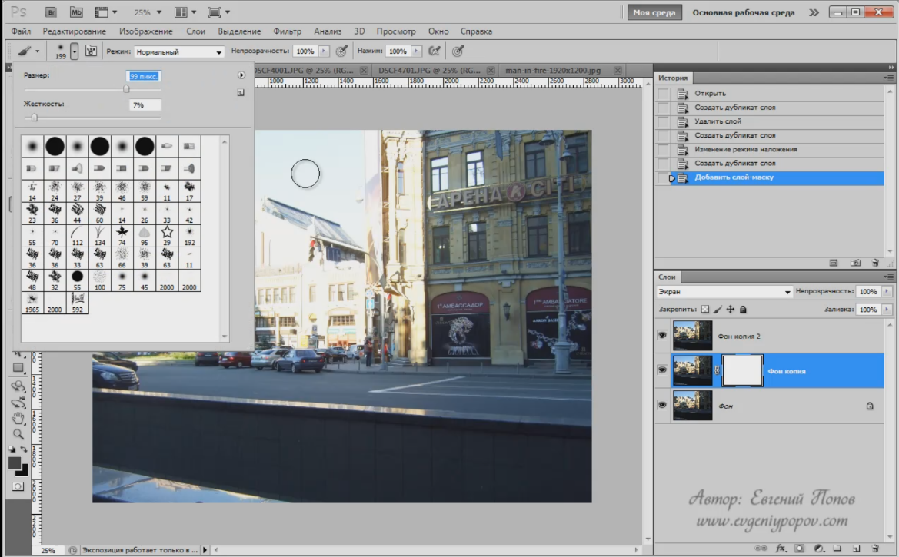
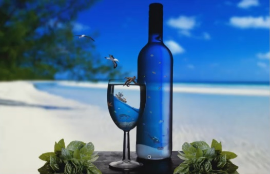
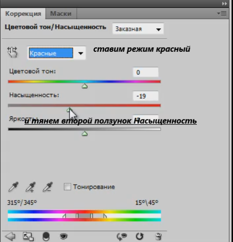
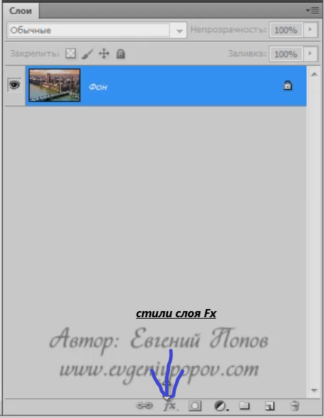
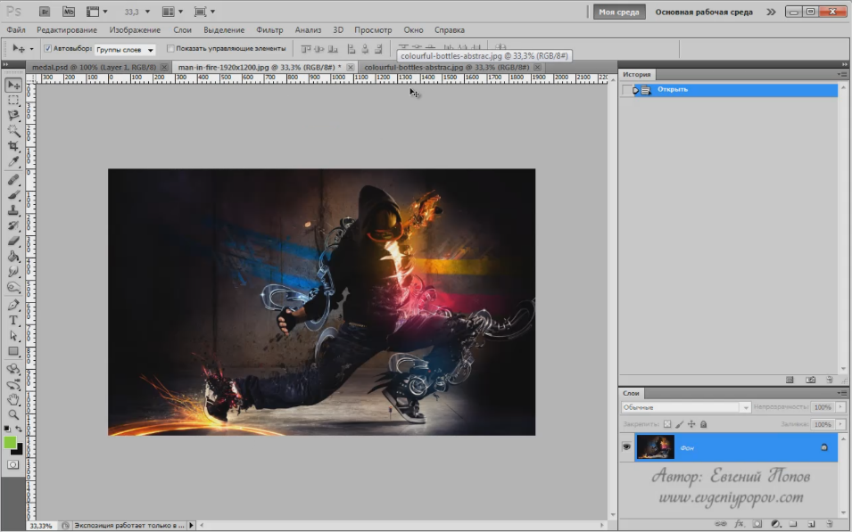
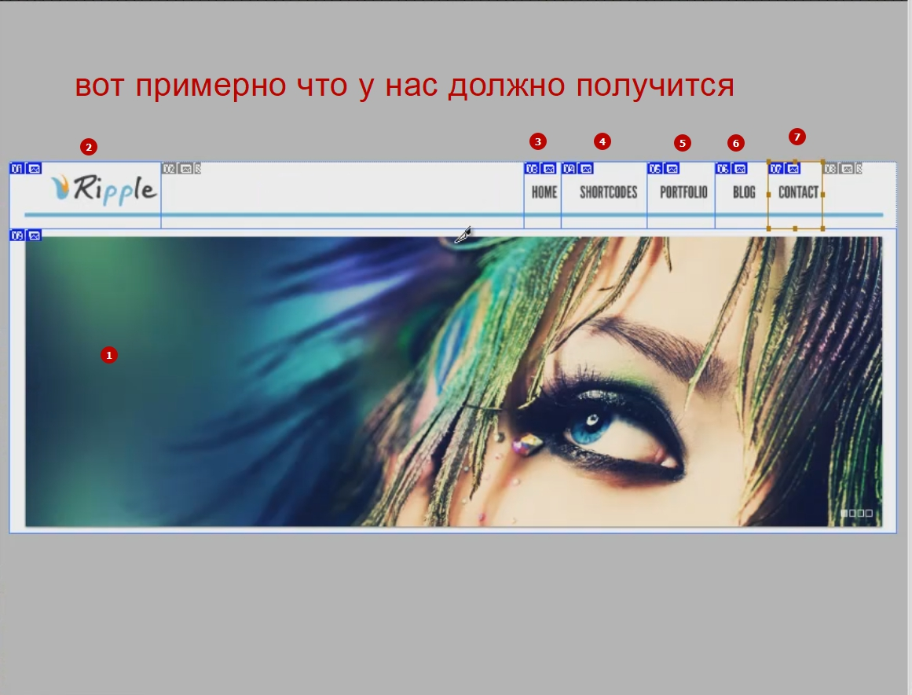
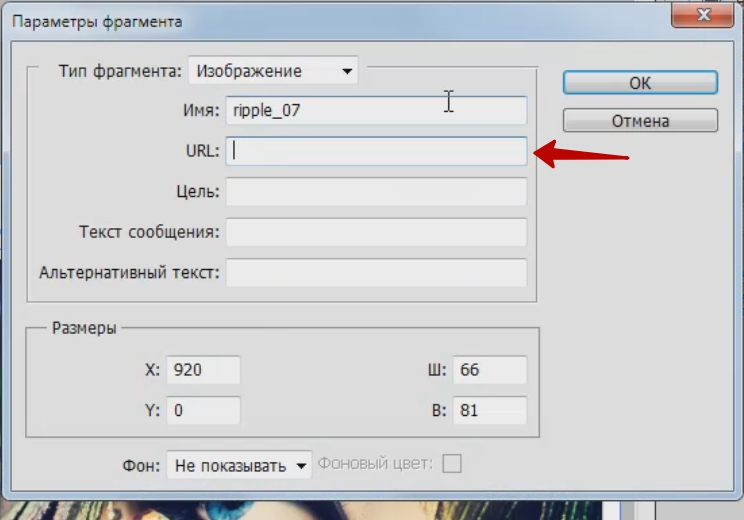

          
# настройка рабочей среды
И так будем рассматривать на примере фотошоп cs5. При первом запуске мы можем заметить некоторые отличия.

У вас правая часть программы, которая состоит из так называемых палитр, может отличаться от моей. Но в этом нет ничего страшного сейчас мы приведем все к единому виду. 
И так давайте создадим свою рабочую  среду. Для этого перейдите в правый верхний угол экрана нажмите на стрелочку и выберите пункт создать новую рабочую среду.

дайте ей какое-нибудь название и сохраните ее.
Все теперь это наша среда. Теперь мы ее один раз настроим и она у нас будет всегда в таком виде в котором мы ее сейчас сделаем.
Для этого переходим на вкладку окно и отключаем не нужные вкладки.

    Нам не нужны будут Гистограммы, Коррекция. Мы должны будем только оставить пункт слои и на первом этапе нам понадобится История (по другому еще называют палитра истории).
    5
Далее мы приводим вот к такому виду и далее отключаем лишнее. И далее отключаем палитру источника клонов

Она нам так же не понадобится. По этому щелкаем в правой части окна и выбираем закрыть группу вкладок.

Далее палитра операции нам тоже пока не понадобится и палитра контуров и каналов тоже. По этому оставляем только слои и историю.  Эти две палитры первое время мы будем использовать достаточно много по этому оставляем только их.
Вот таким образом мы с вами настроили рабочую среду и привели внешний вид программы к одинаковому виду.
Выбираем инструмент перемещение и как на картинке настраиваем ее. Ставим галочку возле автовыбор и выбираем группу слоев.

     

# новый и существующий документ
Следующий наш шаг это научиться создавать новый документ в фотошопе и открывать уже существующие. В принципе здесь ничего сложного нет единственно там есть пара особенностей по расположению. 
И так новый документ создается как обычно файл создать или через комбинацию клавиш ctrl+n. 

Здесь на что следует сразу обратить внимание. Это на пункт имя, здесь мы сразу можем задать имя нового документа. 
Набор-это всего лиш заготовки которые есть в фотошопе  и мы можем например выбрать пункт международный формат бумаги.

И далее уже в пункте размер выбрать из международных форматов например А4. Он сразу проставляет ширину, высоту, размеры в пикселях, цветовой режим, содержимое фона и т.д.
Но обычно используется пункт Заказная где мы можем сами уже регулировать размер. Проставляем свой размер в пикселях например ширина 800, высота 600, и разрешение если вы делаете изображение для размещения на сайте  или просто для хранения в цифровом виде то то достаточно 72 пикселя на дюйм, 300 это используется для печати. Цветовой режим мы будем использовать RGB 8-ми битный так и оставляем и содержимое фона белый. И дополнительные настройки не трогаем. Нажимаем ок и у нас создается новый документ.
Если вы часто работаете с каким то одним размером то вы можете сохранить набор. Выставляем свои значения

И что бы каждый раз это не прописывать мы можем в правой части экрана выбрать параметр сохранить набор параметров.

И нажимаем ок. у нас сохраняется это набор и в следующий раз когда мы будем создавать новый документ из пункта набор мы уже сможем выбрать готовый формат и нажать ок у нас создастся документ по нашим параметрам.
Теперь давайте поговорим уже про открытие существующих изображений файлов. Делается это как обычно через пункт Файл, Открыть и здесь мы указываем то место на своем компьютере где у нас хранятся различные изображения и открываем к примеру штук 6-ть изображений, это нам сейчас понадобится.
Все документы у нас располагаются вот в таких вкладках

А теперь обратите внимание на вот этот пункт называется упорядочить документы

И он позволяет изменить внешний вид вот этого рабочего пространства где открыты фотографии. Если мы в один момент захотели увидеть все фотографии, а не так как во вкладках, выбираем пункт Расположить все в  сетке. Фотошоп под каждую картинку отведет свое место естественно полностью картинку не удастся увидеть.
Есть множество других вариантов по экспериментируй. 
Лучший вариант называется сравнение.

    

# масштаб и перемещение
И так мы с вами переходим к следующему уроку, он будет достаточно простой, но важный, потому что он будет посвящен работе с изображением с точки зрения масштаба и перемещения по этому изображению. Эти функции используются почти в каждой работе и вам ими пользоваться нужно очень хорошо.
 И так, смотрите, когда вы открываете достаточно большую картинку мы ее видим целиком. Но на самом деле мы ее видим не в реальном размере, а в уменьшенном это можно легко определить по вот этой цифре, которая находится во вкладке 43,5%

Т.е этим фотошоп нам говорит что картинку мы видим не в полном размере а  он ее уменьшил что бы мы ее видели целиком. И нам нужно учится работать вот с этим масштабом.
В левой панели инструментов  есть иконка лупы. Этот инструмент называется масштаб, его основная клавиша это Z . изначально он включается в положении плюса т.е. если мы нажимаем на изображение у нас масштаб увеличивается обратите внимание что во вкладке размер сразу поменялся на 50%. И при масштабировании на 100% мы видим изображение с разрешением 72 пикселя на дюйм, то самое стандартное разрешение для монитора. 
Теперь если мы хотим переключится на уменьшение то мы можем на панели настроек данного инструмента переключится на лупу со значком минус. Для перехода между плюсом и минусом не обязательно переходить в верхнее меню, достаточно ЗАЖАТЬ  клавишу ALT и данное значение поменяется, как только отпустите вернется в первоначальное положение.
И еще один важный момент это две кнопки реальные пикселы и подогнать

Реальные пикселы это по cent тот же самый реальный масштаб. а режим подогнать это тот самый режим в котором картинка открывается изначально т.е. мы видим ее полностью.
Теперь что касается дополнительных моментов которые вам нужно здесь знать.
Масштаб перетаскиванием

Смотрите если она включена я нажимаю левую кнопку мыши и двигаю мышку вниз у меня автоматически масштаб увеличивается.
Если мы убираем галочку то при зажатии левой кнопки мыши у нас квадратом выделяется область которую нужно увеличить . еще один момент когда мы тащим эту рамку иногда может такая ситуация быть что нужно эту рамку передвинуть. Для перетаскивания рамки достаточно  зажать пробел  и тащите эту рамку в нужное нам место. 
И теперь давайте сразу затронем еще один инструмент  который часто используется вместе с масштабом  это инструмент рука 

щелкните на него. У него горячая клавиша это H. И теперь допустим нужно переместиться в какую то часть изображения. Переместились поработали допустим кисточкой и теперь нам нужно переместится обратно. Можно поступить так же включить руку переместиться и дальше опять включить кисточку но это не очень удобно.
 По этому придумали такой способ перетаскивания не теряя инструмента достаточно нажать пробел, у нас временно инструмент меняется на руку и как только пробел отпускаем у нас опять возвращается кисточка. 
        
# создание и удаление слоев
Очень часто при работе со слоями приходиться создавать новые слои. И первый способ это щелкнуть по иконке которая находится в нижнем правим краю

Второй момент который годится под создание нового слоя это пункт слои 

Третий вариант-это нажать комбинацию клавишей shift +ctrl+N.
Интересная особенность если мы создаем новый слой через пункт меню СЛОИ +НОВЫЙ+СЛОЙ то у нас появляется вот такое окошко в котором 

Сразу можно задать имя слоя. Можно использовать предыдущий слой для обтравочной маски, об этом мы еще поговорим. Можно задать цвет этому слою, но это будет просто раскраска слоя для вас что бы он выделялся в палитре слоев. На самом же деле слой будет такой же пустой. Ну и можно поменять режим наложения и непрозрачность о которых мы еще поговорим.
Удаление слоев. Первый способ мы можем перетащить на иконку с корзиной в палитре история в левом нижнем углу. Так же можно удалить несколько слоев достаточно зажать клавишу  ctrl и выделить нужные слои и удалить.
Обратите  внимание на новый слой. Мы видим так называемую шахматную доску. Э ТО ПРОЗРАЧНЫЕ ПИКСЕЛИ В ФОТОШОП. Это по сути обозначает что мы создали новый слой новую такую пленку по верх всех остальных которая абсолютно прозрачна т.е. мы через нее смотрим на все остальные слои. Эта пленка ближе всего сейчас к нашим глазам.
И давай те на нем что-нибудь нарисуем, солнце. Забежим немножко вперед и воспользуемся инструментом кисть.

С помощью параметров настройки данной кисти выставте  примерно такие размеры.
Выберите цвет какой-нибудь желто-оранжевый.
И теперь убедитесь что вы стоите на новом слое приучайте себя проверять на каком слое вы работаете. И рисуем солнце. Переименовываем данные слой в солнце. Таким образом у нас все элементы нашего коложа расположены на отдельных слоях. Отключить слой можно на иконку глаза на против того слоя который хотим отключить.

Так же на что хотел обратить ваше внимание это на остальные слои где вы видите вот эту шахматную доску. Сразу такой совет если вы хотите отключить видимость всех слоев кроме какого-то конкретного то делается это очень просто. Зажмите клавишу alt и щелкните по глазу слоя который хотите оставить. Все остальные сразу выключаются. Что бы вернуть видимость всех слоев опять нажимаем alt и щелкаем по глазу левой кнопкой мыши.
И следующее понятие которое мы здесь разберем это не прозрачность слоя.  И обратите внимание на тот параметр который называется не прозрачность слоя

он говорит сам за себя и он отвечает за то как мы видим слой. Часто бывает так что нужно добавить слою прозрачность что бы через него были видны пиксели других слоев. И делается это как раз таки за счет этой настройки. Мы можем щелкнуть на стрелку и с помощью ползунка задать прозрачность либо кликнуть и вбить самим нужное значение. Так же мы можем щелкнуть левой кнопкой мыши на слово непрозрачность и водить ее влево или вправо. 
      
# палитра истории
В палитре фиксируются все шаги которые мы проделываем с нашим изображением. Но фиксация это еще пол дела самое классное что мы можем возвращаться по этим шагам назад и соответственно восстанавливать то состояние которое было до внесения нами каких то изменений.

Здесь есть еще такой пункт как  создание нового файла из текущего состояния. Тоже иногда может пригодиться.
Следующая иконка позволяет создавать снимки, но на первое время не советую с ними работать потому что можете просто запутаться.
изначально  у нас есть один снимок. Он называется так как и сам файл. И все вот эти шаги относятся именно к нему. Но можно создать и новые снимки. 

Допустим мы нарисовали оранжевое солнце и сделали снимок оранжевого солнца.

Перешли назад на laer.psd и решили нарисовать желтое солнце. Ну или возвращаемся на несколько шагов назад когда солнце еще не было нарисовано и далее рисуем желтое солнце. И после того как нарисовали делаем еще один снимок.

и теперь переходя по снимкам мы можем сравнивать. И допустим если из каких-то солнц нам одно понравилось больше, то остаемся на этом снимке и дальше продолжаем работать. Теперь уже все шаги пойдут с этого момента.
И третья иконка говорит сама за себя корзина.
        
# блокировка слоя
Обратите внимание на инструмент перемещения и на его галочку автовыбор рядом выберите слой или группу слоев. В принципе на первом этапе это не так важно.и смотрите теперь если я щелкаю по изображению у меня автоматически выделяется тот слой к которому относится пиксель по которому я щелкнул. Эта настройка позволяет удобно работать со слоями.
Теперь что касается блокировок. Давайте возьмем какой-нибудь слой  который у нас есть слой со стеной. И первая блокировка которая здесь есть наведите на нее курсор

она называется сохраняет прозрачность пикселей. Т.е. это блокировка прозрачных пикселей и в чем она состоит? Если мы ставим эту блокировку то мы не сможем рисовать на прозрачных пикселах а на цветных видимых закрашивание будет происходить в отличие от прозрачных. Сразу на слое появляется такой белый значок который говорит что слой частично заблокирован т.е. какие то возможности по работе с этим слоем блокированы.
Вторая иконка(кисточка) называется сохранение цвета пикселов. Она предотвращает рисование вовсе не только по прозрачным но и по цветным пикселам.
Третий значок блокировки это значок блокировки перемещения. Бывает очень удобным в тот момент когда нужно зафиксировать слой.
И последний вариант блокировки это уже как вы догадались это полная блокировка. Здесь уже черный замок который запрещает какие либо действия.
И кроме вот этой полной блокировки есть еще так называемое блокировка фонового слоя. Если мы открое любую JPG картинку мы увидим так же белый значок

Который говорит о частичной блокировке, но обратите внимание что обычные блокировки здесь не доступны т.е. фоновый слой он идет сам по себе. Это отдельный вид слоя который имеет свои ограничения. Например одно из таких ограничений фоновый слой всегда находится внизу.
Как превратить фоновый слой в обычный? Это можно сделать очень просто щелкните вот здесь в свободном пространстве

И здесь достаточно нажать ок что бы он превратился в обычный.
        
# операция со слоями
В этом уроке мы затронем еще четыре важных момента которые вы должны знать и первый из них это дублирование слоя. Часто бывает так что нужно продублировать какой-нибудь слой т.е. вот есть у нас например солнце понадобилось нам еще точно такое же. Что бы не создавать новый слой не рисовать такое же солнце мы можем просто взять данный слой и продублировать его.

правой кнопкой мыши нажимаем на слой и выбираем Создать дубликат слоя либо тащим в самый низ палитры слоя на иконку создания нового слоя. У нас появляется иконка нового слоя чуть выше. И даже если мы выключим основной слой он все равно будет показываться. 
Но кроме того что можно дублировать слой в одном документе но так же его можно продублировать в другой документ.
Допустим открыли мы другой документ нашли нужный нам слой. Также на нем кликаем правой клавишей мыши и выбираем Создать дубликат слоя появляется вот такое окно в котором мы можем указать в какой документ мы можем продублировать данный слой.

И если мы вернемся на тот документ в который продублировали слой с другого документа мы увидим в палитре слои данный слой в данном случае это солнце который только не виден. Одна загвоздка данный слой появляется на исходном месте на том на котором и стоит и по этому в другом документе оно появляется но мы его можем не увидеть. По этому мы просто в документе в том в который продублировали просто перемещаем. В нашем случае данное солнце вышло за пределы документа.
Второй момент который в этом уроке будем разбирать это группировка слоев.
Бываю такие моменты когда слои разбиты не лучшим образом. Например одни и те же цветы или как в примере многоэтажки разбиты на множество слоев. И для того что бы например отключить или включить цветы приходится отключать несколько слоев. Для таких вот моментов и существует обьединение слоев. Делается это следующим образом. Внизу политры слоев щелкаем на иконку дублирования

Вверху появляется папка

Которую мы можем назвать например цветы и переместить туда все слои связанные с цветами. Выделяем нужные слои и перетаскиваем туда. Такая группировка используется в больших проектах когда делается какой-то очень сложный шаблон. Теперь еще скажу про горячую клавишу которая помогает обьединять слои. Можно просто выделить интересующие слои и нажать комбинацию клавиш ctrl+G.И у вас автоматически появится нужная группа в которую сложены эти слои.
Следующий момент который мы должны изучить называется связывание слоев. Если обратить внимание то на некоторых слоях мы можем увидеть такие цепочки, это значок связывания. 
Допустим нужно нам передвинуть два слоя с цветами но они двигаются по одному. Выделяем нужные нам слои и внизу палитры слоем есть значок связывания

теперь два отдельных слоя позиционируются так как нам нужно.
И следующий момент о котором мы должны поговорить это слияние слоев.
Для этого мы можем выделить нужные нам слои, щелкнуть правой кнопкой мыши по ним и выбрать пункт обьединение слоев.

И кроме этого там еще есть дополнительные варианты обьединения это обьединения видимых слоев. И как мы можем наблюдать у нас все слои обьеденились в один видимый слой но те которые были не видимыми остались не тронутыми.
И еще один вариант это выполнить сведение. Он отличается тем что все слои обьединяються в единый фоновый слой. При чем если есть какие то скрыетые слои то нам будет предложено их удалить.
        
# маска слоя
Этот инструмент очень часто используется в работе по этому я советую отнестись к этому уроку максимально внимательно и обязательно на практике повторить то что сейчас мы будем делать. Тем более что как раз многое новички спотыкаются на этих масках хотя по сути там ничего сложного нет нужно всего лишь один раз понять смысл.
Разберем не примере давайте вот в этот наш калаш добавить в небо летающую тарелку т.е. в картинку. Для этого давайте откроем файл из дополнительных метериалов к этому уроку файл u.jpg. давайте для разнообразия не будем дублировать слой а для разнообразия сделаем расположение в сетке и перенесем его

И так у нас появился слой с летающей тарелкой. Как мы видим проблема в том что у нас не только слой с летающей тарелкой а еще небо горы и т.д. и соответственно нам нужно от них как то избавится. И вот здесь есть несколько вариантов. Самый простой который приходит на ум это просто удалить не нужные участки для этого забежим немного в перед и возьмем инструмент ластик

По этому мы берем и просто закрашиваем не нужные участки. Только в панели сверху поставлю непрозрачтость 100%

 
И вот таким образом удаляем не нужные нам области. И если я допустим лишку взял мы можем вернуться на пару шагов назад в палитре истории и доделать.
 И теперь смотрите допустим мы сохранили наш файл и открыли его на следующий день. И теперь смотрите если мы берем слой слетающей тарелкой двигаем ее и видим что вокруг нее ничего нет так как мы стерли и соответственно это уже ни как не восстановить это потеряно безвозвратно.

Но иногда бывают такие ситуации что нужно не удалить какие то области а просто скрыть потому что она еще может нам понадобиться. Так вот в такой ситуации когда мы не хотим удалять информацию а просто хотим ее на время скрыть можно использовать маску слоя. И теперь еще раз повторяем для примера. Удаляем этот слой с нашей картинки. Открываем картинку с тарелкой и заново дублируем слой.
Теперь мы воспользуемся маской слоя и вы увидите уже другой способ скрытия областей не удаляя ее.
Для этого переходим в палитру слои, и в ее нижней области находим кнопку маска слоя.

кликая на нее мы добавляем маску слою на котором стоим

и у нас рядом со слоем появляется такая белая миниатюра. Белая означает то что мы видим весь слой полностью т.е. ели мы видим маску и она белая это означает что слой к которому эта маска относится виден полностью. Вот это запомните раз и на всегда!!!!!!

Теперь попробуем скрыть не нужные участки. Для этого нам нужно взять черную кисточку.

ставим внизу абсолютно  черный цвет и щелкаем на маску.

И начинаем работать на маске. И если мы начинаем рисовать черной кистью нужная нам область прячется т.е. если мы возьмем обратно белую кисточку мы спокойно можем вернуть все обратно. 
Кстати запомните вот такой момент когда вы будите работать с маской вы в основном будете работать с черным и белым цветом. И что бы быстро переключаться между белым и черным цветом можно просто нажимать клавишу X.
Ну и закончим с летающей тарелкой теперь я ее уменьшу немного при помощи сочетаний клавиш CTRL+T.

И ЩЕ ОЧЕНЬ ВАЖНЫЙ МОМЕНТ КОТОРЫЙ ВЫ ЗДЕСЬ ДОЛЖНЫ ПОНИМАТЬ ! это то что например между белым и черным цветом  у нас лежит область серого цвета к маскам это так же относится. Если мы будем рисовать по маске не черной кисточкой и не белой  а серой то соответственно мы будем скрывать част слоя только на половину. Слой будет виден но не полностью. Это что то вроде полупрозрачности. И чем соответственно серее цвет тем сильнее он скрывает тем больше прозрачность, а чем светлее серый цвет тем соответственно тем соответственно он больше открывает.вот это тоже усвойте потому что очень часто используется специальный градиент.
ГРАДИЕНТ
Для примера создаем но каком-нибудь слое новую  маску. Выбираем градиент

Вверху ставим галочку на инверсию и выбираем градиент от белого к черному. И соответственно при поставленном градиенте при проведении  сверху вниз у нас получится переход от белого к черному т.е. верхняя часть будет лучше видна чем нижняя. Вот этот эффект очень часто используется .
          

# режимы наложения слоев
Это тот самый выпадающий список который находится у нас в самом начале палитры слоев.

изначально у нас написано обычные. Данный параметр регулирует как слои из которых состоит изображения будут взаимодействовать между собой. Обычные это обозначает что слои ни как между собой не взаимодействуют, и мы к этому уже привыкли. Мы знаем, что если слой лежит выше, то он получается, перекрывает все ниже лежащие. Это так же как если у нас в коробке лежат 10-ть фотографий то мы видим только верхнюю 10-ю фотографию. Ниже лежащие мы уже не видим. Точно так же и здесь. При таком режиме слои не взаимодействуют.
Но в фотошопе есть режимы, позволяющие слоям взаимодействовать друг с другом по определенным формулам.
Конечно это техники используемые больше в обработке фотографий, создании каких то эффектов, и в нашей работе редко применяются, но мы должны это знать хотя бы  базовые режимы наложения. Евгений Попов и его коллеги пользуются всего лишь несколькими режимами о которых он и расскажет.
Режимы наложения это просто формулы позволяющие двум слоям взаимодействовать друг с другом. И все эти формулы зашиты в этом выпадающем списке.

Их всего 20-ть с лишним штук, но используются из них в основном несколько. 
И смотрите допустим я выбираю режим наложения который называется умножение

и вот смотрите. Мы видим что слои уже как то начинают взаимодействовать друг с другом и на фоне танцора у нас там проявляются лошади. И таким образом за счет таких вот наложений, смешиваний слоев по определенным формулам мы можем достигать различных эффектов. 

Сейчас мы рассмотрим три фотографии и на примере этих фотографий нам станет на много более понятно принцип работы с наложением слоев.  У всех у этих фотографий первая слишком темная

Вторая слишком светлая

Третья слишком тусклая

И вот сейчас мы с вами за счет режимов наложения попробуем исправить эти фотографии.
И так первая слишком темная фотография.
Для начала продублируем фоновый слой. теперь наша задача сделать так что бы наши слои взаимодействовали друг с другом по формуле которая поможет нам осветлить эту фотографию.
 Все режимы наложения делятся на группы затемняющую, осветляющую, контрастную, предпоследняя группа вычислительная. Там производятся вычисления разница она вычисляет разность пикселей и т.д.
И сейчас наша задача научится пользоваться режимом, который называется Экран. Он  относится  к осветляющим, и смотрите если мы его выбираем то мы сразу видим что фотография у нас осветлилась, но еще не  достаточно. И по тому еще раз дублируем данный слой. И у нас уже два слоя которые накладываются с режимом экран. И теперь мы видим что затемненная часть стала на много светлее но с другой стороны осветленная часть так же стала на много светлее. Но мы уже знаем что такое маска слоя  и соответственно мы на вот этих осветляющих слоях можем слишком осветленную часть просто скрыть и она у нас останется от фонового слоя. Встаем  на первый дублированный слой  создаем маску. Берем допустим кисточку не максимально черную можно где-нибудь ближе к темно серому.

ставим по больше саму кисточку 

И та область которая стала у нас слишком светлой мы начинаем ее скрывать на вот этих осветляющих слоях. Сначала работаем на первом осветляющем слое. И затем точно так же работаем на втором. Так же создаем маску и так же потихоньку скрываем осветленный участок в том месте где нам это не нужно.
Теперь рассмотрим другой режим. Иногда фотографии наоборот получаются слишком светлыми и нужно их затемнить. В этом случае вы можете использовать режим наложения один из затемняющих. Так же дублируем слой 

и выбираем один из затемняющих режимов. Их  здесь пять штук. И каждый из них просто в разной степени работает т.е. формулы немножко отличаются, но здесь самым популярным считается режим умножения. Если мы его выбираем то видим что фотография у нас сразу затемняется. Т.е. эти два слоя смешались, пиксель накладывается на пиксель по сути друг на друга и они смешиваются.
Если мы видим допустим что эффект слишком сильный, слишком затемнилась. Мы всегда можем нашему выделенному слою на скриншоте, которому мы дали режим умножения уменьшить не прозрачность и чем меньше не прозрачность соответственно тем меньше его воздействия на ниже лежащий.

И следующий режим это один из контрастных режимов который позволяет добавить сочности фотографии. Режим называется мягкий свет. Так же продублируем слой и скажем что он должен взаимодействовать с ниже лежащим по алгоритму мягкий свет.

И фотография сразу же становиться такой яркой, контрастной. И опять таки если эффект слишком сильный мы всегда можем его убавить за счет непрозрачности
остальные режимы вы уже можете изучать по своим экспериментам. Для данного уровня нам этого будет вполне достаточно.

        

# введение в корректирующие слои
Они так же больше используются в фото обработке, но все равно знать, что это такое нужно и как сними работать. Тем более что там есть варианты, которые мы достаточно часто будем использовать. 
И так что такое корректирующий слой? Давайте рассмотрим на примере.

И здесь вы увидите ряд надписей которые отвечают за создание того или иного корректирующего слоя. Но самый простой пример это выберите пункт черно-белая. У нас создастся новый слой, который выглядит не обычным образом. Сразу обратите внимание у него сразу же есть маска.

и вместе с этим слоем у нас еще открылась новая палитра которая называется коррекция, и в ней мы видим всякие ползунки. Т.е. корректирующий слой это слой команда которая каким-то образом воздействует на нижележащие слои, но не все корректирующие слои будут воздействовать это мы увидим чуть дальше. Но в данном случае  вот этот слой который называется черно-белое 1, как мы видим воздействует совершенно определенным образом, он обесцвечивает  ниже лежащий слой. 
И здесь мы можем с помощью настроек с ползунками и поиграться с этой степенью перевода в черно-белый режим.
Сейчас мы рассмотрим очень популярный прием когда все изображение черно белое а какая то его часть делается цветной.
Если мы посмотрим на исходное изображение мы сможем допустим сделать видимыми красные части машины.
Т.е. мы включаем этот корректирующий слой, встаем на маску( белое окошко рядом со слоем), и черным цветом кисточки начинаем закрашивать  те места на которые мы хотим что бы этот слой влиял на них т.е. делаем их цветными допустим это тоже  самое зеркало в примере. И начинаем потихоньку работать черным цветом на маске этого черно-белого слоя.  Как мы знаем черный скрывает у нас действие этого слоя. Если где то взяли лишка всегда можно нажать клавишу X и переключить на белую кисточку.
И здесь еще давайте затронем еще три корректирующих слоя которые уже не воздействуют на нижележащие слои, они просто позволят создавать  например

Самый первый корректирующий слой называется цвет. Он  просто создает слой полностью залитый каким то цветом  

И здесь нам  разу выдается диалоговое окно где нужно выбрать цвет этого заливного цвета так скажем. Иногда такие заливные слои бывают очень полезными. Лучше создавать такие слои  с заливкой не через создать новый слой и инструмент заливка. А создавать именно через корректирующий слой.
Второй слой это градиент. Т.е. тоже самое почти 

но здесь слой заливается сразу не сплошным цветом  а каким то градиентом. Причем нам так же сразу выдается диалоговое окно в котором мы можем выбрать тот градиент в который нам нужен, сразу можно востановить его угол, масштаб, инверсию сделать. Это примерно тоже самое что и первый корректирующий слой только здесь заливка происходит градиентом.

И последний корректирующий слой это корректирующий слой узор который позволяет создавать слой

Заполняя его какой-нибудь текстурой. Если у нас в фотошопе установлены какие то текстуры то можно за счет такого корректирующего слоя создать слой заполненный текстурой. 
          

# цветовой тон насыщенность
Это очень полезный и мощный инструмент который позволяет менять цвета на изображении. И сейчас вот на разных примерах мы посмотрим как это работает. Открываем несколько изображений из дополнительных материалов.

**Начнем с медали**
У нас она бронзовая. Но у нас есть задача сделать из нее допустим красную или синюю. Причем сделать это аккуратно что бы никто даже не догадался что раньше она была другого цвета. 
Вот  как раз таки для этого используется корректирующий слой  который называется Цветовой тон/Насыщенность. 

У нее сразу открывается вот такая палитра коррекции в которой сосредоточены все инструменты по работе с данным корректирующим слоем.
И здесь в принципе все достаточно просто. Первое в чем мы должны определиться это какой диапазон цветов мы хотим менять.

Выбираем красный. Здесь мы примерно выбираем.
А дальше желательно уточнить. Сразу обратите внимание на цветовой полоске снизу, когда мы выбрали красный, у нас выделился кое какой диапазон. Этим фотошоп говорит какие цвета он будет менять в случае чего. Т.е. если мы сейчас начнем воздействовать на верхний ползунок то цвета в этом цветовом диапазоне начнут меняться. И обратите внимание что там есть разделение на вертикальные линии

и в случае чего эти цвета будут меняться больше всего. А вот диапазон рядом с ним от красного немного к фиолетовому и к оранжевому и желтому будут меняться менее сильно.
**Причем здесь еще возможность уточнить вот этот диапазон. Это делается через вот эту пипетку +**

щелкаем на нужном нам месте изображения и наблюдаем на полоску. Смотрим что наш диапазон расширился сдвинулся в право в сторону оранжевого. **Пользуемся этой пипеткой всегда.**
И теперь смотрите теперь кода вы уточнили все цвета которые должны быть изменены мы начинаем двигать верхний ползунок по цветовому кругу.
**Следующий пример уже чуть более сложный, здесь очень много синего цвета.**

сложный, здесь очень много синего цвета.
И допустим если мы начинаем менять его таким же образом то у нас начинает меняться все и бутылка с бокалом и небо и т.д.
И опять здесь появляется наша любимая маска. Мы встаем на нее. 
И здесь я вам кстати покажу еще один прием который вам нужно знать когда вам нужно маску полностью превратить из белой в черную достаточно нажать комбинацию CTRL+I. Т.е. я нажимаю эту комбинацию, маска становиться полностью черной .т.е. этот верхний слой уже ни как не влияет на нижний.

**Кароче, сначала создаем цвет который нам нужен. Потом создаем черную маску которая отменяет действие слоя этого созданного цвета на ниже лежащий слой. Хотя по идее тот цвет который мы задали слою остается. Далее берем кисточку белую, становимся на черную маску и начинаем корректировать нашу бутылку  с бокалом. Ну или работаем на тех местах на которых нам нужно воздействие этого корректирующего слоя.**
И вот таким образом уже комбинацией наших знаний по слоям мы используем это корректирующий слой +маска и таким образом мы уже воздействуем на не большой участок изображения. И соответственно теперь если мы будем двигать верхний ползунок, у нас будет меняться цвет самой бутылки с бокалом.
По пипеткам если мы выбираем пипетку минус то соответственно мы исключаем данный цветовой диапазон от изменений. С ползунками насыщенность и яркость я думаю вы уже разберетесь.
И последний момент о котором я хотел вам здесь рассказать это галочка тонирование

она уже полностью тонирует все изображение. Это даже больше актуально для черно-белых изображений. При выборе данной функции у нас картинка тонируется каким-то цветом и соответственно этот тон мы можем менять.
Часто этот эффект используют что бы получить какую-нибудь фотографию в ретро стиле. 
            

# уровни кривые

в принципе это уже достаточно мощные инструменты по цветокоррекции фотографии и больше они конечно уже используются проффесиональными фотографами. Но мы далеко туда углубляться не будем, изучим основные моменты которые позволяют быстро восстановить цвета и вообще внешний вид фоторгафии. И для практики откройте две фотографии.

Уровни. 

Так же появляется панель коррекции. В ней имеется гистограмма расположения тонов на изображении. Слева от пипеток мы видим темные тона, а справа светлые. Соответственно если двигать ползунок темных тонов их добавляется. Если двигать правый то добавляются светлые тона. Но не в этом суть. 
Суть здесь в пипетках, слева от гистограммы, с помощью которых мы можем указать фотошопу  точку белого на нашей фотографии и точку черного и за счет этого он сможет вычеслить все остальные пиксели т.е. восстановить всю цветовую тоновою картину  на фотографии.
Берем пипетку отвечающую за белыйи если сами конкретно не видим белый цвет можем воспользоваться таким приемом. Зажимает кнопку ALT и тянем правый ползунок на гистограмме отвечающий за белый и нам сразу начнутся показываться самые светлые пиксели в нашем изображении. И тоже самое проделываем с черной пипеткой и левым ползунком гистограммы. Еще здесь есть такой вариант если мы все не можем определится  с точками черного и белого то, над гистограммой, можно воспользоваться кнопкой авто. В этом случае фотошоп сам постарается подобрать эти точки и вы получите результат иногда хороший, иногда не очень.
Это был первый момент.  
Во втором моменте затронем сразу комплекс корректирующих слоев т.е. закрепим все то что мы изучили до этого и маски, и цветовой тон насыщенность, и за одно пройдем еще один корректирующий слой который называется кривые.
Когда в изображении переизбыток какого то цвета, в уроке это красный фотография там где он с ребенком. И когда вот такая ситуация вы видите что какой-то такой моар на фотографии можно воспользоваться корректирующим слоем кривые. Это еще более продвинутый инструмент

Чем уровни. Т.е здесь можно регулировать эти тона уже в виде кривой т.е. где то добавлять, где то убавлять, делать с помощью точек различные фигуры этой кривой по данному инструменту есть отдельные книги!!!

Допустим нам нужно убрать слишком много красного то выбираем допустим красный канал.т.е. мы можем здесь работать отдельно по каналам.  Если  нужно убрать то тащим кривую вниз, если добавить то вверх.
И последний момент это краснота от куртки которая передалась на лицо. Для этого воспользуемся корректирующим слоем который мы уже изучили Цветовой фон/Насыщенность. 
Но если в тот урок в котором мы изучали данный слой мы больше работали именно с цветовым фоном меняя цвета на изображении то сейчас мы больше поработаем с насыщенностью, вторым ползунком.

и убираю до тех пор пока лицо не станет нормальным. Однако как вы заметили куртка тоже теряет насыщенность как и все изображение в целом а нам этого не нужно. И что бы этого избежать мы как обычно воспользуемся маской. Т.е. сделаем так что бы слой цветовой тон насыщенность влиял именно на лица. По этому мы  полностью закрасим данную маску черным цветом для этого можно нажать CTRL+I. А затем возьмем белую кисточку и  поводим по лицу, начнем открывать видимость данного слоя только в тех местах где нам это нужно. Но это еще только верхушка айзберга. А так если вы еще хотите расширить свои знания то у нас есть еще курс который называется фотошоп для фотографа там уже приводятся гораздо более мощные техники, больше приемов интересных.

            

# команды коррекции
Этим уроком мы с вами заканчиваем изучение корректирующих слоев. Хотя у нас тут еще остались не изученные моменты но как я вам сказал уже мы изучаем только то что конкретно используется на практике все остальное более редкое, специфичное,там работа с экспозицией с микшированием каналов и т.д. этим вам голову пока забивать не нужно.
Единственный момент о котором я вам хотел еще рассказать это такой момент. Смотрите допустим если мы выбираем какой-нибудь с корректирующих слоев например еще есть такой простой корректирующий слой фотофильтр. Который имитирует как бы на изображение оттенков которые можно получить с помощью таких фильтров которые надеваются на объектив  фотоаппарата.

Но не в этом суть. Суть в том что все эти корректирующие слои которые мы свами использовали они еще могут вызываться в виде команд через пункт меню изображение коррекция

**Но отличия будут в том что выбирая команду в этом пункте оно будет применяться сразу к изображению не как к отдельному слою и соответственно если мы сохраним это изображение, потом откроете заново мы уже не сможем вернуть обратно исходное состояние. А в случае с корректирующими слоями такого не произойдет. Если вы в видео уроках увидите что кто то пользуется командой коррекции через меню то смело можете это делать не через меню, а в виде корректирующего слоя в палитре слоев, что бы можно было вернуть потом исходное состояние.**

            

# стили слоя

и располагаются они вот здесь за вот этой кнопочкой Fx которая осталась единственной не изученной у нас из вот этой нижней строки.
Недоступна она потому что стили слоя нельзя применять к фоновому слою соответственно нам нужно из фонового превратить слой в обычный.  Можете открыть несколько изображений так как мы будем учится копировать стиль слоя из одного изображения в другое.
 И щелчком левой кнопки мыши по синему фону слоя превращаем его в обычный, щелкаем и нажимаем ок.
Щелкаем по этой иконке Fx и у нас вниз выпадает список. Выбираем обводка.

здесь мы не будем изучать все стили слоя не будем сильно вдаваться в эти подробности потому что лучше все это изучать на практике и стили слоя больше используются с различными фигурами которые мы пока не прошли. 
Здесь мы просто познакомимся со стилями слоя, что это такое, как копировать стиль, как их отключать и т.д.
Итак если вы выбрали обводка то на изображении вы пока ни каких изменений не увидите. Потому что обводка у нас стоит в положении снаружи, а с наружи у нас ее просто некуда добавлять потому что изображение занимает все пространство по этому мы переменим положение не внутри. И  мы сразу видим результат. Размер у нас обводки 6 пикселей и цвет стоит черный, режим наложения нормальный, не прозрачность 100%.
Давайте попробуем за счет обводки сделать нечто подобное рамки. Выберете в типе обводки градиент. Внизу мы можем выбрать угол градиента.
Можно добавить следующий стиль это тиснение. Он позволяет добавить обьем нашему слою.
Еще нам здесь очень важно изучить параметр заливка.

Так вот если у нас не прозрачность влияет на весь слой. Если же я уменьшаю заливку то у меня уменьшается только в изображении а все эффекты остаются такими же.

И еще один важный момент который следует знать это то что стили слоя можно копировать из одного слоя в другой.
Выбираем пункт в меню слои здесь есть пункт стиль слоя и там выбираем скопировать стиль слоя.

И далее идем в то изображение в которое хотим вставить и выбираем Слои Стиль слоя и вклеить стиль слоя.

            

# обтравочная маска
И так мы добрались с вами до последнего урока посвященным слоям. Он будет посвящен такой теме как обтравочная маска. Но не пугайтесь данного названия, если разобрались с обычными масками то здесь проблем не будет.
Откройте три картинки

Продублируйте слой с медалью

И скажите что он нам нужен вот в этом документе.

Но мы хотим перекрасить данную медаль и сделать ее не такой бронзово-оранжевой а допустим фиолетово-розовой. 
Соответственно мы как обычно добавляем корректирующий слой Цветовой тон/Насыщенность. Указываем что базовый цвет у нас будет красный. Через пипетку + добавляем к нему оранжевый и приближенные к нему цвета. И начинаем двигать верхний ползунок. 
Но как вы и заметили данный корректирующий слой повлиял у нас еще и на фоновый слой, т.е. цветовая гамма поменялась не только на медали но и на фоновом слое с танцором. Нам же это совершенно не нужно, нам нужно чтобы корректирующий слой перекрашивал только медаль. Частично мы уже знаем выход из этой ситуации. Мы можем взять встать на маску данного корректирующего слоя

Далее взять черную кисточку  и закрашивать те места где мы  не хотим влияние данного корректирующего слоя.
Либо инвертировать маску и на оборот белой кисточкой пройтись по медали.
 Но это как вы понимаете не так уж быстро и в каких то сложных формах придется долго поработать кисточкой что бы все идеально получилось.
На самом деле в фотошопе есть более специализированный инструмент для такой задачи который называется обтравочная маска. И  он позволяет сделать так что бы корректирующий слой влиял на медаль точно в пиксель в пиксель прям идеально и он будет затрагивать только медаль. 
И смотрите как это делается. Мы просто подносим курсор мыши между этими двумя слоями  и нажимаете клавишу ALT.  У нас появляется вот такой значок.

который говорит что можно создать обтравочную маску и что вот этот верхний слой будет виден только в пределах нижнего.
И что мы видим, у нас верхний слой начинает влиять только на медаль, а фон остался таким как и был. Вот этот смысл этой обтравочной маски. Она экономит время. Нам не нужно самим возится с обычной маской и что то там кисточкой прям идеально выделять. Мы просто ставим корректирующий слой чуть выше того, сразу точнее за тем на который он должен влиять и делаем обтравочную маску. 
 Второй способ ее создания это просто щелкнуть правой кнопкой мыши по данному слою и выбрать пункт создать обтравочную маску.

и у этого слоя сразу появляется стрелочка которая показывает что она влияет только на нижний слой который находится под ним. По этому не в коем случае, если мы хотим что бы он не влиял на фоновый слой, фоновый слой должен стоять последним.

И что бы закрепить работу с обтравочной маской давайте сделаем еще один момент. Создаем новый документ размерами на пример 800 на 600 и возьмите инструмент текст и каким-нибудь штифтом, любым цветом.

И теперь сюда же в этот документ скопируем изображение с банками. Через правую кнопку мыши по слою с банками создаем дубликат и помещаем его в этот новый документ.

Он у нас появляется сразу над слоем с обтравочной маской и показывается в реальных пикселях. Мы его пока отключаем по глазу. И теперь смотрите что мы сделаем. Мы сделаем так что бы у нас вот этот слой с этими банками у нас проявлялся только в рамках вот этого текста.

Мы просто включаем слой с банками, наводим в пространство между слоями нажимаем клавишу ALT и левую кнопку мыши. И теперь смотрите. 

У нас данный слой проявляется только в рамках нижележащего слоя который у нас является текстовым. По тому что текст является для него по сути маской.
              

# выделение
И так мы с вами переходим к другой обьемной теме которую одним общим словом можно назвать выделение. И первый такой инструмент называется у нас прямоугольная область он скрывается у нас сразу за стрелкой.

И допустим у нас есть задача сделать в этой комнате не четыре картины а шесть. Мы встаем на фоновый слой и с помощью инструмента прямоугольная область, проследите что бы стиль у вас стоял обычный, мы выделяем два окошка и идем в обычное меню Редактирование Скопировать и потом Редактирование Вставить (CTRL +С CTRL +V.)
У нас сразу образуется новый слой с этими двумя скопированными окошками.
Далее берем инструмент перемещения и нажимаем на клавиатуре левую стрелку то мы видим что у нас на отдельном слое теперь есть два окошка.
**Теперь поговорим о тех параметрах которых данный инструмент имеет.**

И первые параметры это вот эти четыре кнопки. Первый значок это обычный режим в котором мы работаем.
Второй режим это Добавление к выделенной области. Это значит если вы что то выдели ли за тем начинаете еще раз выделять то у вас получается единое выделение на одном слое.
Следующий режим наоборот вычетание. И  последний вариант это пересечение оставляет только ту область в которой произошло пересечение.
**Следующий параметр это растушевка (смягчает края выделенной области).** 
При обычном выделении и перемещении он у нас это делает жестко, по краям видны стыки. Для того что бы оно было четкое и ровное применяется этот инструмент. Радиус растушевки ставим примерно 10 пикселей.
**Следующий параметр это Стиль.** Стиль позволяет нам менять соотношение сторон определенным образом. Т.е. изначально мы можем выделять ка угодно. В стиле мы можем задать пропорции выделения. Если мы допустим хотим сделать выделение допустим 10 на 15 что бы потом распечатать в виде фотографии. То  мы можем поставить что бы ширина допустим должна быть 10 а высота 15. И вот теперь как бы мы не водили у нас всегда пропорции будут соблюдаться.
И иногда нужно выделить какой то конкретный блок, это на практике очень часто используется, для этого используем стиль Задать размер. Он у нас сразу выдает значение в пикселях. Задаем размеры и потом просто кликаем левой кнопкой мыши и нам сразу выдается выделение заданных размеров.
 А теперь поговорим про остальные инструменты этой группы.
**Это инструмент овальная область.** Для перетаскивания выделения мы можем зажать пробел и перетащить в нужную нам область.
 **И последние инструменты этой группы это горизонтальная строка и вертикальная строка (чаще используется в однопиксельном выделении).**
            

 # лассо
 Следующая наша цель научиться делать не стандартные выделения. Для этого первым инструментом из этой группы мы будем изучать лассо. Здесь на самом деле три вида лассо просто лассо, прямолинейное лассо и магнитное лассо. 
Начнем с первого. Это инструмент позволяющий делать выделение любой формы.так же этот инструмент может работать в тех же режимах как и прямоугольная выделенная область.

Добавление, вычетание и пересечение и так же есть растушевка + параметр сглаживание.
Если  выбираем инструмент прямолинейное лассо, оно уже позволяет более точно выделить обьект и спомощью него можно более точно выделить например вот этот стул. Этот инструмент уэе работает по точкам.

и еще один момент допустим вы не там поставили точку мы можем вернуться назад нажав клавишу Backspase. 
Но не достаток данного инструмента в том что если мы нажимаем Esc то все выделение теряется. Но данный инструмент используется для сложных выделений не так часто и через пару уроков вы поймете почему. Просто потому что есть более удобные инструменты.
И инструмент магнитное лассо он позволяет нам выделять в более менее автоматизированном режиме и он пытается сам определить область которую нужно выделить и основывается он на контрасте. Где нет четкой границы и он не знает куда поставить точку то в этом случае мы можем поставить точку  самостоятельно. А вот эти параметры как вы уже догадались

Первый за ширину зоны контрастности, степень этой контрастности, и третий частота точек которые он будет ставить.

            

# расскройка
Этот инструмент находится сразу за рамкой кадрирования и предназначен для нарезки изображения на несколько кусков. В основном это используется в вэб-дизайне потому что фотошоп сразу позволяет сохранить такое нарезанное изображение сразу в html виде т.е. на выходе вы получите html страницу где большое изображение будет уже собрано во едино из многих кусочков т.е. это оптимизирует время загрузки больших изображений. Причем на определенные места мы можем сразу поставить ссылки. Сейчас мы все это дело изучим на примере. Вот у нас есть шаблон

Естественно весь шаблон нарезать мы не будем. Потому что это будет долго. Понятно это будет на не большой части шаблона. Мы возьмем только верхнюю часть с логотипом, с большим изображением и навигацией. 
В итоге мы получим  html страницу где пункты навигации будут ссылками и навигация и логотип сохранены в разных форматах, потом это все воедино соединено в html страницу с помощью только лишь фотошопа т.е. ни капли html кода мы с вами писать не будем.

Давайте возьмем с вами ту часть шаблона с которой будем работать. Для этого берем рамку кадрирования и оставляем только верхнюю часть.
 
 Приближаем и начинаем нарезку. Сразу смотрим как выгоднее нарезать данное изображение. Я вижу сразу один единственный вариант вот эту большую часть с девушкой оставить в одном блоке, логотип в одном блоке, белую часть от логотипа до навигации в отдельном блоке, и каждый пункт навигации в отдельном блоке.
 По этому берем инструмент Раскройку и начинаем нарезать. Сначала можно сразу отделить вот этот большой блок с девушкой. Можно даже брать с запасом выходя за пределы, ничего страшного он все равно станет точно по контуру.

И теперь нужно аккуратно продолжить нашу нарезку. Следующий фрагмент получается логотип. Выделяем аккуратно, не заходя на тот нижний элемент который уже вырезали. Обращай внимание на контуры нарезки, при соприкосновении контуров в точке нарезки контур меняет свой цвет. 
**Следующая часть это у нас навигация.** Каждый блок отдельно выделяем в отдельное изображение. При чем как вы уже догадались не достающие блоки добавляются у нас автоматически.

Теперь допустим вам не нравиться что один фрагмент слишком широкий получился и вы хотите его уменьшить то можно здесь еще воспользоваться последним инструментом который позволяет выделить фрагмент т.е. с помощью него вы можете любой фрагмент выделить и потом доработать.

Следующая наша цель добавить пунктам навигации сопоставить их с ссылками это можно сделать сразу здесь щелкнув по элементу два раза и прописать URL 

Либо мы можем сделать это уже при сохранении. Там это можно сделать немножко по удобнее. По-этому здесь мы просто определяемся с теми фрагментами которые у нас будут, нарезаем так как нам нужно. И теперь в пункте **Файл** выбираем **Сохранить для Web и устройств (Alt+Shift+S).**
 
 Сразу загружается пред просмотр где мы можем по каждому кусочку с помощью инструмента выделить фрагмент ходить и выбирать для фрагмента тот формат в котором лучше всего его сохранить. Девушку на картинке сохраняем только в JPEG. Элемент с логотипом лучше всего сохранить GIF сразу видна коласальная разница в размере. Белый блок так же лучше сохранять в gif и все куски области навигации так же лучше сохранить в gif. Мы сэкономили 50 килобайт только за счет разно форматного сохранения. Теперь в принципе все, нажимаем сохранить и выбираем формат в котором мы будем сохранять. 
**Если нам нужны эти просто нарезанные картинки по раздельности то здесь формат можно выбрать Только изображения.**

Если же нам нужен такой вариант когда уже есть готовая html страница с html кодом который все это соединяет воедино то выбираем в формате HTML и изображения.

И второй способ создания ссылок. В пред просмотре кликаем два раза по нужной нам области и в url вводим адрес. В пункте цель если нужно сделать что бы открывался в новом окне выбрать blank. И в ALT можем ввести альтернативный текст если человек заходит на сайт с отключенными картинками. И с остальными блоками соответственно мы можем сделать тоже самое. 
 
                        

 # пипетка и линейка, комментарии
 25 пипетка и линейка, комментарии
В этом уроке мы свами переходим к группе инструментов которые находятся после раскройки это пипетка, линейка и комментарии. 

Пипетка очень простой инструмент. В меню размер образца поставьте точка.

Он позволяет определить цвет под курсором и поставить его в качестве вот этого основного цвета.

вот мы щелкаем по зеленой горе и основной цвет становится зеленым.
Единственная настройка которая здесь важна это от куда он берет этот цвет, **Пункт Размер образца**, либо просто под точкой (точнее в том месте куда мы кликнули этот пиксель он и берет), либо он берет среднее из какого то квадрата.
Что касается вот этой настройки Активный слой или Все слои

То это очень легко понять на примере. Сейчас у нас есть один единственный слой по этому мы особой разницы не почувствуем. Но если мы этот слой разделим на два. Сначала из фонового создадим из него обычный слой. Затем с помощью инструмента Прямоугольное выделение выделим половину картинки и вырежем ее через Ctrl +X 

И вставим на новый слой. Подвинем  как и было.

Т.е. теперь у нас изображение состоит из двух слоев. И смотрите встаем на активный слой (первый) щелкаем на пипетку и выбираем цвета на этом активном слое. Цвета выбираются. Если же выбираем цвета не на активном слое этого не происходит.
При выборе Группа слоев у нас все получается на обоих слоях.
**Следующая настройка это кольцо пробы.**

И при щелканье мы наблюдаем выбор нашего цвета. Сверху у нас показывается тот цвет который у нас получится если мы отпустим мышь. Снизу у нас показывается тот цвет который у нас установлен в качестве основного.
***Линейка***. Это очень актуально для вэб-дизайна при верстке сайта когда нужно узнать размер того или иного блока. Если мы выделили не ровно какой то участок, он будет показывать, в меню сверху, что мы отклонились на столько то нрадусов. Если четко идеально то у нас должен быть ноль.
**Но кроме этого данный инструмент позволяет выравнивать горизонт да же быстрее чем через рамку кадрирования.**

Это делается через вот эту кнопку **выпрямить**. Для этого проводим линию по горизонту который нужно выпрямить и нажимаем эту кнопку. Он автоматически все сделает сам и вы получите фотографию с прямым горизонтом.
**Следующий инструмент это комментарии.** Допустим вам дизайнер прислал то что вы ему заказали шаблон сайта или еще что то, но вас какие то моменты не устроили. Мы можем открыть этот дизайн в фотошопе. Взять инструмент комментарии и в тех местах которые нас не устроили просто щелкаете, появляется окошко и пишем наш  коммент.

          
             

 # восстанавливающая кисть, точечная восстанавливающая кисть, заплатка, красные глаза.

Интересный инструмент. Очень часто он используется для ретуши кожи, но не только в этой области можно его использовать. Сейчас мы рассмотрим на примере как с ним работать.

Смотрите у него здесь есть ранка от которой мы сейчас будем избавляться как раз таки за счет инструмента восстанавливающая кисть. Он позволяет клонировать какой то участок слоя и переместить его в другое место при чем таким образом что он там будет вписан максимально идеально. Приближаем участок с той раной, берем инструмент восстанавливающая кисть и увеличиваем его до размера этой раны.

И далее несем курсор на проблемный участок. Мы сразу будем видеть что у нас в итоге получится и нажимаем левой кнопкой мыши. В итоге у нас происходит идеальная подгонка образца к конечному блоку. Таким образом мы можем избавиться от таких мелких дефектов.
**И еще один совет. Если вы хотите данный инструмент хорошо закрепить на практике то можете выполнить вот этот вот урок который есть у нас на сайте фотошоп мастер. Ру.**

**Теперь рассмотрим, чем отличается инструмент точечная восстанавливающая кисть?** Здесь уже смысл в том что нам уже не нужно указывать образец а программа будет сама пытаться определить близ лежащие как бы участки во круг проблемного и будет сама пытаться взять нормальный образец.

 

Иногда это работает, иногда нет. Все же старайтесь самому указывать источник. 
Следующий инструмент в этой группе называется Заплатка. Он очень похож на восстанавливающую кисть, только здесь немножко интересней сделан принцип отбора образца. 

 

 И допустим мы хотим сделать 477 т.е. нам нужно 7 продублировать. Инструментом Заплатка мы можем аккуратно указать контуры этой семерки.

 

 При чем у заплатки есть такой момент, мы можем указывать куда мы хотим вставить эту семерку. В настройках инструмента нужно поставить вместо **Назначение**, пункт **Источник.**

  

  И тогда мы сначала указываем то место куда мы хотим вставить

 А за тем уже это место тащим на семерку.

 

 **И последний инструмент из этой группы он называется красные глаза.** Ставим в настройках размер зрачка примерно но 50% и величину затемнения на 20%. И затем просто указываем, выделяем, то место где зрачок. У нас программа сама определяет его красную часть и ее затемняет.

# штамп (S)
Сразу к примеру. С помощью восстанавливающей кисти делаем копию плафона. Далее, что бы увидеть отличия берем инструмент штамп, он работает по тому же принципу, мы берем образец и щелкаем по тому же месту куда нужно вставить копию. И смотрите на результат.

И вот как он был на светлом фоне так он и скопировался. А восстанавливающая кисть все же пытается подогнать ваш клон под то место в которое он вставляется. Вот в этом их главное отличие. Но и + в штампе есть настройки Непрозрачности т.е. вы в штампе можете задавать настройки Непрозрачности и Нажим, а у Восстанавливающей кисти таких настроек нет. 
В качестве закрепления данного инструмента вы можете так же открыть сайт фотошоп мастер ру. И там в разделе учебник фотошопа найдите урок про фотошоп штамп и посмотрите что делается с помощью данного инструмента. В кадр здесь попала девушка с боку

 И в итоге за счет инструмента штамп от нее удалось ибавится. Т.е. все эти участки которые есть рядом с девушкой они постоянно дублировались и в итоге от нее удалось избавиться. 

 # осветлитель затемнитель губка
 
Осветлитель. Данный инструмент позволяет осветлить часть изображения. Посмотрим на примере осветления радужки глаз и зубов.

Здесь он может работать в трех диапазонах. Если мы ставим Подсветка то он будет воздействовать только на светлые участки. Экспонирование это сила воздействия. Экспонирование сильно много ставить не надо потому что работать нужно очень деликатно. Начинаем водить по интересующей на области. При чем лучше всего делать это на отдельном слое что бы мы могли потом отрегулировать непрозрачность. Сильно осветлением увлекаться не стоит. Если эффект получается не естественным с помощью не прозрачности мы всегда можем откорректировать этот момент.
При чем если нам нужно на оборот осветлить темные участки то в Диапазоне нужно ставить Тени. Если какие то средние участки не светлые и не темные то ставьте Средние тона.
Следующий инструмент который у нас здесь идет это затемнитель. Это обратный инструмент осветлителю. Здесь все тоже самое т.е. он работает по обратному принципу.
 И последний инструмент в этой группе это губка. Который позволяет повышать или понижать насыщенность в каких то участках нашего слоя.
И вот на примере. На  свиторе есть зеленая полоска и мы хотим ее осветлить.

И так же водим по интересующей нас области.

# размытие и резкость и палец
**Размытие.** В открытом изображении мы видим футболистов которых мы видим одинаково четко. Они все у нас в фокусе находятся и все нормально видны. Но иногда бывает ситуация когда нужно размыть или фон, или какой то передний план что бы выделить того или иного участника.

И размываем фон. Если же эффект слишком сильный мы всегда можем исправить его за счет Непрозрачности.

**Резкость.** Это обратный инструмент размытию. Когда на оборот мы хотим вернуть резкость какой то части картинки можно аккуратно пользоваться вот этим инструментом.

Здесь сильно большую интенсивность можно не ставить.
 И третий инструмент в этой группе это инструмент Палец этот инструмент используется если нам нужно какой то обьект замылить.                                                             
 #  кисть

  В этом уроке мы с вами более подробно рассмотрим инструмент кисть. Нам нужно более подробно изучить данный инструмент потому что на его основе работают другие инструменты. Как вы заметили  когда мы например пользовались инструментом Размытие или Восстанавливающая кисть или Штамп все время была у нас работа кисточкой. И по этому можно сказать это базовый инструмент и работать с ним нужно уметь. И в первую очередь нужно уметь работать с жесткостью кисти.
Как мы видим при максимальной жесткости края максимально четкие, границы не расплывчаты.  Если мы берем жесткость 0% мы наблюдаем обратную картину, края максимально размыты.

 

 По-этому это имейте ввиду. Когда вам нужно работать очень четко, например вы выделяете какую то границу где ни один пиксель не должен уйти, то нужно работать жесткой кистью. Если же вы наоборот делаете какую то ретушь кожи  где все должно быть очень плавно без резких переходов, то в этом случае нужно использовать более мягкую кисть.
Теперь поговорим про форму кисти.

до этого мы работали вот с такой круглой кистью. Но на самом деле форма кисти может быть практически любой.
Он выбрал кисточку и просто провел… образовалось много звездочек. От чего это зависит?
А зависит это от настройки.

Она открывает дополнительные настройки.

И смотрите здесь стоит дополнительное рассеивание.
И сейчас самые интересные настройки мы рассмотрим.
1.	Это динамика формы. Если  вы хотите что бы при рисовании размер звездочек постоянно менялся то можно поставить эту настройку.
2.	Рассеивание. Название говорит само за себя.
3.	Динамика цвета. Если поставить эту настройку то можно получить разброс цветов. В данном примере разноцветные звездочки. При выставке колебания цветового тона чем больше процентов тем больше разброс цвета. И еще масса других настроек.
Но это еще пол дела. Это те формы которые установлены здесь изначально. На самом деле в интернете мы можем найти миллионы кисточек которые можно дополнительно добавить в фотошоп. Например на сайта фотошом мастер .ру. дальше несет бред с которым и сам разберусь. 

                                       
