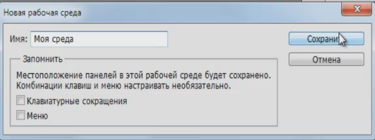

# настройка рабочей среды
И так будем рассматривать на примере фотошоп cs5. При первом запуске мы можем заметить некоторые отличия.

У вас правая часть программы, которая состоит из так называемых палитр, может отличаться от моей. Но в этом нет ничего страшного сейчас мы приведем все к единому виду. 
И так давайте создадим свою рабочую  среду. Для этого перейдите в правый верхний угол экрана нажмите на стрелочку и выберите пункт создать новую рабочую среду.

дайте ей какое-нибудь название и сохраните ее.
Все теперь это наша среда. Теперь мы ее один раз настроим и она у нас будет всегда в таком виде в котором мы ее сейчас сделаем.
Для этого переходим на вкладку окно и отключаем не нужные вкладки.

