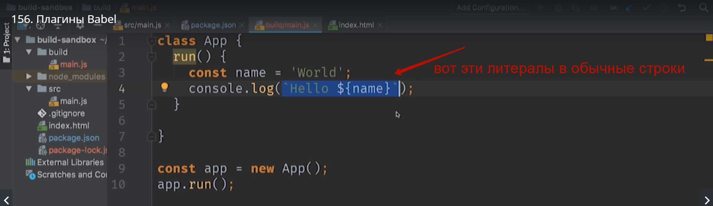
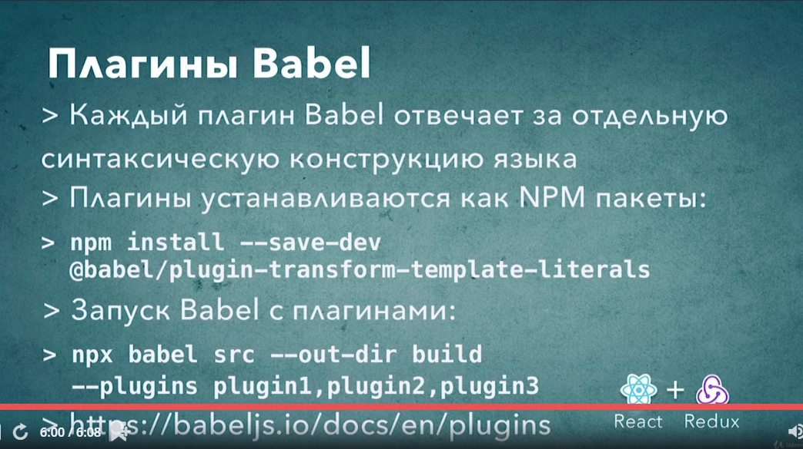

# Плагины Babel

Для каждого преобразования. Для каждой конструкции языка которую будет преобразовывать babel нужно установить отдельный плагин. К примеру для того что бы babel начал преобразовывать tamplete literal

Нужно установить плагин под названием

> @babel/plugin-transform-template-literals

Это обычные npm пакеты. Установка

> npm install --save-dev @babel/plugin-transform-template-literals

После установки плагина можно запустить babel снова, но в этот раз мы добавим еще один аргумент который сообщит babel что нужно этот plugin начать использовать.

npx babel, указываем директорию из которой взять файлы, указывам --out-dir это директория в которую мы положим сгененированные файлы это build, и добавим новый флаг plugins и после этого флага указываем плагины которые нам нужны.

>npx babel src --out-dir build --plugins @babel/plugin-transform-template-literals

Список официальных плагинов [https://babeljs.io/docs/en/plugins](https://babeljs.io/docs/en/plugins)

Давайте **class** преобразуем в обычную функцию, и что бы вместо **const** у нас был обычный **var**. Для этого нам понадобится еще два плагина

> npm install --save-dev @babel/plugin-transform-classes @babel/plugin-transform-block-scoping

Проверяем их наличие в package.json.

Запускаем. Обратите внимание на то что наша команда становится громоздкой.

> npx babel src --out-dir build --plugins @babel/plugin-transform-template-literals, @babel/plugin-transform-classes, @babel/plugin-transform-block-scoping

Чуть позже мы научимся как сделать так что бы было не нужно перечислять. 

