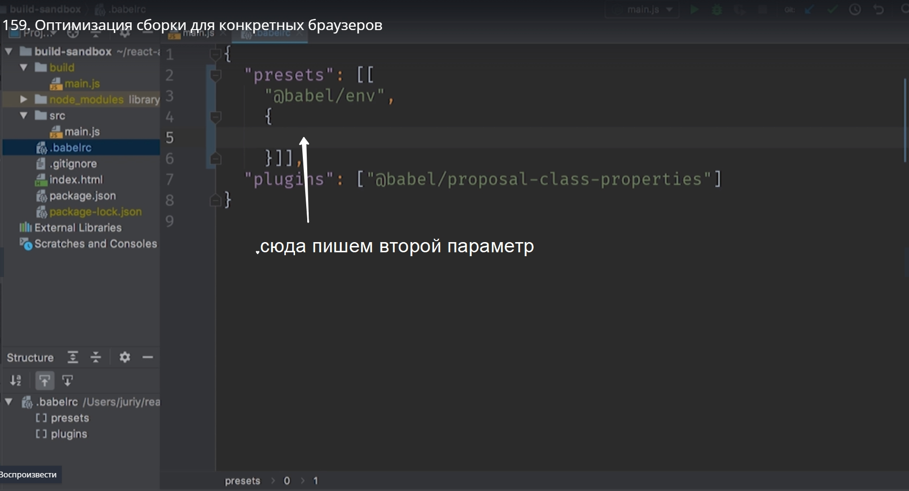
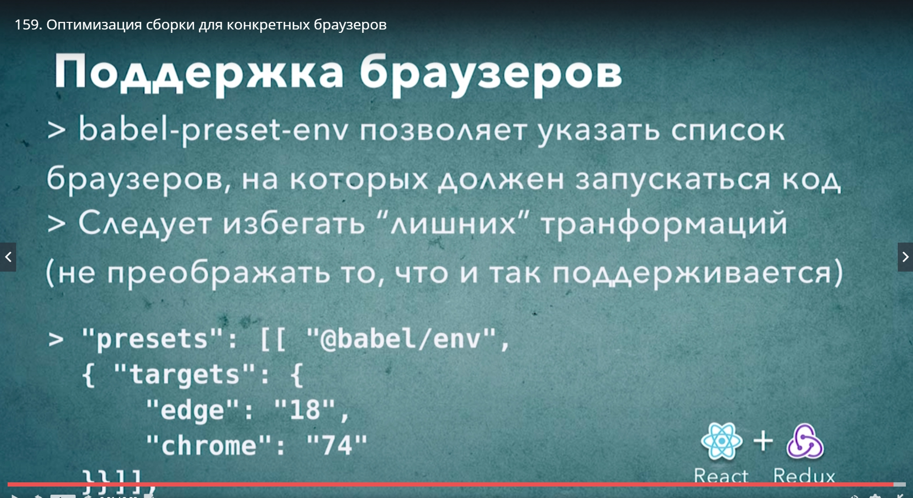

# Оптимизация сборки для конкретных браузеров

В babelrc помимо самого preset мы можем указать дополнительные свойства этого preset. 

Но синтаксис немного не обычный. Если мы хотим передать в preset дополнительные параметры, то вместо preset нам нужно передать массив где первым элементов будет сам preset. Ну а вторым элементом  будет объект с настройками для этого preset.



Вторым параметром мы указываем **targets** цели в переводе, и далее указываем конкретные версии браузеров которые мы хотим поддержать.

```
{
"presents":[[
    "@babel/env",{
        "targets":{
            "edge":"18",
            "chrome":"74"
        }
    }
]],
"plugins":["babel/proposal-class-properties"]
}
```




