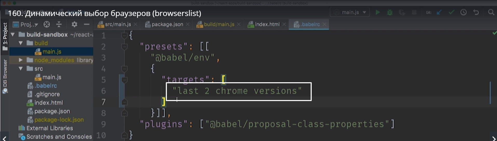
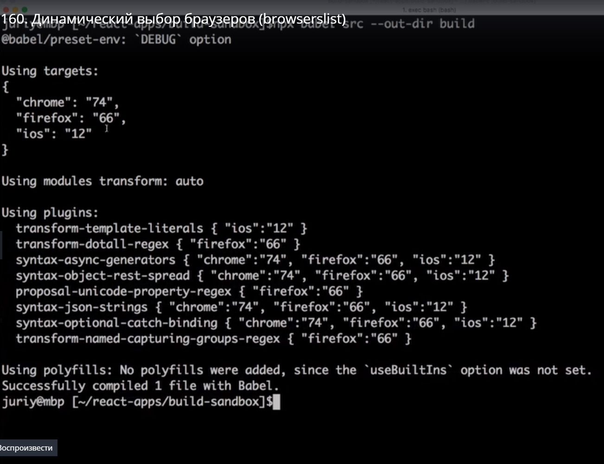
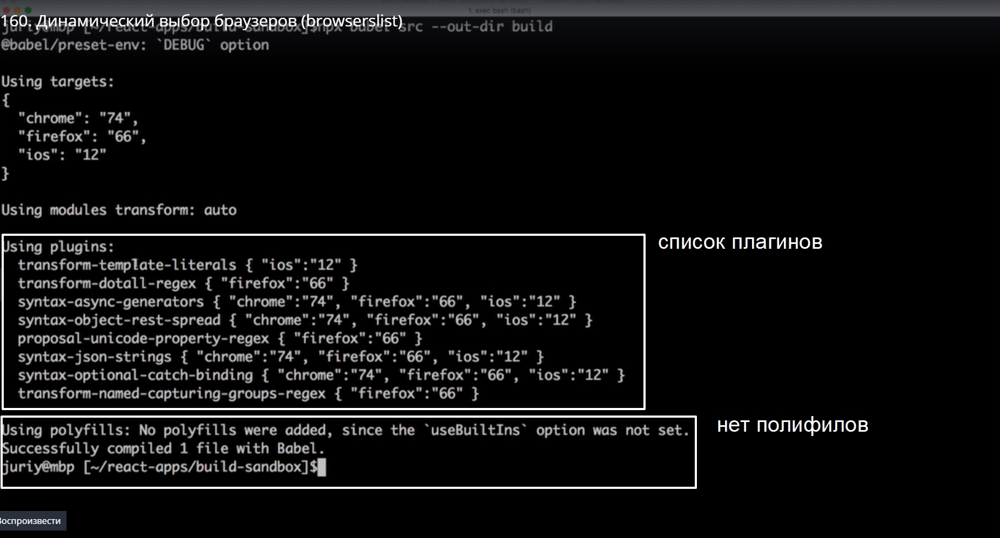
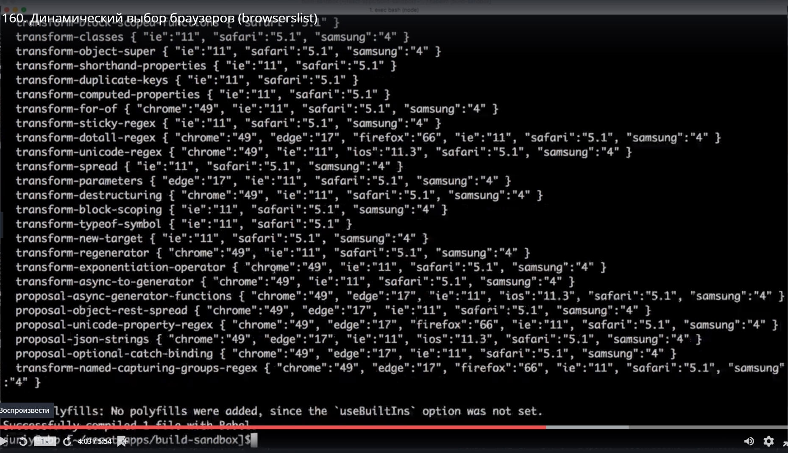
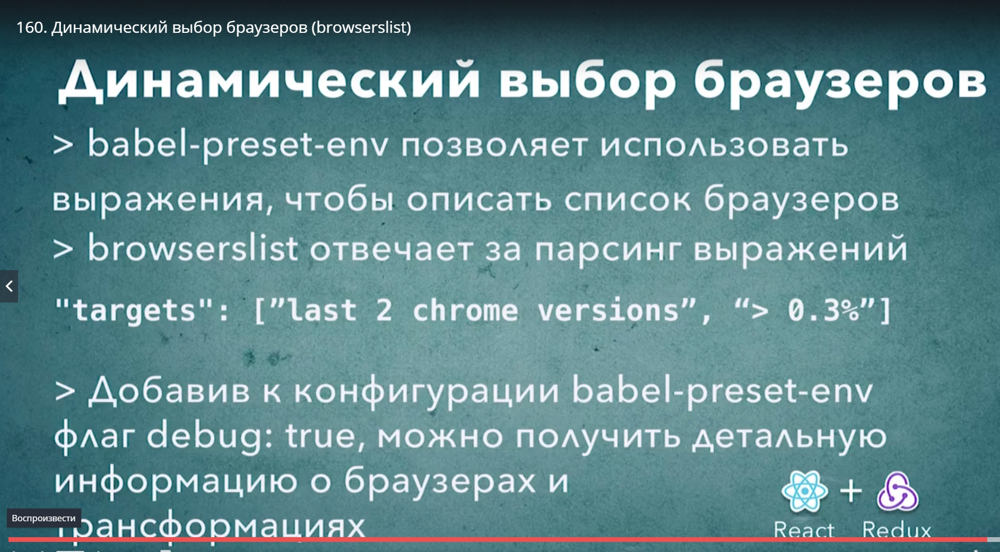

# Динамический выбор браузеров (browserslist)

Возможности preset-env не заканчиваются на выборе конкретных браузеров. В качестве целевой платформы  в targets можно указать выражение, которое будет исполняться динамически и выбирать за нас нужные браузеры по каким-нибудь признакам.
К примеру мы можем указать последние версии chrome. Нужно немного изменить синтаксис targets, теперь это будет массив. И это будет массив строк и пишем

```
{
    "presents":[[
     "@babel/env",
     {
         "targets":[
         "last 2 chrome versions"
         ]
     }]],
     "plugins":["@babel/proposal-class-properties"]
}

```

Если перезапустить build то мы увидим что это выражение тоже работает

> npx babel src --our-dir build

Но самое интересное, помере того как будут выходить новые версии chrome это выражение,"last 2 chrome versions",



будет давать разные результаты и мы будем автоматически поддерживать только свежие версии и опускать поддержку тех версий которые нам больше не интересны.

И эти выражения можно комбинировать.

```
{
    "presents":[[
     "@babel/env",
     {
         "targets":[
         "last 2 chrome versions",
         "last 2 firefox versions",
         "last 2 ios versions"
         ]
     }]],
     "plugins":["@babel/proposal-class-properties"]
}

```

Но вот интересный вопрос. Как  же нам узнать какие именно браузеры мы поддерживаем. Сделать это очень просто. Нужно добавить еще один параметр который называется **debug** в нашу конфигурацию preset и тогда во время сборки мы в консоли увидим под какие именно браузеры мы собираемнаш код. 
Пишем в параметрах

```
{
    "presents":[[
     "@babel/env",
     {
         "debug": true, //для отображения версий браузера в консоли добавляем этот параметр
         "targets":[
         "last 2 chrome versions",
         "last 2 firefox versions",
         "last 2 ios versions"
         ]
     }]],
     "plugins":["@babel/proposal-class-properties"]
}

```

Если мы снова запустим свой babel build

> npx babel src --out-dir build

то мы увидим в консоли что у нас появилось на много больше информации




Кроме вывода поддерживаемых браузеров мы видим список плагинов,



Рядом с каждым плагином будет версия браузера для которой эта трансформация нужна.

Но есть и другие способы определить какие браузеры будут поддерживаться. можно зайти на сайт [https://browserl.ist/](https://browserl.ist/) в строке поиска ввести выражение которое мы используем в массиве  и посмотреть какие браузеры выберет browserslist.
Это и есть та библиотека которая отвечает за выбор браузеров в нашем приложении. Это opensorce библиотека, она доступна на gitHub [https://github.com/browserslist/browserslist](https://github.com/browserslist/browserslist)


Идем еще дальше.

```
{
    "presents":[[
     "@babel/env",
     {
         "debug": true, //для отображения версий браузера в консоли добавляем этот параметр
         "targets":[
             "> 0.3%" // это выражение означает что мы хотим поддержать все браузеры у которых количество пользователей в мире это 0.3%
         ]
     }]],
     "plugins":["@babel/proposal-class-properties"]
}

```

это выражение означает что мы хотим поддержать все браузеры у которых количество пользователей в мире это 0.3%

И если мы снова запустим build nj мы увидим что количество браузеров стало намного больше



Кроме того можно комбинировать выражения. К примеру мы хотим все браузеры у которых больше 0.3% бользователей, но мы не хотим поддерживать enternet Explorer, т.е. никакая версия enternet Explorer  которая больше нулевой не должны попасть в наш список браузеров

```
{
    "presents":[[
     "@babel/env",
     {
         "debug": true, //для отображения версий браузера в консоли добавляем этот параметр
         "targets":[
             "> 0.3%",
             "not ie > 0" // Кроме Enternet Explorer 
         ]
     }]],
     "plugins":["@babel/proposal-class-properties"]
}

```

После перезапуска build  мы увидим что Enternet Explorer у нас больше не поддерживается.

Несмотря на то что эта возможность preset-env  довольно интересная нужно не забывать что использовать такие выражения в реальных проектах не всегда хорошая идея. К примеру мировая статистика не имеет ничего общего с географией ваших пользователей  и ваших конкретных условий бизнеса. Поэтому лучшим подходом будет указать конкретные браузеры которые вы собираетесь поддержать. И помните одна из главных ошибок которые совершают начинающие команды. Если ваша команда не пользуется браузером или даже не знает о существовании каког-нибудь браузера, это совершенно не означает что этот браузер не заслуживает поддержки.



