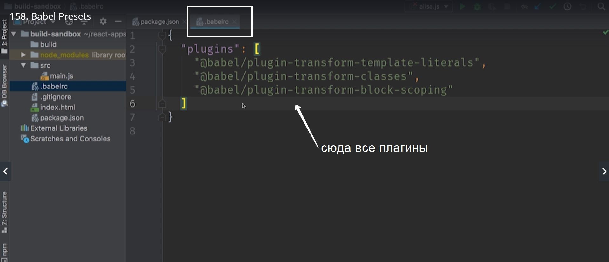
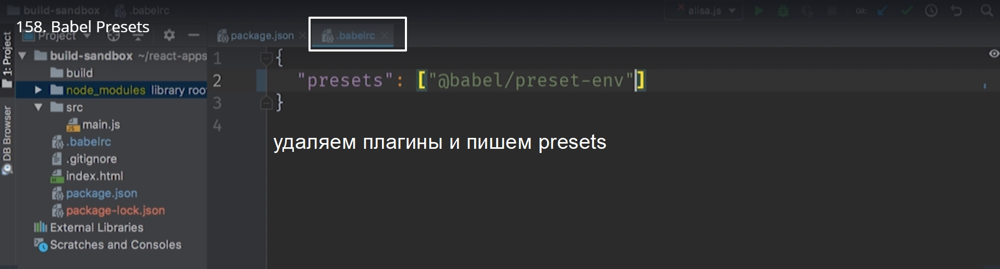
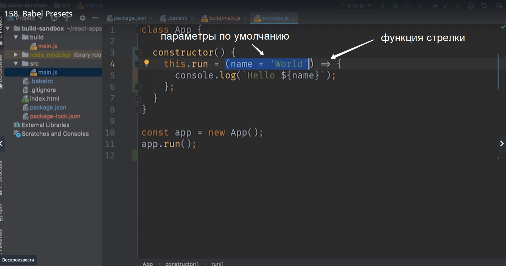
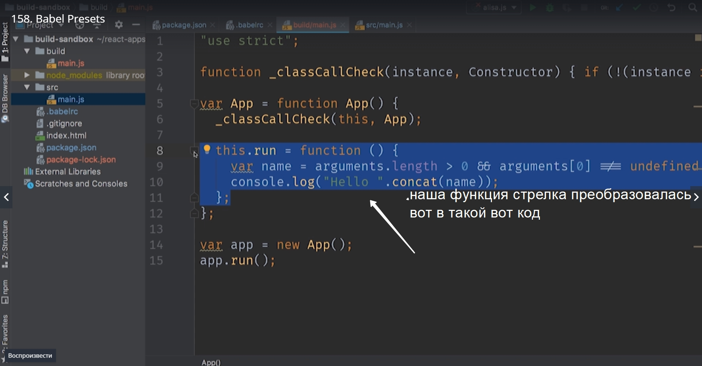
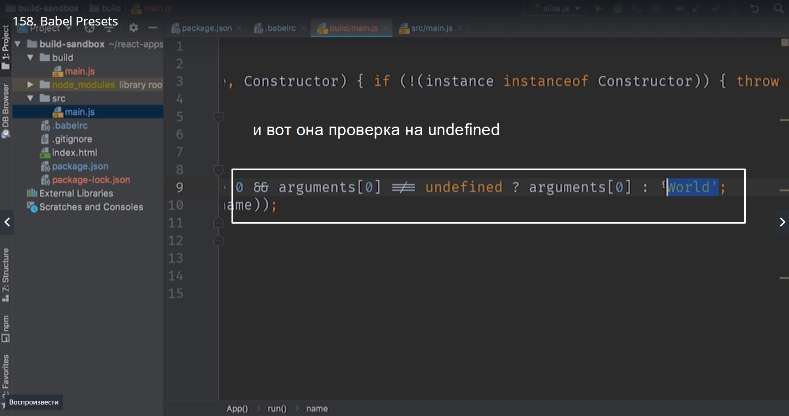
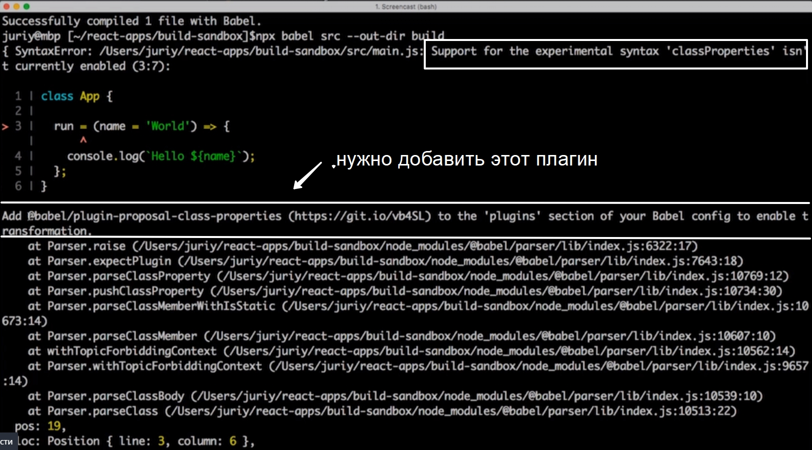
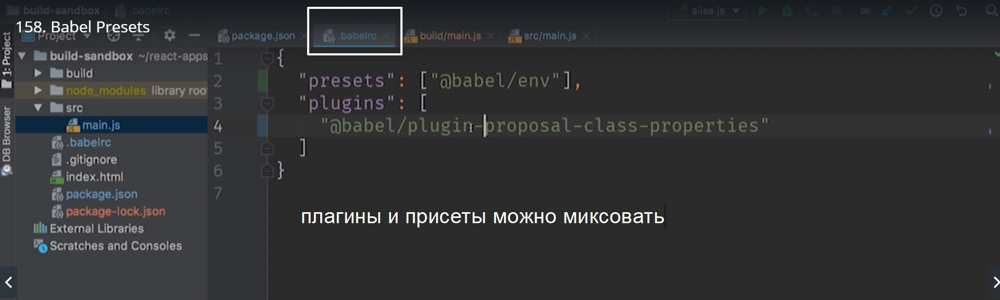
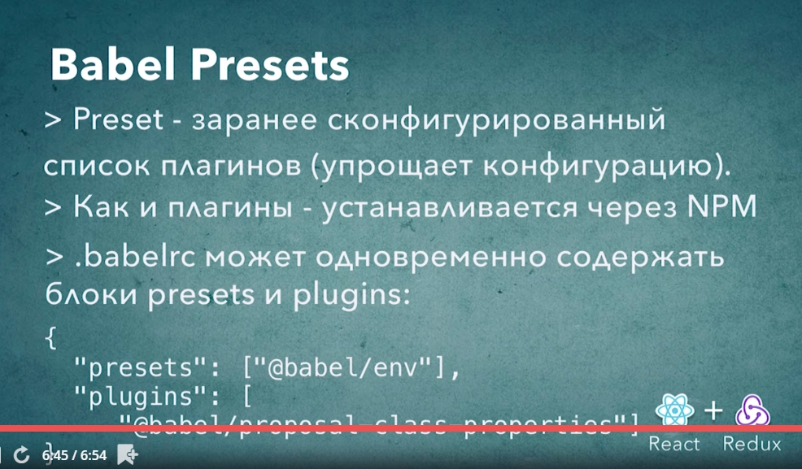

# babel presets (предустановки babel)

Мы уже знаем как вынести конфигурацию плагинов в отдельный файл. Но даже с этой возможностью настройка babel под свои нужды может быть весьма трудозатратным процессом.     
Если в этом блоке перечислить все плагины



что бы преобразовать наш код их ECMAScript2019
ES5 то у нас получится список где-то 30-ти плагинов. Ну и совершенно очевидно что вручную хранить такой список и поддерживать совершенно не удобно.

Что бы упростить эту конфигурацию у babel есть еще один механизм presets. Это в переводе преднастройки.

preset это заранее сконфигурированный список плагинов который можно передать в babel что бы не перечислять плагины по одному вручную. 

Давайте посмотрим на такой пример.
[https://babeljs.io/docs/en/babel-preset-env](https://babeljs.io/docs/en/babel-preset-env)

Этот preset содержит в себе все плагины что бы поддержать самый свежий стандарт ECMAScript. Эксперементальные возможности в этот preset не входят.

Установка

preset это самый обычный npm пакет и устанавливается точно так же как плагины.

> npm install --save-dev @babel/preset-env




Перезапускаем babel

> npx babel src --out-dir build

Пишем код для проверки

```
class App{

constructor(){
    this.run = (name = 'World') =>{
        console.log(`Hello ${name}`);
    };
}
}

const app = new App();
app.run();

```

Если бы мы и раньше добавляли по одному плагину для тех возможностей языка которые мы хотим поддержать то сейчас нам нужно было бы добавить еще два плагина. Один плагин для поддержки функции стрелок. А другой плагин для параметров по умолчанию.



Но благодаря нашему присету эти плагины уже подключены и работают.

перезапускаем babel

> npx babel src --our-dir build





**Но мы использовали так же эксперементальный синтаксис не вошедший в стандарт** К примеру поля классов.

```
class App{

run = (name = 'World') =>{
console.log(`Hello ${name}`);
};
}

const app = new App();
app.run();

```

Этот синтаксис пока что не вошел в стандарт.

И если мы запустим babel нам в консоли выдаст ошибку. Нам скажут что у нас не верный синтаксис и даже укаэут где ошибка. 

Но babel идет еще дальше. Он определяет какой синтаксис мы используем и подсказывает нам.



Нужно добавить этот плагин в секцию плагинов вашей конфигурации для того что бы включить эту трансформацию.



Теперь нужно установить этот плагин. Каждый плагин это npm пакет.

> npm install --save-dev @babel/plugin-proposal-class-properties

И конечно же перезапускаем babel

> npx babel src --out-dir build




