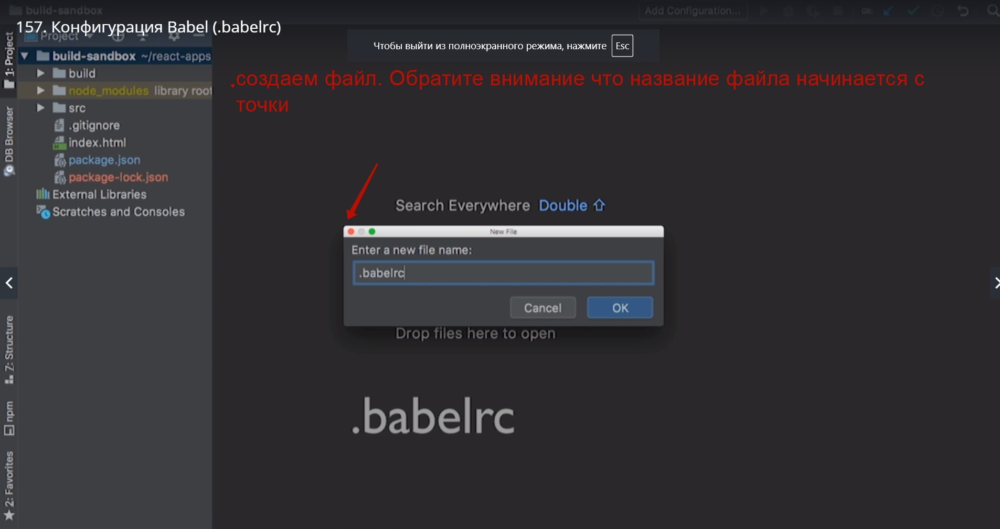
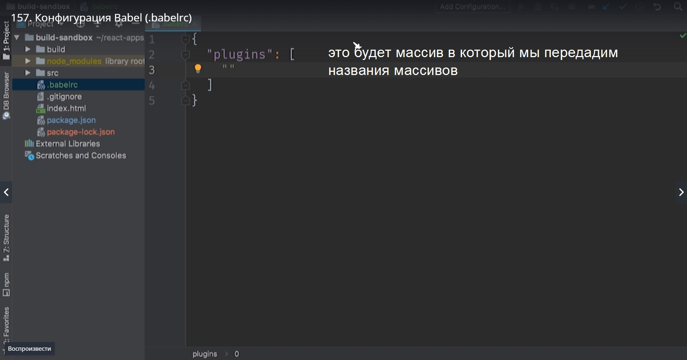
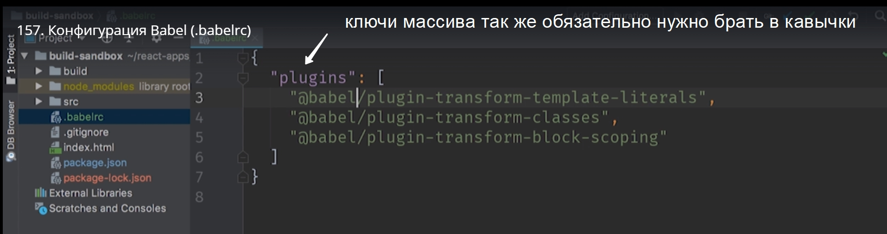
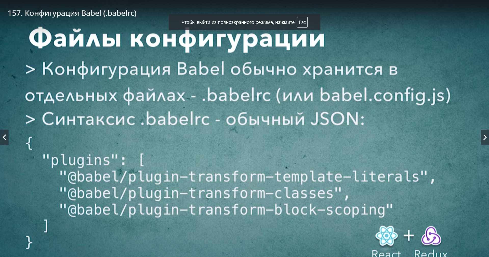

# Конфигурация Babel (.babelrc)

У babel  есть простой способ что бы указать конфигурацию для компилятора, и этот механизм это конфигурационные файлы. 
Babel поддерживает несколько форматов кофигурациооных файлов. Это могут быт .jason или .js файлы.



Внутри этого файла мы должны поместить обычный json объект. Внутри этого объекта можно указать параметры конфигурации и первый параметр конфигурации. 
И первый параметр который мы укажем это список плагинов который будет использовать babel, тот самый список который до этого мы передавали командной строке




```
"plugins":[
    "@babel/plugin-transform-template-literals",
    "@babel/plugin-transform-classes"
    "@babel/plugin-transform-block-scoping"
]

```

Обратите внимание внутри этого файла используется синтаксис json. Поэтому если нам захочится использовать одинарные кавычки вместо двойных для определения строки, то это будет неправильным синтаксисом и такой файл не заработает.

И еще одна особенность! Ключи мы тоже должны брать в кавычки



Запускаем npx babel снова укажем основные параметры директории откуда нужно взять файлы и путь деректории в которую нужно положить трансформированные файлы. Ну а список плагинов нам теперь указывать не надо т.к. babel найдет их в файле babelrc.

> npx babel src --out-dir build

Конфигурация движка для более детального изучения [https://babeljs.io/docs/en/configuration](https://babeljs.io/docs/en/configuration)



