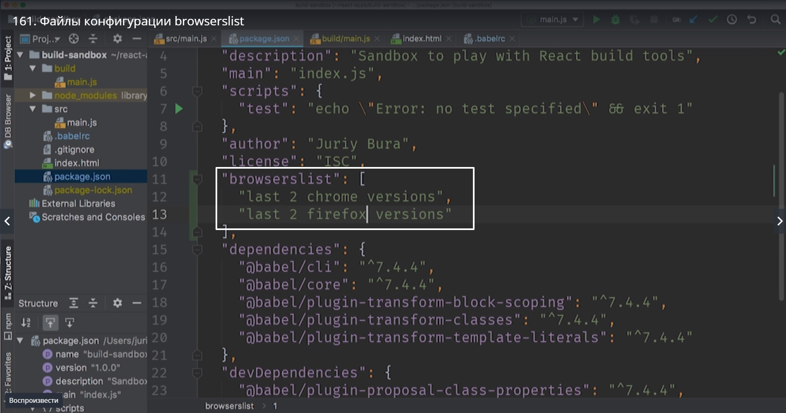
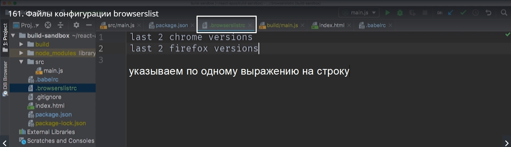
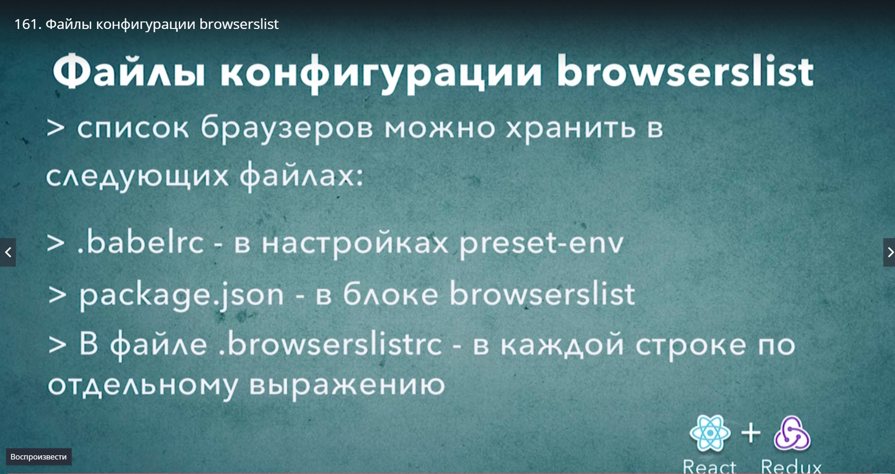

# Конфигурационные файлы browserslist

Держать эту информацию в babelrc не всегда удобно. Есть еще несколько файлов в которые можно добавить ту же самую конфигурацию и в которых ее держать и поддерживать будет немного удобнее.

Первое место это **package.json**. Этот файл традиционно описывает свойства и требования для конкретного проекта. Этот файл зародился в среде **nodeJS** и одним из атрубутов стандартной конфигурации для этого файла был атрибут **angens** вроде так пишется.
Это список движков nodeJS и npm с которыми совместим данный конкретный проект.

По сути  список браузеров это точно такой же атрибут. Он описывает список платформ на которых будет работать это приложение.

пишем этот блок

если теперь мы перезапустим build то благодаря строке debug: true мы увидим список браузеров.

Держать это в сдесь довольно удобно.

Есть еще один способ.
Впапке с проектом создаем еще один файл **.browserslistrc**

