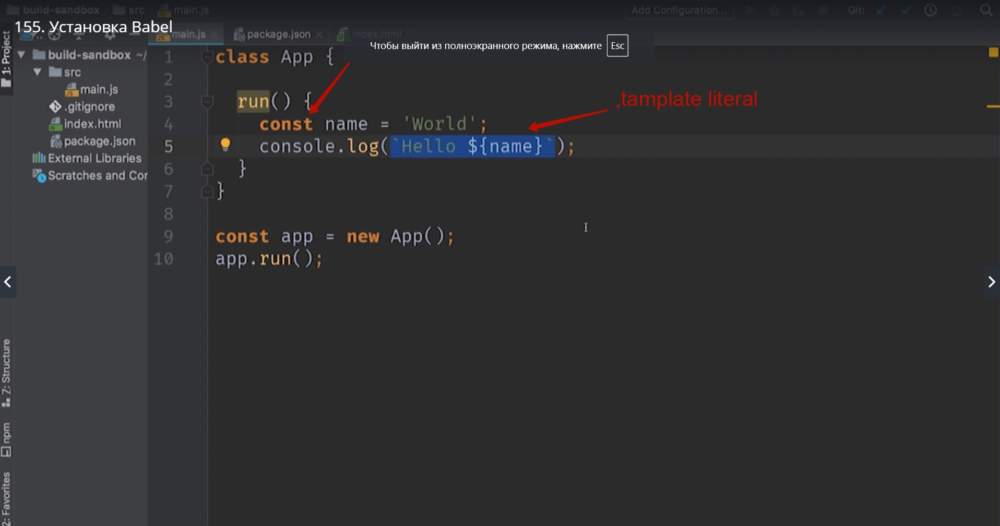
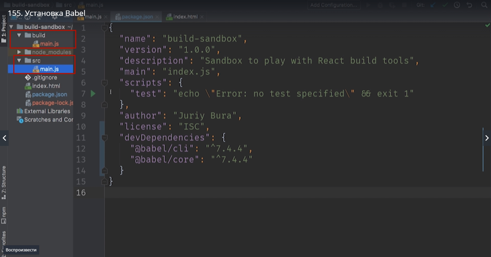
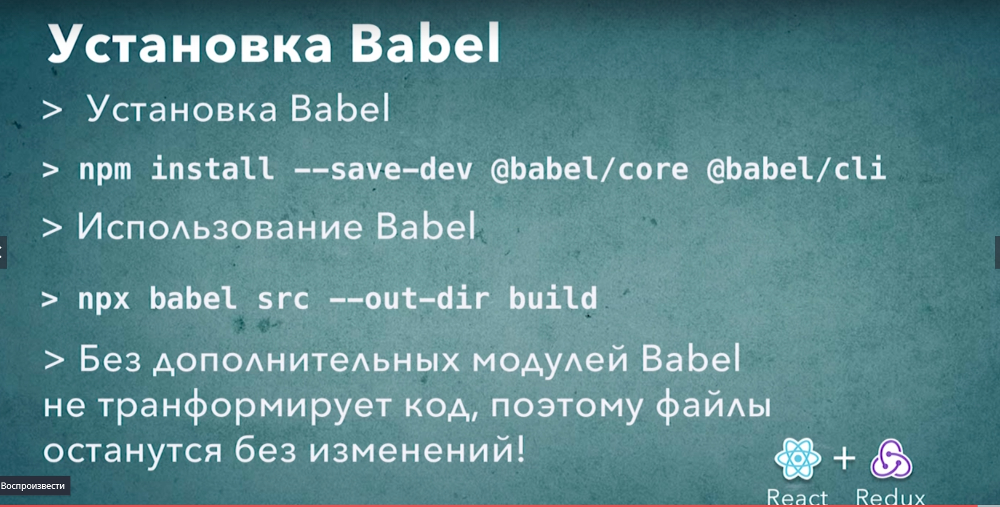

# Установка Babel

Когда у нас есть тестовый проект мы можем преобразовать его таким образом что бы этот код мог запускаться на более старых версиях браузерах. К примеру на тех браузерах которые не поддерживают объявление const или template literal

Устанавливаем

> npm install --save-dev @babel/core @babel/cli

**--save-dev**  он говорит npm что те зависимости которые мы будем устанавливать это те зависимости которые мы будем использовать исключительно для разработки. Этот флаг нужен нам разработчикам для того что бы вспомнить какие именно библиотеки мы используем только во время разработки. Например библиотеки для сборки и для трансформиции кода.

Еше вот такой вот формат имени пакета **@babel/core**. Это относительно свежая возможнось babel которая называется name space т.е. пространство имен. 

Для трансформации нашего файла используем команду **npx**. **npx** это утилита которая сможет запустить в качестве скрипта один из тех пакетов которые мы установили т.е.запустить его как обычное приложение. Далее мы должны указать то что мы хотим запустить **npx babel** и для того что бы babel заработал нам нужно указать пару параметров. Первый параметр это то откуда мы будем брать исходные файлы и это папка **src**. Второй флаг который мы укажем это  **--out-dir** это путь к той папке в которую мы будем складывать трансформированные файлы т.е. те файлы которые будут преображены в более старую версию ECMASript. И мы укажем папку **build**

>npx babel src --out-dir build

Но в файле main.js ни каких преобразований не произошло. Все дело в том что babel  это модульный компилятор. И для того что бы он начал преображать наш код нам нужно указать какие именно аспекты языка мы хотим преобразовывать. Это очень удобная особенность которая позволяет нам настроить поведение bable именно таким образом как нужно для нашего проекта.

