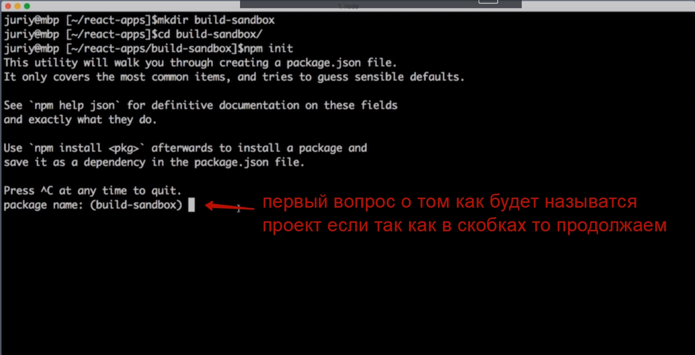
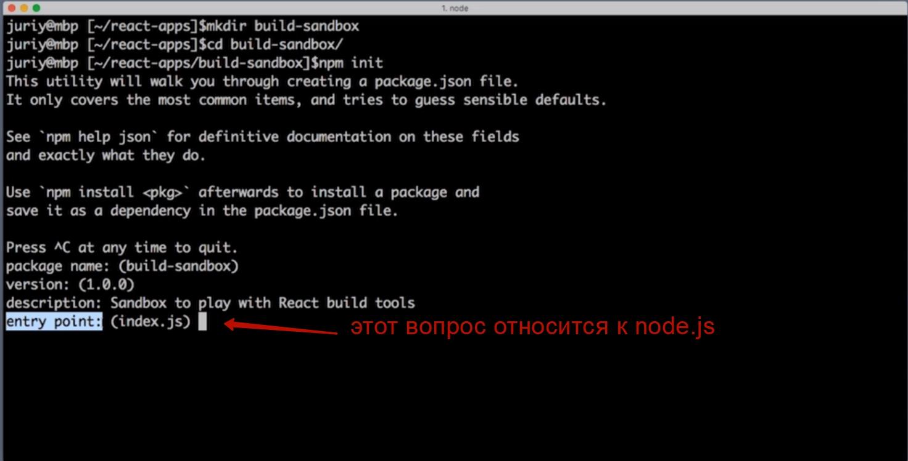
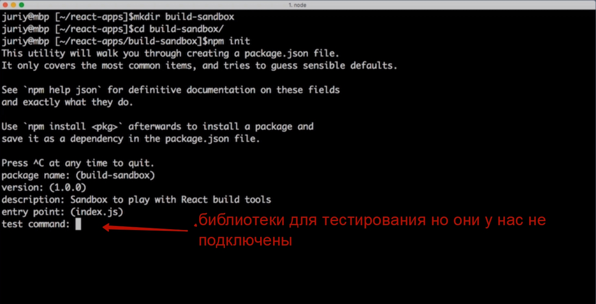
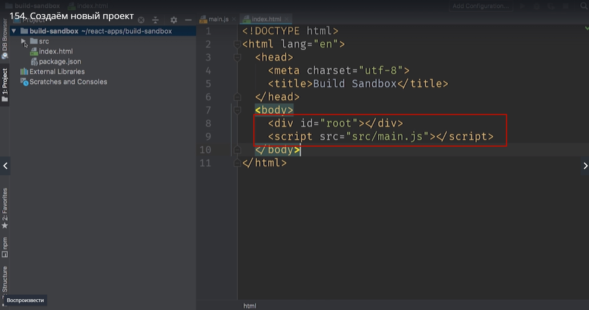

# Новый проект

Создаем этот проект с пустой папки, с ноля.

> mkdir и название папки

Далее инициализируем проект

>npm init

при инициализации проекта npm задаст нам пару вопросов и используя наши ответы создаст пустой файл package.json

если мы не хотим ни каких вопросто мохно добавить -y

> npm init -y

оозначает yes и использует все ответы по умолчанию.



Далее version, устанавливаем нужную для нас версию. 
description, можем оставить небольшое текстовое описание.



какой файл будет считаться главным index.js. Но в нашем проекте мы его использовать не будут.



> **git repository:** добавляем ссылку
> **keywords:** ключевые слова они нужны исключительно для индексации и поиска
> **author**:  кроме имя можем добавить < email >
> **license: ISC** это лицензия opensorce
> it this ok? нажимаем enter

И после этого у нас появляется **package.json**.

Создаем небольшую структуру из папок и файлов в нашем проекте. Создаем папку src и в ней файл main.js.

B пишем код для проверки работоспособности проекта.

```
class App{
    run(){
        const name ='World';
        console.log(`Hallo ${name}`);
    }
}

const app = new App();
app.run();

```

Этот код вовсю использует синтаксис ECMAScript2015. Поэтому если мы попытаемся запустить этот код в старом браузере скорее всего мы получим ошибку.

Создаем index.html и создаем каркас. и добавляем.




