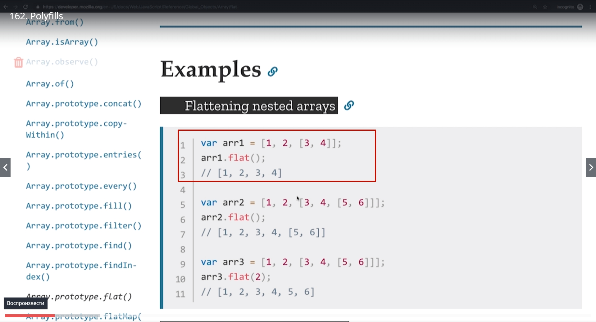
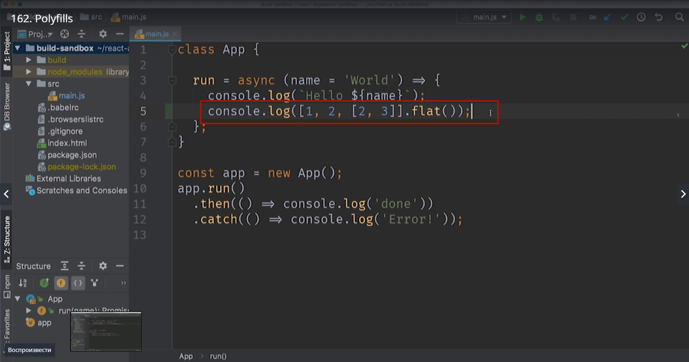
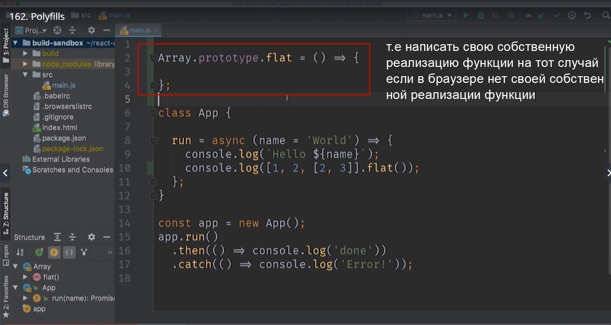
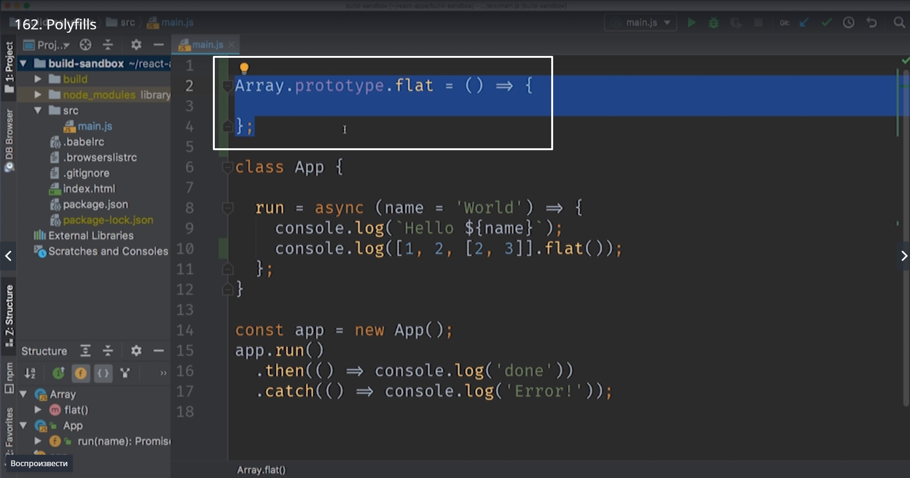
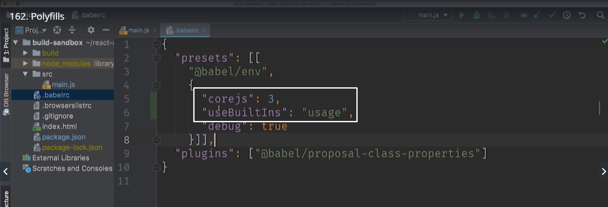
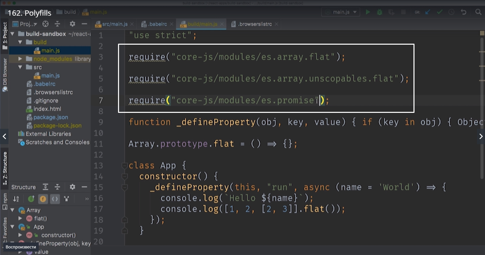
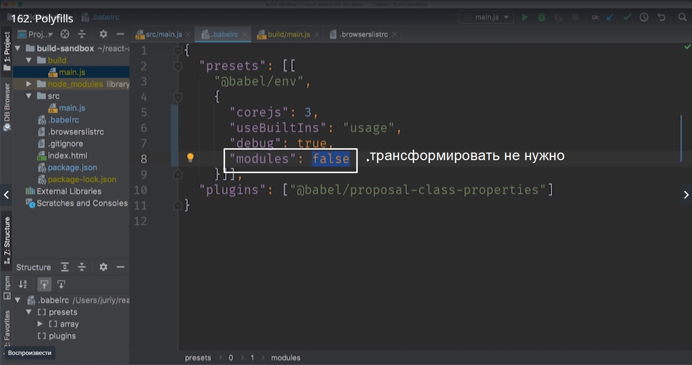
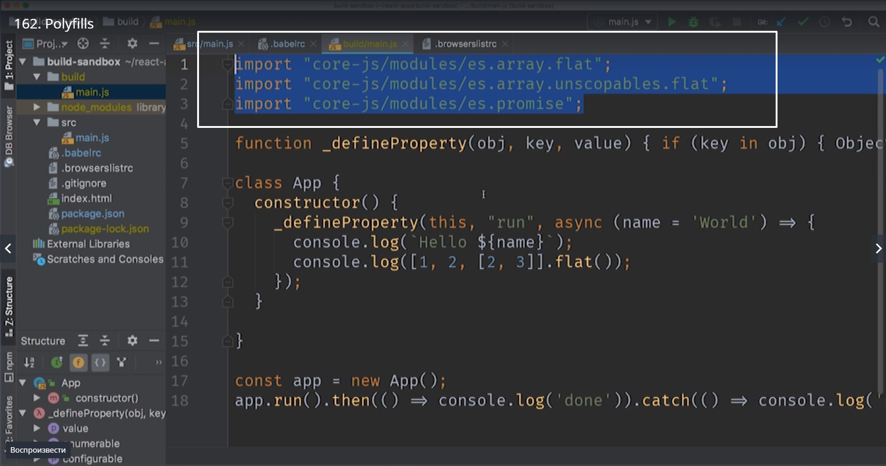

# Polyfills

Когда обновляется стандарт ECMAScript то многие нововведения языка это новые стандартные функции а не новый синтаксис. Пример такой функции [Array.prototype.flat()](https://developer.mozilla.org/ru/docs/Web/JavaScript/Reference/Global_Objects/Array/flat) которая относительно недавно появилась в стандарте ECMAScript. Эта функция позволяет уменьшить размерность массива. К примеру двумерный массив можно сделать одномерным

Суть в том что эта новая часть стандарта она не добавляет ни какого нового синтаксиса. Единственное что появляется это новая функция которая определена на объекте Array.prototype.

Соответственно для того что бы мы могли использовать эту функцию в коде 

нам не надо будет преображать этот синтаксис в какой-либо другой т.к. с точки зрения синтаксиса сдесь все ок.
Только вот проблема эта функция доступна не во всех браузерах. И решить эту проблему довольно просто. Поскольку JS это динамический язык мы можем изменять совершенно любые стандартные функции. Ну и добавлять свои собственные стандартные функции.

Для того что бы добавить это поведение мы могли бы добавить

Конечно если бы это был бы настоящий код. Мы бы сначала проверили что функции flat действительно нет на объекте Array.prototype. Ну а затем только добавляли бы ее к прототипу масива.

Вот этот код

который добавляет новую стандартную функцию, новую глобальную функцию и называется Polyfill.
Точно так же как и с остальными стандартными аспектами языка мы не хотим работать вручную с Polyfill.
Есть отличная библиотека которую использует babel. Эта библиотека называется **coreJS** которая как раз содержит необходимые polyfills.
Если ваш код использует не только новый синтаксис но и вот такие вот функции. Эта библиотека сделает так что бы эти функции были доступны.

Подключить **coreJS** совсем не сложно.

Устанавливаем

> npm install core-js

После установки добавим конфигурацию в наш файл .babelrc. В presets добавим несколько параметров

**"corejs"**: и указываем последнюю версию библиотеки.
Самая интерестная строка это **"useBuiltIns":"usege"**. Это означает что babel находит те места в коде которые используют новые функции языка и подключить только те Polyfills, только те функции которые действительно нужны для того что бы этот код работал.
вот что получилось в коде. Мы импортируем три функции

Это и есть реализация полифилов, дополнительных функций которых пока нет в нашем браузере.
Нужно заметить что babel использовал функцию require для того что бы подключить эти модули. Это метод который используется в nodeJS и намного реже в браузерах. 
В нашем коде нам не нужно использовать ключевое слово require поскольку мы подключим WebPack который будет заниматься обработкой модулей. Мы можем сказать что выражение import не нужно трансформировать. Достаточно добавить еще один параметр в конфигурацию

Перезапускаем buid и смотрим.

Когда вы получите этот код не спешите его исполнить. Для того что бы он заработал, нужно сделать так что бы заработали import, а для этого нам понадобится WebPack.