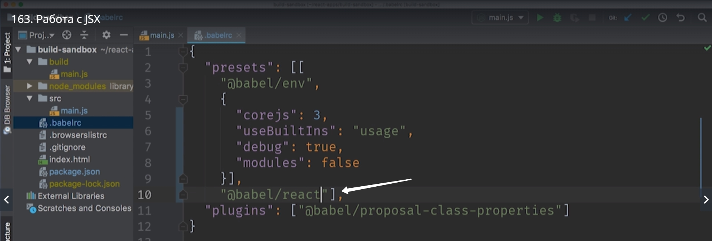

# Работа с JSX

Пишем код а после посмотрим как его преобразовать

```
import React from 'react';
import ReactDOM from 'react-dom';

const App = () => <p>Hello<p/>;

ReactDom.render(<App/>, document.getElementById('root'));


```

Если мы попробуем запустить этот код в браузере то у нас ничего не получится потому что это **< p>Hello< p/>** не стандартный синтаксис JS. Это синтаксис JSX и стандартный JS движок с этим синтаксисом не справится.

Для того что бы это приложение запустить в браузере мы преобразуем этот синтаксис в стандартный синтаксис JS. Ведь у react есть стандартный JS апи < App/> который можно использовать вместо JSX. 

И так установим react и reactDOM.

> npm install react react-dom

Ну и для того что бы трансформировать этот код нам понадобится еще один preset который называется @babel/preset-react

> npm install --save-dev @babel/preset-react

Этот preset содержит несколько плагинов которые позволяют babel обрабатывать JSX код. Все что нам нужно будет сделать это добавить этот preset к списку в .babelrc.



Запускаем buid и смотрим что получается. 


Но этот код все еще не заработает потому что нужно добавить поддержку ключевого слова import за который отвечает WebPack


