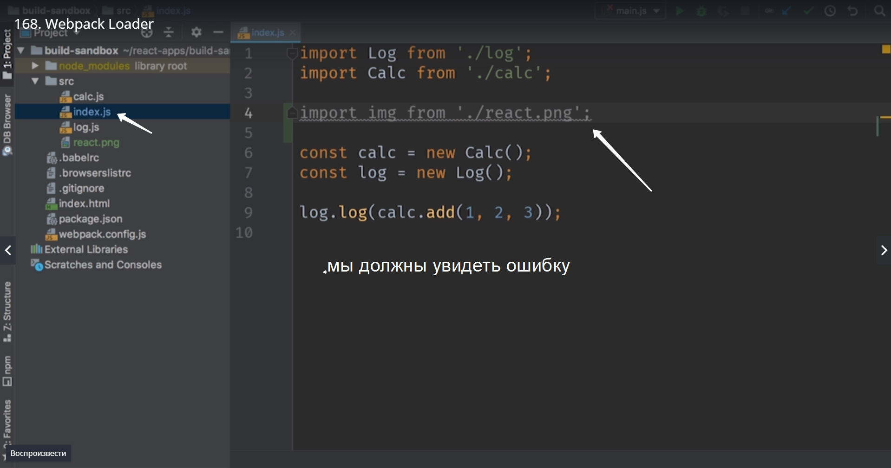
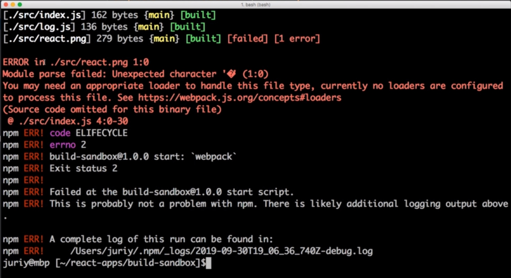
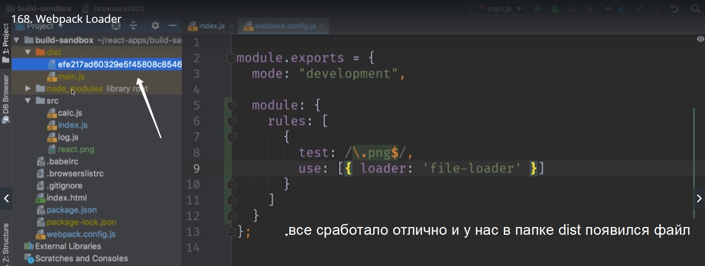
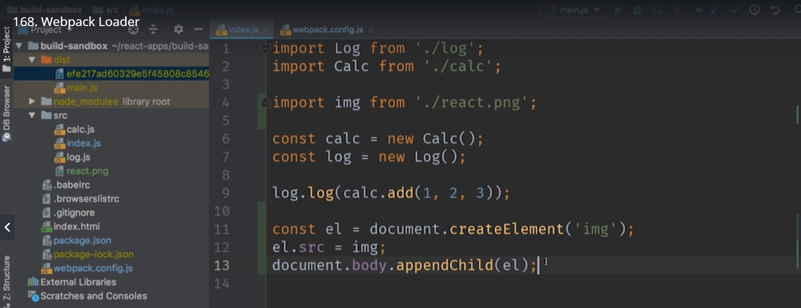
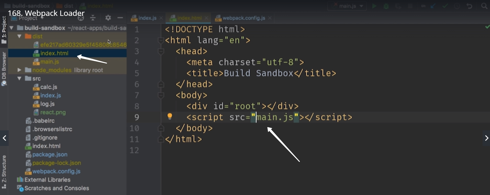
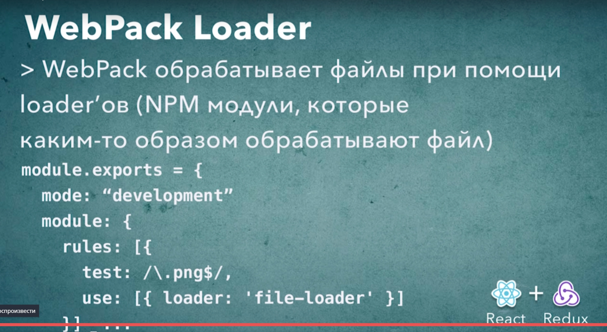

# WebPack Loader

Webpack отличается от большинства инструментов которые работают с модульным кодом. Основное отличие в том что большинство систем разделяют понятие ресурсов и модулей и обрабатывают по разному. 
Ресурсы это файлы с которыми почти ничего делать не нужно вроде html или сss ну или картинок и шрифтов.

А модули это динамические файлы js которые могут загружать другие модули или подгружать ресурсы.

Но WebPack работает иначе. Для WebPack любой файл это модуль. Это значит что совершенно любой файл может учавствовать в сборке. С точки зрения WebPack нет ни какой разницы между js css ну и к примеру шрифтом.

Мы помним что в качестве модуля можно было подключить css или изображение. Но возможности WebPack куда более широки. Можно подклучать scss или less файлы и преобразовывать их в обычный css для браузера. 

Как WebPack достигает такой гибкости? Поддержка других форматов это поддержка так называемых loader. Если говорить упрощенно то loader это функция которая знает что делать с файлами определенного типа и как их загружать и обрабатывать.

К примеру в нашем проекте может быть отдельный loader для картинок, для css b так далее.

Как только WebPack встречает файл который соответствует заданным критериям, вызывается Loader и обрабатывает файл.

И так поехали.
Добавим несколько loader и посмотрим как они работают.
Самый простой это file loader который загружает файл без преобразований и без обработки внутренней структыры файла. Этот Loader часто используется для загрузки шрифтов и изображений.



запускаем

> npm start



Вот она ошибка. WebPack сообщает нам о том что возможно у нас нет Loader xn  бы обработать этот файл и дает нам ссылку на документацию как сконфигурировать Loader.

Устанавливаем

> npm install --save-dev file-loader

И подключаем его к нашему проекту. Возвращаемся к нашему файлу webpack.config.js. Конфигурировать Loader мы будем в блоке module. И внутри блока module мы добавим еще один блок который называется rulse т.е. правила. Это коллекция правил как обрабатывать модули. Для того что бы научить WebPack работать с png файлами нам нужно добавить правило которое скажет что для png файлов мы будем использовать файл Loader.
Написать правило совсем не сложно. Правило это обычный объект. Свойство test это регулярное выражение которое позволяет выбрать только те файлы которые нужно обработать этим Loader. Наше регулярное выражение будет выглядеть так, все файлы которые заканчиваются на  /\.png$/ будут обрабатываться этим Loader.
Ну а затем в этом правиле нужно указать какой Loader мы будем использовать. И для этого мы будем использовать свойство use. use это массив каждый элемент которого описывает Loader и его конфигурацию. Часто бывает так что один файл обрабатывается сразу несколькими Loader. Пока в нашем массиве будет один элемент. И все что нам нужно сделать это добавить еще один объект {loader:'file-loader'}


```
//webpack.config.js

module.exports = {
    mode:"development",

    module:{
        rules:[
            {
                test:/\.png$/,
                use:[{loader:'file-loader'}]
            }
        ]
    }
};

```

перезапускаем и смотрим.

> npm start



Этот файл получил другое имя, но именно так работае file loader. Он переимеовывает файлы для того что бы файлы с одинаковым именем которые находятся в разных папках не конфликтовали между собой.
Теперь проверяем что все работает. Напишем немного кода пока что без rect.

```
//index.js

import img from './react.png';

const el = document.createElement('img');
el.src = img;
document.body.appendChild(el);


```



Если мы все сделали правильно то в теле нашего документа ,document.body.appendChild(el);, появится новый тег img  у которого src , будет указывать на нашу картинку.

Теперь еще один маленький но важный момент. WebPack будет считать что все файлы которые нужны для работы нашего приложения будут находится в папке dist и все пути ко всем файлам в коде будут рассчитываться от папки dist. Поэтому для того что бы все работало корректно нам нужно скопировать наш index.html в папку dist. И правим путь



С автоматическим добавлением html разберемся позже. Все получилось картинка отображается.



