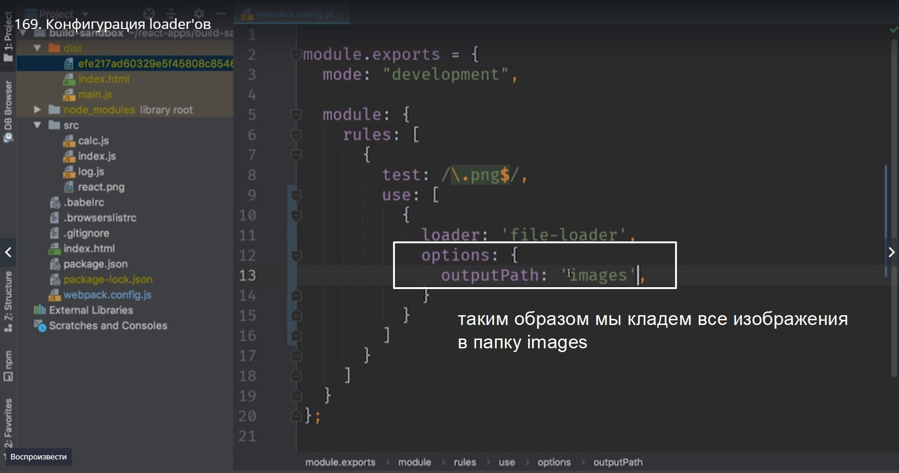
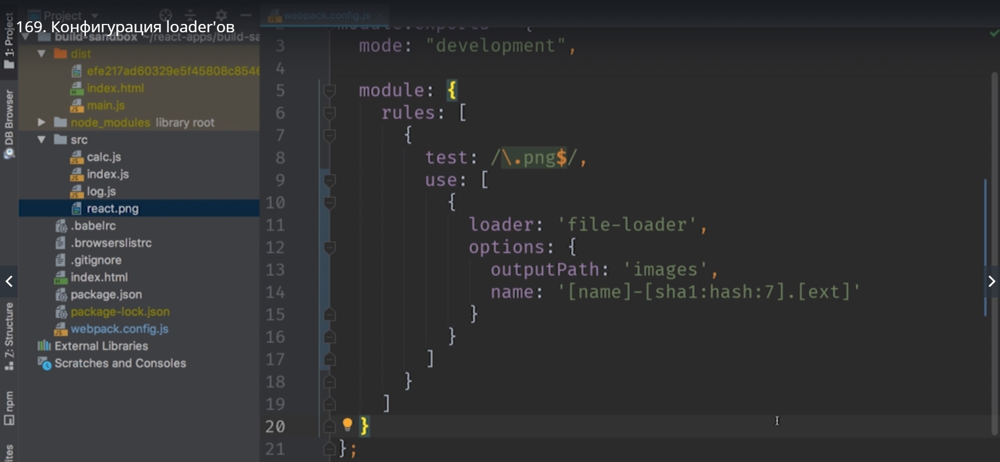
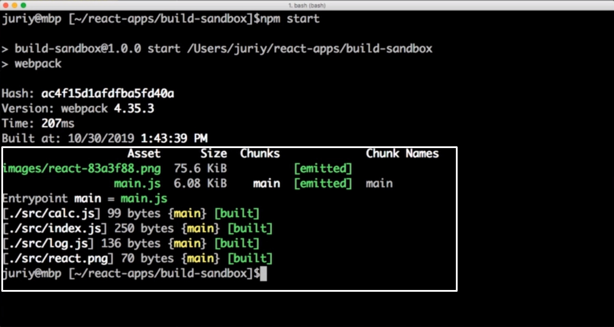
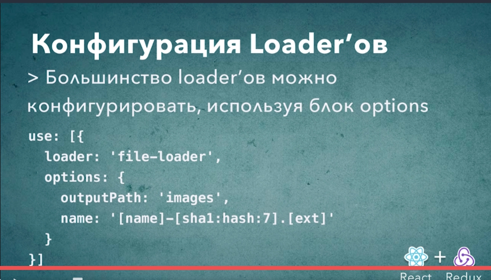

# Конфигурация WebPack Loader-ов

Loader можно конфигурировать и указывать как они будут работать.

Кладем все изображения в папку images. Под Loader передаем options  и options это обычный объект. в значение передаем outputPath и указываем 'images'.



Вторую опцию которую мы передадим это будет опция name и сдесь в качестве имени мы передадим паттерн который будет динамически интерпретирован WebPack и этот паттерн будет состоять из нескольких блоков. Первый блок [name] это оригинальное имя без рассширения. Далее мы пишем -[sha1:hash:7] семерка означает семь знаков. Ну и .[ext] рассширение.

```
module:{
    rules:[
        test:/\.png$/,
        use:[{
            loader:'file-loader',
            options:{
                outputPath:'images',
                name:'[name]'-[sha1:hash:7].[ext]
            }
        }]
    ]
}


```



перезапускаем и смотрим.



Читай документацию [https://webpack.js.org/concepts/#loaders](https://webpack.js.org/concepts/#loaders)



