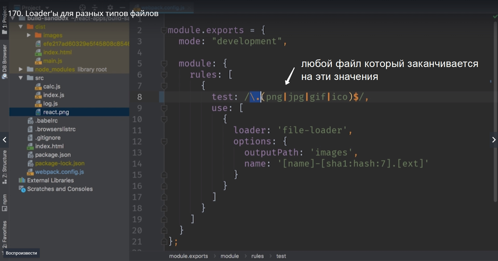
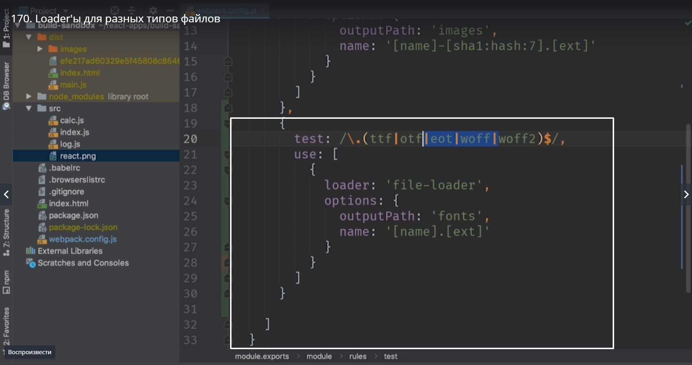
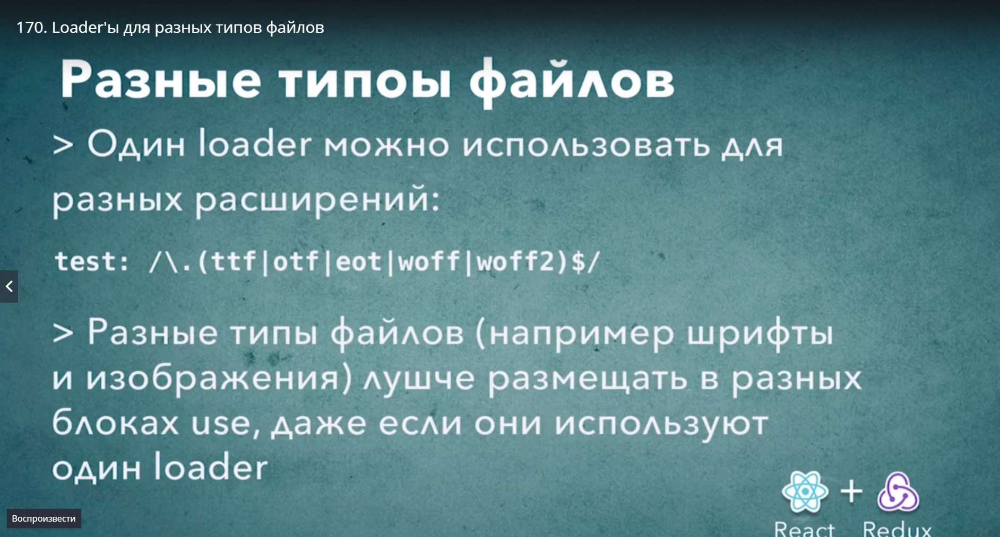

# Loader для разных типов файлов

Кроме того мы можем использовать файл kj дер и для других типов файлов. К примеру шрифты. 

Создаем новый блок

Поскольку это js файл мы можем добавить свои коментарии.

Для аудио и видео делаем так же. Для svg указываем fonts только название папки делаем не fonts а svg.

