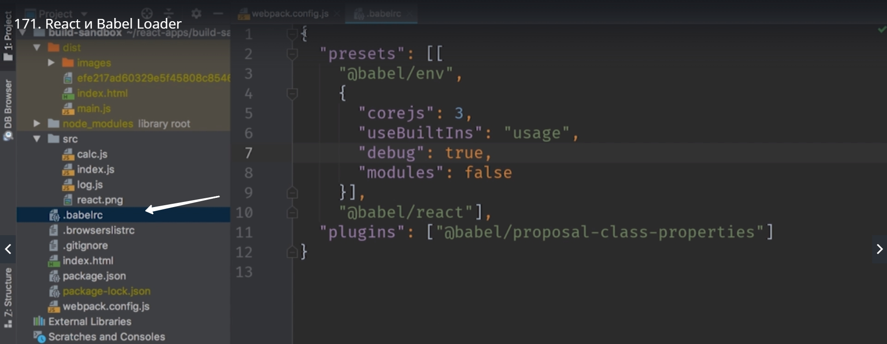
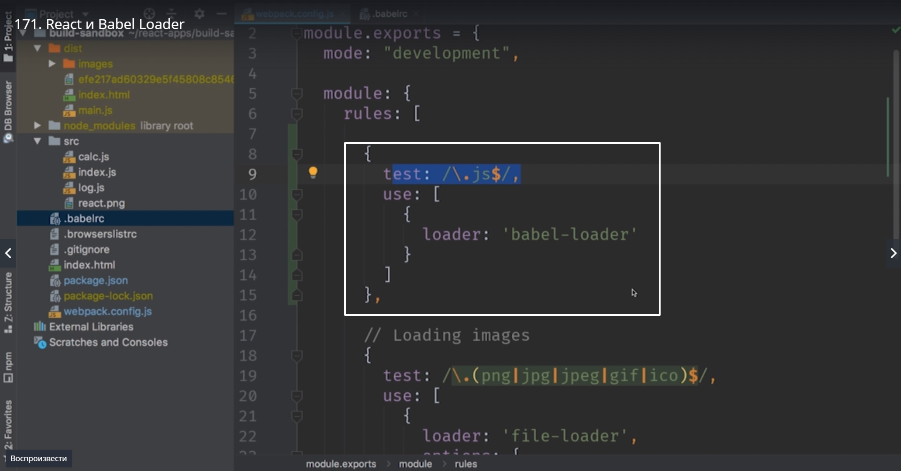
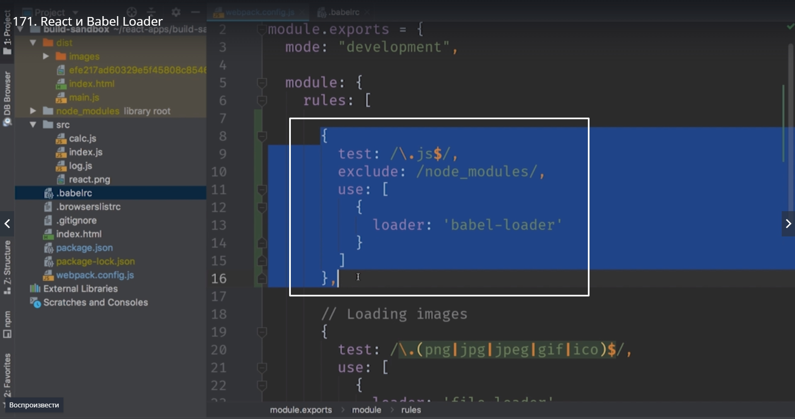
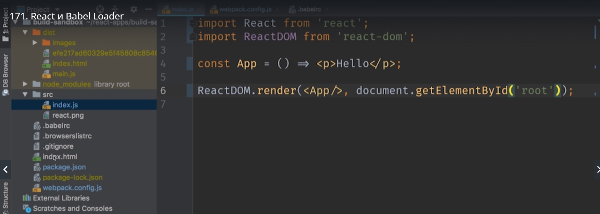
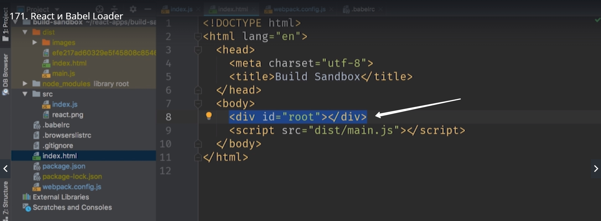
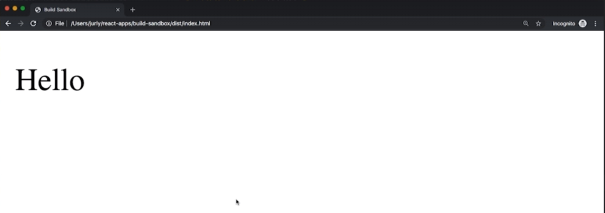
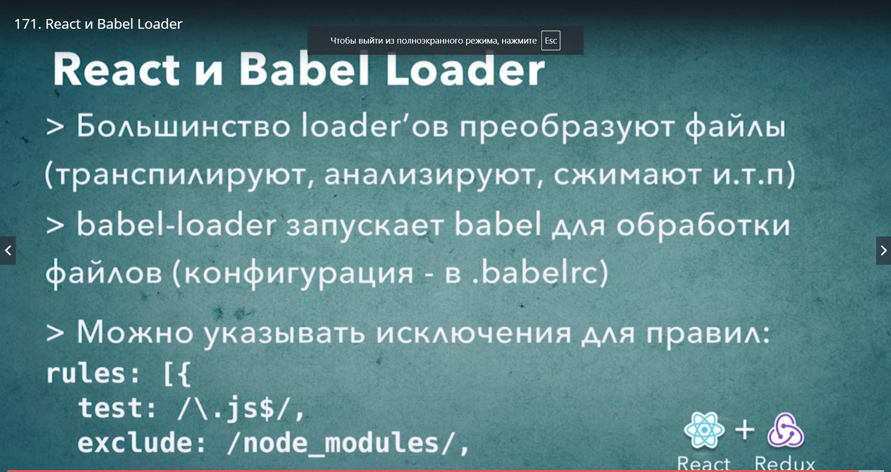

# react и babel loader

Давайте теперь посмотрим как мы можем преобразовывать файлы. Рассмотрим Babel. Сейчас посмотрим что бы Babel и WebPack работали вместе.
Достаточно Установить Loader и указать какие файлы обрабатывать. Ну а все детали конфигурации Babel загрузит из файла .babelrc



Переходим в консоль и устанавливаем babel-loader

> npm install --save-dev babel-loader

После установки возвращаемся к нашей конфигурации и добавляем еще одно правило.  Мы добавляем его первым, поскольку правило JS это самая главная часть нашего приложения, поэтому блок с конфигурацией js будет первым блоком.

```
test:/.\js$/, //это все файлы которые заканчиваются на .js
use:[{
    loader:'babel-loader' // и указываем что для загрузки этих файлов мы будем использовать babel loader
}]

```



Теперь абсолютно любые js файлы которых коснется WebPack будут проходить через Babel-loader.
Сдесь есть один маленький но очень сложный нюанс. В случае с js файлами нам нужно преобразовывать файлы только самого проекта, но не как файлы библиотек, те файлы которые мы загружаем из папки node_modules.

К примеру нам не нужно пропускать через Babel код самой библиотеки react ну или redux. Они уже из коробки готовы к использованию в браузерах.
Поэтому для этого правила мы добавим исключение. 
Для этого под test добавляем параметр exclude: в нем передаем регулярное выражение. Все что называется node_modules не будет проходить через babel. 

```
test:/.\js$/,
exclude:/node_modules/,
use:[{
    loader:'babel-loader'
}]

```



Удалим из проекта calc.js и log.js они нам больше не нужны.

И в index.js пишем простое react приложение

```
//index.js

import React from 'react';
import ReactDOM from 'react-dom';

const App = () => <p>Hallo</p>;

```



ReactDom.render(<App/>, document.getElementById('root'));

И перед тем как собрать наше приложение не забудем что для того что бы react начал работать нам нужен div с id root в нашем html.




> npm start



Теперь у нас есть минимальная конфигурация которая умеет собирать react проекты.




