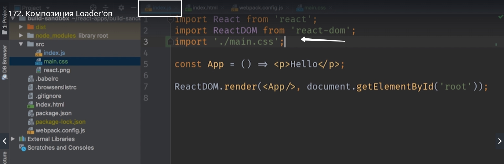
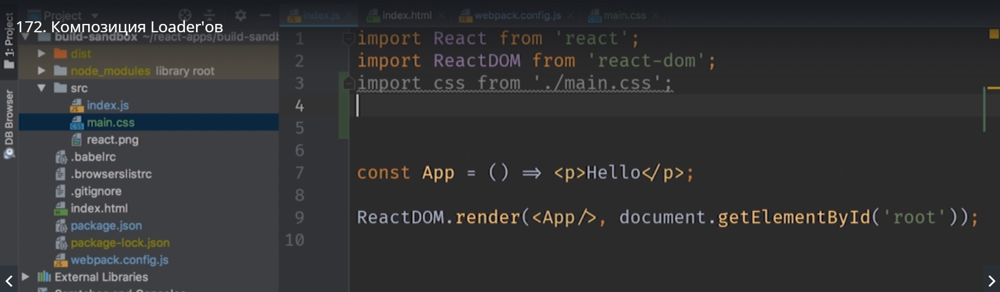
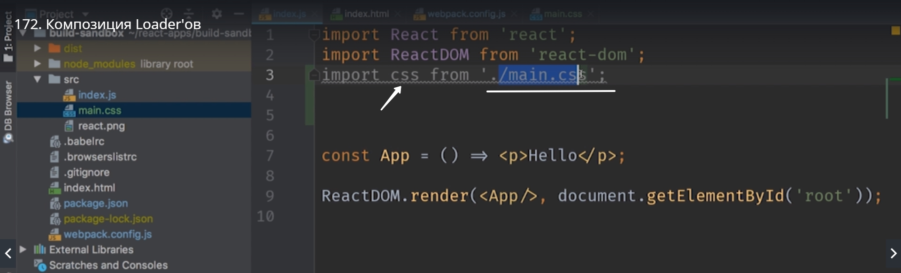
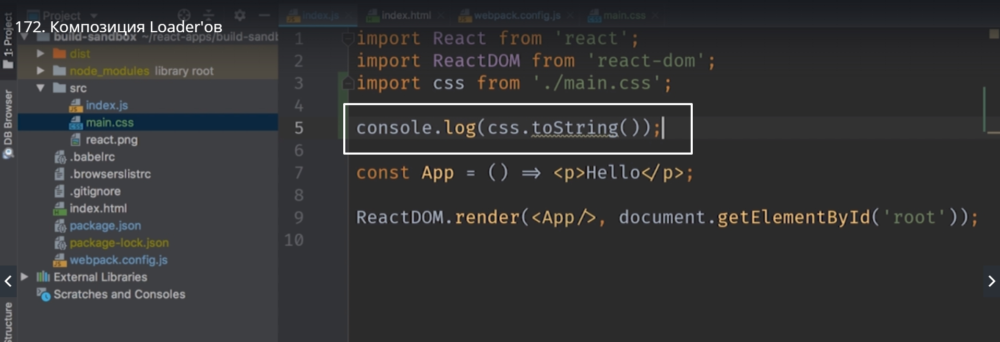
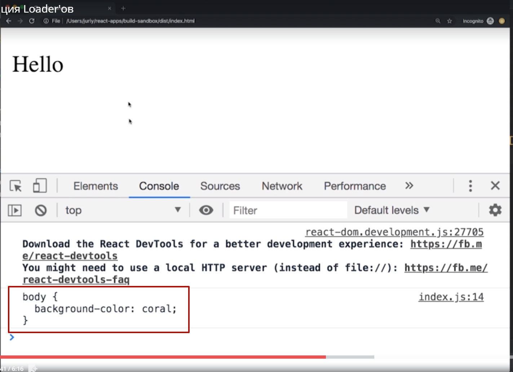
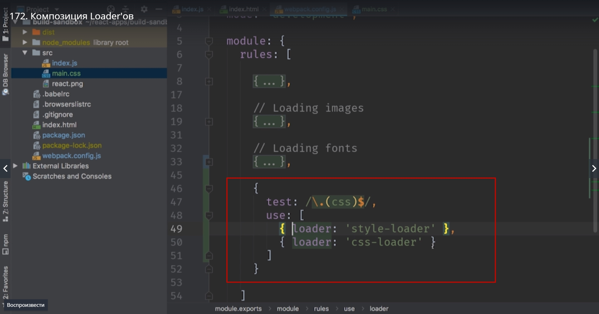
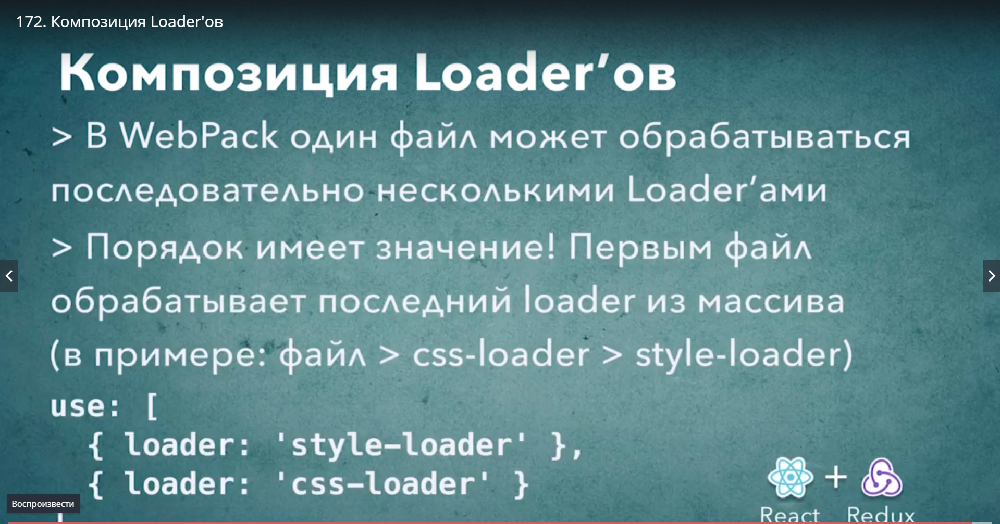

# Композиция Loader-ов

По своей идеологии Loader в WebPack похожи на утелиты командной строки в Linux. В место того что бы пытаться покрыть все возможные сценарии использования одной супер мощной утилиты. Разработчики создают несколько небольших утилит собирая из них сложные команды передавая из них данные от одной утилиты в другую.
Авторы Loader следуют такому же принципу.

css loader который мы рассмотрим занимается исключительно парсингом css. А добавлением css в контекст нашего приложения занимаются отдельные loader которые реализуют одну из этих стратегий.


Создаем main.css

Добавим

```
//main.css

body{
    backgroun-color: coral;
}

```

Подключаем css

> import './main.css';



У нас не сконфигурирован loader-css поэтому пока ничего не заработает пото му что WebPack попытается его сконфигурировать как js файл.

Устанавливаем

> npm install --save-dev css-loader

Возвращаемся в webpack.config.js

```

{
    test:/.\.(css)$/,
    use:[{
        loader:'css-loader'
    }]
}

```


Теперь наш build как минимум сработает. WebPack будет знать что делать с css файлами, но css файлы не появятся на странице.

Возвращаемся в наше приложение мы напишем вот такой код

```
//index.js

import React from 'react';
import ReactDOM from 'react-dom';
import css from './main.css';

const App = () => <p>Hello</p>;

ReactDOM.render(<App/>, document.getElementById('root')); 

```



И посмотрим что именно вернет css-loader потому что этот объект css который мы получим из main.css




это именно то что возвращает css-loader.

Выводим в консоль



```
//index.js

import React from 'react';
import ReactDOM from 'react-dom';
import css from './main.css';

console.log(css.toString());

const App = () => <p>Hello</p>;

ReactDOM.render(<App/>, document.getElementById('root')); 

```



Как видите когда мы запустили наше приложение цвет фона на нашей страничке не изменился. Это значит что наш css еще не подключен к странице. Но тем немение мы смогли получить текст css фрагмента в консоль.

Подходящий для этой задачи loader называется style-loader. Он делает так что бы текст который мы получили из css, добавлялся ввиде style блоков на страничку.

> npm install --save-dev style-loader

И после установки добовляем его к конфигурации.
Обратите внимание что use в наших правилах rules, это массив т.е. это не один объект это массив. И значит в него можно передавать несколько loader

```
//webpack.config.js

{
    test:/.(css)$/,
    use:[
        {loader:'style-loader'},
        {loader:'css-loader'}
    ]
}

```

<br/><br/><br/><br/>



Теперь в загрузке сss файлов будет учавствовать не один, а два loader. Сначало css файл пройдет через css-loader. А затем результат работы этого css-loader  мы передадим в style-loader и он уже сделает так что наш css код появится на странице.

пересобираем наше приложение.

> npm start

Обновляем странице и смотрим что действительно подключился.


Обратите внимание. Порядок Loader имеет значение. Он точно такой же как функция compouse в redux. т.е. сначала срабатывает самый последний loader затем передает результат предпоследнему и тд.




