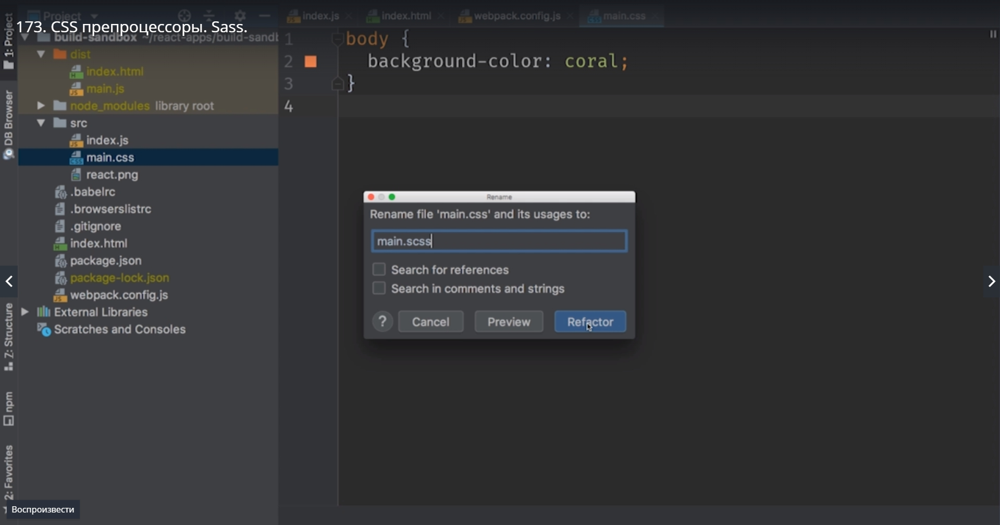
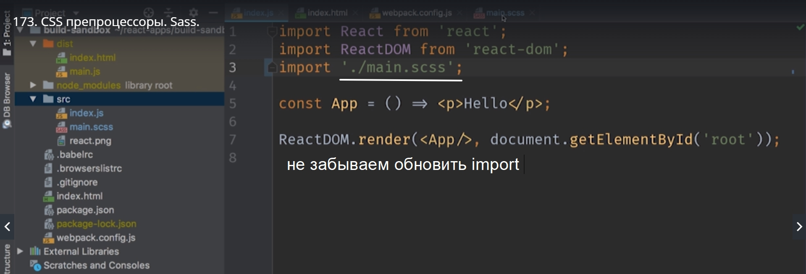
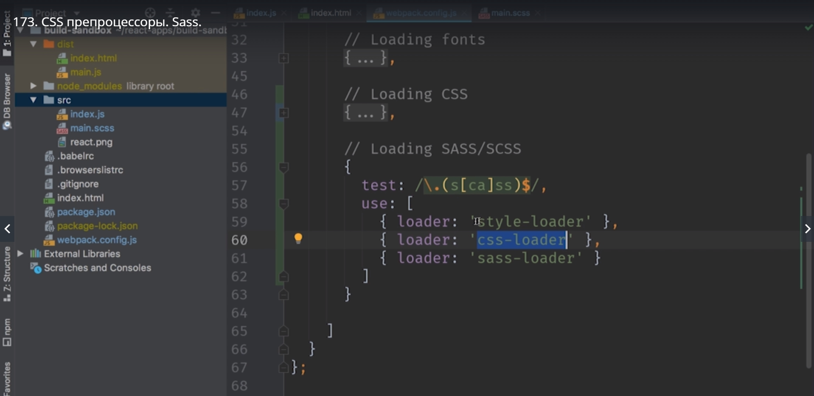
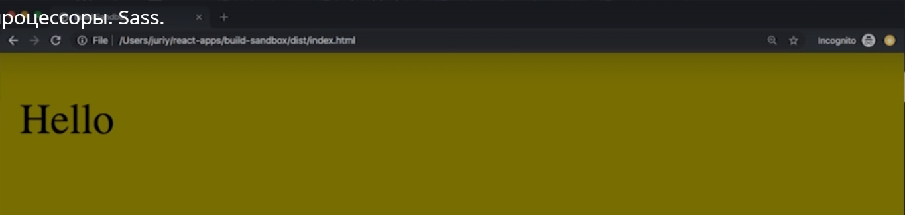
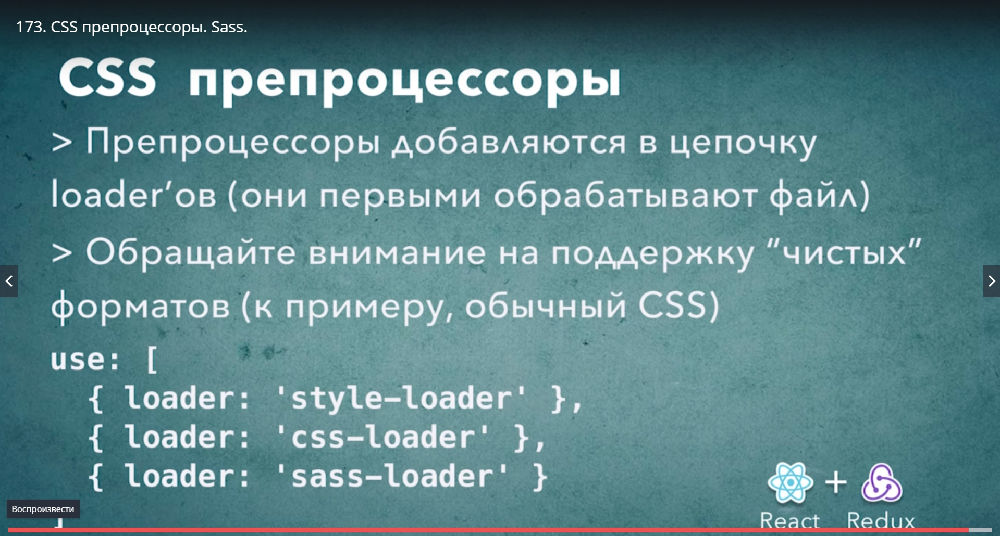

# css препроцессоры sass

Переименовываем main.css в main.scss.



Но обычного переименования файла не хватит для того что бы WebPack сработал. Более того WebPack сейчас не сможет обработать этот файл.



```
$body-color: olive;

body{
    background-color: $body-color;
}

```

Теперь идем в терминал и устанавливаем необходимые зависимости.
Кроме sass-loader нам понадобится еще один модуль node-sass

> npm install --save-dev node-sass sass-loader;

node-sass это собственно движок который производит преобразования из scss в обычный css.
После установки возвращаемся в webpack.config.js b подумаем что дальше делать. Что бы сделать проек более гибким и использовать не только scss но и обычный css, копируем блок с css и немного правим.

```

// loading css

{
    test:/\.(css)$/,
    use:[
        {loader:'style-loader'},
        {loader:'css-loader'}
    ]
},

// loading sass/scss

{
    test:/\.(s[ca]ss)$/,
    use:[
        {loader:'style-loader'},
        {loader:'css-loader'}
        {loader: 'sass-loader'}// последним стоит потому что файл он будет обрабатывать первым. Помни что последовательность имеет значение
    ]
}

```

<br/><br/><br/><br/><br/>



пересоберем проект и посмотрим 

> npm start







