# Плагины

Плагины позволяют выполнять действие не для одного конкретного модуля, а всего проекта. Например можно собрать все маленькие изображения из проекта и объеденить их в один sprite shit, спрайт лист, что бы загружать один файл вместо десятка разных файлов.
Можно собрать все фрагмены css из всего проекта и сохранить их в один оптимизированный css файл.

, вают и другие плагины которые не изменяют результирующие файлы, но позволяют проанализировать упакованное приложение.

[https://github.com/webpack-contrib/webpack-bundle-analyzer](https://github.com/webpack-contrib/webpack-bundle-analyzer)

Один из самых популярных плагинов это webpack bundle analazer. Он создает такой вот симпатичний 3map которая позволяет понять почему ваш bundle внезапно стал весить 5MB.

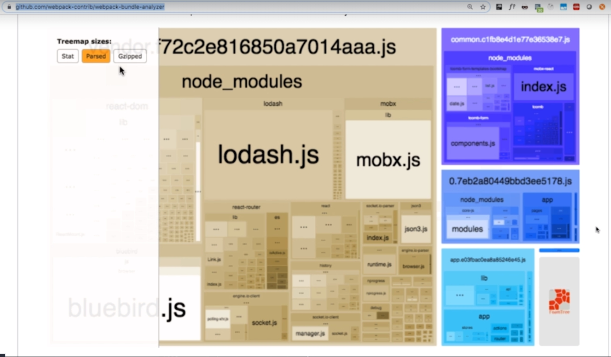

louders отличается от plugins. Louders работают с конкретным файлом с конкретным модулем.

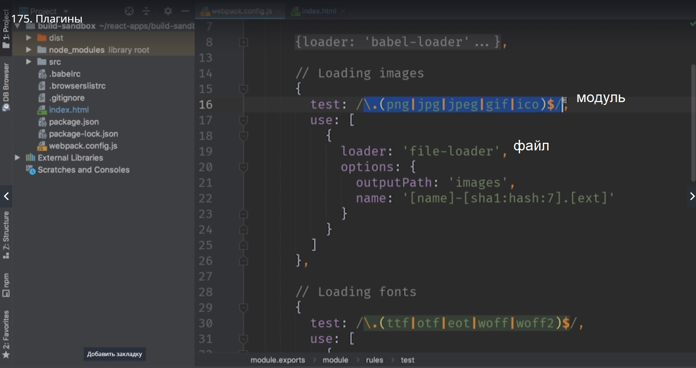

Plugins же работает со всем приложением решая глобальные задачи.

Для того что бы начать знакомство с Plugins мы автоматизируем единственный не автоматезированный шаг в нашей сборке это копирование index.html.

Установим этот plugin

>npm install --save-dev html-webpack-plugin

Добавляем его к нашему файлу конфигурации.

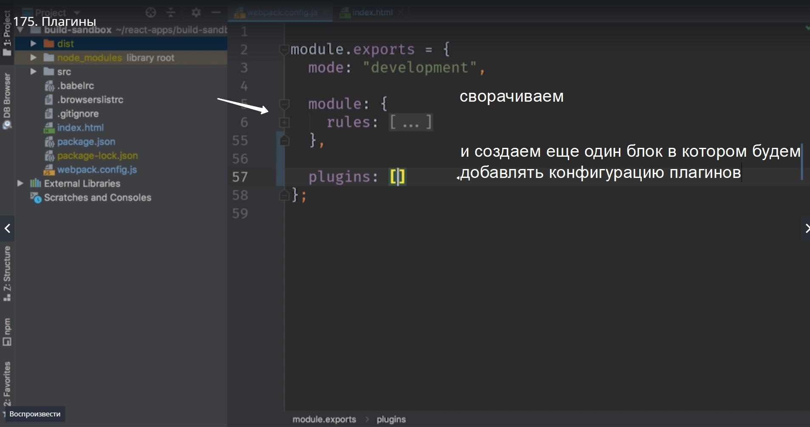

В случае с плагинами нам еще обязательно их проимпортировать в наш build

> const HtmlWebpuckPlugin = require('html-webpack-plugin');

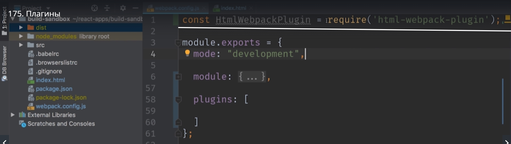

require мы используем вместо импорта в nodeJS.

Ну и теперь в массив передаем новый объект этого класса для того что бы WebPack начал работать с index.html. Для проверки мы можем удалить дирректорию dist для того что бы проверить что все работает правильно.

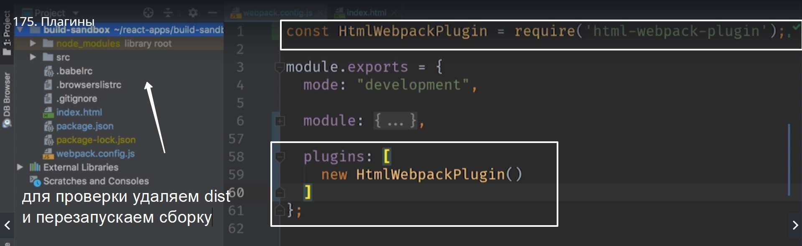

> npm start

И он действительно появился в dist. Если мы его откроем мы заметим несколько удивительных вещей. Это не тот же html  что был в нашей корневой директории.

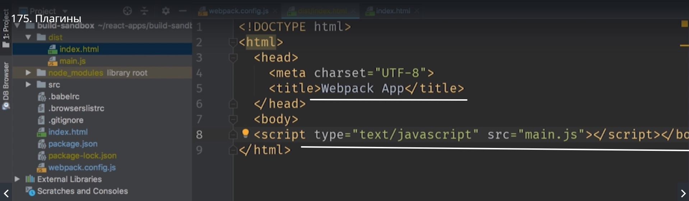

В нашем скомпилированном html нет блока div с id="root", поэтому наше приложение не заработает. В этом файле есть script который ссылается на основной файл main.js.

Для того то бы использовать наш файл в plugin нужно будет передать небольшой объект с конфигурацией.
И в случае с plugin конфигурация работает немного по другому чем для loader. Для того что бы предать конфигурацию нам нужно передать объект в конструктор.

```
plufins:[
    new HtmlWebpackPlugin({
        templete: 'index.html'
    })
]

```

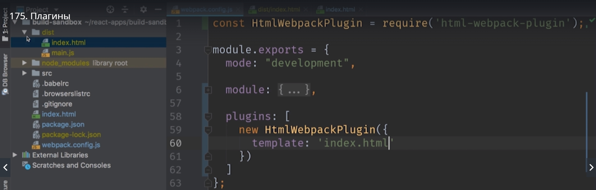


Можно пойти еще на шаг дальше и сделать наше приложение таким же как create-react-app. Вернее структуру папок.

создаем папку public, переносим index.html. И далее в конфигурационном файле обновляем путь.

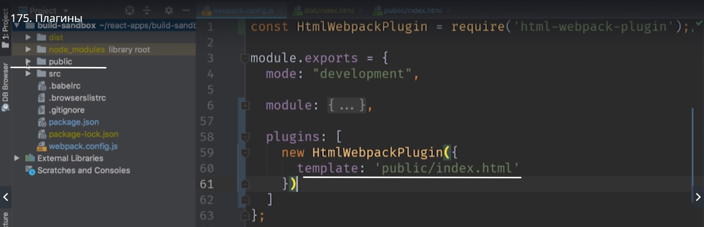

HtmlWebpackPlugin достаточно умный для того что бы поставить самостоятельно тег script который нужен для работы нашего приложения.

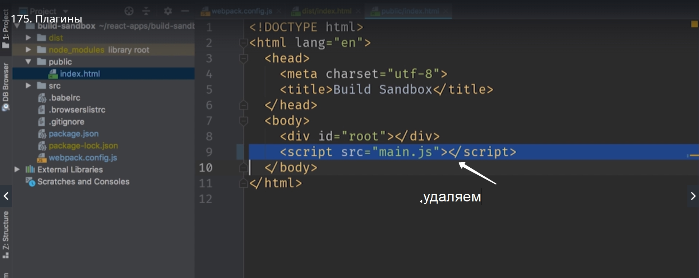

> npm start

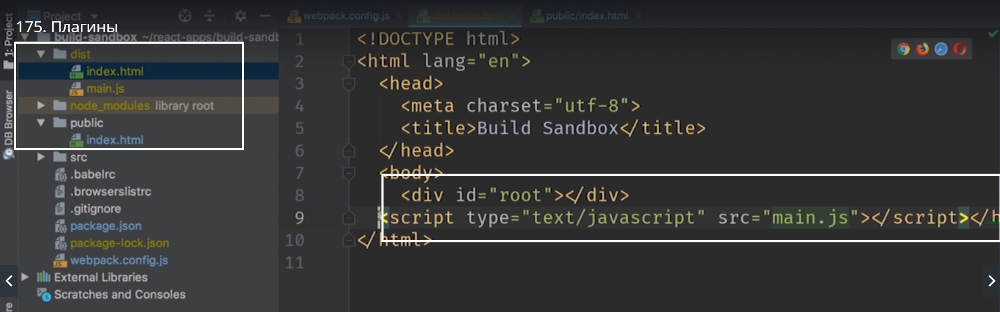

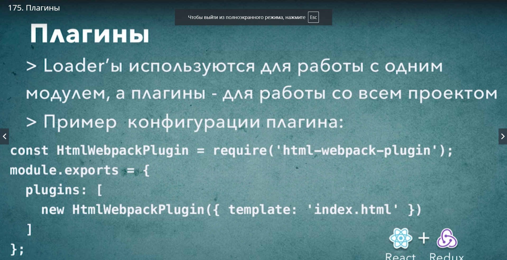 