# HtmlWebpackPlugin использование шаблонов

А теперь еще один важный аспект. Этот файл который мы передаем в HtmlWebpackPlugin

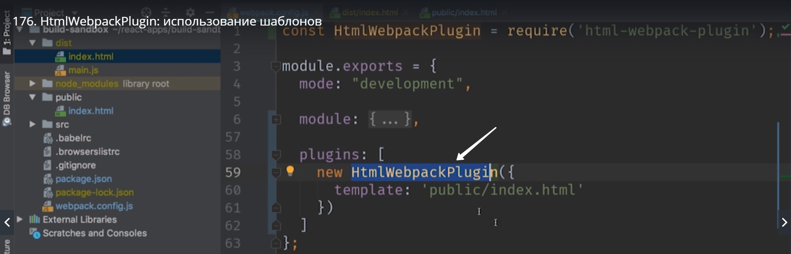

Он работает не как статический html файл, а как шаблон. HtmlWebpackPlugin сможет динамически его интерпретировать и заменять определенные блоки этого файла на какие-нибудь выражения или значения каких-нибудь переменных.

Смотрим как это работает. Мы можем динамически устанавливать title для нашего приложения.

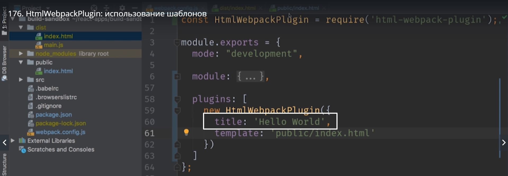

И теперь для того что бы использовать эту переменную переходим в index.html и в title меняем содержимое на вот такое. Синтаксис шаблонов немного отличается.
Пишем знак меньше процент и равно таким образом мы открываем шаблон <%= %> и процент и знак больше закрываем шаблон.
Внутри пишем HtmlWebpakPlugin таким образом мы получаем доступ к объекту плагина, далее заходим в .options и достаем опцию которая называется .title

```
<DOCTYPE html>
<html lang="en">
<head>
<meta charset="utf-8">
<title><%= HtmlWebpackPlugin.options.title %></title>
</head>
<body>
<div id="root"></div>
</body>
</html>


```

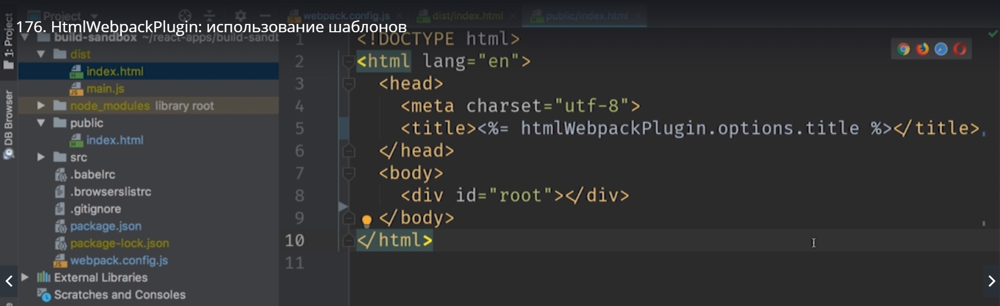

перезапускаем

> npm start

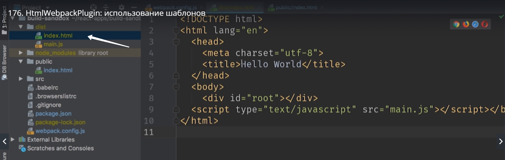

Все дело в том что при исполнении этой конфигурации мы находимся в nodeJS. И затем мы можем использовать совершенно любые переменные которые доступны в окружении, которые доступны в момент build.
Например используя это удобное свойство мы можем добавить к нашему index.html информацию о том когда именно был сождан этот build. Эта информация например может быть очень полезна команде тестировщиков. Которым важно знать какую именно версию они тестируют.
Давайте добавим свойство buildTime и в качестве значения установим new.Date().toISOString()

```
plugins:[
    new HtmlWebpackPlugin({
        title:'Hello World',
        buildTime: new Date().toISOString(),
        tamplate:'public/index.html'
    })
]

```

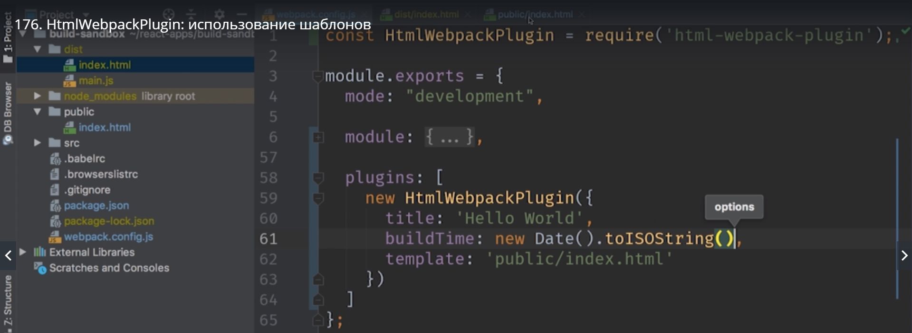

Возвращаемся в наш шаблон и используем эту строку в теле html документа.

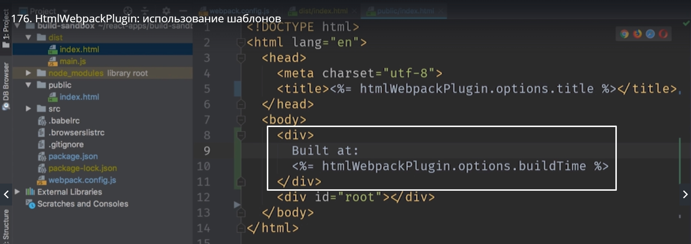

Перезапускаем
> npm start

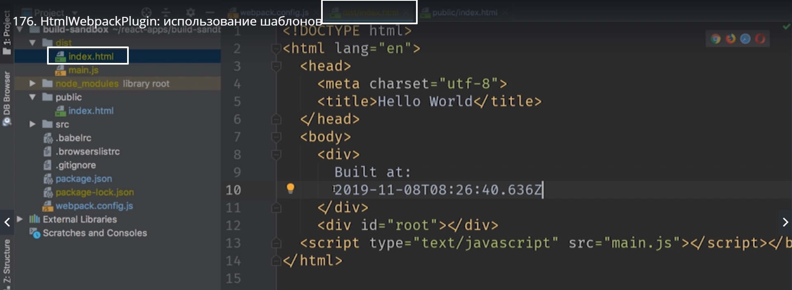

И соответственно эта информация теперь появится на странице нашего приложения.

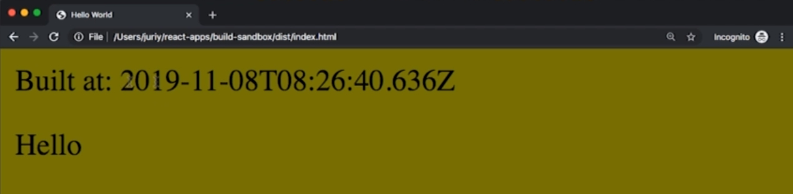

В идеальном варианте можно было бы больше добавить служебной информации. Например на каком именно сервере был сделан этот build и Hash коммита в git от которого этот build произошел. Но это не для этого курса.

Что делать с этой информацией если мы делаем этот build для porodaction. Т.е. для настоящего website который мы будем демонстрировать настоящим клиентам. Ведь им совершенно не нужно знать когда именно была собрана версия этого приложения. Далее мы посмотрим как можно сделать блоки конфигурации в webpack.config.js динамическими. Такими которые будут зависить от режима в котором мы сейчас собираем приложение.
Таким способом мы сможем получить один build который работает для development

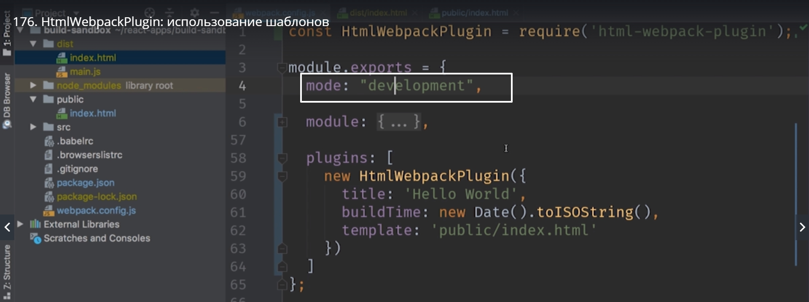

c одними правилами.

Ну а другой build который работает для prodactions c другими правилами. И в poduction build мы естественно не будем использовать вот эти значения в результирующем шаблоне

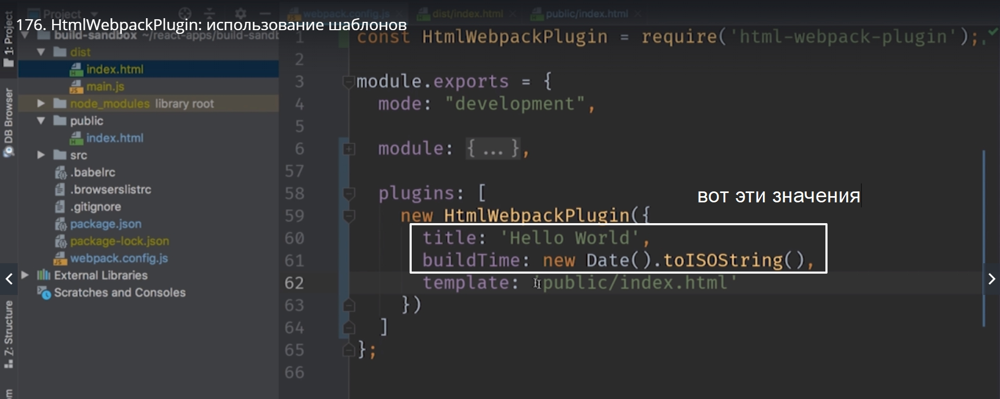

Вместо этого мы сможем подставить какой-нибудь другой шаблон.

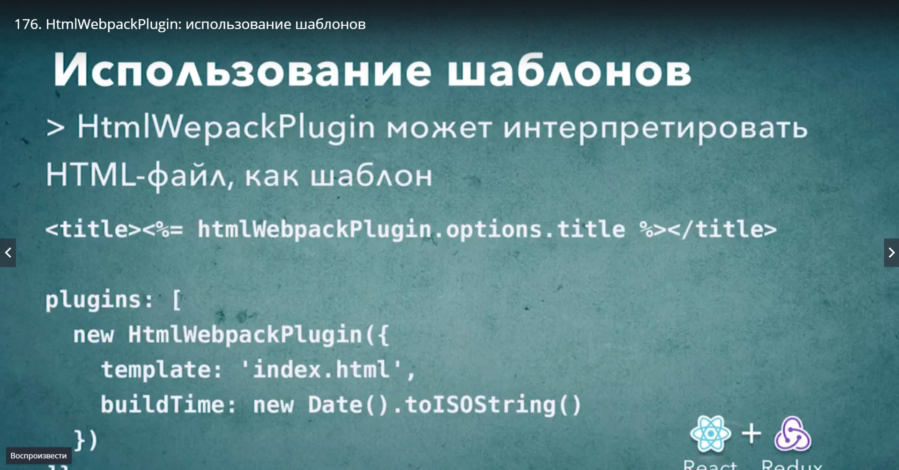

