# WebPack Dev Server

Это не плагин и не Loader. Это отдельная утилита которая самостоятельно запускает WebPack.

[https://github.com/webpack/webpack-dev-server](https://github.com/webpack/webpack-dev-server)

Он самостоятельно запускает WebPack Build, мониторит изменения в файловой системе и знает когда этот build нужно перезагрузить.

устанавливаем

> npm install --save-dev webpack-dev-server

И для того что бы его запустить нам нужно вернуться в package.json и изменить то как мы запускаем наш скрипт.

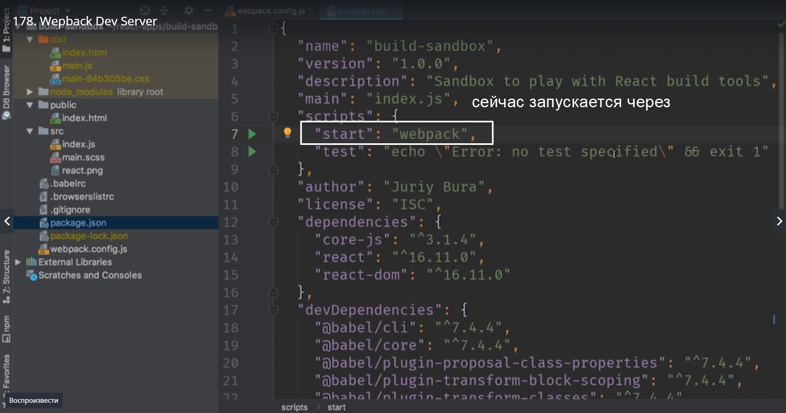

Прямо сейчас для того что бы собрать приложение мы запускаем команду webpack.
Но теперь когда у нас есть webpack-dev-server управлять сборкой будет именно он.

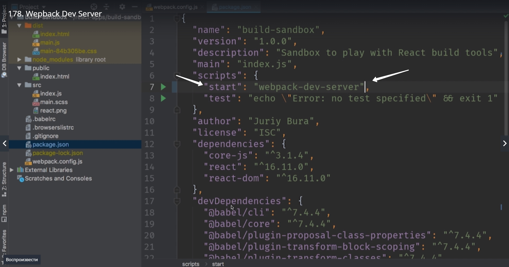

> npm start

Судя по консоли мы получили тот же результат что и раньше

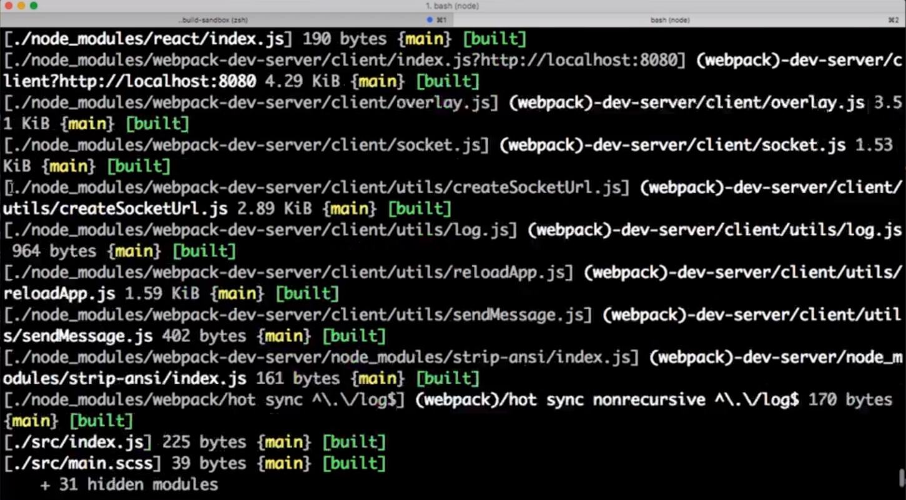

Но при этом build не закончился т.е это приложение все еще выполняется. Это потому что у нас сейчас запущен webpack-dev-server. Он мониторит файловую систему. Как только мы начнем изменять файлы, он будет перезапускать build и давать браузеру команду перезагрузится. Таким образом мы постоянно будем видить самую свежую версию приложения.

Запускаем браузер и переходим на localhost:8080
Обратите внимание. Если нам когда-нибудь необходимо будет узнать на каком хосте запустился webpack-dev-server при запуске в консоль выводится

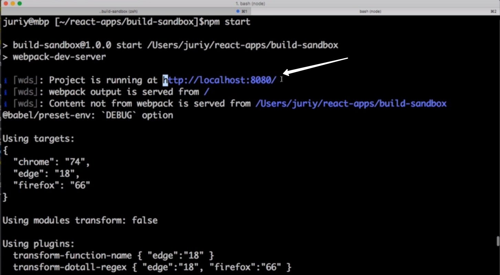

Теперь смотрим что будет когда мы изменим один из файлов.

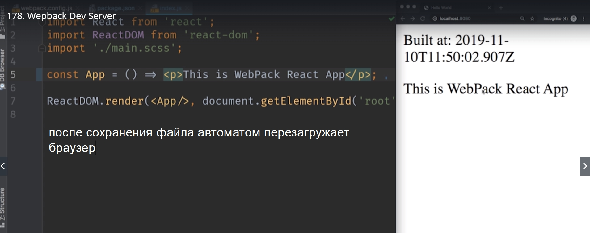

Еще один важный и интересный момент. нажимаем Ctrl+C в командной строке. Таким образом останавливаем webpack-dev-server

Далее удаляем директорию dist

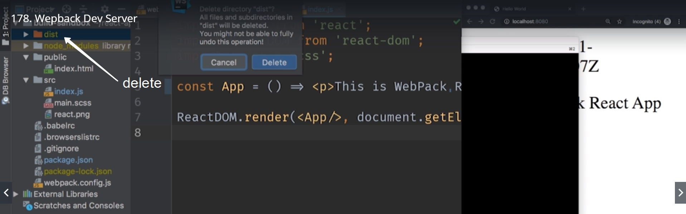

После удаления перезапускаем build

Откуда же webpack-dev-server берет эти файлы? Все очень просто. Он собирает эти файлы и хранит их в оперативной памяти компьютера. Связано это стем что оперативная память быстрее чем жесткий диск. А еще мы не создаем огромное количество лишних файлов с очень коротким жизненным циклом поскольку когда мы активно разрабатываем приложение мы меняем файлы очень часто. Build перезапускается каждые пару секунд и создавать каждый раз новые файлы это не практично.

Но нам нужны эти файлы для того что бы переслать их на сервер и запустить со своего хостинга. Поэтому создаем еще один script и назовем его build и в параметрах указываем webpack.

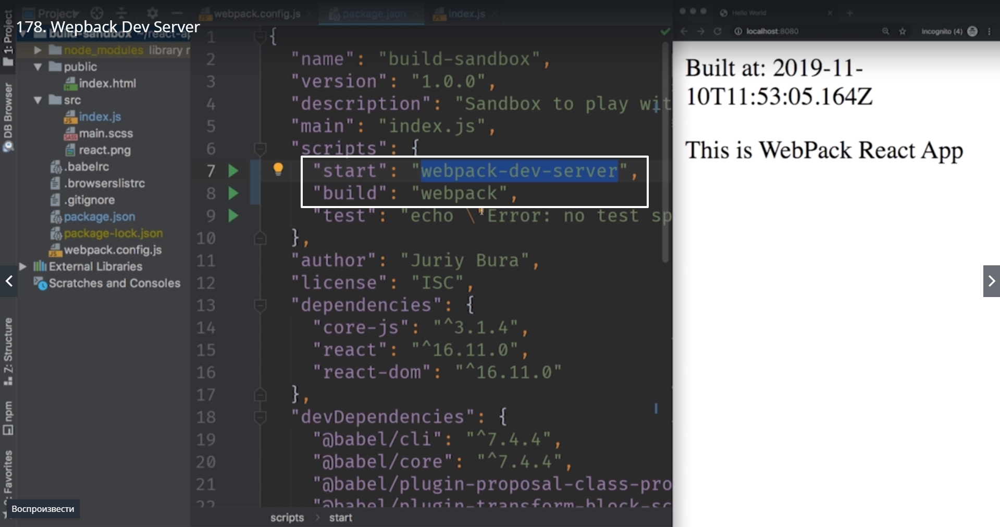

Теперь если я наберу npm start то запустится webpack-dev-server и я буду работать в режиме разработчика и приложение будет перезапускаться каждый раз когда я буду сохранять файлы.

Но если я запущу команду webpack run build то запуститься обычный webpack соберет наше приложение и сохранит файлы в папку dist точно так же как это работало раньше.

Обратите внимание что если мы хотим запустить вот этот script

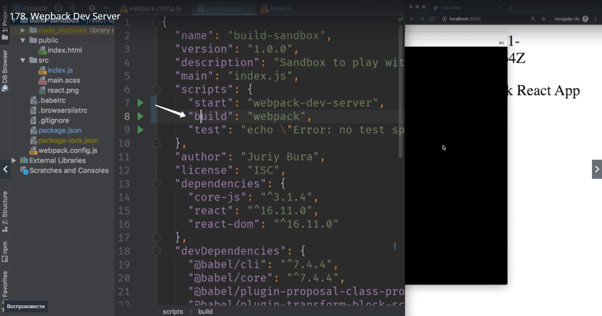

Это не npm build!!! Это а npm run build

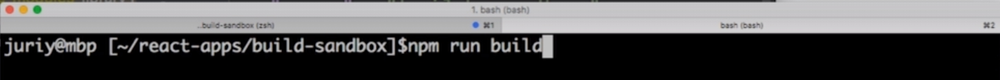

Теперь в нашем packege.json есть два скрипта start для активной разработки когда мы хотим запустить приложение, разрабатывать его и обновлять страничку когда мы изменяем файлы. И build для того что бы запустить сборку, сохранить файлы на локальной файловой системе и иметь возможность запустить их куда-нибудь на сервер.

Несмотря на то что webpack-dev-server это не плагин и не loader его все равно можно кофигурировать в webpack.config.js.

для этого добавляем блок devServer

Смотри на сайте различные конфигурации

[https://webpack.js.org/configuration/dev-server/#root](https://webpack.js.org/configuration/dev-server/#root)

Я поставлю самые полезные. Первый параметр это автоматически открывать браузер когда мы делаем build. для этого пишем open:true

запускаем

> npm start

Запускается браузер по умолчанию.

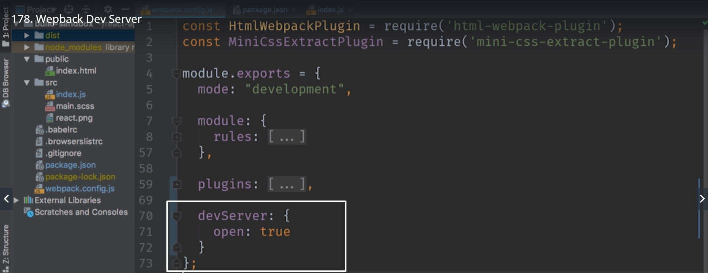

Смотрите на сайте там огромное количество возможностей.

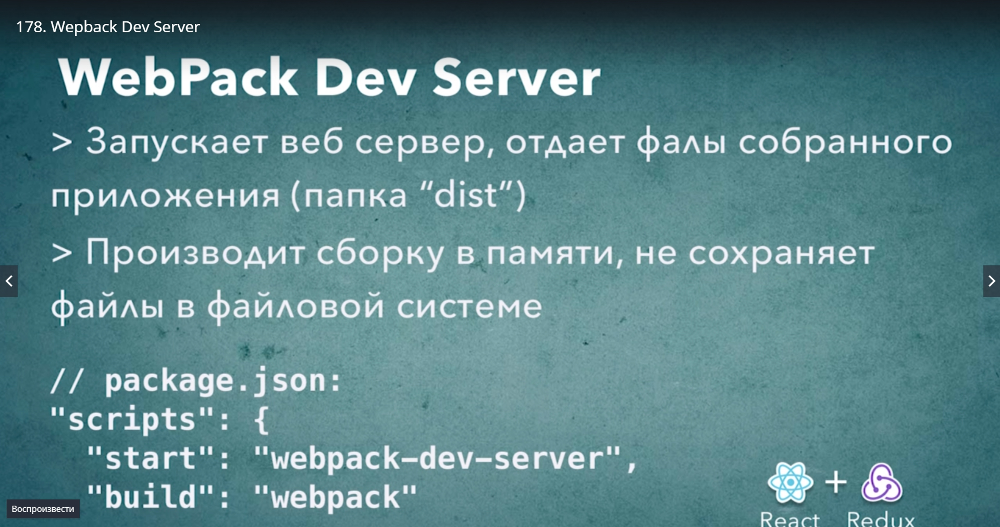
