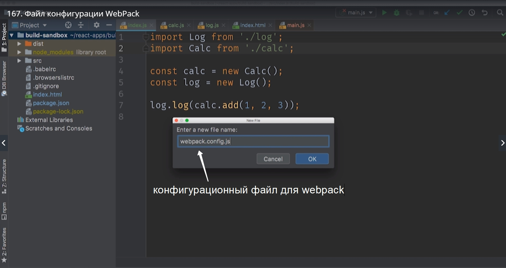
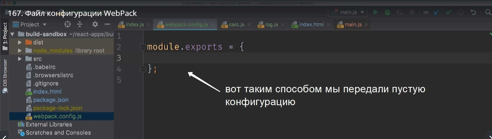
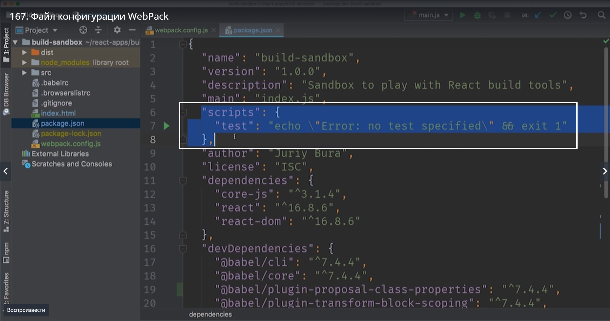
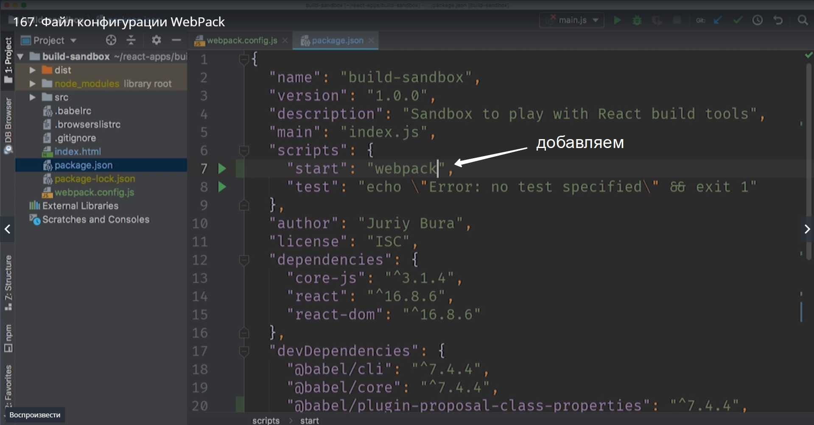
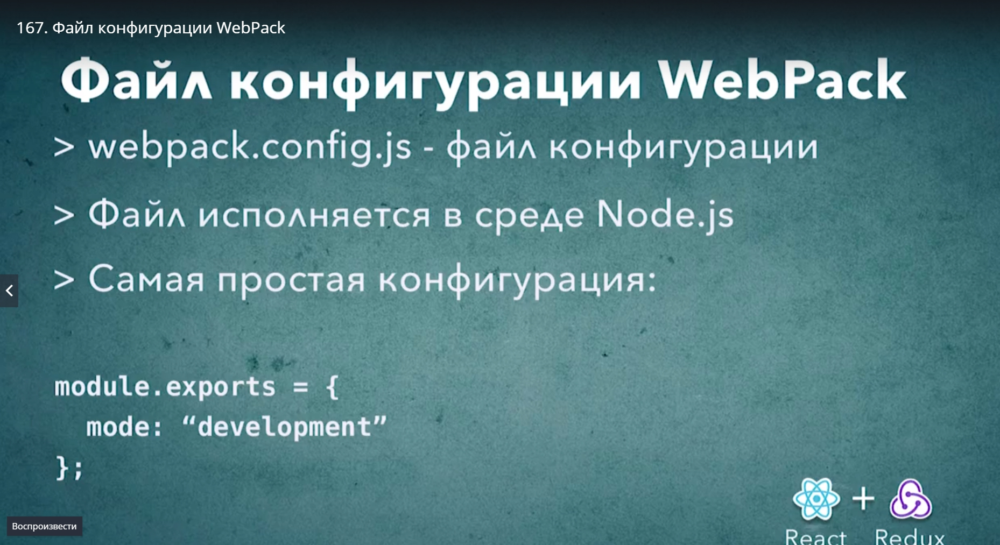

# Конфигурационный файл WebPack

Работать в командной строке не так уж удобно. Поэтому мы создадим отдельный кофигурационный файл. 
Прямо в корне проекта создаем новый файл.

 

Обратите внимание что это js файл. Отличия в том что в этом файле мы можем исполнить совершенно любой JS код который реализует дополнительную логику.
Второй важный факт который важно помнить, webpack работает не в браузере а в среде noseJS поэтому этот файл webpack.config.js исполняется в среде в nodeJS.
Соответственно когда мы пишем код в этом файле мы можем использовать совершенно любые функции библиотеки доступные в nodeJS.

Мы будем использовать синтаксис экспорта nodeJS.



Передаем тот параметр который WebPack просил нас передать

```
module.exports = {
    mode:"development"
};

```

теперь можно перезапутить webpack

> npx webpack

мы не будем передавать параметр mode т.к. мы его передали в файле.

Давайте вспомним как запускался build в create-react-app. Что бы запустить приложение мы вызывали npm start.
Считается хорошей практикой добавлять команду npm start в свой проект.Что именно будет делать эта команда зависит от самого проекта. К примеру в nodeJS эта команда запускает само приложение. А во front-end приложениях эта команда может собирать проект и запускать webserver для разработки.
Делаем так что бы npm start запускал сборку нашего проекта. Заходим package.json и находим там такой блок



сдесь есть один параметр test. Добавим еще один скрипт. Ключ в этом объекте это название скрипта.




 