# Конфигурация для production

Нам становится важно конфигурировать development и prodaction builds. Prodaction build одна из самых запутанных тем.
Начнем с того что зачем нам разделять prodaction и development билды. Development build оптимизирован для разработки. Например нам совершенно не важен результирующий размер файлов потому что мы будем загружать изображения из локальной папки или даже из памяти если мы используем webpack-dev-server.

Зато нам важны sorce map-ы для того что бы отлаживать приложение и нам важна скорость сборки. Что бы при изменении пары строк кода нам не нужно было ждать обновления несколько секунд.
В Prodaction build с одной стороны мы упаковываем приложение для того что бы опубликовать его на настоящем сервере и дать к нему доступ реальным пользователям. Следовательно нам важны другие качества. Нам не важно сколько времени будет работать build даже если он будет занимать минуту или две. Это не большая проблема. Мы не так часто публикуем новые версии приложения. 
Но зато нам важно что бы Build был оптимизирован, сжат. Можно разбить на несколько файлов что бы оптимизировать загрузку приложения.

Совершенно очевидно что для development и prodaction билдов louder-ы plugin-ы их настройки будут отличаться. Другими словами нам нужна разная конфигурация для development и prodaction билда.

Самый простой способ перевести в prodaction режим это вот сдесь заменить

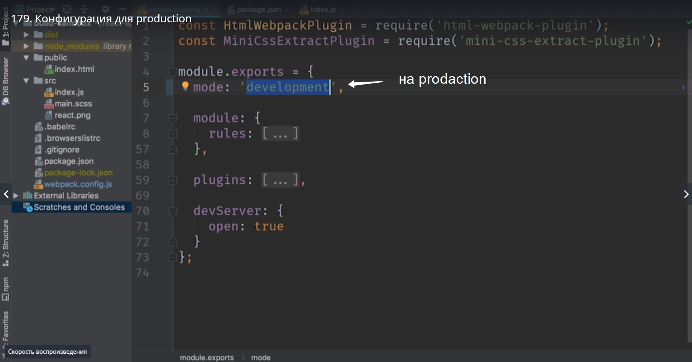

И после этого webpack автоматически включит ряд оптимимизаций. Это не плохое начало но этого не достаточно. Ведь прямо вот сдесь в конфигурациях в модулях в плагинах в лоудерах, в их настройках, нам нужно использовать разные значение в зависимости от того собираем мы для development или для prodaction.

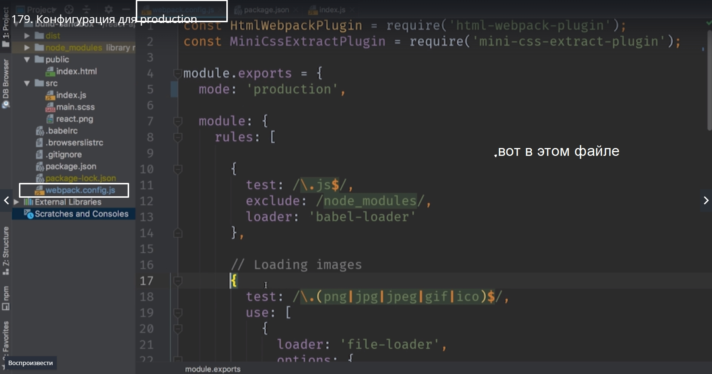

Посути нам нужны две разных конфигурации или одна конфигурация которая знает в каком режиме она работает, в prodaction или development.

Пожалуй самый простой способ это разделить конфигурацию на несколько файлов

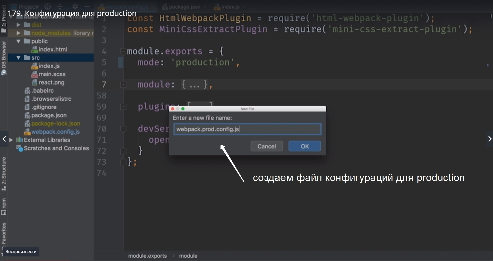
 

 для prodaction файл webpack.prod.config.js
 и для development  webpack.dev.config.js
Сохранить эти файлы в нашем проекте и затем перейти куда-нибудь в package.json и указать в build

> "build":"webpack --config webpack.prod.config.js"

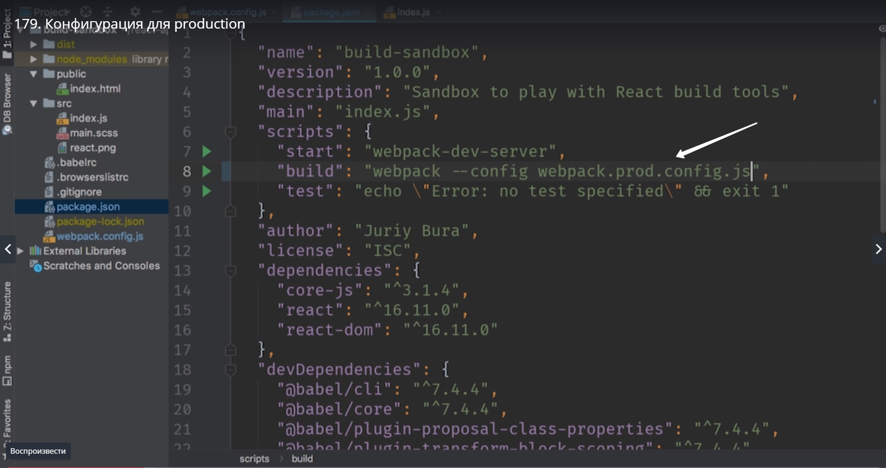

Т.е. webpack понимает этот флаг, этот параметр командной строки и мы можем в явном виде передать тот конфиг с которым мы будем работать.

Такая модель работы была довольно популярна последнее время. Файлы организовывались примерно таким образом.

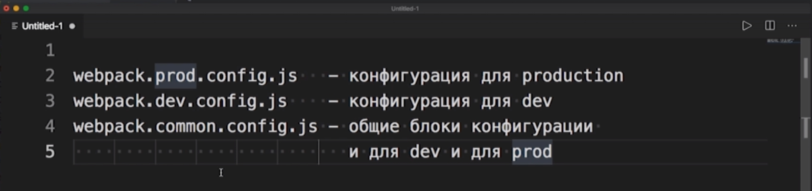

У нас был файл для каждого режима, в этом случае это prod и dev, может быть какой-нибудь режим, например test, тогда у нас был бы еще один файл. И был еще один отдельный файл который назывался webpack.common.config.js где содержались общие блоки конфигурации которые разделялись между dev и prod. Плюс этого способа заключается в его простоте. Очень просто начать использовать 3-ри файла вместо одного. Минус этого способа заключается в том что теперь наша конфигурация разбита на 3-ри разных файла и читая только один из них, например webpack.prod.config.js, , дет довольно сложно понять что все таки происходит во всем build.     

Второй способ это передать из командной строки каким-то образом в наш webpack.config.js какой-нибудь флаг который скажет в каком режиме мы хотим собрать наше приложение.

тогда где-нибудь в файле мы могли бы написать что нибудь вроде 

> const isProd = //.......

или

> const isDev = //........

Азатем использовать эти константы в нашем module.exports

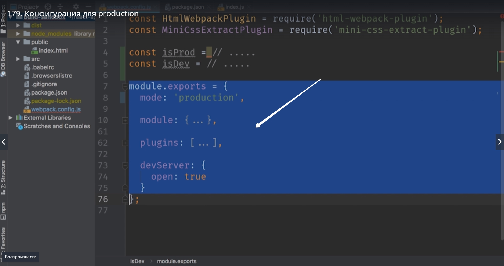

И в зависимости от того какая константа установлена в true выбирать нужные режимы.

Совершенно не сложно будет написать условную логику. Если мы в development то мы не будем использовать MiniCssExtructPlugin.

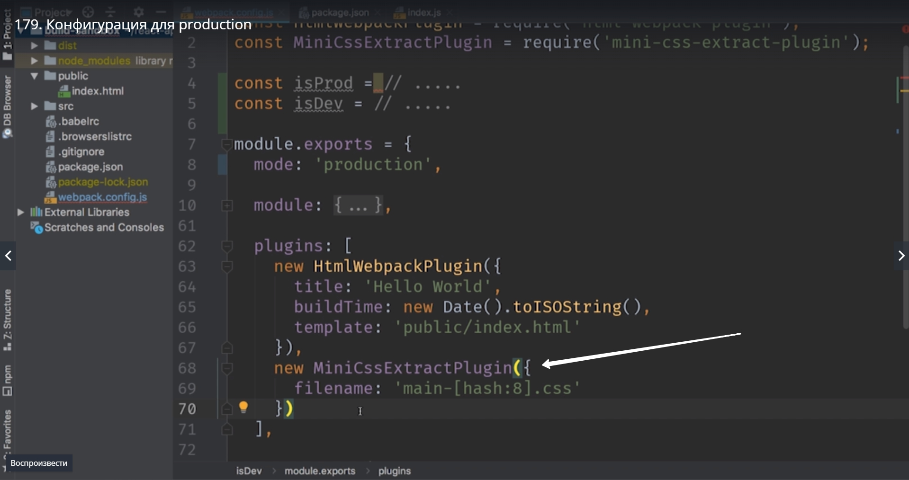

А если мы в prodaction то будем использовать. Или например если мы в Development режиме мы будем использовать сдесь один loader, а если в production режиме то другой.
Основной вопрос как нам получить вот эти значения констант isProd или isDev?  И как ими управлять? Плюс этого подхода что мы сохраним один целостный конфигурационный файл. А минус в том что в нашем коде появится условие и этот код станет немножечко сложнее читать.
Мы будем рассматривать второй способ. Этот способ куда интереснее. Да и create-react-app использует именно этот подход.
И так как нам передать build script из командной строки?
В webpack есть специальные параметры командной строки которые начинаются на **env**.

Переходим в package.json и в build пишем

> "build": "webpack --env.mode=production"

Все значение которые мы передатим вот таким способом из командной строки будут доступны в файле конфигурации. 


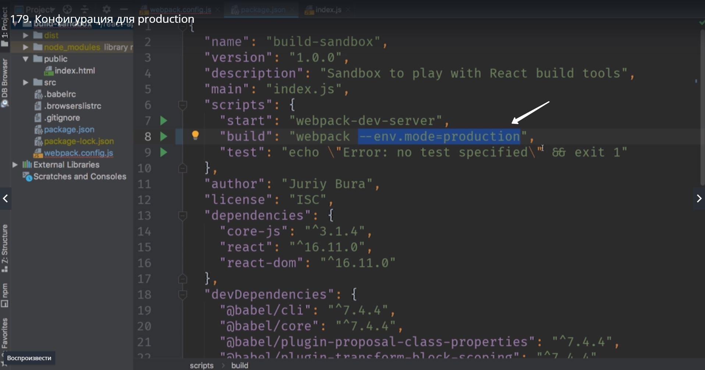

Кстати можно использовать не только  mode=production. Можно передавать совершенно любые значения таким способом, если вам нужно сконфигурировать какие-то аспекты вашего build скрипта. Это классный способ это сделать

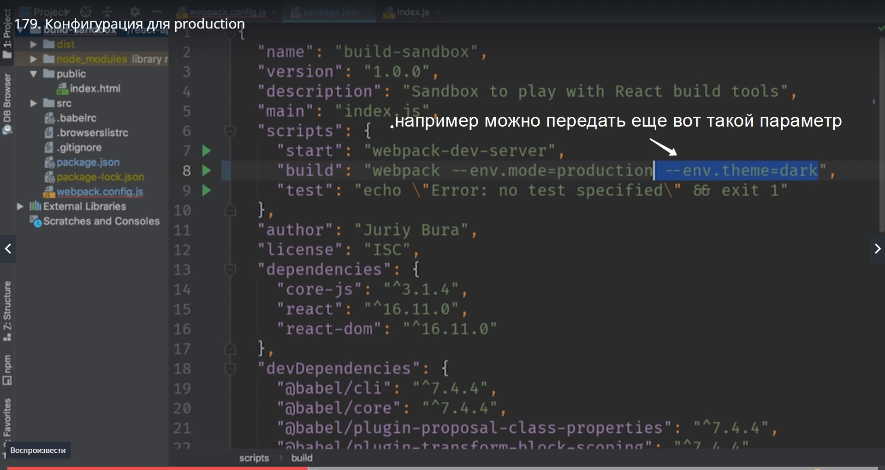

Но это нам не надо. Так что удаляем.

Следующий вопрос это как получить эти значения в webpack.config.js?

Первый шаг это сделать так что бы файл webpack.config.js экспортировал не объект с конфигурацией а функцию которая возвращает объект с конфигурацией.

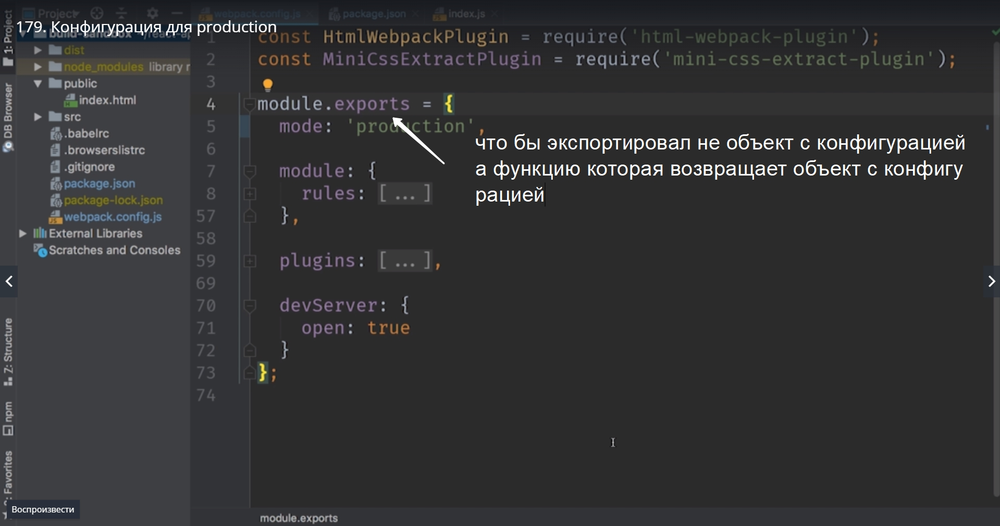

Должна получится вот такая функция

```

module.exports = () =>{
    return{
        mode: 'production',

        module:{
            rules:[...]
        },
        plugins:[...],

        devServer:{
            open:true
        }
    }
};

```

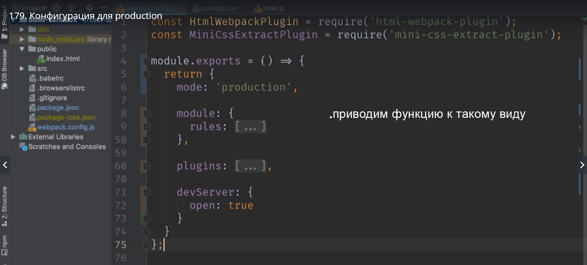


Эту функцию вызовет webpack. Webpack достаточно умный для того что бы понять что если это функция то ее нужно вызывать, и затем тот объект который вернет функция будет использован в качестве конфигурации точно так же как тот объект который мы возвращали на прямую в прошлых видео.

А теперь самое интересное. В эту функцию в качестве первого аргумента webpack  передаст объект со всеми теми значениями которые мы сконфигурировали в командной строке. Назовем этот объект env, поскольку сюда перейдут все значения которые начинаются на env в командной строке, **этот префикс env он ключевой**, по этому префиксу webpack скажет что эти значения нужно передать в функцию конфигурации.

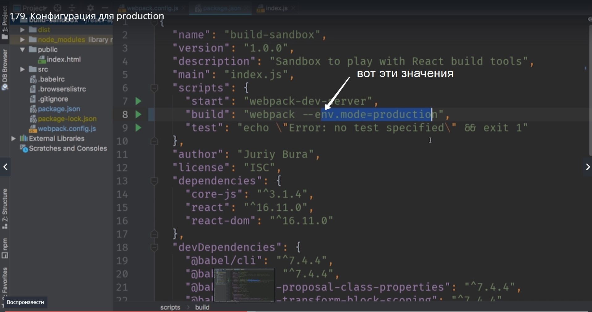

 И теперь для начала давайте просто напечатаем в консоли что же мы получим если мы запустим наш build

 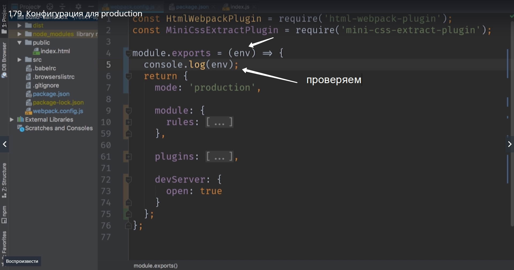

 запускаем 

 > npm run build

 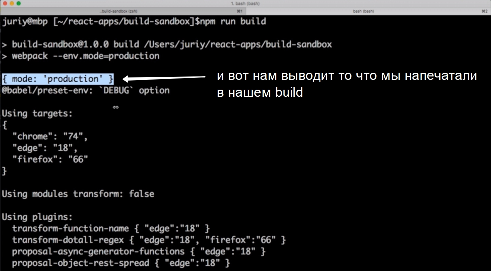

 Если добавить еще параметр через env. Например --theme=dark

 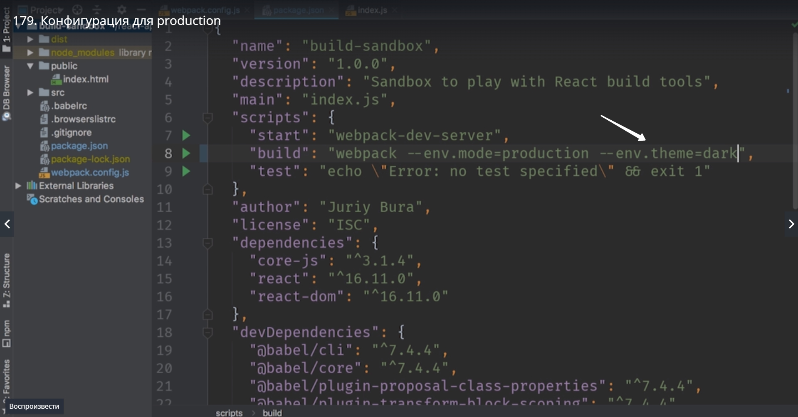
  
и снова перезапустить build

> npm run build

то мы увидим что объект содержит два значения.

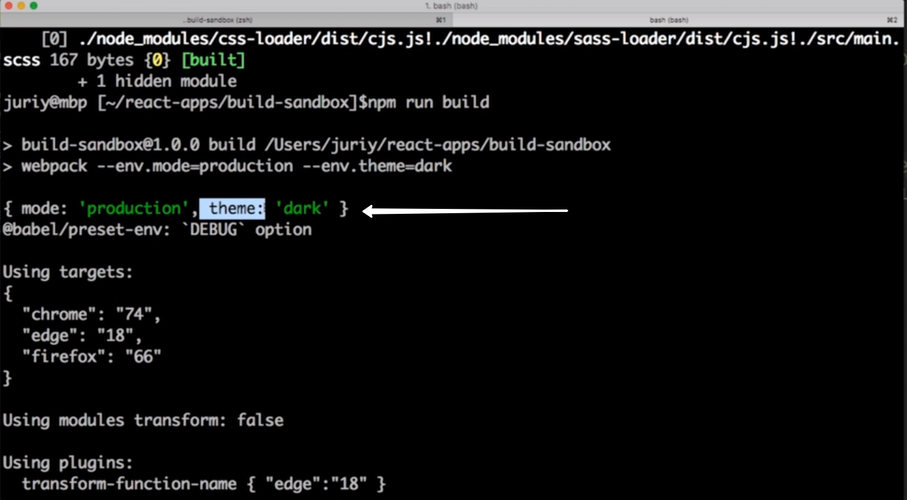

Таким образом мы узнали как в консоли можно передать в webpack build какое-нибудь значение. И этим значением может быть режим в котором мы прямо сейчас хотим исполнить наш build, prodaction or development.

Удаляем это не нужное нам значение что бы не засорять наш package.json 

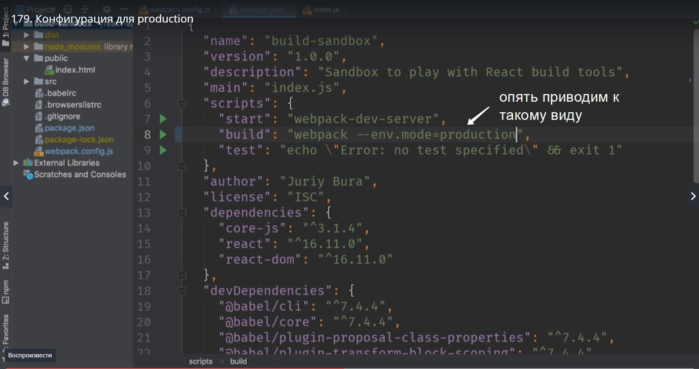

и возвращаемся в наш webpack.config.js

А теперь определить в каком именно режиме мы хотим собрать наше приложение очень просто.

Создаем константы

```
const isProd = env.mode === 'production'; // если env.mode это production то isProd будет true

const isDev = env.mode === 'development';

```

Если у нас будет еще режим, к примеру testing, мы можем создать еще одну константу и назвать ее isTesting и точно так же вычислить ее значение.

Ну а теперь сделаем так что бы наш webpack build работал по разному в зависимости от того режима который мы сейчас запускаем build.

Для начала значение mode 

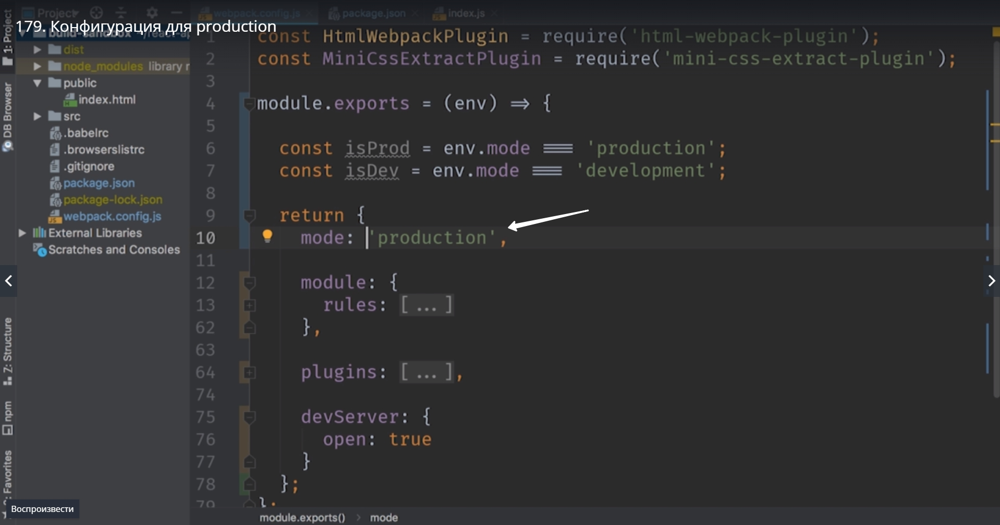

нашей конфигурации. Это значение скажет webpack следует ли включать какие-то дополнительные оптимизации. Если мы находимся в продакшене то mode будет prodaction т.е. **isProd ? 'production'** а если **:** мы находимся в isDev то mode будет development.
т.е.

> mode: isProd ? 'production' : isDev && 'development';

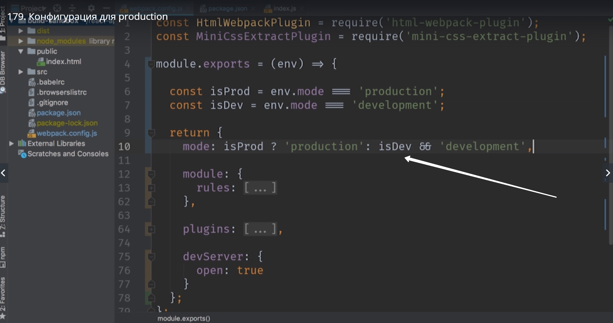

Если мы не находимся не production и не в development. Если у нас будет какой-нибудь третий режим. То тогда mode будет false и webpack не будет включаль ни каких оптимизаций. И этот режим тоже будет работать.

В этом месте нужно сделать одно небольшое замечание. Мы немного копируем структуру build скрипта из create-react-app. 
Yf  как профессиональному разработчику наверняка захочется посмотреть под капот create react app и узнать как работают инструменты facebook и читать тот код create react app будет намного проще если мы попробуем следовать тому же стилю.

Gh жде чем продолжать давайте установим значение по умолчанию что бы наш код ни при каких обстоятельствах не валился. Потому что прямо сейчас нам нужно обязательно передать env.mode иначе мы сломаемся.

И если мы по умолчанию env поставим пустой объект.

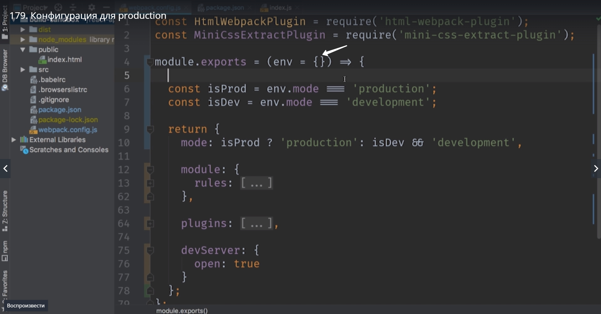

И кроме того если мы скажем что mode по умолчанию это development то мы спожем запускать наш build без параметров

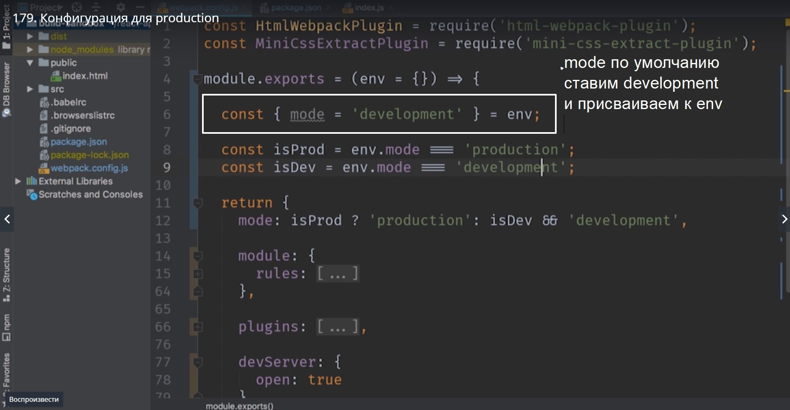


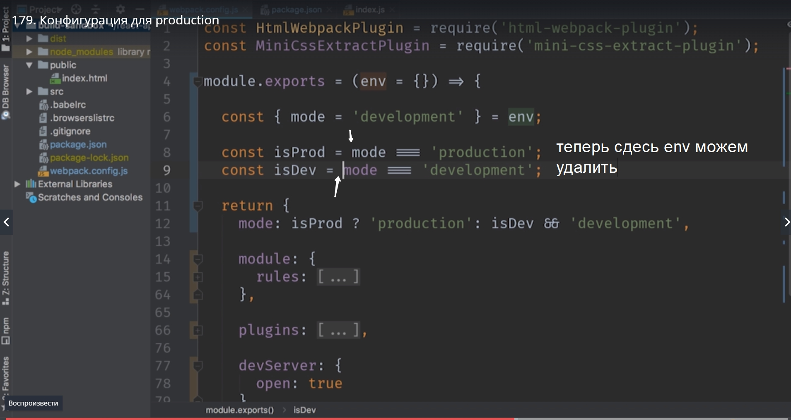

Перед тем как продолжать и начинать писать конфигурацию этих значений давайте вернемся к нашему build и посмотрим что он действительно работает.

> npm run build

И поскольку в npm run build мы указали по умолчанию mode prodaction прямо сейчас мы должны запуститься в production режиме.

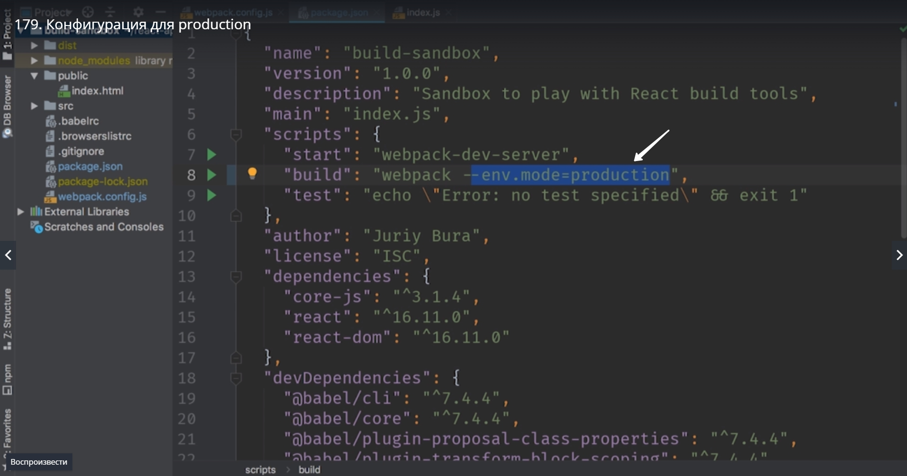

В prodaction main.js занимает 128MB.

Меняем на development

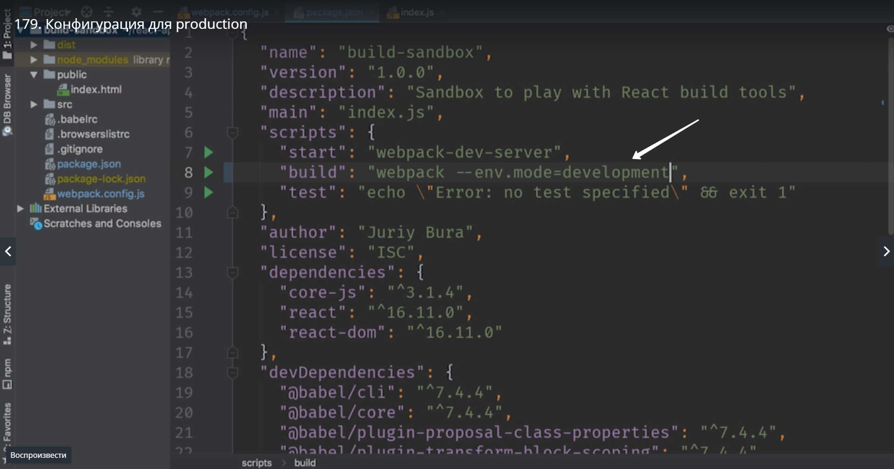

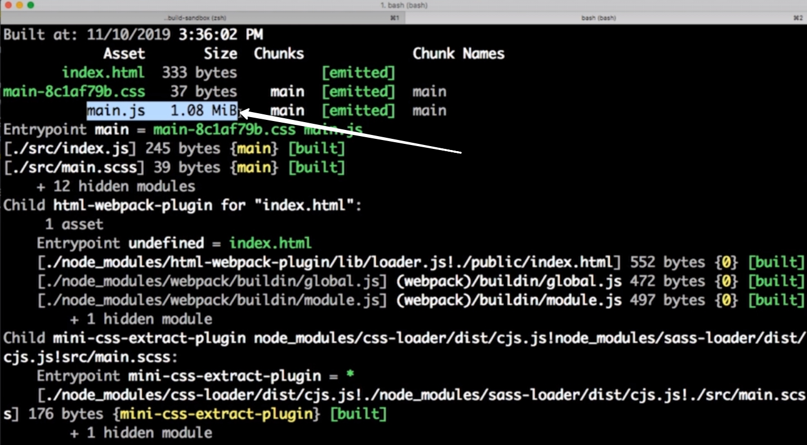

Возвращаем режим production. 

Начинаем писать наш конфиг в зависимости от режима.
Один из подходящих примеров это загрузка css. В development режиме мы хотим использовать style.loader. В Production режиме мы хотим использовать MiniCssExtractPlugin.loader. 

Самый простой способ это сделать отдельную функцию. Создаем функцию getStyleLoaders в которой возвращаем массив style.loaders стайл лоудеров, содержимое которого т.е. конкретный loader будет отличаться для development и для production режимов.

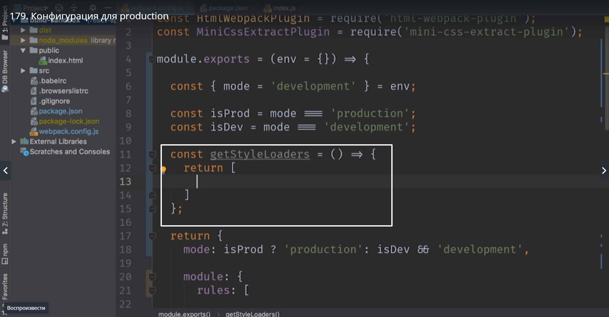

И в return пишем дальше. Если ? мы находимся в production мы будем использовать MiniCssExtractPlugin.loader Иначе :  будем использовать style-loader, Ну а первый loader будет одинаковым для обоих конфигураций это css loader.

```
const getStyleLoaders = () => {
return[
    isProd ? MiniCssExtractPlugin.loader : 'style-loader', 'css-loader'
];
};

```


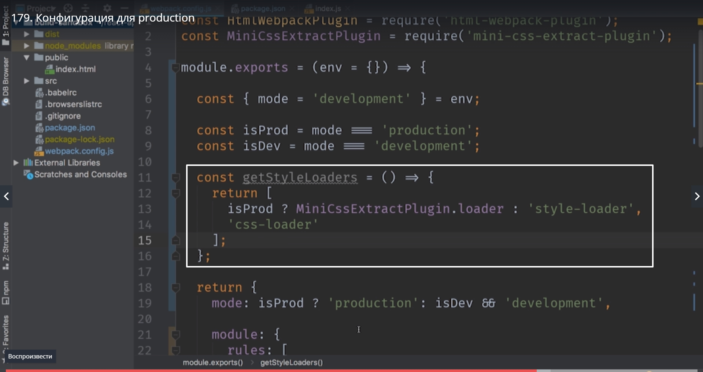

Теперь мы можем использвать эту функцию в том месте где нам нужно использовать список лоудеров для css

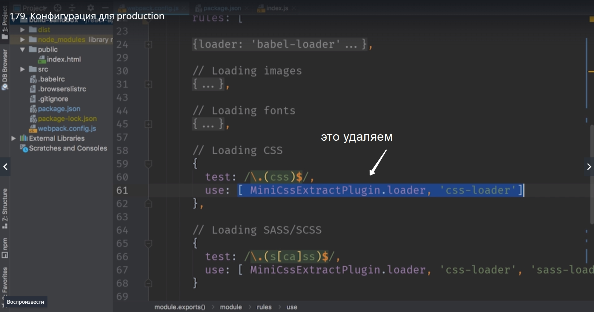

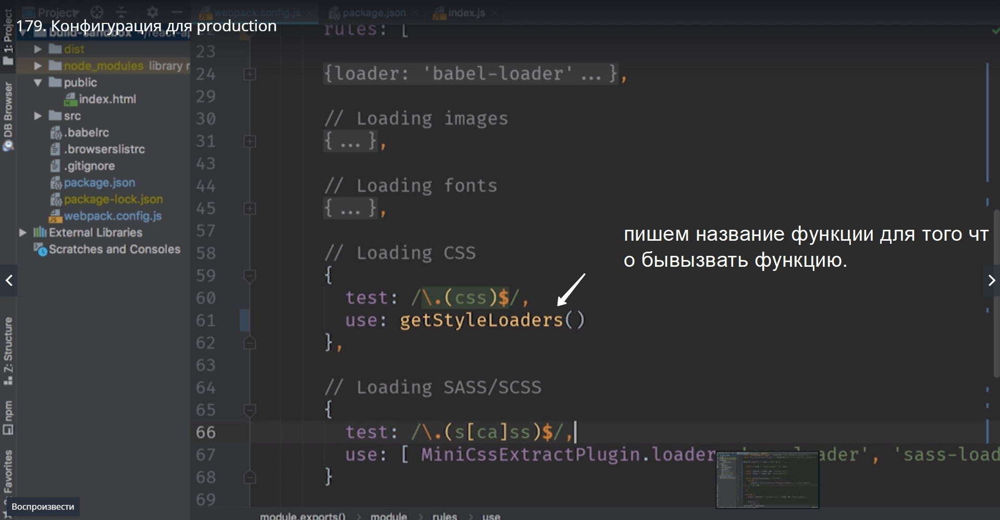

Так же можно использовать эту функцию там где нужно получить список loader для scss

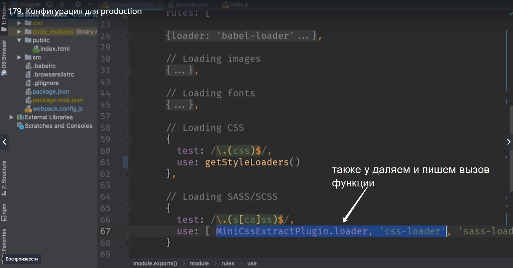

Тоже самое делаем для scss только сдесь мы используем spread оперратор для массива, для того что бы получить элементы этого массива. Т.е. мы молучаем два loader из функции, ну а третий лоадер будет всегда одинаковый sass-loader.

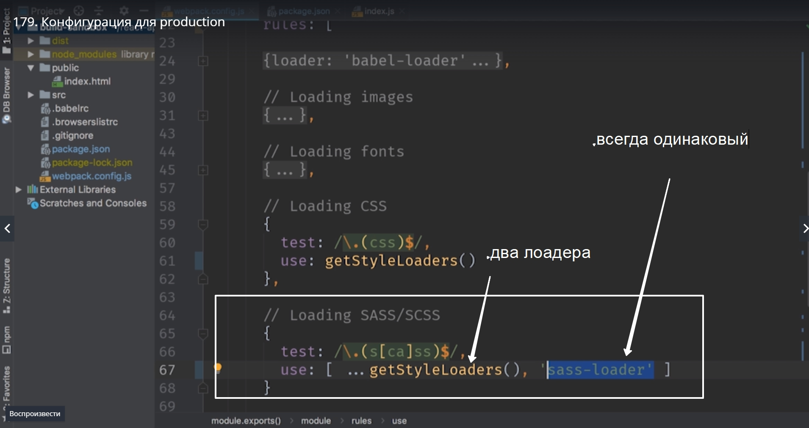

Точно так же поступим и с плагинами.
MiniCssExtractPlugin нужен нам только в том случае если мы запускаемся в режиме prodaction

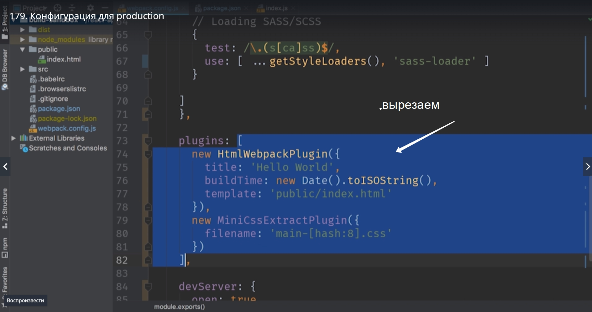

Визываем сдесь функцию getPlugins которую мы напишем через минуту

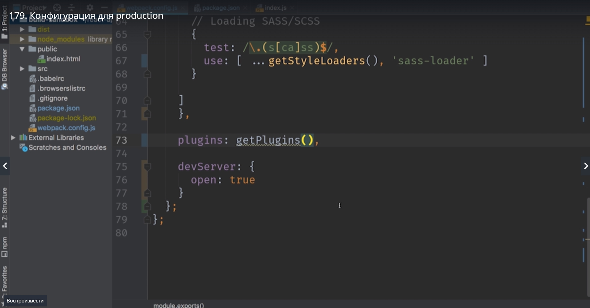

Возвращаемся к нашим функциям и создаем функцию getPlugins и в returne вставляем то что вырезали.

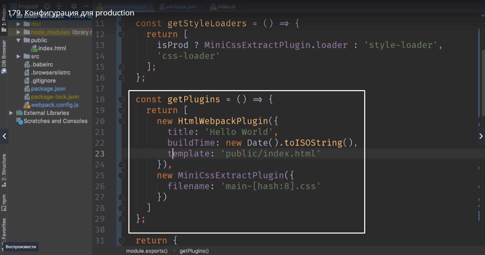

И немного изменяем эту структуру

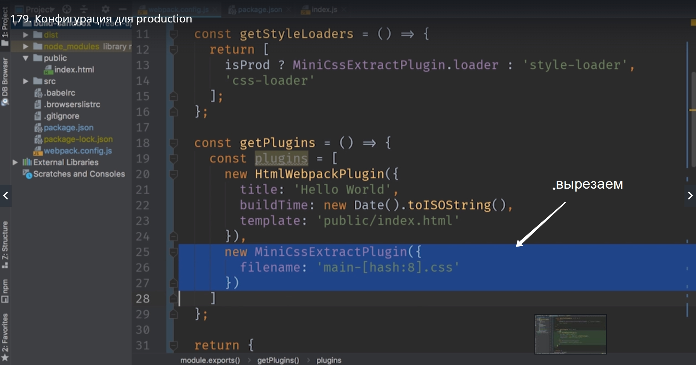

И скажем что только в том случае если мы находимся в production режиме if(isProd){}, добавим список plugins. Новый плагин plugin.push(new MiniCssExtraPlugin)

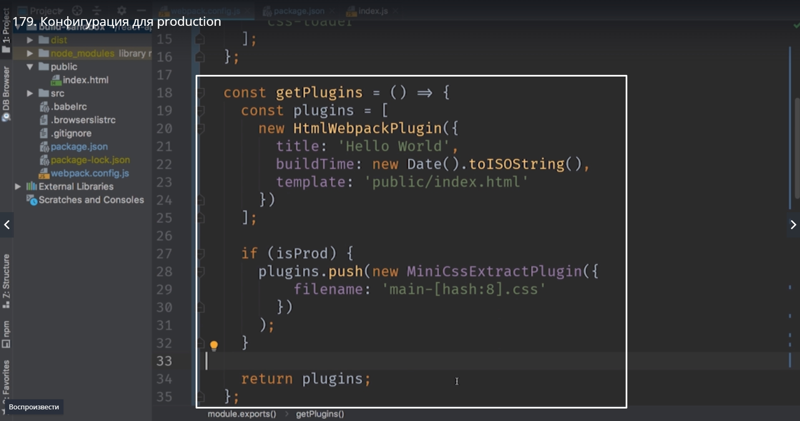

Ну и теперь можно вернуть результирующий результат с плагинами из функции. return plugins;

Вот код который должен получится на выходе

```
const getPlugins = () =>{
const plugins = [
    new HtmlWebpackPlugin({
    title: 'Hello world',
    buildTime:new Data().toISOString(),
    templete:'public/index.html'
    })
];

if(isProd){
    plugins.push(new MiniCssExtractPlugin({
    filename: 'main-[hash:8].css'
    })
    );
}
return plugins;

};

```

Мы только что вынесли те части которые зависят он режима исполнения в отдельные функции. В нашей основной конфигурации мы используем эти функции и в нашей основной конфигурации мы используем эти функции вместо фиксированного списка плагинов или style лоудеров.


Что еще можно сконфигурировать в зависимости от режима prodaction или development. Можно сконфигурировать название файла который webpack будет гененрировать. Название js файла. 
Для этого  добавляем блок output и в этом блоке мы укажем название файла

```
output:{
    filename: isProd ? 'main-[hash:8].js' : undefined
    }
 // main-[hash:8].js для prodaction режима isProd ?. В противном случае : выставляем по умолчанию т.е. если мы не в production режиме то нам не важно как будет называться  


```


И так вкраце мы добавили параметр командной строки который называется env и через этот параметр мы передаем значение mode= production или development.

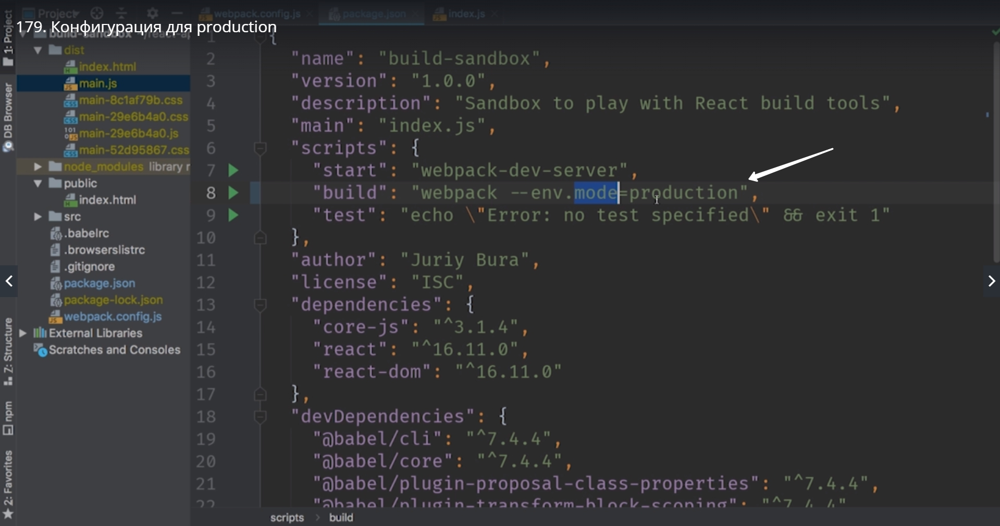

Этот параметр можно получить из webpack.config.js мы вернем не объект а функцию. Тогда первым аргументом этой функции будет объект env со всеми теми значениями которые мы предали в командной строке.

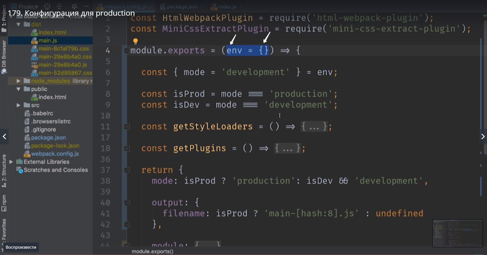

Ну и последний шаг это реализовать логику создания нашей конфигурации в зависимости от того в каком режиме мы находимся.

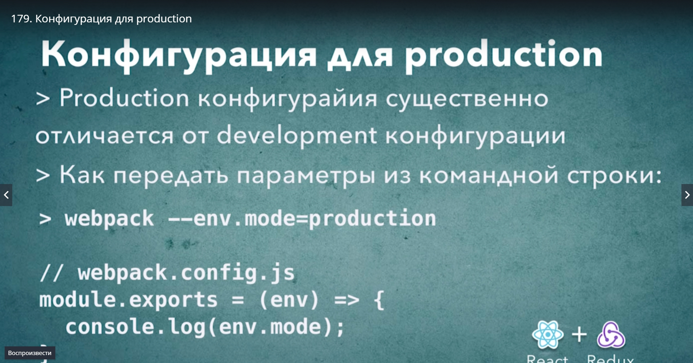


