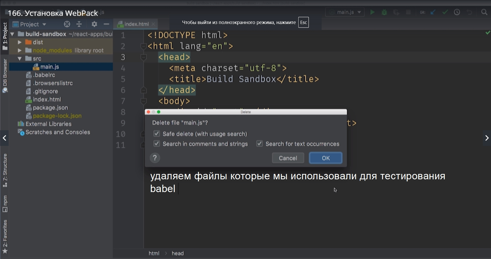
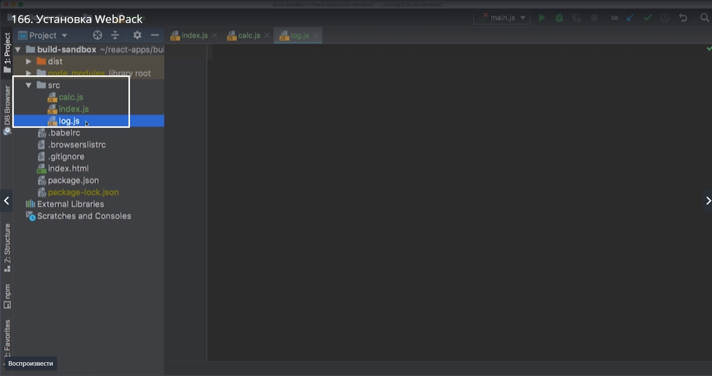
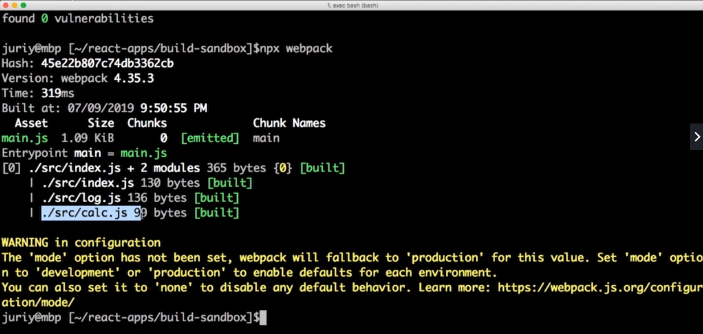
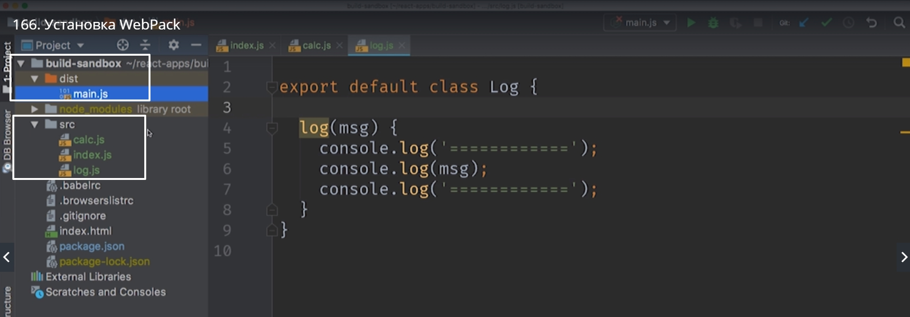
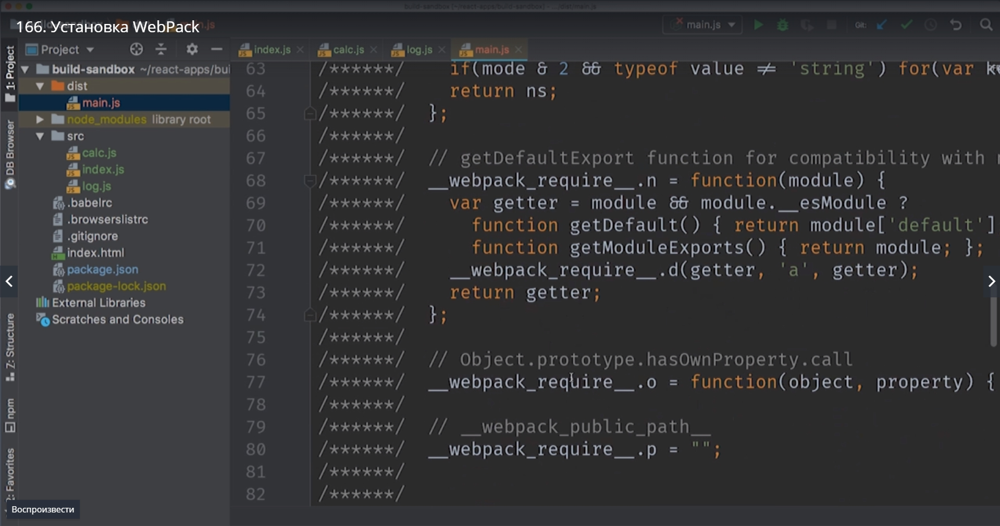
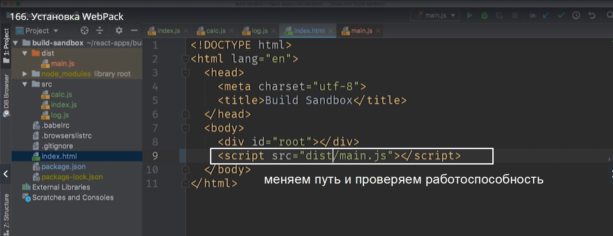
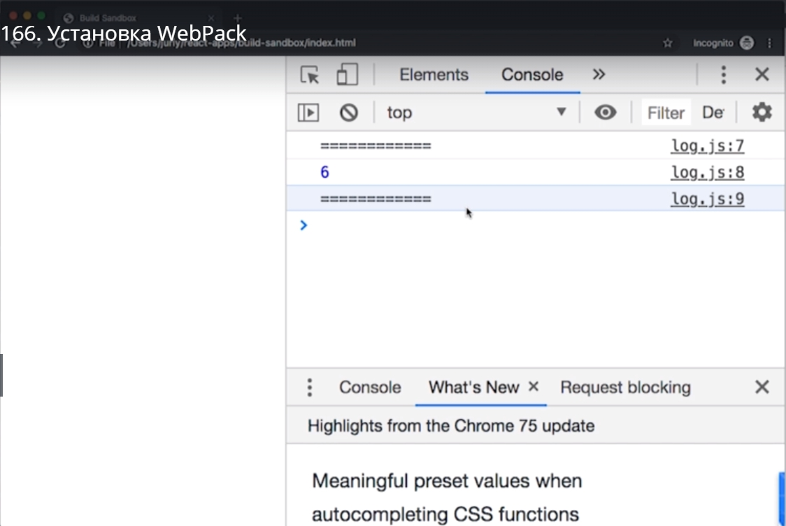
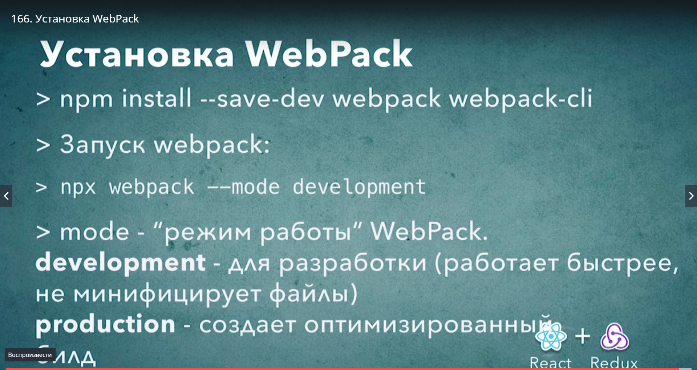

# Установка WebPack

Перед тем как это сделать давайте создадим небольшое приложение в котором будет несколько модулей.



Создаем файл index.js. Это точка входа для нашего приложения. Первый модуль будет calc.js а второй log.js



```
//calc.js

export default class Calc{
    add(...args){
        return.args.reduce((a, b) => a + b, 0);
    }
}

```

Наша функция которая будет производить сложение будет принимать сколько угодно аргументов а затем возвращать их сумму.

Ну и для того что бы вывесть результат сложения нам понадобится отдельный класс который мы назовем log.

```
// log.js

// поскольку мы пишем модуль нам нужно проэкспортировать  по умолчанию

export default class Log{
    log(msg){
        console.log('==========');
        console.log(msg);
        console.log('==========');

    }
}

```

<br/><br/><br/><br/>

```
//index.js

import Log from './log';
import Calc from './calc';

const calc = new Calc();
const log = new Log();

log.log(calc.add(1,2,3));

```

Если мы сейчас попробуем запустить этот код в браузере то у нас ничего не получится т.к. поддержка ключевого слова import в браузерах ограничено и браузеры не умеют самотоятельно загружать нужные модули.

Установка WebPack.

> npm install --save-dev webpack webpack-cli

webpack-это само ядро приложения, ну а webpack-cli небольшая обертка которая позволяет вызывать webpack из командной строки.

Теперь мы можем запустить webpack. Нам даже не понадобится ни какой конфигурации ведь в нашем проекте стандартная структура директорий. У нас есть папка src и в ней index.js. Именно этот файл WebPack будет использовать в качестве точки входа. По этому файлу он будет искать все остальные необходимые модули. 

По этому в консоли для запуска мы пишем просто

> npx webpack




еще webpack создал дирректорию dist и в этой папке появился main.js. Это результат работы WebPack. Файл main.js содержит все 3-ри модуля calc.js,index.js,log.js.



У нас в консоли еще есть предупреждение. WebPack хочет знать в каком режиме мы будем работать production или development. Gj кольку мы ничего не передали WebPack взял значение production именно поэтому файл main.js минифицирован.
Для разработки нужен development.

Вызываем

> npx webpack --mode development

Как видите когда мы передали дополнительную опцию  WebPack запустился без предупреждений и вот результат










