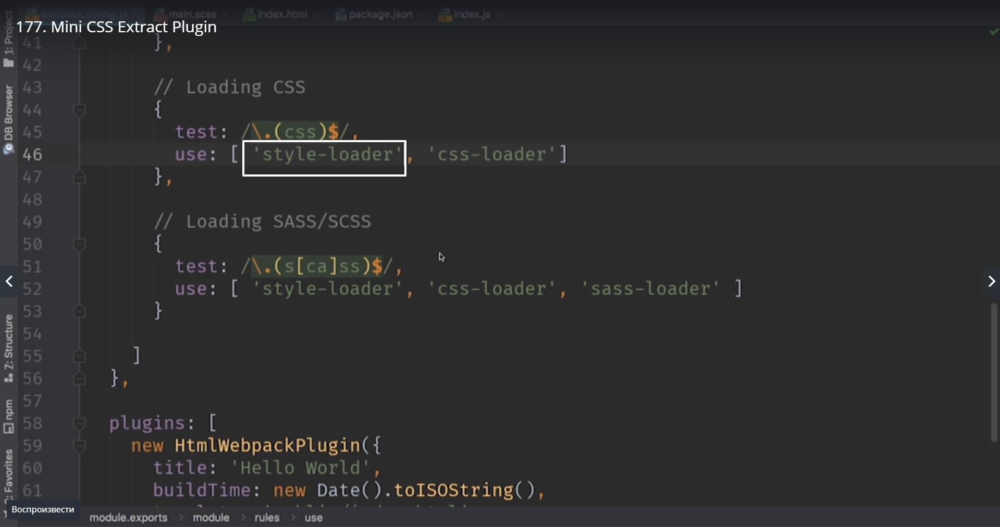
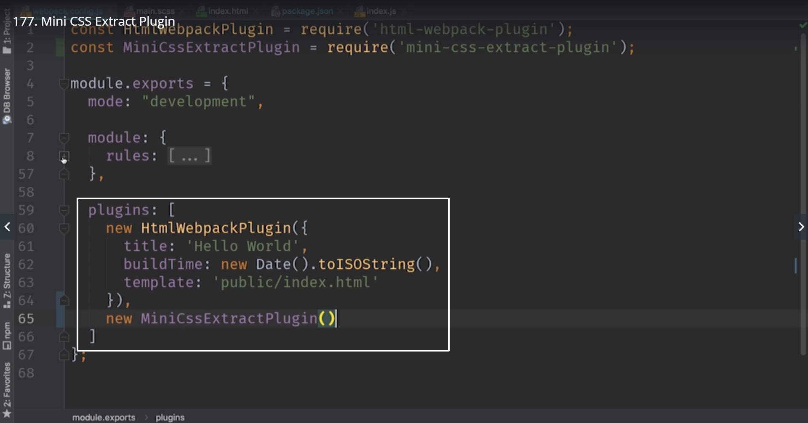
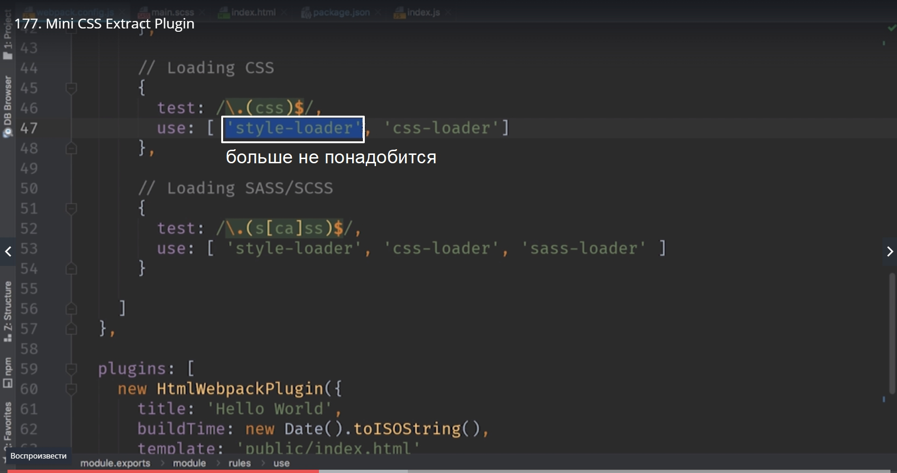
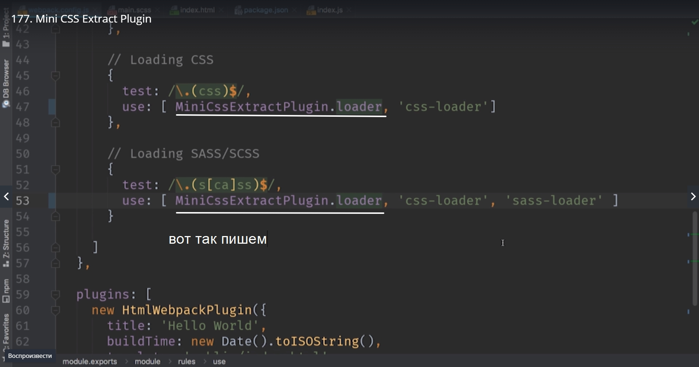
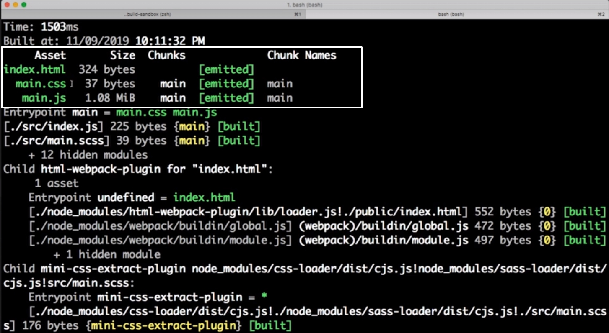
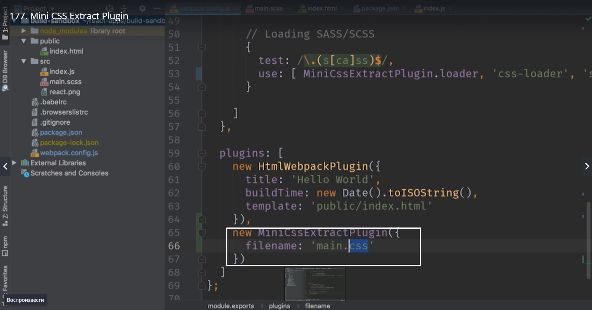
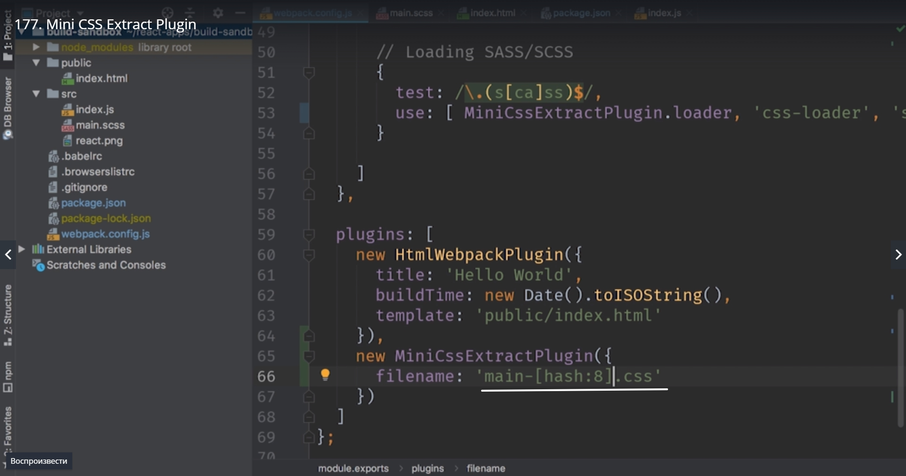
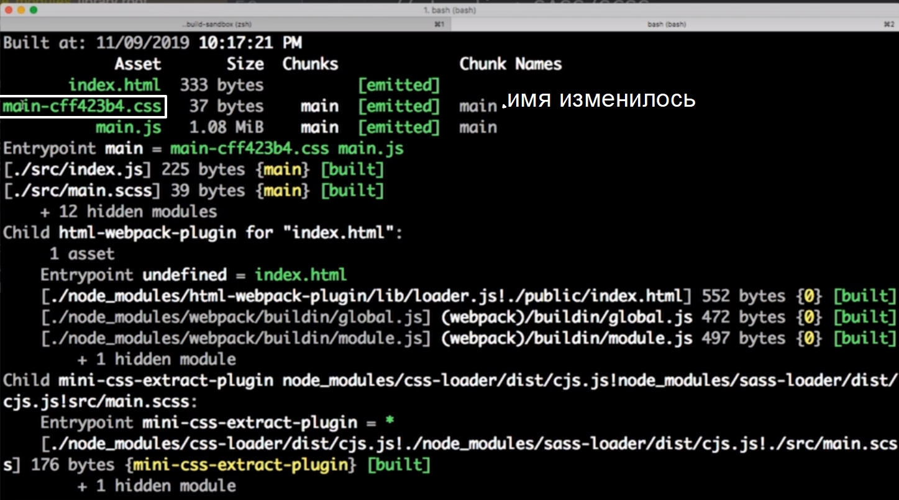
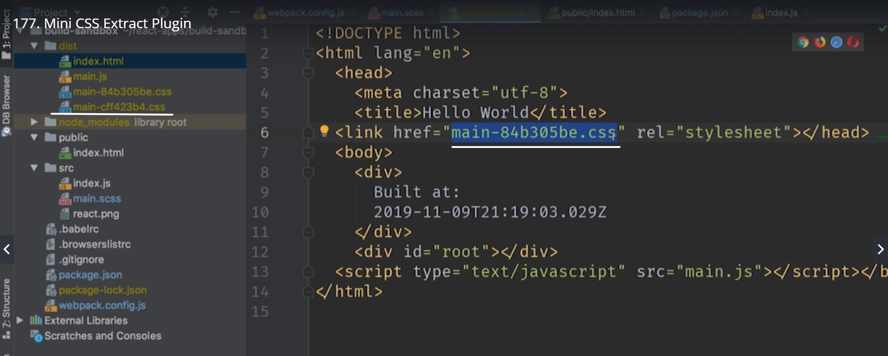
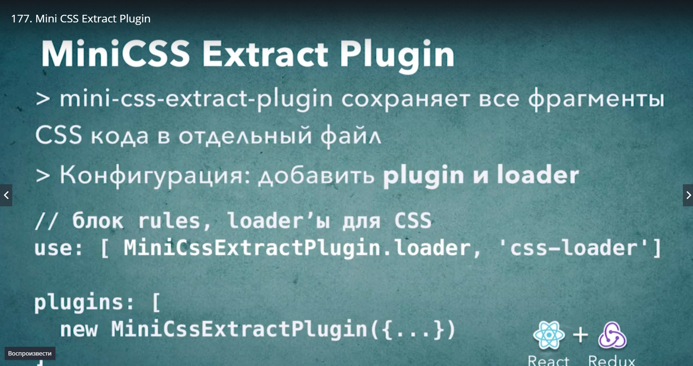

# MiniCSS Extract Plagin(как вынести сss в отдельный файл)

В наших цепочках css loader последним стоит style-loader



этот style-loader сохраняет css код в js файле, а затем во время исполнения он добовляет блоки style на страницу. 
Эта стратегия отлично подходит для разработки, но для prodaction build она не подходит. В ральных проектах css файл нужно вынести в отдельный файл и загрузить его при помощи тега link.

Поможет нам в этом деле [mini-css-extract-plugin](https://github.com/webpack-contrib/mini-css-extract-plugin)

Это плагин который есть почти в каждом WebPack build в том числе в create-react-app он тоже используется. Этот WebPack плагин делает именно то что нам нужно. Он извлекает css код в отдельные файлы, а затем добавляет ссылки на эти файлы в html документ.

Установка

> npm install --save-dev mini-css-extract-plugin

Переходим к файлу конфигурации и добавляем этот плагин к нашему конфигу.
И так для того что бы нам получить плагин, нам нужно импортировать его

> const MiniCssExtractPlugin = require('mini-css-extract-plugin');

И теперь как в прошлый раз создаем новый объект и сохраним этот объект в массиве plugins. D этом случае порядок определения плагинов значение не имеет.



Кроме добавления самого plugin нам нужно обновить список Loader. Нам больше не понадобится Style-loader



Вместо него мы подставим Loader который идет вместе с плагином MiniCssExtractPlugin



> npm start



Так же его можно конфигурировать, передать опции. Например можно указать в конфигурации имя файла который мы сохраним.



Но такое имя файла не очень удачное поскольку этот файл будет агресивно кэшироваться браузерами. И если мы захотим обновить наш css и он будет тоже называться main.css. Браузеры наших клиентов будут считать что файл не поменялся и не будут пытаться перезагрузить его с сервера.
Но если мы добавим например hash то имя будет изменяться каждый раз при каждой сборке.



```
//webpack.config.js

plugins:[
    new HtmlWebpackPlugin({
        title:'Hello World',
        buildTime: newDate().toISOString(),
        template:'public/index.html'
    }),
    new MiniCssExtractPlugin({
        filename:'main-[hash:8].css'
    })
]

```

И как только мы опубликуем обновления, браузеры пользователей заметят что имя файла изменилось. Соответственно браузер посчитает что это другой файл и загрузит новую версию.

Перезапускаем проект.





Каждый раз формирует новое имя и генерирует новую ссылку на него.

