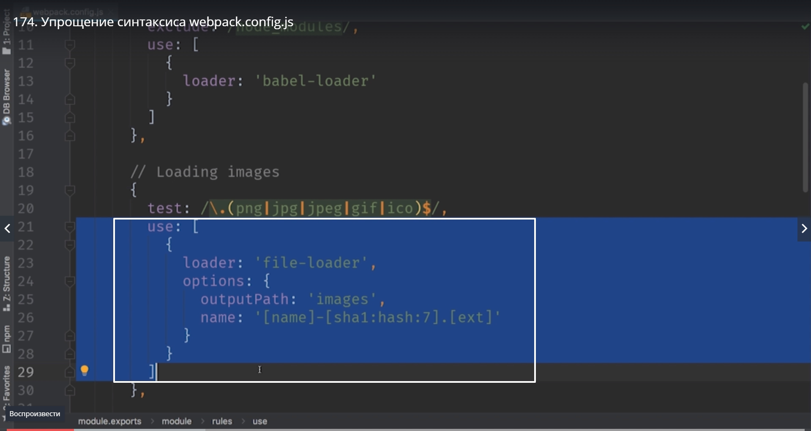
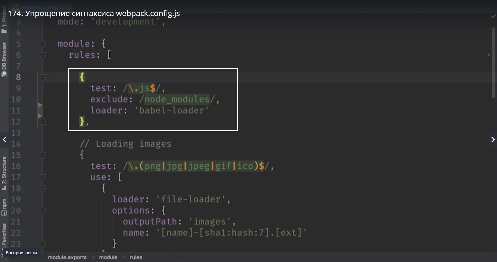
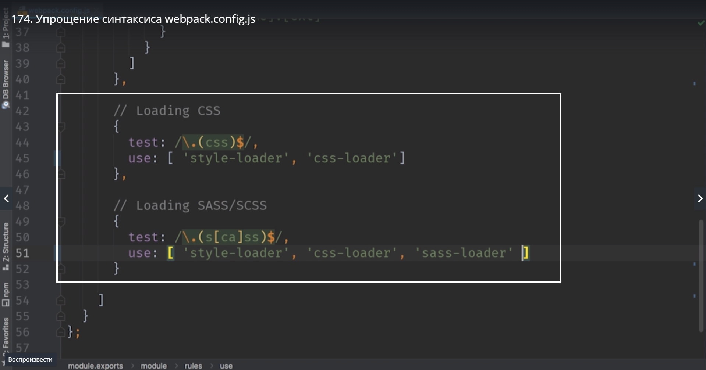
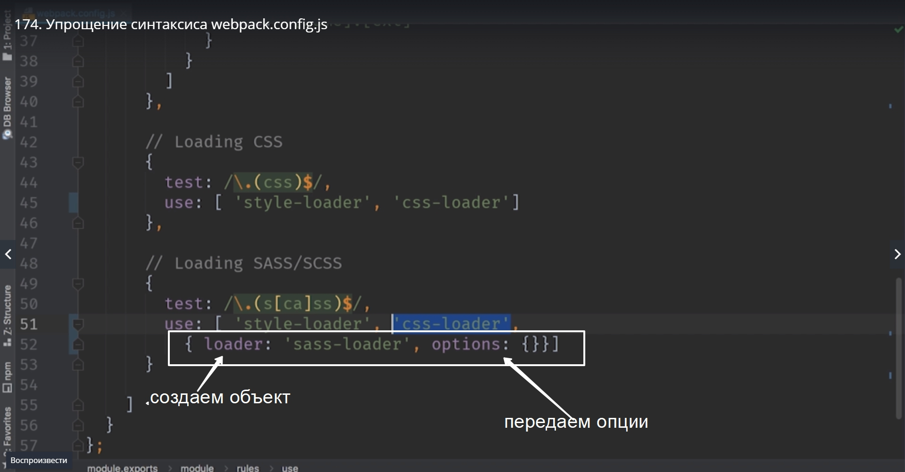
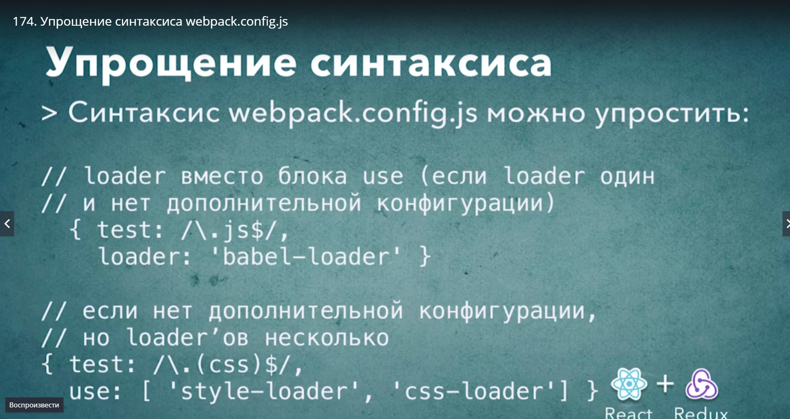

# Упрощение синтаксиса webpack.config.js

До этого мы использовали полную форму use

т.е. в use мы предавали объект в котором мы указывали отдельно loader и options. Но мы можем сократить этот синтаксис и сделать его намного компактнее.

К примеру когда мы используем один loader и у этого loader нет дополнительных опций мы можем не использовать блок use вообще, а вместо него сразу использовать название loader

ntgthm смотрим на блок css и scss. В этом случае в блок use мы  можем передавать просто строки, если у loader нет дополнительных опций, мы можем не создавать вложенные объекты а просто передавать названия loader которые мы хотим использовать.

Обратите внимание на одну интересную деталь. Если позже нам все же понадобится передать, к примеру sass-loader, дополнительные опции. То мы можем для sass-loader сделать объектом и передать опции, а остальные loader оставить в виде обычных строк.

Но нам пока эти опции не требуются.

пересоберем проект и проверим

> npm start

